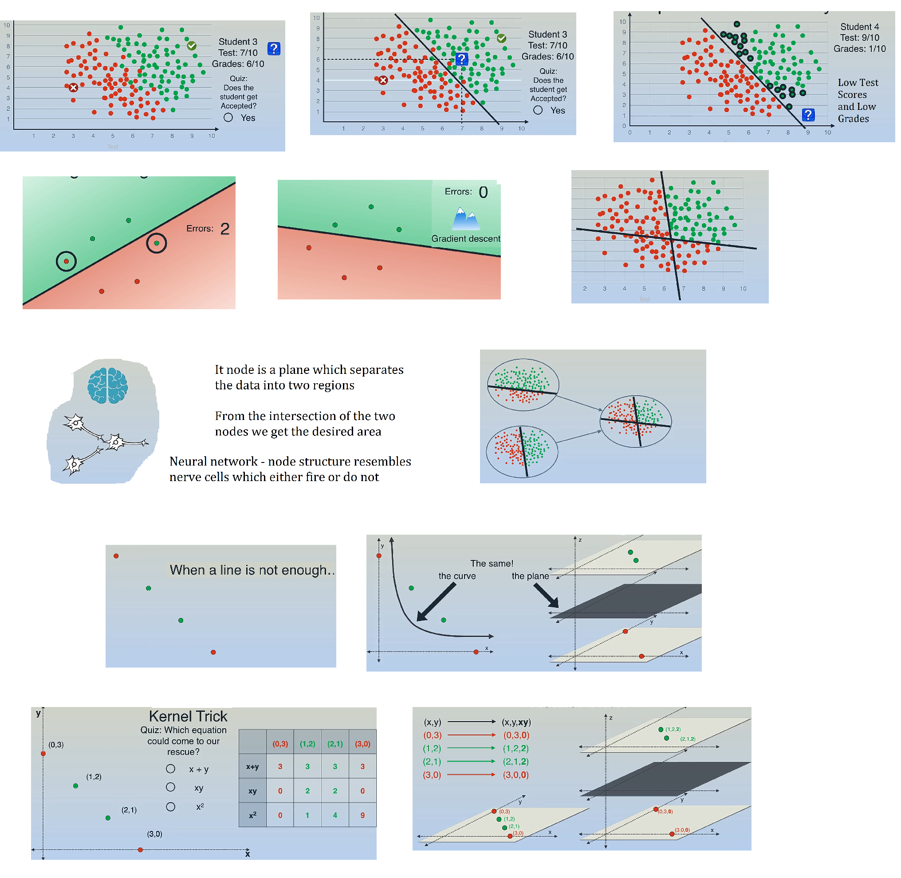
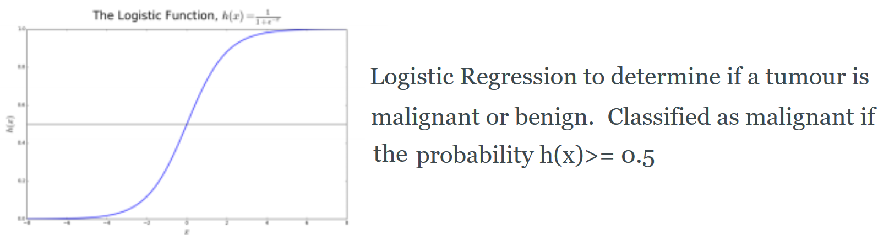
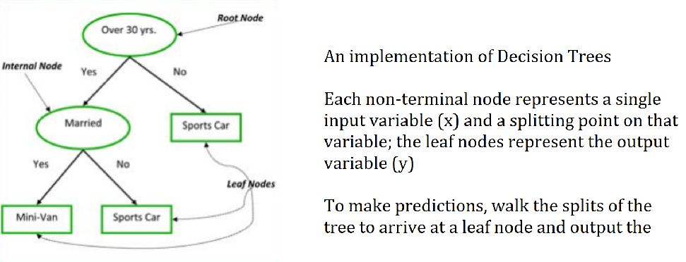
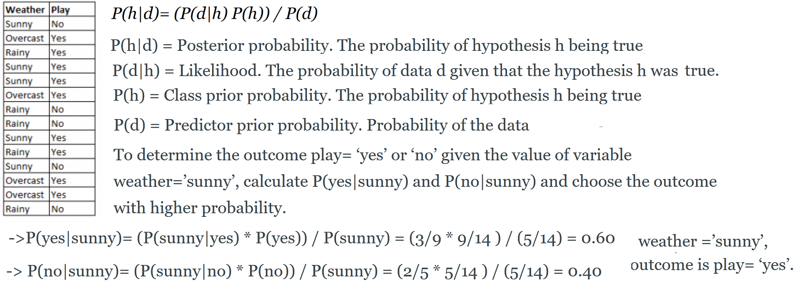
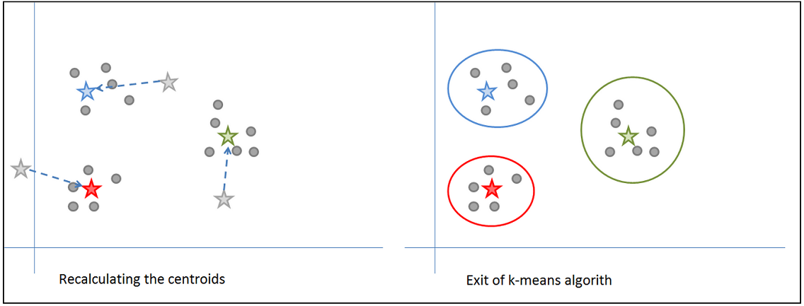
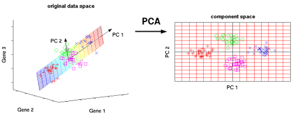
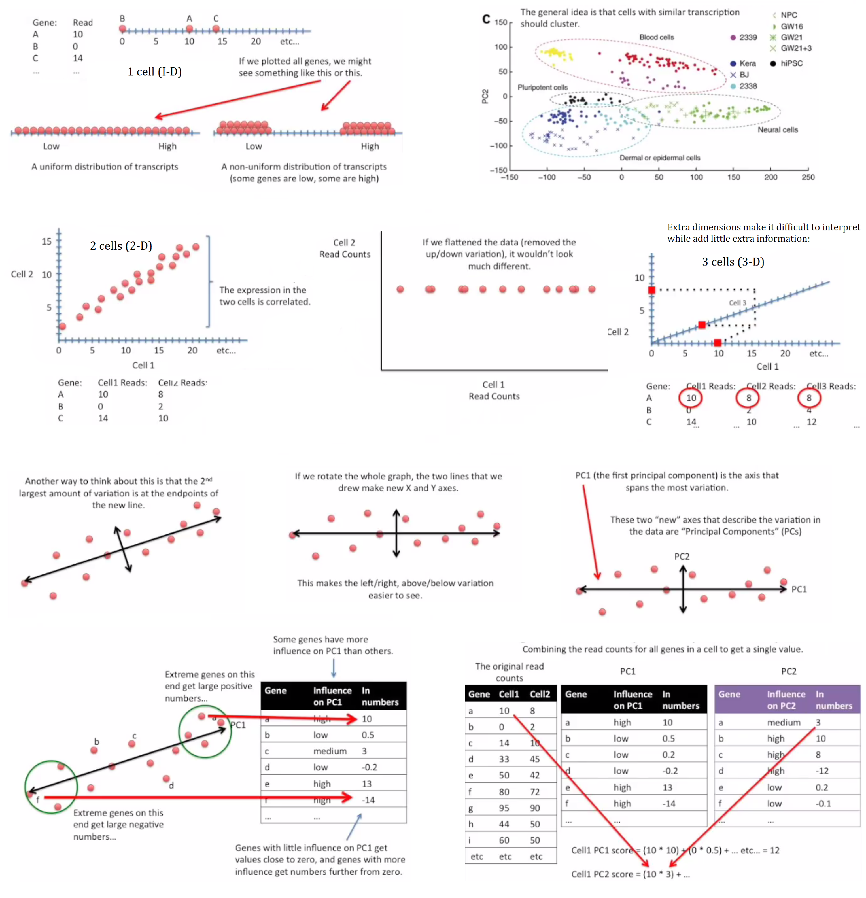
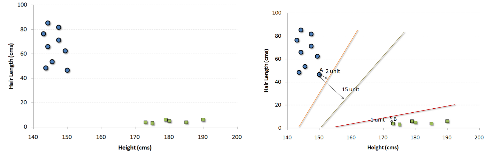

Algorithms that can learn from data and improve from experience, without human intervention. Learning tasks may include learning the function that maps the input to the output, learning the hidden structure in unlabeled data.

Machine learning explores the study and construction of algorithms that can learn from and make predictions on data. Such algorithms operate by building a model from an example training set of input observations in order to make data-driven predictions or decisions expressed as outputs, rather than following strictly static program instructions.

Supervised learning
------------------

Use labeled training data to learn the mapping function from the input variables (X) to the output variable (Y).

    Y = f (X)  # learn the mapping function

1) Classification: output variable is in the form of categories. e,g. male and female, sick and healthy.

2) Regression: output variable is in the form of real values. e.g. the amount of rainfall, the height of a person.

Supervised learning problems can be of two types:

a. Classification: To predict the outcome of a given sample where the output variable is in the form of categories. Examples include labels such as male and female, sick and healthy.

b. Regression: To predict the outcome of a given sample where the output variable is in the form of real values. Examples include real-valued labels denoting the amount of rainfall, the height of a person.

In supervised learning, the learner is trained with a set of examples (dataset) that contains the right answer; we call it the training dataset. We call the dataset that contains the answers a labeled dataset, because each observation is labeled with its answer. In supervised learning, you are supervising the computer, giving it the right answers. For example, a bank can try to predict the borrower’s chance of defaulting on credit loans based on the experience of past credit loans. The training dataset would contain data from past credit loans, including if the borrower was a defaulter or not.

**Linear Regression**

A relationship exists between the input variables and the output variable. The goal of ML is to quantify this relationship.

Thus, the goal of linear regression is to find out the values of coefficients `a` (the intercept) and `b` (slope of the line) in order to give a line fit that is nearest to most of the points. This would reduce the distance (‘error’) between the `y` value of a data point and the line.

Different techniques can be used to learn the linear regression model from data, such as a linear algebra solution for ordinary least squares and gradient descent optimization.

Predictive modeling is primarily concerned with minimizing the error of a model or making the most accurate predictions possible, at the expense of explainability. Good rules of thumb are to remove outliers from your data and to ensure 'multicollinearity' is avoided in your predictive model. This occurs when your model includes multiple factors that are correlated not just to your response variable, but also to each other. In this case, remove highly correlated predictors from the model, alternatively, use Partial Least Squares Regression (PLS) or Principal Components Analysis, regression methods that cut the number of predictors to a smaller set of uncorrelated components.

**Logistic Regression**

The go-to method for binary classification problems. Like linear regression the goal is to find coefficient values that weight each input variable. Unlike linear regression, the prediction for the output is transformed using a non-linear function called the logistic function.

Whereas linear regression predictions are continuous values (e.g. rainfall in cm), logistic regression predictions are discrete values e.g. a test pass/fail,
and are best suited for binary classification (datasets where y = 0 or 1).

It is named after the transformation function used in it, called the logistic function `h(x)= 1/ (1 + ex)`, which is an S-shaped curve. We can then snap values into a binary classification using a threshold (e.g. If less than 0.5 then output 1)

The output is in the form of probability in the range of 0-1, The output (y-value) is generated by log transforming the x-value, using the logistic function `h(x)= 1/ (1 + e^ -x)` . A threshold is then applied to force this probability into

    P(x) = e^(b0 + b1x) / (1 + e(b0 + b1x))
    ln(p(x) / 1-p(x)) = b0 + b1x

The goal of logistic regression is to use the training data to find the values of coefficients `b0` and `b1` such that it will minimize the error between the predicted outcome and the actual outcome. These coefficients are estimated using the technique of Maximum Likelihood Estimation.
Because of the way that the model is learned, , the predictions made by logistic regression can also be used as the probability of a given data instance belonging to class 0 or class 1.

**Classification and Regression Trees (CART)**

Trees are fast to learn and very fast for making predictions. They are also often accurate for a broad range of problems and do not require any special preparation for your data.

*See notes*: decision-trees.md

**Naïve Bayes**

To calculate the probability that an event will occur, given that another event has already occurred, we use Bayes’ Theorem.

Called ‘naive’ because it assumes that all the variables are independent of each other, a naive assumption to make in the real-world

**k-nearest neighbours**

Uses the entire dataset as the training set, rather than splitting the dataset into a trainingset and testset.
The KNN algorithm goes through the entire dataset to find the k-nearest (or most similar) instances to the new instance.
It then outputs the mean of the outcomes (for a regression problem) or the mode (most frequent class) for a classification problem.
Distance calculated using measures such as Hamming distance.The value of k is user-specified.

Unsupervised learning
---------------------

In unsupervised learning, our dataset doesn’t have the right answers (unlabelled datasets) and the learner tries to discover hidden patterns in the data. In this way, we call it unsupervised learning because we’re not supervising the computer by giving it the right answers. A classic example is trying to create a classification of customers. The model tries to discover similarities between customers.

**k-means**

An iterative algorithm that groups similar data into clusters.It calculates the centroids of k clusters and assigns a data point to that cluster having least distance between its centroid and the data point.

A cluster is represented by a point or center called the centroid. In the initialization step we create k number of centroids; usually, the centroids are initialized randomly. Below, observations are a point and the three colored stars are the three centroids. The computer associates each object with the nearest centroid, creating k clusters.

Now, the computer has to recalculate the centroids’ position. The new position is the mean of each attribute of every cluster member.
The algorithm iterates by recalculating centroids and assigning observations to each cluster until some finalization condition is reached:

The final result of a K-means algorithm are k centroids that represent each cluster and the observations associated with each cluster.

Drawbacks of k-means are that you need to know or decide the number of clusters, k, and this has a large impact on the result. Also, the result of the algorithm depends on where the centroids are initialized. In order to avoid a local optimum, you can run the algorithm many times, starting with different centroids’ positions.

**Principal Component Analysis (PCA)**

Overall, factor analysis involves techniques to help produce a smaller number of linear combinations on variables so that the reduced variables account for and explain most the variance in correlation matrix pattern.
Principal component analysis is recommended when the researcher’s primary concern is to determine the minimum number of factors that will account for the maximum variance in the data.

Multivariate Analysis often starts out with data involving a substantial number of correlated variables.
PCA is a dimension-reduction tool that can be used to reduce a large set of variables to a small set that still contains most of the information in the large set. Underlying principle is how television which is 2D can represent 3D.

Below, PCA is used to visualize gene expression data by reducing the dimensionality of the data: The three original variables (genes) are reduced to a lower number of two new variables termed principal components (PCs)

Dimensionality Reduction:

Low variance can often be assumed to represent undesired background noise. The dimensionality of the data can therefore be reduced, without loss of relevant information, by extracting a lower dimensional component space covering the highest variance. Using a lower number of principal components instead of the high-dimensional original data is a common pre-processing step that often improves results of subsequent analyses such as classification.

For visualization, the first and second component can be plotted against each other to obtain a two-dimensional representation of the data that captures most of the variance (assumed to be most of the relevant information), useful to analyze and interpret the structure of a data set.

**Support Vector Machines**

It is a classification method. In this algorithm, we plot each data item as a point in n-dimensional space (where n is number of features you have) with the value of each feature being the value of a particular coordinate. E.g. two features like Height and Hair length of an individual, in two dimensional space where each point has two co-ordinates (these co-ordinates are known as Support Vectors):

Then find a line such that the distances from the closest point in each of the two groups (of differently classified groups of data) will be farthest away.

This line is our classifier. Then, depending on where the testing data lands on either side of the line, that’s what class we can classify the new data as.

In practice, an optimization algorithm is used to find the values for the coefficients that maximizes the margin.

General Discussion
-----------------------
We typically develop models is a cyclic way. First, we apply something very simple, out of the box (may be logistic regression for example). This is called a baseline. Next, we iterate trying to improve accuracy until time or budget is over. Say, next iteration might be SVM with some smart kernels. Next, neural network and so on.

Logistic Regression is a very good all-purpose algorithm, useful when you have a reduced number of dimensions or when your dataset has a lot of noise. LR uses ALL the points in the dataset to classify so it can be sensitive to outliers but is robust against noise.

SVMs are useful when you have a high dimensionality dataset and you don't have a lot of data. SVM is an instance based method, it will try to find the instances that are needed to separate the points (support vectors) and disregard the rest so are robust against outliers.

NNs are very flexible you usually need a lot of data and they are particularly useful for data such as sound, images, video and other multimedia data. Takes longer and is harder to interpret than LR and SVMs.

Glossary
----------
**Attribute** a quality describing an observation (e.g. color, size, weight). In Excel terms, these are column headers.

**Feature** a feature represents an attribute and value combination. Color is an attribute. “Color is blue” is a feature. In Excel terms, features are similar to cells.

**Clustering** is the unsupervised grouping of data into buckets.

**Feature Selection** is the process of selecting relevant features from a data-set for creating a Machine Learning model.

**Learning Rate** The size of the update steps to take during optimization loops like Gradient Descent. With a high learning rate we can cover more ground each step, but we risk overshooting the lowest point since the slope of the hill is constantly changing. With a very low learning rate, we can confidently move in the direction of the negative gradient since we are recalculating it so frequently. A low learning rate is more precise, but calculating the gradient is time-consuming, so it will take us a very long time to get to the bottom.

**Overfitting** occurs when your model learns the training data too well and incorporates details and noise specific to your dataset. You can tell a model is overfitting when it performs great on your training/validation set, but poorly on your test set (or new real-world data).

**Bias metric** What is the average difference between your predictions and the correct value for that observation?
Low bias could mean every prediction is correct. It could also mean half of your predictions are above their actual values and half are below, in equal proportion, resulting in low average difference.
High bias (with low variance) suggests your model may be underfitting and you’re using the wrong architecture for the job.

**Variance** How tightly packed are your predictions for a particular observation relative to each other? Low variance suggests your model is internally consistent, with predictions varying little from each other after every iteration.
High variance (with low bias) suggests your model may be overfitting and reading too deeply into the noise found in every training set.

