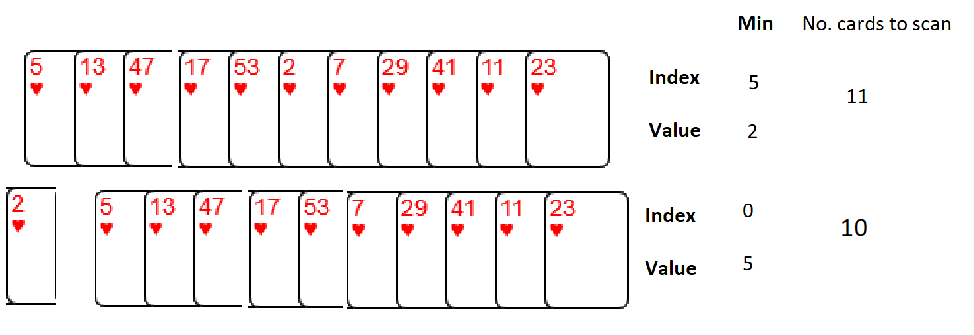
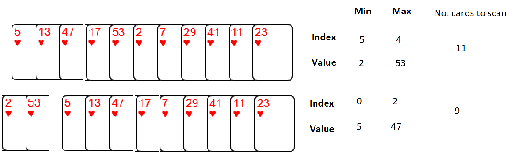
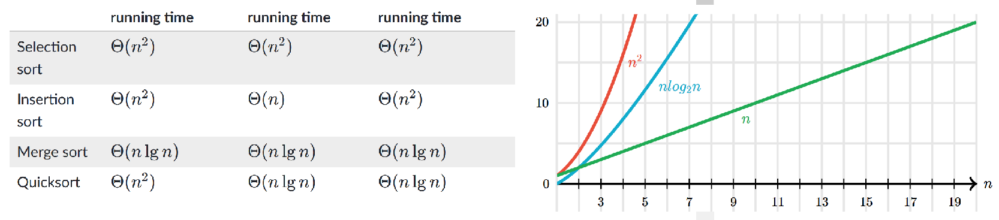
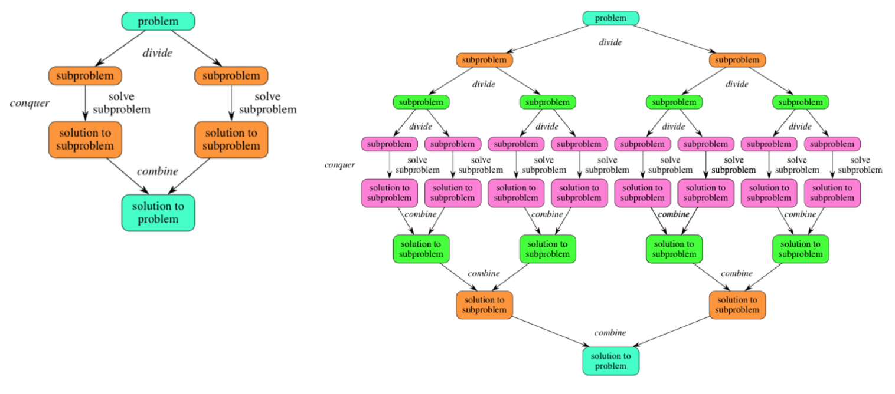

Sorting a list of items can help with finding items in a list, perhaps using an algorithm like binary search.

Imagine tasks of sorting array of cards. One strategy would be iterate over the cards
a remove the cards with the min (and max values) and place these in a ordered list.

See example of CardSort below. The number of iterations required would be 11 + 9 + 7 + 5 + 3 (35).
Notice that the number of calls to `check_min_max()` increases in exponentially.

    11 cards --> 35 cards checked   (11 + 9 + 7 + 5 + 3)
    12 --> 42   (12+2)(6/2)   (12, + 10 + 8 + 6 + 4 + 2)
    13 --> 48   (13+3)(6/2)  (13 + 11 + 9 + 7 + 5 + 3)
    14 --> 56   (14+2)(7/2)  (14 + 12, + 10 + 8 + 6 + 4 + 2)

**Side note - sum of consecutive integers**

    (max + min)(n/2)
    1+2+3+4+5+6=21
    (1+6)(6/2) = 21
    1+2+3+4+5+6=21
    (1+6)(6/2) = 21

**Insertion sort**

Although still `O(n2)`, works in a slightly different way. It always maintains a sorted sublist in the lower positions of the list.
See `insertion_sort()` below.

There are *n* − 1 passes to sort *n* items. The maximum number of comparisons for an insertion sort is the sum of the first n−1 integers. Again, this is O(n2). However, in the best case, only one comparison needs to be done on each pass. This would be the case for an already sorted list.

**Divide-and-conquer**

Both merge sort and quicksort employ a common algorithmic paradigm based on recursion. This paradigm, divide-and-conquer, breaks a problem into subproblems that are similar to the original problem, recursively solves the subproblems, and finally combines the solutions to the subproblems to solve the original problem.

Because divide-and-conquer creates at least two subproblems, a divide-and-conquer algorithm makes multiple recursive calls.

Merge sort is a recursive algorithm that continually splits a list in half. If the list is empty or has one item, it is sorted by definition (the base case). If the list has more than one item, we split the list and recursively invoke a merge sort on both halves. Once the two halves are sorted, the fundamental operation, called a merge, is performed.

    uns_cards = [5, 13, 47, 17, 53, 2, 7, 29, 41, 11, 23, 101, 77, 99]

    class CardSort:
        """ simulate a human strategy to list of number cards, i.e. no sort or min/max methods """
        def __init__(self, unsorted):
            self.unsorted = unsorted
            self.sorted1 = []
            self.sorted2 = []
            self.min_ind = None
            self.min_val = None
            self.max_ind = None
            self.max_val = None
            self.total_checks = 0
            self._initial = True
            self._first = True
            self.unsorted_len = 2

        def check_min_max(self, index, value):
            if self._initial and index + 1 > self.unsorted_len:
                self.unsorted_len = index + 1
            if self._first:
                self.min_val, self.max_val = value, value
            if value <= self.min_val:
                self.min_ind, self.min_val = index, value
            if value >= self.max_val:
                self.max_ind, self.max_val = index, value

        def loop_over_unsorted(self):
            self._first = True
            for i, num in enumerate(self.unsorted):
                self.check_min_max(i, num)
                self._first = False
                self.total_checks += 1
            self._initial = False
            unsort_min = self.unsorted.pop(self.min_ind)
            if self.max_ind > self.min_ind:
                self.max_ind -= 1
            unsort_max = self.unsorted.pop(self.max_ind)
            self.sorted1.append(unsort_min)
            self.sorted2.insert(0, unsort_max)
            self.unsorted_len -= 2

        def run(self):
            while self.unsorted_len > 1:
                self.loop_over_unsorted()
            if self.unsorted:
                self.sorted1.append(self.unsorted[0])
            return 'Sorted list: {} \nTotal cards checked: {} \nn = {}'.format(
                self.sorted1 + self.sorted2, self.total_checks, len(self.sorted1 + self.sorted2))

    >>> c = CardSort(uns_cards)
    >>> c.run()
    Sorted list: [2, 5, 7, 11, 13, 17, 23, 29, 41, 47, 53]
    Total cards checked: 35
    n = 11
    Sorted list: [2, 5, 7, 11, 13, 17, 23, 29, 41, 47, 53, 101]
    Total cards checked: 42
    n = 12
    Sorted list: [2, 5, 7, 11, 13, 17, 23, 29, 41, 47, 53, 77, 101]
    Total cards checked: 48
    n = 13
    Sorted list: [2, 5, 7, 11, 13, 17, 23, 29, 41, 47, 53, 77, 99, 101]
    Total cards checked: 56
    n = 14

    def insertion_sort(alist):
       for index in range(1, len(alist)):
         currentvalue = alist[index]
         position = index
         while position> 0 and alist[position -1] > currentvalue:
             alist[position] = alist[position -1]
             position = position - 1
         alist[position]=currentvalue

    alist = [54,26,93,17,77,31,44,55,20]
    insertion_sort(alist)
    print(alist)

