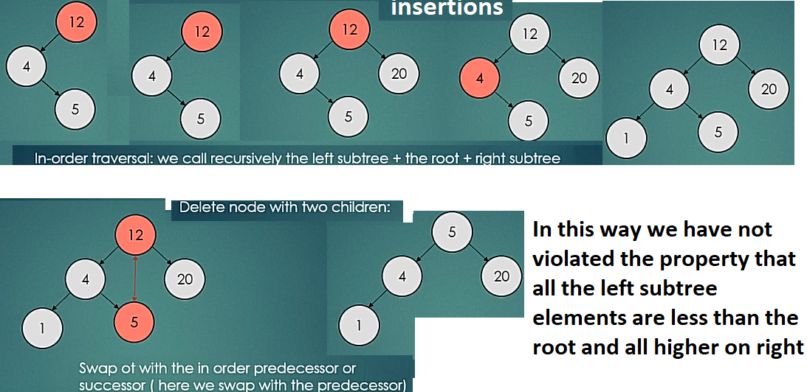

Big O notation is used in the context of performance or complexity of an algorithm, and its execution time and memory used.

It is easy to see how fewer comparisons are made in comparison to linear search.
But we're interested in time, not just guesses. The running times of linear search and binary search include the time needed to make and check guesses, but there's more to these algorithms.
The running time of an algorithm depends on how long it takes a computer to run the lines of code of the algorithm—and that depends on a number of factors.

First, we need to determine how long the algorithm takes, in terms of the size of its input. E.g. linear search vs binary search and the difference in number of comparisons made. Or think about a GPS, if it knew about only the interstate highway system, and not about every little road, less calculations to make a route? So we think about the running time as a function of the input size.

The second idea is that we must focus on how fast a function grows with the input size. We call this the rate of growth of the running time. To keep things manageable, we need to simplify the function to distill the most important part and cast aside the less important parts. For example, suppose that an algorithm, running on an input of size n, takes 6n2+100n+300 machine instructions. The 6n2 term becomes larger than the remaining terms, 100n+300, once n becomes large enough, 20 in this case.
By dropping the less significant terms and the constant coefficients, we can focus on the important part of an algorithm's running time—its rate of growth. When we drop the constant coefficients and the less significant terms, we use asymptotic notation.

In other words, as the problem gets larger, some portion of the T(n) function - the time to solve a problem of size n. - tends to overpower the rest. This dominant term is what, in the end, is used for comparison. The order of magnitude function describes the part of T(n) that increases the fastest as the value of n increases.

As another example, suppose that for some algorithm, the exact number of steps is T(n)=5n2+27n+1005
When n is small, say 1 or 2, the constant 1005 seems to be the dominant part of the function. However, as n gets larger, the n2 term becomes the most important. In fact, when n is really large, the other two terms become insignificant in the role that they play in determining the final result. Again, to approximate T(n) as n gets large, we can ignore the other terms and focus on 5n2. In addition, the coefficient 5 becomes insignificant as n gets large. We would say then that the function T(n) has an order of magnitude f(n)=n2, or simply that it is O(n2)

A number of very common order of magnitude functions will come up over and over as you study algorithms. These are:

    f(n)    Name
    1       Constant
    logn    Logarithmic
    n       Linear
    nlogn   Log Linear
    n2      Quadratic
    n3      Cubic
    2n      Exponential

Big O notation will always assume the upper limit where the algorithm will perform the maximum number of iterations. i.e. the worst case scenario

**O(1)**

describes an algorithm that will always execute in the same time (or space) regardless of the size of the input data set.

**O(N)**
O(N) describes an algorithm whose performance will grow linearly and in direct proportion to the size of the input data set.

**O(N2)**
O(N2) represents an algorithm whose performance is directly proportional to the square of the size of the input data set. This is common with algorithms that involve nested iterations over the data set.

**O(2N)**
O(2N) denotes an algorithm whose growth doubles with each additon to the input data set. The growth curve of an O(2N) function is exponential. An example of an O(2N) function is the recursive calculation of Fibonacci numbers.

**O(log N)**

Examples is binary search, a technique used to search sorted data sets. When searching, It will continue to halve the data set with each iteration until the value has been found or until it can no longer split the data set.

