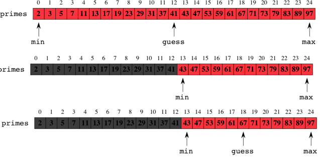

Classified with big-O notation of `O(log N)`

The key idea is that when binary search makes an incorrect guess, the portion of the array that contains reasonable guesses is reduced by at least half.
Once the reasonable portion contains just one element, no further guesses occur; the guess for the 1-element portion is either correct or incorrect, and we're done. So with an array of length 8, binary search needs at most four guesses.

    n    log2​n
    1    0
    2    1
    4    2
    8    3
    16   4
    32   5

Insertion and deletion operations:

**A Python implementation**

In the following, the attributes `left_child` and `right_child` will become references to other instances of the `BinaryTree` class

    class BinaryTree:
        def __init__(self,rootObj):
            self.key = rootObj
            self.left_child = None
            self.right_child = None

