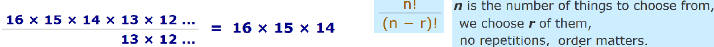
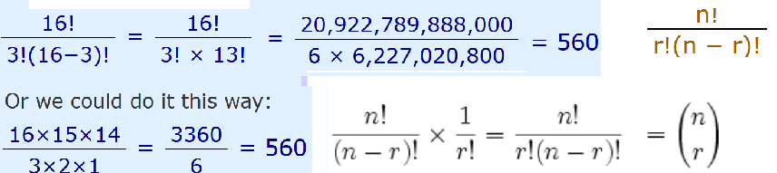
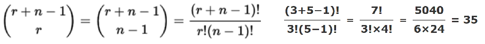

"My fruit salad is a combination of apples, grapes and bananas"  - When the order doesn't matter, it is a Combination.

"The combination to the safe is 472" - When the order does matter it is a Permutation.

In other words: a Permutation is an ordered Combination.

**Permutations**

1) Repetition is Allowed: e.g. a PIN code "334". choosing r of something that has n different types, the permutations are: n × n × ... (r times) = n^r.
E.g. there are 10 numbers to choose from (0-9) and we choose 3 of them: 10^3 = 1000.

2) No Repetition: e.g. in a running race, you can't be first and second. Without repetition our choices get reduced each time.
E.g. What order could 16 pool balls be in? See below. Or just 3 of them? 16 × 15 × 14 = 3,360

How do we write this reducing number of choices mathematically? The factorial function (symbol: !).

    16! = 20,922,789,888,000
    4! = 4 × 3 × 2 × 1 = 24
    7! = 7 × 6 × 5 × 4 × 3 × 2 × 1 = 5,040
    1! = 1

But when we want to select just 3 we don't want to multiply after 14. How do we do that? We divide by !13

**Combinations**

Combinations without Repetition. To explain the possible numbers, the easiest way is to treat as for permutations then alter so that the order doesnt matter.
  With the pool ball example, we just want to know which 3 pool balls are chosen, not the order.
  Say that balls 1, 2 and 3 are chosen.

      Order does matter:       Order does not matter:
      1 2 3
      1 3 2
      2 1 3                     1 2 3
      2 3 1
      3 1 2
      3 2 1

The permutations have 6 times as many possibilities, since there are 6 ways 1 2 3 could be ordered: 3! = 3 × 2 × 1 = 6.
So we adjust our permutations formula to reduce it by how many ways the objects could be in order:

Combinations with Repetition. Let us say there are five flavours of icecream
We can have three scoops. How many variations will there be? Let's use letters for the flavours: {b, c, l, s, v}. Example selections include {c, c, c} (3 scoops of chocolate)
There are 35 ways of having 3 scoops from five flavours of icecream:

