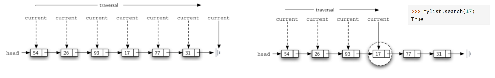
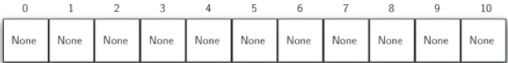
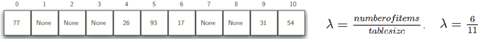
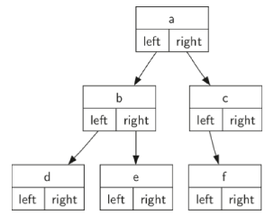
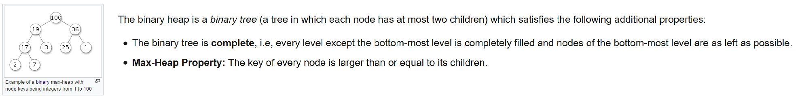
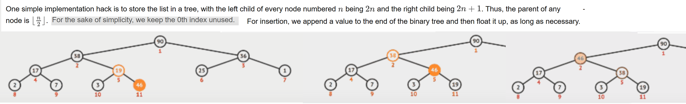

Stacks - ordered collection of items where the addition of new items and the removal of existing items always takes place at the same end.
Stacks are fundamentally important, as they can be used to reverse the order of items. The order of insertion is the reverse of the order of removal.

Queues - ordered collection of items where the addition of new items happens at one end, and removal at other end. FIFO, first-in first-out.
E.g. we wait in the check-out line at a grocery store

Deques - like a hybrid linear structure provides all the capabilities of stacks and queues. Addition/removal at either end. It is up to you to make consistent use of the addition and removal operations.

List is a fundamental data type, the ordering items relative to each other is very useful.

**The linked list - an unordered list**

An unordered list maintains the relative positioning of the items but has no requirement that we maintain that positioning in contiguous memory.

It is important to note that the location of the first item of the list must be explicitly specified. Once we know where the first item is, the first item can tell us where the second is, and so on. The external reference is often referred to as the **head** of the list. Similarly, the last item needs to know that there is no next item.

The basic building block for the linked list implementation is the node. Each node object must hold at least two pieces of information. First, the node must contain the list item itself. In addition, each node must hold a reference to the next node.

    class Node:
        def __init__(self,initdata):
            self.data = initdata
            self.next = None

    class UnorderedList:
        def __init__(self):
            self.head = None

        # only the first node created (the end) has next set to None;
        def add(self, item):
            temp = Node(item)
            temp.next = self.head
            self.head = temp

        def search(self, item):
            current = self.head
            found = False
            while current is not None and not found:
                if current.data == item:
                    found = True
                else:
                    current = current.next
            return found

    >>> mylist = UnorderedList()
    >>> for i in [31, 77, 17, 93, 26]:
    ...     mylist.add(i)
    >>> mylist.head
    <__main__.Node at 0x1229ed0>
    >>> mylist.head.next.next.data
    17
    >>> mylist.search(17)
    True

Searching for a value in a linked list implementation of an unordered list uses the technique of linked-list traversal.

As we visit each node in the linked list we will ask whether the data stored there matches the item, traversing all the way to the end of the list if it is not found.

**Hashing**

By knowing that a list was ordered, we could search in logarithmic time using a binary search. Hashing goes one step further by building a data structure that can be searched in `O(1)` time.

A hash table is a collection of items which are stored in such a way as to make it easy to find them later. Each position of the hash table, often called a slot, can hold an item and is named by an integer value starting at 0.
It can be implemented by using a Python list with each element initialized to `None`. E.g.
a hash table of size `m=11`, so there are m slots in the table, named 0 through 10:

The mapping between an item and the slot where that item belongs in the hash table is called the hash function.

An example of hash function is modulo arithmetic, *item*/*m* e.g. `54 % 11`. The result must be in the range of
hash names, hence modulo arithmetic in some form typically used in all hash functions.

Once hash values have been computed for items we want to store we can insert them into hash table at designated positions.
E.g. assume we want to store integer items 54, 26, 93, 17, 77, and 31.

Now when we want to search for an item, we simply use the hash function to compute the slot name for the item and then check the hash table to see if it is present. This searching operation is O(1), since a constant amount of time is required to compute the hash value and then index the hash table at that location.

Items need to map to unique position on the hash table. Note that if we now wanted to add integer of 44, this has hash value of 0 (44%11==0) which is already taken, so we would have a problem, a 'collision'.

Our goal is to create a hash function that minimizes the number of collisions, is easy to compute, and evenly distributes the items in the hash table. If the hash function is too complex, then it becomes more work to compute the slot name than it would be to simply do a basic sequential or binary search as described earlier. This would quickly defeat the purpose of hashing. There are a number of common ways to extend the simple remainder method.

An example of a numerical technique for constructing a hash function is called the mid-square method. We first square the item, and then extract some portion of the resulting digits. For example, if the item were 44, we would first compute 442=1,936. By extracting the middle two digits, 93, and performing the remainder step, we get 5 (93 % 11).
or character-based items such as strings. The word “cat” can be thought of as a sequence of ordinal values. We can then take these three ordinal values, add them up, and use the remainder method to get a hash value.

**Trees**

Using nodes and references, we might think of the tree as being structured like:

The structure is recursive in that each child of a binary tree can be treated as a binary tree itself.

The attributes left and right will become references to other instances of the `BinaryTree` class. When we insert a new left child into the tree we create another instance of `BinaryTree` and modify `self.left_child` in the root to reference the new tree. The root can reference any object or data

    class BinaryTree:
        def __init__(self, obj, left=None, right=None):
            self.key = obj
            self.left_child = left
            self.right_child = right

        def insert(self, position, obj):
            child = getattr(self, position + '_child')
            if child is None:
                setattr(self, position + '_child', BinaryTree(obj))
            else:
                new_node = BinaryTree(obj, **{position: child})
                setattr(self, position + '_child', new_node)

There are several ways of visiting nodes of a tree, which do so in different orders.
Functions which recursively traverse the nodes may be written as an external function or as a method on the class.

    bt = BinaryTree('a')
    bt.insert('left', 'b')
    bt.insert('right', 'c')
    bt.insert('left', 'd')

    def inorder(tree):
        if tree is not None:
            inorder(tree.left_child)
            print(tree.key)
            inorder(tree.right_child)

    def preorder(tree):
        if tree:
            print(tree.key)
            inorder(tree.left_child)
            inorder(tree.right_child)

    >>> print(inorder(bt))
    b
    d
    a
    c
    None
    >>> print(preorder(bt))
    a
    b
    d
    c
    None

**Binary Heaps**

A binary tree heap data structure used in sorting and priority queue algorithms.
Binary trees are useful for many purposes, but especially for searching, where it can find elements much quicker compared to walking an array or linked list.

Max heaps allow us to quickly find maximum level elements in a queue.
Children further down the tree can be of greater value than nodes higher up the tree on the other side. That doesn’t matter. The only thing that matters is that the children at equal or less than their parents.
So every node is the root of it’s own sub-heap.

