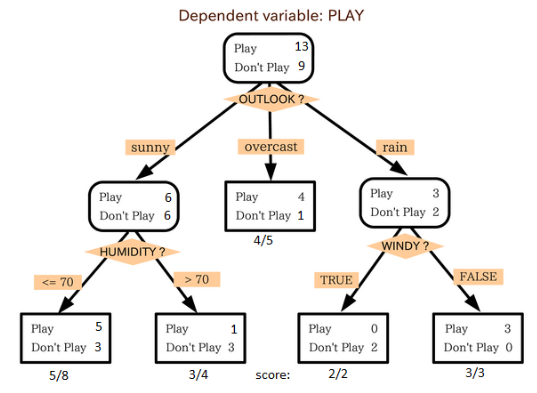
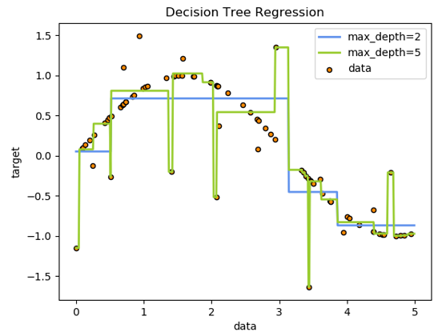
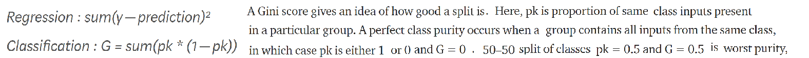

A decision tree classifies data items by posing a series of questions about the features associated with the items. Each question is contained in a node, and every internal node points to one child node for each possible answer to its question.

In the simplest form, we ask yes-or-no questions, and each internal node has a ‘yes’ child and a ‘no’ child. An item is sorted into a class by following the path from the topmost node, the root, to a node without children, a leaf, according to the answers that apply to the item under consideration.

in the example below, decision trees learn from data to approximate a sine curve with a set of if-then-else decision rules. The deeper the tree, the more complex the decision rules and the fitter the model.

Decision trees are sometimes more interpretable than other classifiers such as neural networks and support vector machines because they combine simple questions about the data in an understandable way.
They require little data preparation. Other techniques often require data normalisation and remove blank values etc.

Decision trees are flexible enough to handle items with a mixture of real-valued and categorical features, as well as items with some missing features. They are expressive enough to model many partitions of the data that are not as easily achieved with classifiers that rely on a single decision boundary (such as logistic regression or support vector machines). However, even data that can be perfectly divided into classes by a hyperplane may require a large decision tree if only simple threshold tests are used.

A crucial aspect to applying decision trees is limiting the complexity of the learned trees so that they do not overfit the training examples. One technique is to stop splitting when no question increases the purity of the subsets more than a small amount.

**Tips on practical use**

Decision-tree learners can create over-complex trees that do not generalise the data well. This is called overfitting. Mechanisms such as setting the minimum number of samples required at a leaf node or setting the maximum depth of the tree are necessary to avoid this problem.

Decision trees tend to overfit on data with a large number of features. Getting the right ratio of samples to number of features is important, since a tree with few samples in high dimensional space is very likely to overfit.

Consider performing dimensionality reduction (PCA or Feature selection) beforehand to give your tree a better chance of finding features that are discriminative.

Visualise your tree as you are training by using the `export` function. Use `max_depth=3` as an initial tree depth to get a feel for how the tree is fitting to your data, and then increase the depth.

Remember that the number of samples required to populate the tree doubles for each additional level the tree grows to. Use `max_depth` to control the size of the tree to prevent overfitting.

Example - Titanic dataset
-------------------------
The leaf nodes represent whether the passenger died or survived, so this is a Classification tree; egression trees are represented in the same manner, just they predict continuous values like price of a house. . A real dataset may have a lot more features, in which case this will just be a branch in a bigger tree.

Decide which features to choose and what conditions to use for splitting, along with knowing when to stop.

**Recursive Binary Splitting**

This algorithm is recursive in nature as the groups formed can be sub-divided using same strategy.
The root node is the best predictor/classifier.

Say we have 3 features, so will have 3 candidate splits. Now we will calculate how much accuracy each split will cost us, using a function. The split that costs least is chosen, which in our example is sex of the passenger.

**Cost of a split**

Cost functions used for classification and regression:

**When to stop splitting?**

A large set of features will result in a large number of split, which in turn gives a huge tree. Such trees are complex and can lead to overfitting. So, we need to know when to stop.

One way of doing this is to set a minimum number of training inputs to use on each leaf. e.g. a minimum of 10 passengers and ignore any leaf with < 10 passengers. Another way is to set maximum depth of your model (from root to leaf).

**Pruning**

Involves removing the branches that make use of features having low importance. This can improve performance of the tree by reducing complexity and therefore overfitting.

The simplest method of pruning starts at leaves and removes each node with most popular class in that leaf, this change is kept if it doesn't deteriorate accuracy. Its also called reduced error pruning.

Cost complexity pruning where a learning parameter (alpha) is used to weigh whether nodes can be removed based on the size of the sub-tree. This is also known as weakest link pruning.

**Drawbacks of CART**

Decision trees can be unstable because small variations in the data might result in a completely different tree being generated. This is called variance, which needs to be lowered by methods like bagging and boosting.

Decision tree learners create biased trees if some classes dominate. It is therefore recommended to balance the data set prior to fitting with the decision tree.

**Random forests and boosting**

Are two strategies for combining decision trees; increased accuracy often can be achieved by combining the results of a collection of decision trees.

