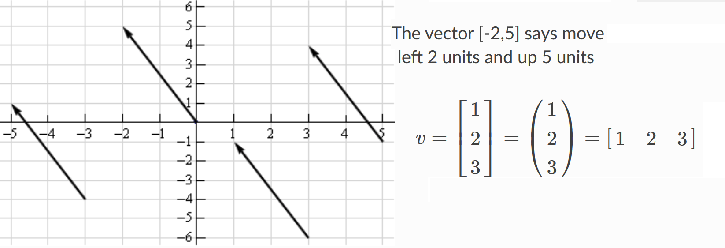
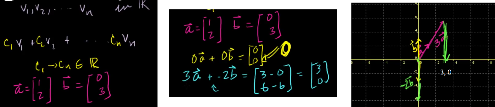
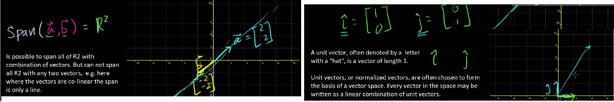
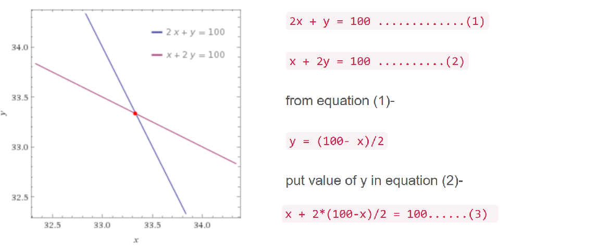
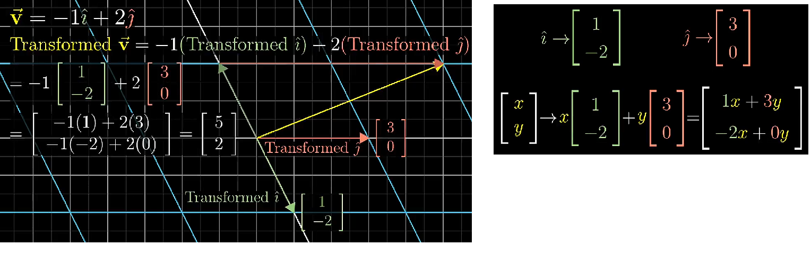

Linear algebra is a mathematical toolbox that offers helpful techniques for manipulating groups of numbers simultaneously. It provides structures like vectors and matrices (spreadsheets) to hold these numbers and new rules for how to add, subtract, multiply, and divide them.

Algebra explores the relationship between unknown numbers. Without knowing x and y, we can still work out that (x + y)2 = x2  + 2xy + y2

“Linear Algebra” generally means “line-like relationships”. Lines are nice and predictable, e.g. if 3 metres forward has a 1-metre rise, then going 10x as far should give a 10x rise. Contrast this with climbing a dome: each horizontal foot forward raises you a different amount.
Exponents (F(x) = x2) aren’t predictable: 102 is 100, but 202 is 400. We doubled the input but quadrupled the output.

**Vectors** are 1-d arrays of numbers or terms. In geometry, vectors store the magnitude and direction of a potential change to a point. The vector [3, -2] says go right 3 and down 2. A vector with more than one dimension is called a matrix.

Vectors and spaces
------------------
**Linear combinations**

Linear combination of the following vectors means you just add up the vectors (v1, v2 ...) and scale them by arbitrary constants (c1, c2...)
What is the linear combination of vector a and vector b?

It is called linear combination as all we are doing is scaling up and adding the vectors, not e.g. multiplying.

**Span**

What is the set of all the vectors I could have created by combining vectors a and b?

Representation of problems
--------------------------
Broadly speaking, in linear algebra data is represented in the form of linear equations. These linear equations are in turn represented in the form of matrices and vectors.

Suppose that price of 1 ball & 2 bat or 2 bat and 1 ball is 100 units. We need to find price of a ball and a bat.

Let’s translate this in mathematical form (where bat is Rs ‘x’ and ball is Rs 'y'):

    2x + y = 100
    x + 2y  =  100

To find the prices of bat and ball, we need the values of ‘x’ and ‘y’ such that it satisfies both the equations. The basic problem of linear algebra is to find these values of ‘x’ and ‘y’ i.e. the solution of a set of linear equations.

Linear equations represent flat objects. We will start with the simplest one to understand i.e. line. A line corresponding to an equation is the set of all the points which satisfy the given equation. For example,

Points (50,0) , (0,100), (100/3,100/3) and (30,40) satisfy our  equation (1) . So these points should lie on the line corresponding to our equation (1). Similarly, (0,50),(100,0),(100/3,100/3) are some of the points that satisfy equation (2).

Now in this situation, we want both of the conditions to be satisfied i.e. the point which lies on both the lines.  Intuitively, we want to find the intersection point of both the lines as shown in the figure below:

Now, since the equation (3) is an equation in single variable x, it can be solved for x and subsequently y.

**A third variable**

Suppose you are given a set of three conditions with three variables each as given below and asked to find the values of all the variables.

    x+y+z=1.......(4)
    2x+y=1......(5)
    5x+3y+2z=4.......(6)

From equation (4) we get:

    z=1-x-y....(7)

Substituting value of z in equation (6), we get:

    5x+3y+2(1-x-y)=4

    3x+y=2.....(8)

Once we know‘x’ and ‘y’, using the same logic as above, we can use (7) to find the value of ‘z’

Now imagine having 10 or more variables and equations. The above approach is unfeasible.
Matrices are used to solve a large set of linear equations.

A linear equation in 3 variables represents the set of all points whose coordinates satisfy the equations.
Basically, a linear equation in three variables represents a plane. Matrices enable us to deal with data in more the 3-dimensions.

More on Linear Transformations
----------------------------

ADD FROM 5:58 IN Linear transformations and matrices _ Essence of linear algebra, chapter 3

