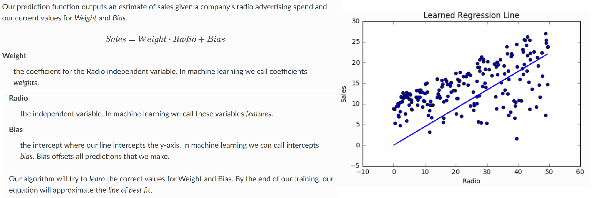
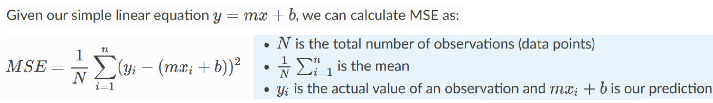
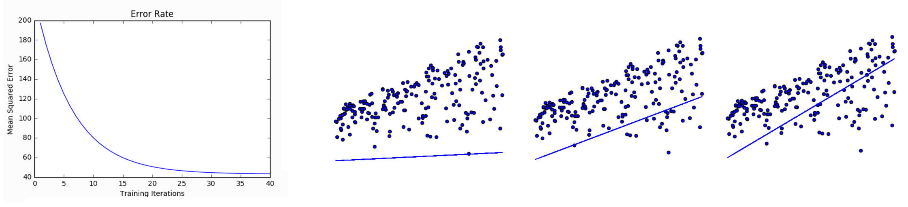
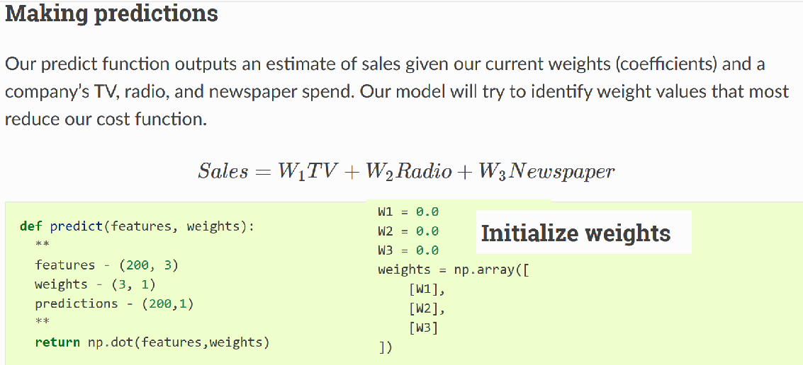

**Simple regression**

Simple linear regression uses traditional slope-intercept form, where m
and b are the variables our algorithm will try to “learn” to produce the most accurate predictions. x represents our input data and y represents our prediction.

    y=mx+b

**Multivariable regression**

A more complex, multi-variable linear equation might look like this, where w
represents the coefficients, or weights, our model will try to learn.

    f(x,y,z)=w1x+w2y+w3z

The variables x,y,z represent the attributes, or distinct pieces of information, we have about each observation. For sales predictions, these attributes might include a company’s advertising spend on radio, TV, and newspapers.

Simple regression
-----------------

[L1 vs. L2 Loss function](http://rishy.github.io/ml/2015/07/28/l1-vs-l2-loss/)

Least absolute deviations(L1) and Least square errors(L2) are the two standard loss functions, that decides what function should be minimized while learning from a dataset.

MSE (L2) measures the average squared difference between an observation’s actual and predicted values. The output is a single number representing the cost, or score, associated with our current set of weights.

MSE can be calculated as follows:

    def cost_function(radio, sales, weight, bias):
        companies = len(radio)
        total_error = 0.0
        for i in range(companies):
            total_error += (sales[i] - (weight*radio[i] + bias))**2
        return total_error / companies

To minimize MSE we use Gradient Descent whereby we iterate through our data points using our new weight and bias values and take the average of the partial derivatives. The resulting gradient tells us the slope of our cost function at our current position (i.e. weight and bias) and the direction we should update to reduce our cost function

Training a model is the process of iteratively improving your prediction equation by looping through the dataset multiple times, each time updating the weight and bias values in the direction indicated by the slope of the cost function (gradient). Training is complete when we reach an acceptable error threshold, or when subsequent training iterations fail to reduce our cost.

    def train(radio, sales, weight, bias, learning_rate, iters):
        cost_history = []

        for i in range(iters):
            weight,bias = update_weights(radio, sales, weight, bias, learning_rate)

            #Calculate cost for auditing purposes
            cost = cost_function(features, targets, weights)
            cost_history.append(cost)

            # Log Progress
            if i % 10 == 0:
                print("iter: "+str(i) + " cost: "+str(cost))

        return weight, bias, cost_history

    # logging
    iter=1     weight=.03    bias=.0014    cost=197.25
    iter=10    weight=.28    bias=.0116    cost=74.65
    iter=20    weight=.39    bias=.0177    cost=49.48
    iter=30    weight=.44    bias=.0219    cost=44.31
    iter=30    weight=.46    bias=.0249    cost=43.28

By learning the best values for weight and bias, we now have an equation that predicts future sales based on radio advertising investment: Sales=.46Radio+.025

Multivariable regression
------------------------
As the number of features grows, the complexity of our model increases and it becomes increasingly difficult to visualize, or even comprehend, our data.
One solution is to break the data apart and compare 1-2 features at a time. In this example we explore how Radio and TV investment impacts Sales.

As the number of features grows, calculating gradient takes longer to compute. We can speed this up by “normalizing” our input data to ensure all values are within the same range. This is especially important for datasets with high standard deviations or differences in the ranges of the attributes. Our goal now will be to normalize our features so they are all in the range -1 to 1.

    For each feature column {
        #1 Subtract the mean of the column (mean normalization)
        #2 Divide by the range of the column (feature scaling)
    }

Our input is a 200 x 3 matrix containing TV, Radio, and Newspaper data. Our output is a normalized matrix of the same shape with all values between -1 and 1.

    def normalize(features):
        """
        features     -   (200, 3)
        features.T   -   (3, 200)

        We transpose the input matrix, swapping
        cols and rows to make vector math easier
        """

        for feature in features.T:
            fmean = np.mean(feature)
            frange = np.amax(feature) - np.amin(feature)

            #Vector Subtraction
            feature -= fmean

            #Vector Division
            feature /= frange

        return features

Now we need a cost function to audit how our model is performing.

    def cost_function(features, targets, weights):
        """
        Features:(200,3)
        Targets: (200,1)
        Weights:(3,1)
        Returns 1D matrix of predictions
        """
        N = len(targets)
        predictions = predict(features, weights)
        sq_error = (predictions - targets)**2
        return 1.0/(2*N) * sq_error.sum()

Again using the Chain rule for our gradient descent:

    def update_weights_vectorized(X, targets, weights, lr):
        '''
        Features:(200, 3)
        Targets: (200, 1)
        Weights:(3, 1)
        '''
        predictions = predict(features, weights)

        #Extract our features
        x1 = features[:,0]
        x2 = features[:,1]
        x3 = features[:,2]

        # Use matrix cross product (*) to simultaneously
        # calculate the derivative for each weight
        d_w1 = -x1*(targets - predictions)
        d_w2 = -x2*(targets - predictions)
        d_w3 = -x3*(targets - predictions)

        # Multiply the mean derivative by the learning rate
        # and subtract from our weights (remember gradient points in direction of steepest ASCENT)
        weights[0][0] -= (lr * np.mean(d_w1))
        weights[1][0] -= (lr * np.mean(d_w2))
        weights[2][0] -= (lr * np.mean(d_w3))

        return weights
