Whereas linear regression algorithms are used to predict/forecast values but logistic regression is used for classification tasks.

Many classification tasks done routinely by people, e.g. classifying whether an email is a spam or not, classifying whether a tumour is malignant or benign, are typical examples ML algorithms can do.

LR is a classification algorithm that is used to predict the probability of a categorical dependent variable. In logistic regression, the dependent variable is a binary variable (data is 1 or 0).
The independent variables should be independent of each other. That is, the model should have little or no multicollinearity.
Requires quite large sample sizes.

Types include: Binary (Pass/Fail), Multi (Cats, Dogs, Sheep), Ordinal (Low, Medium, High)

The Sigmoid Function: logistic regression algorithm also uses a linear equation with independent predictors to predict a value (which can be between negative infinity and positive infinity). To squash the predicted value between 0 and 1, we use the sigmoid function.

**The Cost Function**

Is used to measure the accuracy of the LR model for a given set of parameters θ.
The math behind this is a little complicated, but you can interpret it as computing an error rate based on a comparison of the predicted probability of an outcome P(1) and the actual outcome y. The closer the predicted probability is to 1 or 100%, the lower the error for the “1” or “positive class”.

Example 1
---------
Say we’re given [data](http://scilab.io/wp-content/uploads/2016/07/data_classification.csv) on student exam results and our goal is to predict whether a student will pass or fail based on number of hours slept and hours spent studying. We have two features (hours slept, hours studied) and two classes: passed (1) and failed (0).

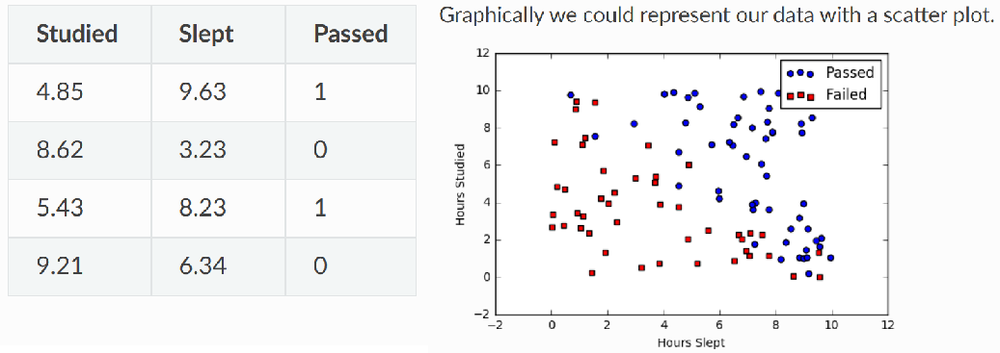

**Sigmoid activation** Use sigmoid to map predictions to probabilities:

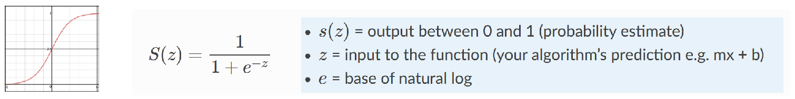

**Decision boundary** In order to map this to a discrete class, we select a threshold value or tipping point above which we will classify values

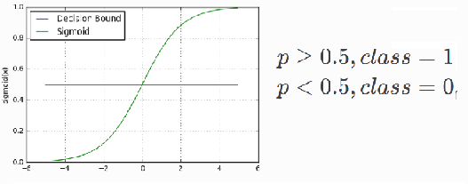

**Making predictions** A prediction function in logistic regression returns the probability of our observation being positive, True, or “Yes”. We call this class 1 and its notation is P(class=1)

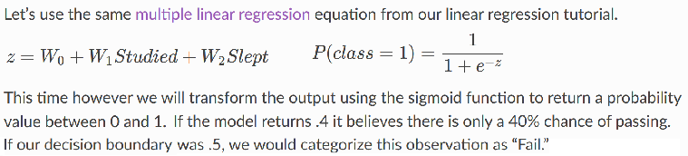

    def predict(features, weights):
        ''' Returns 1D array of probabilities that class label == 1 '''
        z = np.dot(features, weights)
        return sigmoid(z)

**The Cost Function** We cannot use the same cost function MSE (L2) as we did for linear regression, because our prediction function is non-linear (due to sigmoid transform). Instead we use as function known as Log Loss.

    def cost_function(features, labels, weights):
        observations = len(labels)
        predictions = predict(features, weights)

        #Take the error when label=1
        class1_cost = -labels*np.log(predictions)

        #Take the error when label=0
        class2_cost = (1-labels)*np.log(1-predictions)

        #Take the sum of both costs
        cost = class1_cost - class2_cost

        #Take the average cost
        cost = cost.sum()/observations
        return cost

**Gradient Descent** To minimize our cost, we use Gradient Descent just like before in Linear Regression.

    def update_weights(features, labels, weights, lr):
        '''
        Vectorized Gradient Descent

        Features:(200, 3)
        Labels: (200, 1)
        Weights:(3, 1)
        '''
        N = len(features)

        #1 - Get Predictions
        predictions = predict(features, weights)

        #2 Transpose features from (200, 3) to (3, 200)
        # So we can multiply w the (200,1)  cost matrix.
        # Returns a (3,1) matrix holding 3 partial derivatives --
        # one for each feature -- representing the aggregate
        # slope of the cost function across all observations
        gradient = np.dot(features.T,  predictions - labels)

        #3 Take the average cost derivative for each feature
        gradient /= N

        #4 - Multiply the gradient by our learning rate
        gradient *= lr

        #5 - Subtract from our weights to minimize cost
        weights -= gradient

        return weights

**Mapping probabilities to classes and training**

    def decision_boundary(prob):
        return 1 if prob >= .5 else 0

    def classify(preds):
        '''
        >>> def classify([ 0.967, 0.448, 0.015, 0.780, 0.978, 0.004])
        [1, 0, 0, 1, 1, 0]
        '''
        decision_boundary = np.vectorize(decision_boundary)
        return decision_boundary(predictions).flatten()

    def train(features, labels, weights, lr, iters):
        cost_history = []

        for i in range(iters):
            weights = update_weights(features, labels, weights, lr)

            #Calculate error for auditing purposes
            cost = cost_function(features, labels, weights)
            cost_history.append(cost)

            # Log Progress
            if i % 1000 == 0:
                print "iter: "+str(i) + " cost: "+str(cost)

        return weights, cost_history

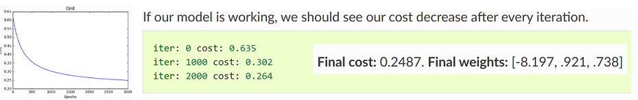

**Accuracy** measures how correct our predictions were. In this case we simple compare predicted labels to true labels and divide by the total.

    def accuracy(predicted_labels, actual_labels):
        diff = predicted_labels - actual_labels
        return 1.0 - (float(np.count_nonzero(diff)) / len(diff))

**Decision boundary** Another helpful technique is to plot the decision boundary on top of our predictions to see how our labels compare to the actual labels.

    def plot_decision_boundary(trues, falses):
        fig = plt.figure()
        ax = fig.add_subplot(111)

        no_of_preds = len(trues) + len(falses)

        ax.scatter([i for i in range(len(trues))], trues, s=25, c='b', marker="o", label='Trues')
        ax.scatter([i for i in range(len(falses))], falses, s=25, c='r', marker="s", label='Falses')

        plt.legend(loc='upper right');
        ax.set_title("Decision Boundary")
        ax.set_xlabel('N/2')
        ax.set_ylabel('Predicted Probability')
        plt.axhline(.5, color='black')
        plt.show()

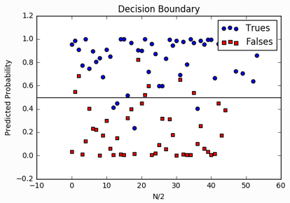

**More than two discrete outcomes**

Say you are trying to distinguish between 3 outcomes, i.e. fraudulent vs. valid vs. refunded transactions. To solve this multiclass problem, you’d basically create 3 separate logistic regression models: the 1st by separating fraud vs. valid + refunded, the 2nd for valid vs. fraud + refunded, and the 3rd for refunded vs. valid + fraud. Then for each example you want to run a prediction, you simply choose the model with the highest predicted probability.

Example 2
---------
The [dataset](http://archive.ics.uci.edu/ml/index.php) provides the bank customers’ information. It includes 41,188 records and 21 fields:

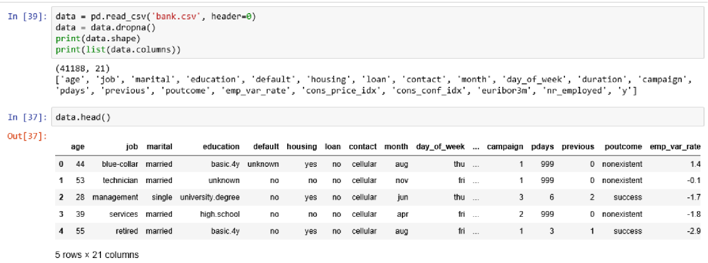

**Predict variable (desired target)**

y — has the client subscribed a term deposit? (binary: “1”, means “Yes”, “0” means “No”)

The education column of the dataset has many categories and we need to reduce the categories for a better modelling.

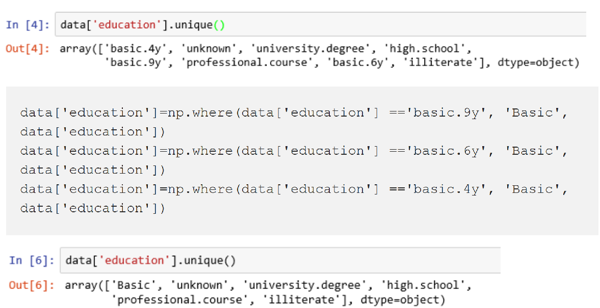

**Data exploration**

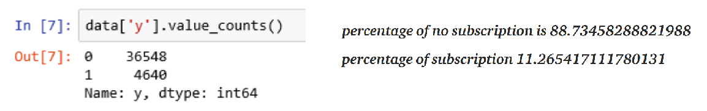

Our classes are imbalanced, and the ratio of no-subscription to subscription instances is 89:11. Before we go ahead to balance the classes, let’s do some more exploration.

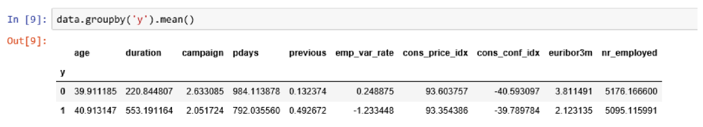

The average age of customers who bought the term deposit is higher, and the pdays (days since the customer was last contacted) is lower.

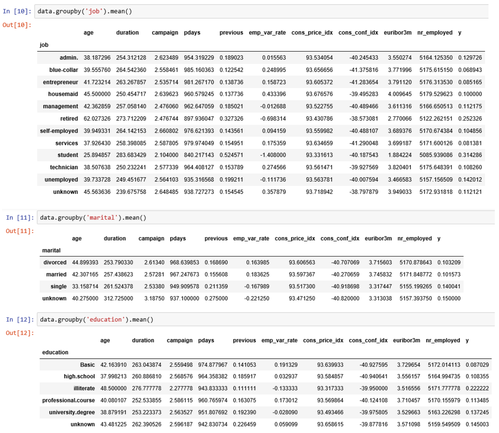

**Create dummy variables and training data**

Nominal variables, or variables that describe a characteristic using two or more categories are not always useable in their categorical form. A common workaround for incorporating these variables into a regression analysis is to use dummy variables.
Consider the favorite class variable, originally coded as science = 1, math = 2, and language = 3:

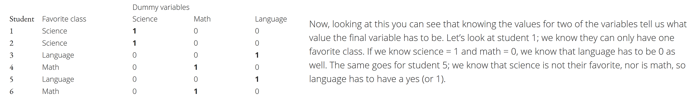

We do not use all three categories in a regression however. Doing so would give the regression redundant information and result in multicollinearity.
This means we have to leave one category out, and we call this missing category the reference category. Using the reference category makes all interpretation in reference to that category. For example, if you included the dummy variable of science and used language as the reference, results for that variable tell you those students’ results in comparison to students with language as their favorite class. The author edreference category is usually chosen based on how you want to interpret the results, so if you would rather talk about students in comparison to those with math as their favorite class, simply include the other two instead.

    cat_vars=['job','marital','education','default','housing','loan','contact','month','day_of_week','poutcome']
    for var in cat_vars:
        cat_list='var'+'_'+var
        cat_list = pd.get_dummies(data[var], prefix=var)
        data1=data.join(cat_list)
        data=data1

    data_vars=data.columns.values.tolist()
    to_keep=[i for i in data_vars if i not in cat_vars]

    data_final=data[to_keep]
    data_final.columns.values

    X = data_final.loc[:, data_final.columns != 'y']
    y = data_final.loc[:, data_final.columns == 'y']

    # Over-sample with SMOTE in creation of training data

    from imblearn.over_sampling import SMOTE

    os = SMOTE(random_state=0)
    X_train, X_test, y_train, y_test = train_test_split(X, y, test_size=0.3, random_state=0)
    columns = X_train.columns

    os_data_X,os_data_y=os.fit_sample(X_train, y_train)
    os_data_X = pd.DataFrame(data=os_data_X,columns=columns )
    os_data_y= pd.DataFrame(data=os_data_y,columns=['y'])
    # we can then check the numbers of our data

    data_final_vars=data_final.columns.values.tolist()
    y=['y']
    X=[i for i in data_final_vars if i not in y]

    # Implelemnt RFE to train the model by choosing best performing features

    from sklearn.feature_selection import RFE
    from sklearn.linear_model import LogisticRegression

    logreg = LogisticRegression()

    rfe = RFE(logreg, 20)
    rfe = rfe.fit(os_data_X, os_data_y.values.ravel())
    print(rfe.support_)
    print(rfe.ranking_)

    cols=['euribor3m', 'job_blue-collar', 'job_housemaid', 'marital_unknown', 'education_illiterate', 'default_no', 'default_unknown',
          'contact_cellular', 'contact_telephone', 'month_apr', 'month_aug', 'month_dec', 'month_jul', 'month_jun', 'month_mar',
          'month_may', 'month_nov', 'month_oct', "poutcome_failure", "poutcome_success"]
    X=os_data_X[cols]
    y=os_data_y['y']

    # We can now implement the model

The SMOTE algorithm works by creating synthetic samples from the minor class instead of creating copies.
After this, we now have a perfect balanced set of data. We over-sampled only on the training data, so none of the information in the test data is used to create synthetic observations

Synthetic data: collecting the necessary amount of labeled training data needed to train machine learning algorithms can be cost prohibitive or impractical, or say the data needs to certain conditions that cannot be obtained with authentic data (e.g. 98% of samples negative).

**Recursive Feature Elimination (RFE) to select best-performing features**

The performance of machine learning algorithms is typically evaluated using predictive accuracy. However, this is not appropriate when the data is imbalanced and/or the costs of different errors vary markedly. As an example, consider the classification of pixels in mammogram images as possibly cancerous. A typical mammography dataset might contain 98% normal pixels and 2% abnormal pixels. A simple default strategy of guessing the majority class would give a predictive accuracy of 98%. However, the nature of the application requires a fairly high rate of correct detection in the minority class and allows for a small error rate in the majority class in order to achieve this. Simple predictive accuracy is clearly not appropriate in such situations. The Receiver Operating Characteristic (ROC) curve is a standard technique for summarizing classifier performance over a range of tradeoffs between true positive and false positive error rates

Where classification categories are not approximately equally represented. Often real-world data sets are predominately composed of “normal” examples with only a small percentage of “abnormal” or “interesting” examples. It is also the case that the cost of misclassifying an abnormal (interesting) example as a normal example is often much higher than the cost of the reverse error. Under-sampling of the majority (normal) class has been proposed as a good means of increasing the sensitivity of a classifier to the minority class. This paper (on [SMOTE algorithm](https://arxiv.org/pdf/1106.1813.pdf)) shows that a combination of our method of over-sampling the minority (abnormal) class and under-sampling the majority (normal) class can achieve better classifier performance (in ROC space) than only under-sampling the majority class.

Recursive Feature Elimination (RFE) is based on the idea to repeatedly construct a model and choose either the best or worst performing feature, setting the feature aside and then repeating the process with the rest of the features. This process is applied until all features in the dataset are exhausted. The goal of RFE is to select features by recursively considering smaller and smaller sets of features.

**Implementing the model**

    import statsmodels.api as sm
    logit_model=sm.Logit(y,X)
    result=logit_model.fit()
    print(result.summary2())

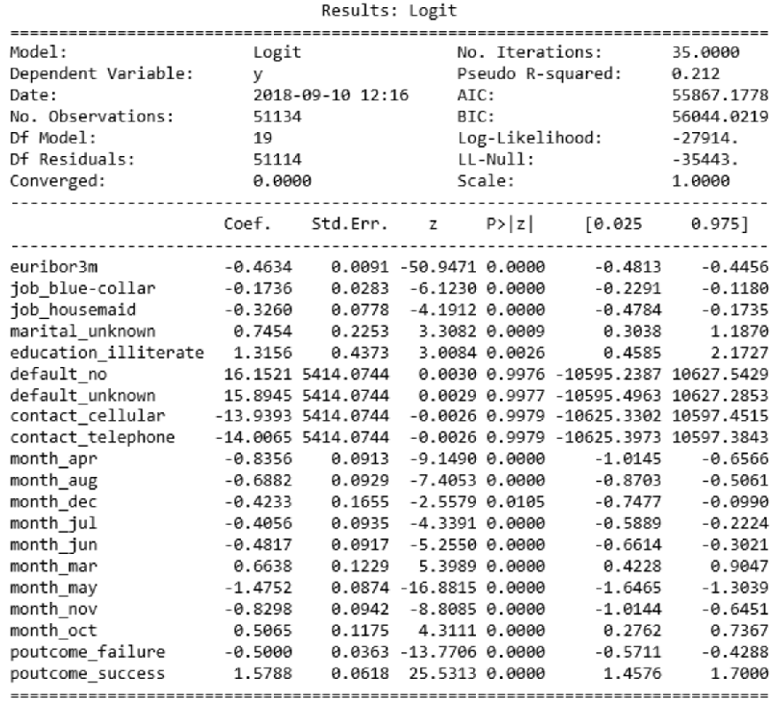

The p-values for most of the variables are smaller than 0.05, except four variables which we remove:

    X=os_data_X[cols]
    y=os_data_y['y']

    logit_model=sm.Logit(y,X)
    result=logit_model.fit()
    print(result.summary2())

**Logistic Regression Model Fitting**

    from sklearn.linear_model import LogisticRegression
    from sklearn import metrics

    X_train, X_test, y_train, y_test = train_test_split(X, y, test_size=0.3, random_state=0)
    logreg = LogisticRegression()
    logreg.fit(X_train, y_train)

    y_pred = logreg.predict(X_test)
    print('Accuracy of logistic regression classifier on test set: {:.2f}'.format(logreg.score(X_test, y_test)))

Accuracy of logistic regression classifier on test set: 0.74.

**Confusion Matrix**

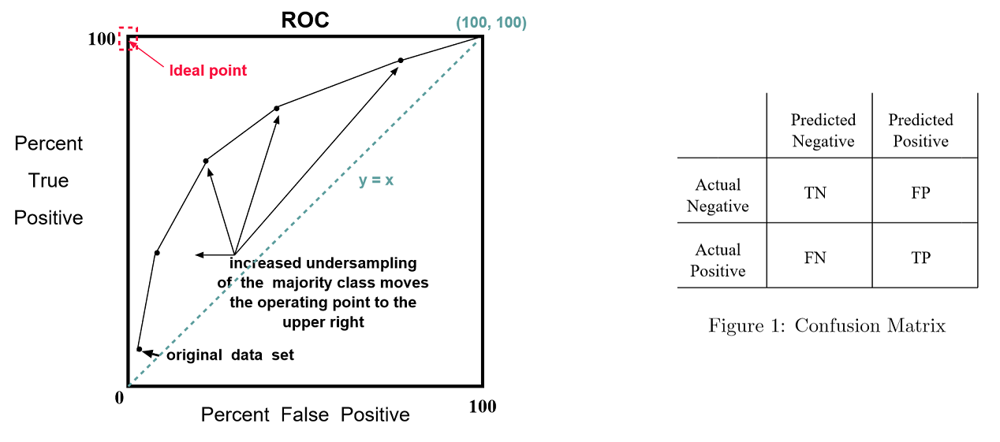

    from sklearn.metrics import confusion_matrix
    confusion_matrix = confusion_matrix(y_test, y_pred)
    print(confusion_matrix)

The result is telling us that we have 6124+5170 correct predictions and 2505+1542 incorrect predictions.

**ROC Curve**

    from sklearn.metrics import roc_auc_score
    from sklearn.metrics import roc_curve
    logit_roc_auc = roc_auc_score(y_test, logreg.predict(X_test))
    fpr, tpr, thresholds = roc_curve(y_test, logreg.predict_proba(X_test)[:,1])
    plt.figure()
    plt.plot(fpr, tpr, label='Logistic Regression (area = %0.2f)' % logit_roc_auc)
    plt.plot([0, 1], [0, 1],'r--')
    plt.xlim([0.0, 1.0])
    plt.ylim([0.0, 1.05])
    plt.xlabel('False Positive Rate')
    plt.ylabel('True Positive Rate')
    plt.title('Receiver operating characteristic')
    plt.legend(loc="lower right")
    plt.savefig('Log_ROC')
    plt.show()

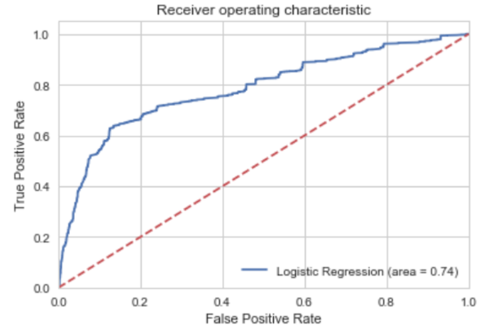

The ROC curve is another common tool used with binary classifiers. The dotted line represents the ROC curve of a purely random classifier; a good classifier stays as far away from that line as possible (toward the top-left corner).
