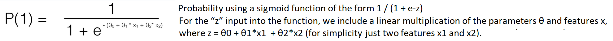

Whereas linear regression algorithms are used to predict/forecast values but logistic regression is used for classification tasks.

Many classification tasks done routinely by people, e.g. classifying whether an email is a spam or not, classifying whether a tumour is malignant or benign, are typical examples ML algorithms can do.

LR is a classification algorithm that is used to predict the probability of a categorical dependent variable. In logistic regression, the dependent variable is a binary variable (data is 1 or 0).
The independent variables should be independent of each other. That is, the model should have little or no multicollinearity.
Requires quite large sample sizes.

Types include: Binary (Pass/Fail), Multi (Cats, Dogs, Sheep), Ordinal (Low, Medium, High)

**The Sigmoid Function**

Logistic regression algorithm also uses a linear equation with independent predictors to predict a value (which can be between negative infinity and positive infinity). To squash the predicted value between 0 and 1, we use the sigmoid function.

**The Cost Function**

Is used to measure the accuracy of the LR model for a given set of parameters θ.

The math behind this is a little complicated, but you can interpret it as computing an error rate based on a comparison of the predicted probability of an outcome P(1) and the actual outcome y. The closer the predicted probability is to 1 or 100%, the lower the error for the “1” or “positive class”.

**Example 1**

**More than two discrete outcomes**

Say you are trying to distinguish between 3 outcomes, i.e. fraudulent vs. valid vs. refunded transactions. To solve this multiclass problem, you’d basically create 3 separate logistic regression models: the 1st by separating fraud vs. valid + refunded, the 2nd for valid vs. fraud + refunded, and the 3rd for refunded vs. valid + fraud. Then for each example you want to run a prediction, you simply choose the model with the highest predicted probability.

