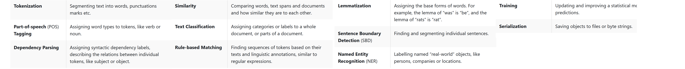
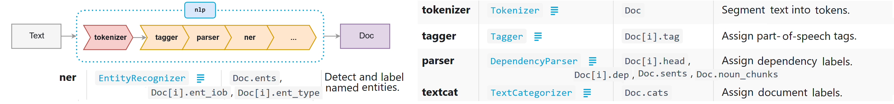
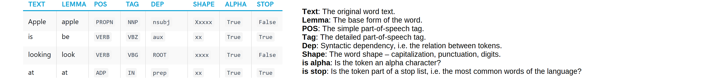
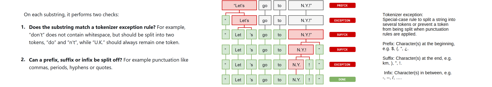
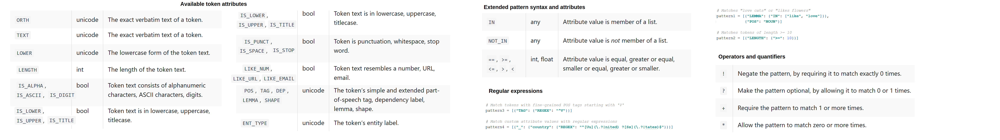
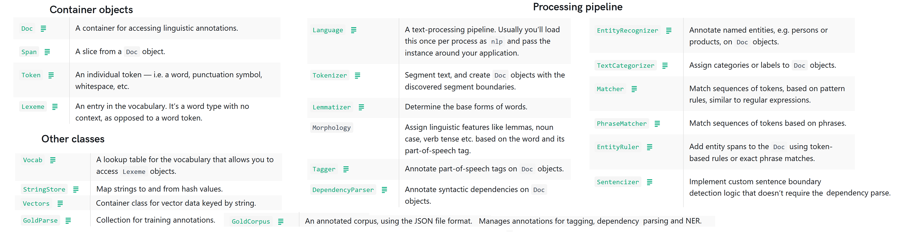

spaCy intro
-----------

A library that helps build  that process and “understand” large volumes
of text. It can be used to build systems for
extracting information and understanding natural language, or used to pre-process text for deep learning.
Some of its features and capabilities refer to linguistic concepts, while others
are related to more general machine learning functionality.

Some features require statistical models to be loaded (e.g. `nlp = spacy.load('en_core_web_sm')`), which enable
linguistic annotations to be predicted – e.g. if a word is a verb or a noun.

When you call `nlp` on text, it is tokenized to produce a `Doc` object which
is then processed in steps, known as the processing pipeline. The pipeline used by
the default models consists of a tagger, a parser and an entity recognizer.
Each pipeline component returns the processed `Doc`, which is then passed on
to the next component:

The processing pipeline always depends on the statistical model and its
capabilities. For example, a pipeline can only include an entity recognizer
component if the model includes data to make predictions of entity labels.
Each `Doc` consists of individual tokens, and we can iterate over them:

    nlp = spacy.load('en_core_web_sm')
    doc = nlp('You owe me $90 million')
    [token.text for token in doc]
    # ['You', 'owe', 'me', '$', '90', 'million']

A token simply refers to an individual part of a sentence having some semantic value.
After tokenization, the `Doc` is parsed and tagged. The
statistical model enables predictions of which
tag or label most likely applies in the context. A model consists of binary
data and is produced by showing a system enough examples for it to make
generalizations – e.g. a word following “the” is most likely a noun.

Stop words are "the", "a", "an" etc and do not have any meaning of their own.
Stop words are often not very useful for NLP tasks such as text classification,
so it is often better to remove them. There are 305 stop words;
you can add or remove words from this list:

    >>> nlp.Defaults.stop_words.add('looking')
    >>> nlp.vocab['looking'].is_stop = True
    >>> [token.is_stop for token in nlp('Paul is looking')]
    [False, True, True]

The `pos_` attribute gives parts of speech.
POS tagging is useful if you have words or tokens that can have multiple POS tags.
E.g. the word "google" can be used as both a noun and verb and this difference
is important in NLP.
The context (surrounding words) allows the correct POS tag for the word to be predicted.
Usage guides on [part-of-speech tagging](https://spacy.io/usage/linguistic-features#pos-tagging)
and [using the dependency parse](https://spacy.io/usage/linguistic-features#dependency-parse).
You can also find the number of occurrences of each POS tag:

    >>> [a.pos_ for a in doc]
    ['PRON', 'VERB', 'PRON', 'SYM', 'NUM', 'NUM']
    >>> doc.count_by(spacy.attrs.POS)
    {99: 1, 100: 1, 93: 2, 95: 2}

For [dependency parsing](https://nlp.stanford.edu/software/dependencies_manual.pdf), the attribute `dep_` is used as shown below.
The output shows that spaCy is able to find the dependency between the
tokens. For the word "is'nt", the depenency parser has broken it down to
two words and specified the "n't" as being a negation of the previous word:

    >>> [(a.text,  a.pos_, a.dep_) for a in nlp("He isn't looking")]
    [('He', 'PRON', 'nsubj'), ('is', 'VERB', 'aux'), ("n't", 'ADV', 'neg'), ('looking', 'VERB', 'ROOT')]

The `sentence` attribute can be used, for example, to check if a sentence
starts with a particular token or not. The `is_sent_start` attribute
can be used to show if a particular sentence starts with 'The'.
The following example shows that scaPy knows not to tokenize the
punctuation marks in abbreviations "U.K" and "U.S.A.":

    >>> [a.text for a in nlp('"They\'re leaving U.K. for U.S.A."')]
    ['"', 'They', "'re", 'leaving', 'U.K.', 'for', 'U.S.A.', '"']

The following example shows that spaCy is able to detect the email and
so it is not tokenized despite it having a "-". On the other hand,
the word "non-vegetarian" is tokenized:

    >>> [a.text for a in nlp("I'm non-vegetarian, send the menu to abc-xyz@gmai.com")]
    ['I', "'m", 'non', '-', 'vegetarian', ',', 'send', 'the', 'menu', 'to', 'abc-xyz@gmai.com']

Raw text is split on whitespace characters, similar to `str.split(' ')`.
Then, the tokenizer processes the text from left to right.
If there’s a match, the rule is applied and the tokenizer continues its loop,
starting with the newly split substrings. This allows handling of
combinations of abbreviations and multiple punctuation marks:

**Detecting entities and nouns**

In the following sentence, we know that "Manchester United" is a single
word, therefore it should not be tokenized into two words. Similarly,
"Harry Kane" is the name of a person, and "$90 million" is a currency value.
Named entities are available as the `ents` property of a `Doc`:

    >>> for entity in nlp(u'Manchester United signed Harry Kane for $90 million').ents:
    ...     print(entity.text + ' - ' + entity.label_ + ' - ' + str(spacy.explain(entity.label_)))
    Manchester United - ORG - Companies, agencies, institutions, etc.
    Harry Kane - PERSON - People, including fictional
    $90 million - MONEY - Monetary values, including unit

As models are statistical and strongly depend on examples they were trained on,
this may need some tuning later, depending on your use case.
To learn more about entity recognition in spaCy, how to add your own entities
to a document and how to train entity predictions of a model,
see [named entity recognition](https://spacy.io/usage/linguistic-features#named-entities)
and [training the named entity recognizer](https://spacy.io/usage/training#ner).

**Stemming and Lemmatization**

Stemming refers to reducing a word to its root form.
For instance, compute, computer, computing, computed etc. have the same root.
Suppose we created an instance of `PorterStemmer` or `SnowballStemmer` from the nlpk library called `stemmer`:

    >>> tokens = ['compute', 'computer', 'computed', 'computing']
    >>> [stemmer.stem(token))for token in tokens]
    ['comput', 'comput', 'comput', 'comput']

Lemmatization reduces the word to its stem which is a semantically-complete word.
It would return the same words from `tokens` above.
We can perform lemmatization using spaCy, which converts words to their first form variants:

    >>> [a.text + ' => ' + a.lemma_ for a in nlp('A letter has been written')]
    ['A => a', 'letter => letter', 'has => have', 'been => be', 'written => write']

**Rule-based Matching**

[Docs](https://spacy.io/usage/rule-based-matching).
Compared to using regex on raw text, spaCy’s rule-based matcher engines allow
you to access and analyze the surrounding tokens, merge spans into single
tokens or add entries to the named entities in `doc.ents`.

Training a model is useful if you have some examples and you want your system
to be able to generalize based on those examples. It works especially well
if there are clues in the local context.
Rule-based systems are a good choice if there’s a more or less finite number
of examples that you want to find in the data, or if there’s a very clear,
structured pattern you can express with token rules or regular expressions
(e.g. IP addresses, URLs).
See [docs](https://spacy.io/usage/rule-based-matching#rules-vs-model) for further
info on deciding whether to use rules or train a model?

The `Matcher` tool that can be used to specify custom rules for phrase matching.
Usage involves defining the patterns and adding them to your `Matcher`.
In the following
block, `p1`, `p2`, `p3`, and `p4` look for the phrases "quickbrownfox", "quick-brown-fox",
"qucik brown fox" and "quick brownfox":

    p1 = [{'LOWER': 'quickbrownfox'}]
    p2 = [{'LOWER': 'quick'}, {'IS_PUNCT': True}, {'LOWER': 'brown'}, {'IS_PUNCT': True}, {'LOWER': 'fox'}]
    p3 = [{'LOWER': 'quick'}, {'LOWER': 'brown'}, {'LOWER': 'fox'}]
    p4 =  [{'LOWER': 'quick'}, {'LOWER': 'brownfox'}]

    nlp = spacy.load('en_core_web_sm')
    m_tool = Matcher(nlp.vocab)
    m_tool.add('QBF', None, p1, p2, p3, p4)  # QBF is the name of our matcher

We can then pass a `Document` object to the matcher and this returns
ids of the phrases matched in the document, along with their starting
and ending positions:

    >>> doc = nlp(u'The quick-brown-fox jumps over the lazy dog. The quick brown fox eats...')
    >>> for match_id, start, end in m_tool(doc) :
    ...    string_id = nlp.vocab.strings[match_id]
    ...    span = doc[start:end]
    ...    print(match_id, string_id, start, end, span.text)
    12825528024649263697 QBF 1 6 quick-brown-fox
    12825528024649263697 QBF 13 16 quick brown fox

[Docs](https://spacy.io/usage/linguistic-features#adding-patterns-attributes) on
all the tokens and wildcards that can be used for phrase matching.
The "*" attribute, for instance, can be used to search for one or more
instances of a token. The following lines allow "quick--brown--fox" to be matched:

    m_tool.remove('QBF')
    p1 = [{'LOWER': 'quick'}, {'IS_PUNCT': True, 'OP':'*'}, {'LOWER': 'brown'}, {'IS_PUNCT': True, 'OP':'*'}, {'LOWER': 'fox'}]
    m_tool.add('QBF', None, p1)

***

A pattern consists of a list of dicts, where each dict describes a token.

    # Matches "love cats" or "likes flowers"
    pattern1 = [{"LEMMA": {"IN": ["like", "love"]}}, {"POS": "NOUN"}]

The available token pattern [keys](https://spacy.io/usage/rule-based-matching#adding-patterns-attributes)
are uppercase versions of the Token attributes.
See [docs](https://spacy.io/usage/rule-based-matching#matcher) on token-based matching.

    from spacy.matcher import Matcher

    nlp = spacy.load("en_core_web_sm")
    matcher = Matcher(nlp.vocab)

    def set_sentiment(matcher, doc, i, matches):
        doc.sentiment += 0.1

    pattern1 = [{"ORTH": "Google"}, {"ORTH": "I"}, {"ORTH": "/"}, {"ORTH": "O"}]
    pattern2 = [[{"ORTH": emoji, "OP": "+"}] for emoji in ["😀", "😂", "🤣", "😍"]]
    matcher.add("GoogleIO", None, pattern1)  # Match "Google I/O" or "Google i/o"
    matcher.add("HAPPY", set_sentiment, *pattern2)  # Match one or more happy emoji

    doc = nlp(u"A text about Google I/O 😀😀")
    matches = matcher(doc)

    for match_id, start, end in matches:
        string_id = nlp.vocab.strings[match_id]
        span = doc[start:end]
        print(string_id, span.text)
    print("Sentiment", doc.sentiment)

    # GoogleIO Google I/O
    # HAPPY 😀
    # HAPPY 😀😀
    # HAPPY 😀
    # Sentiment 0.30000001192092896

By default, the matcher will only return matches and not do anything else
like merge entities or assign labels. This can be defined
individually for each pattern, by passing in a callback function as the on_match argument on add`()`,
as done with the `set_sentiment` function above.

***

In addition to defining rules, we can directly specify the phrases that we are looking for.
PhraseMatcher API [docs](https://spacy.io/api/phrasematcher).
The `PhraseMatcher` is useful if you already have a large terminology list oof single or multi-token
phrases you want to find exact instances of in your data.

The `.add` method adds a rule to the matcher instance and has
the same call signature as for `Matcher` , consisting of an ID key,
one or more patterns , and a callback function
(a callable or `None` - see [docs](https://spacy.io/api/phrasematcher#add))
to act on the matches.

    >>> matcher = PhraseMatcher(nlp.vocab)
    >>> matcher.add("HEALTH", None, nlp(u"health care reform"),  nlp(u"healthcare reforms"))
    >>> doc = nlp(u"He defended his planned healthcare reforms")
    >>> matches = matcher(doc)
    >>> matches
    [(3161894980173008574, 4, 6)]
    >>> nlp.vocab.strings[matches[0][0]]
    HEALTH

***

    phrase_matcher = PhraseMatcher(nlp.vocab)
    patterns = [nlp(text) for text in ['machine learning', 'robots', 'intelligent agents']]
    phrase_matcher.add('AI', None, *patterns)  # AI is the name of our matcher

We can use this to get matched phrases along with their start and end indexes (as a list of tuples)
from a document:

    >>> doc = nlp(processed_article)  # text scraped from a web page
    >>> phrase_matcher(doc)
    [(5530044837203964789, 37, 39),
     (5530044837203964789, 402, 404),
     (5530044837203964789, 693, 694),
     ...

To can use the values from this to index the document and see the matched text:

    >>> span = doc[37:39]
    >>> span.text
    intelligent agents

**Word vectors and similarity**

Models that come with built-in word vectors (larger models,
not the small models, which end in 'sm') make them available as the
`Token.vector` attribute.

    >>> nlp = spacy.load('en_core_web_md')
    >>> for token in nlp(u'dog banana afskfsd'):
    ...     print(token.text, token.has_vector, token.vector_norm, token.is_oov)
    ...
    dog True 7.0336733 False
    banana True 6.700014 False
    afskfsd False 0.0 True

Whereas “dog” and “banana” are common in English so are part of the model’s vocabulary
and come with a vector, “afskfsd” is out-of-vocabulary – so its vector representation
consists of 300 dimensions of `0`, which means it’s practically nonexistent.
If a large vocabulary with more vectors is desired, consider using one of the
larger models or loading in a full vector package, e.g. `en_vectors_web_lg`,
which includes over 1 million unique vectors.
To learn how to customize them and how to load your own vectors into spaCy, see the
usage guide on [using word vectors and semantic similarities](https://spacy.io/usage/vectors-similarity).

spaCy can compare two objects and predict how similar they are, which is useful for
building recommendation systems or flagging duplicates. E.g. suggest
content to a user that is similar to what is currently being looking at,
or label a support ticket as a duplicate.
Each `Doc`, `Span` and `Token` comes with a `.similarity()` method

    >>> nlp = spacy.load('en_core_web_md')  # make sure to use larger model!
    >>> tokens = nlp(u'dog cat banana')

    >>> for token1 in tokens:
    ...     for token2 in tokens:
    ...         print(token1.text, token2.text, token1.similarity(token2))
    ...
    dog dog 1.0
    dog cat 0.80168545
    dog banana 0.24327643
    cat dog 0.80168545
    ...

**Training**

spaCy’s models are statistical and decide/predict e.g. POS tags or whether a
word is a named entity, based on the examples seen in training.
To train a model, you first need training data – examples of text, and the
labels you want the model to predict. This could be a POS tag,
a named entity or any other information.

The model is then shown the unlabelled text and will make a prediction.
Because we know the correct answer, we can give the model feedback on its
prediction in the form of an error gradient of the loss function that
calculates the difference between the training example and the expected
output. The greater the difference, the more significant the gradient and
the updates to our model.

From training a model, we want it to come up with a theory that can be generalized across other examples.
E.g. we don’t just want the model to learn that this one instance of “Amazon”
right here is a company – we want it to learn that “Amazon”, in contexts like
this, is most likely a company.
This also means that in order to know how the model is performing, and whether
it’s learning the right things, you don’t only need training data – you’ll
also need evaluation data (to test how well your model generalizes).
See the usage guides on [training](https://spacy.io/usage/training).

**Serialization**

If you’ve been modifying the pipeline, vocabulary, vectors and entities,
or made updates to the model, you’ll eventually want to save your progress.
spaCy comes with built-in serialization methods and supports the Pickle protocol.

All container classes, i.e. Language (e.g. our `nlp` variable above), `Doc`,
`Vocab` and `StringStore` have the following methods available:
`to_bytes`, `from_bytes`, `to_disk`, `from_disk`.
Usage guide on [saving and loading](https://spacy.io/usage/saving-loading#models).

    nlp = spacy.load("en_core_web_sm")
    customer_feedback = open("customer_feedback_627.txt").read()
    doc = nlp(customer_feedback)
    doc.to_disk("/tmp/customer_feedback_627.bin")
    new_doc = Doc(Vocab()).from_disk("/tmp/customer_feedback_627.bin")

spaCy API
----------

**Library architecture**

The central data structures are `Doc` and `Vocab`. The `Doc` object owns the
sequence of tokens and all their annotations. The `Vocab` object owns a set
of look-up tables that make common information available across documents,
as a single source of truth.

Similarly, the `Doc` object owns its data, with `Span` and `Token` pointing into it.
The `Doc` object is constructed by the `Tokenizer`, and then modified in place by
the components of the pipeline. The `Language` object coordinates these components.
It takes raw text and sends it through the pipeline, returning an annotated
document. It also orchestrates training and serialization.

**Annotation specs**

Tokenization standards are based on the OntoNotes 5 corpus.
Sentence boundaries are calculated from the syntactic parse tree,
so features like punctuation and capitalization are important
but non-decisive.

For part-of-speech tagging, fine-grained and coarse-grained part-of-speech
tags assigned by spaCy models by mappings to a specific training corpus,
e.g. [Universal Part-of-speech Tags](https://spacy.io/api/annotation#pos-universal)
and [English](https://spacy.io/api/annotation#pos-en).
`spacy.explain` gives a description for the string representation
of a tag, e.g. `spacy.explain("RB")` will return “adverb”.

For named entity recognition, models trained on the OntoNotes 5 corpus support entity types listed
in the [dcos](https://spacy.io/api/annotation#named-entities).

For examples of training data in JSON format see [docs](https://spacy.io/api/annotation#json-input).

**Top-level functions**

**[`spacy.load`](https://spacy.io/api/top-level#spacy.load)**

Returns a `Language` object with the model loaded, by passing a shortcut link,
a name of an installed model package, a unicode path or a `pathlib.Path`-like object:

    nlp = spacy.load("en") # shortcut link
    nlp = spacy.load("en_core_web_sm") # package
    nlp = spacy.load("/path/to/en") # unicode path
    nlp = spacy.load(Path("/path/to/en")) # pathlib Path

Essentially, a convenience wrapper that reads the language
ID and pipeline components from a model’s `meta.json`, initializes the `Language` class,
loads in the model data and returns it.

**[`spacy.explain`](https://spacy.io/api/top-level#spacy.explain)**

Get a description for a given POS tag, dependency label or entity type.
For a list of available terms, see [glossary.py](https://github.com/explosion/spaCy/tree/master/spacy/glossary.py)

    spacy.explain(u"NORP")
    # Nationalities or religious or political groups

    doc = nlp(u"Hello world")
    for word in doc:
       print(word.text, word.tag_, spacy.explain(word.tag_))
    # Hello UH interjection
    # world NN noun, singular or mass

**[`displaCy`](https://spacy.io/api/top-level#displacy)** is
a built-in visualization suite. See the
usage guide on [visualizing spaCy](https://spacy.io/usage/visualizers).

