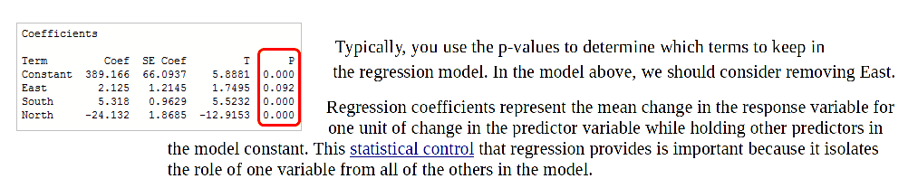
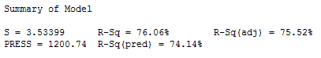
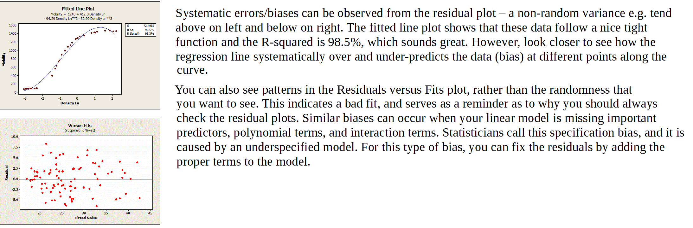
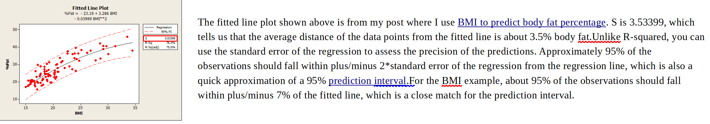

**Intrepreting p-values and coefficients**

Multiple regression estimates how the changes in each predictor variable relate to changes in the response variable. Importantly, regression automatically controls for every variable that you include in the model. So you explain the effect that changes in one predictor have on the response without having to worry about the effects of the other predictors

A low p-value suggests that the slope is not zero, which in turn suggests that changes in the predictor variable are associated with changes in the response variable.
I used a fitted line plot because it really brings the math to life. However, fitted line plots can only display the results from simple regression, which is one predictor variable and the response. The concepts hold true for multiple linear regression, but I would need an extra spatial dimension for each additional predictor to plot the results. That's hard to show with today's technology!

**In regression anaylsis, both R-squared and standard error are measures of the goodness-of-fit**

n.b. goodness of fit does not necessarily mean the model is correct

**When doing linear regression, it is advisable to:**

1) Remove Noise. Linear regression assumes that your input and output variables are not noisy. Consider using data cleaning operations that let you better expose and clarify the signal in your data.

2) Remove Collinearity. Linear regression will over-fit your data when you have highly correlated input variables. Consider removing the most correlated, or use PCA.
There is no 'bright line' between not too much collinearity and too much collinearity. Analysts would not typically think of r=.50 as too much collinearity between two variables. A rule of thumb regarding multicollinearity is that you have too much when the VIF is greater than 10.
The implication would be that you have too much collinearity between two variables if r≥.95. [Read more](http://blog.minitab.com/blog/understanding-statistics/handling-multicollinearity-in-regression-analysis).

3) Rescale Inputs: Linear regression will often make more reliable predictions if you rescale input variables using standardization or normalization. Data normalization is the process of rescaling one or more attributes to the range of 0 to 1. Normalization is a good technique to use when you do not know the distribution of your data or when you know the distribution is not Gaussian (a bell curve).

**Predicted r-squared**

Indicates how well the model predicts new observations. Here’s the Summary of Model table from General Regression.

For our model, the predicted R-squared is 74.14%. Because this value is close to the R-squared of 76.06%, the model provides valid predictions. However, in the case of a model where the regular R-squared is good but the predicted R-squared is significantly lower, it indicates that the model fits the original data but fails to provide valid predictions, i.e. overfitting, where the model starts to model the noise in the data.

“How high should R-squared be?” this depends, what you really want to know is whether your regression model can meet your objectives. A low R-squared is most problematic when you want to produce predictions that are reasonably precise. In some fields, it is entirely expected that your R-squared values will be low. Regardless of the R-squared, the significant coefficients still represent the mean change in the response for one unit of change in the predictor while holding other predictors in the model constant. Obviously, this type of information can be extremely valuable.

A high R-squared does not necessarily indicate that the model has a good fit. look at the fitted line plot and residual plot below. The fitted line plot displays the relationship between semiconductor electron mobility and the natural log of the density for real experimental data.

**Residual Error Plots**

Make a plot of residual values to see: is there a non-random pattern in the residuals indicates that the deterministic portion (predictor variables) of the model is not capturing some explanatory information that is “leaking” into the residuals. The graph could represent several ways in which the model is not explaining all that is possible. Possibilities include:

    A missing variable
    A missing higher-order term of a variable in the model to explain the curvature
    A missing interaction between terms already in the model

Identifying and fixing the problem so that the predictors now explain the information that they missed before should produce a good-looking set of residuals!
In addition to the above, here are two more specific ways that predictive information can sneak into the residuals:
The residuals should not be correlated with another variable. If you can predict the residuals with another variable, that variable should be included in the model.

Adjacent residuals should not be correlated with each other (autocorrelation). If you can use one residual to predict the next residual, there is some predictive information present that is not captured by the predictors. Typically, this situation involves time-ordered observations. For example, if a residual is more likely to be followed by another residual that has the same sign, adjacent residuals are positively correlated.

**Standard Error**

When the standard error is large relative to the statistic, the statistic will typically be non-significant. However, if the sample size is very large, for example, sample sizes greater than 1,000, then virtually any statistical result calculated on that sample will be statistically significant. For example, a correlation of 0.01 will be statistically significant for any sample size greater than 1500. However, a correlation that small is not clinically or scientifically significant. When effect sizes (measured as correlation statistics) are relatively small but statistically significant, the standard error is a valuable tool for determining whether that significance is due to good prediction, or is merely a result of power so large that any statistic is going to be significant. The answer to the question about the importance of the result is found by using the standard error to calculate the confidence interval about the statistic.

