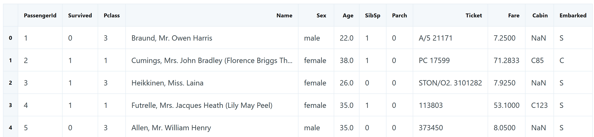
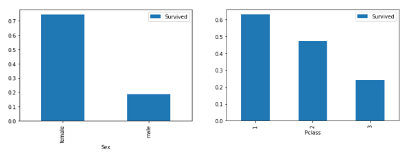

In this competition, we have a data set of different information about passengers onboard the Titanic, and we see if we can use that information to predict whether those people survived or not.

Two data files that you will work with - a training set and a testing set.

The training set contains data we can use to train our model. It has a number of feature columns which contain various descriptive data, as well as a column of the target values we are trying to predict: in this case, Survival.

The testing set contains all of the same feature columns, but is missing the target value column. Additionally, the testing set usually has fewer observations (rows) than the training set.

Below are the descriptions contained in the training data:

    PassengerID— A column added by Kaggle to identify each row and make submissions easier
    Survived— Whether the passenger survived or not and the value we are predicting (0=No, 1=Yes)
    Pclass— The class of the ticket the passenger purchased (1=1st, 2=2nd, 3=3rd)
    Sex— The passenger's sex
    Age— The passenger's age in years
    SibSp— The number of siblings or spouses the passenger had aboard the Titanic
    Parch— The number of parents or children the passenger had aboard the Titanic
    Ticket— The passenger's ticket number
    Fare— The fare the passenger paid
    Cabin— The passenger's cabin number
    Embarked— The port where the passenger embarked (C=Cherbourg, Q=Queenstown, S=Southampton)

Create pandas dataframes from the data:

    test = pd.read_csv("test.csv")
    train = pd.read_csv("train.csv")

    train.shape  # (891, 12)
    test.shape  # (418, 11)

    train.head()

Data exploration
----------------
Thinking about the topic you are predicting is very important, e.g. keeping in mind that women and children were given preference to lifeboats and the vast class disparity of the passengers.

This indicates that Age, Sex, and PClass may be good predictors of survival. We'll start by exploring Sex and Pclass by visualizing the data.

We can segment our data by sex and calculate the mean of the `Survived` column:

    import matplotlib.pyplot as plt

    sex_pivot = train.pivot_table(index="Sex",values="Survived")
    sex_pivot.plot.bar()
    plt.show()

    class_pivot = train.pivot_table(index="Pclass",values="Survived")
    class_pivot.plot.bar()
    plt.show()

