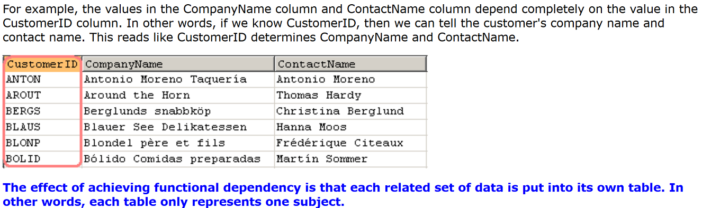

**Database Normalization**

Normalization is the process of breaking down our data and store them in different tables consistently

**First Normal Form (1st NF)**

In theory, this is the first thing you need to do to break down your data. In this step, we want to achieve the following three goals:

    Each row in a table must be uniquely identifiable.

    Each column must only contain one piece of information.

    No repeating columns - no two columns should contain the same data.

**Second Normal Form (2nd NF)**

For a table to be in the Second Normal Form, it must already be in the First Normal Form.

After 1st NF, every table has got a primary key. Sometimes the primary key consists of multiple columns (also known as composite primary key). When this happens, we should pay attention to other columns (non-key columns) in this table to make sure all these other non-key columns must fully depend on the whole primary key. If not, we will have to action on the following three steps:

    Remove partial dependencies on the composite primary key.

    Then build separate tables for each set of removed data.

    Then build relationships between these tables.

If we can't find partial dependencies of non-key columns on the composite primary key or the table uses a single column as primary key, we are already at Second Normal Form.

The pre-requisite for 2nd Normal Form is that the primary key in the table must consist of multiple columns.

**The benefits of normalization**

So far we have covered the three normal forms but we haven't explicitly listed why we need to normalize. Here are the two main benefits you get from normalization.

Benefit #1: Reduce data redundancy.

Unless absolutely necessary, storing redundant data is a waste of system resources. Nowadays hard disk space is cheap but is not free. More importantly, maintaining very large size of databases requires more work on database administrators and network engineers.

Benefit #2: Reduce data inconsistency.

The data redundancy issue can further cause date inconsistency issues. As we keep the same piece of data across different locations, we have to make sure that they are kept exactly the same all the time. For example, when one piece of data is updated, the same data in other locations has to be updated as well.

The issues of data inconsistency are collectively called Data Anomaly. There are four types of possible errors they could cause. These four types of errors are the causes of data anomaly:

    Select anomaly (also known as join anomalies):
    This happens when we select the same piece of data from different tables but they could produce different results.

    Update anomalies
    This occurs when we update the same piece of data in more than one place. If care not taken, we could end up with updating the data in one place but forgot to update it in another place.

    Insertion anomalies
    This can happen when we are adding a new record for the data. If we forgot to insert it to other places for the same data, data inconsistency occurs.

    Deletion anomalies
    This happens when we delete data. If the deletion does not remove the same data from all places, data anomalies occur.

Summary

Database normalization is clearly going to make our data management more efficiently. When we look back at what we have discussed so far, we can summarize the key points for the three normal forms. Remembering the following three short sentences can help you quickly recall what each normalization is all about. This was what I did when attending the exam for System Analysis course.

    1st NF: Unique identifier, atomic data, no repeating columns.

    2nd NF: Remove partial dependencies on composite primary key.

    3rd NF: Remove transitive dependencies on non-primary key column(s).

We have now concluded data normalization theory. Next logical step in the learning is understanding what data integrity is and how to use various database features to enforce data integrity
