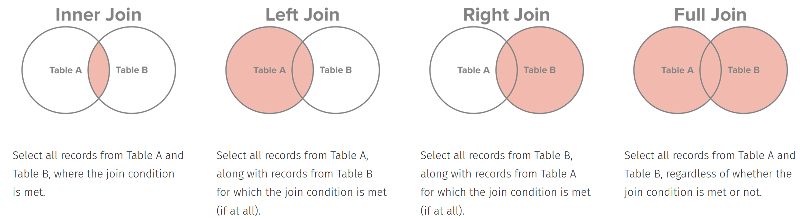
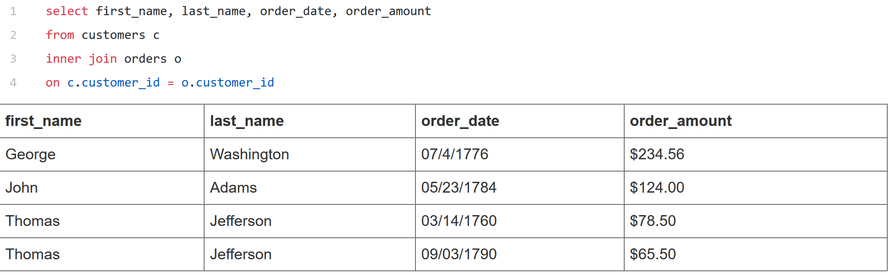
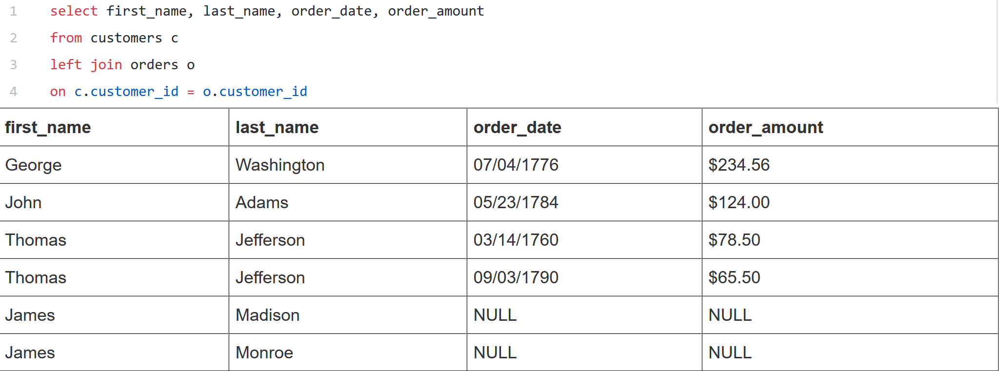
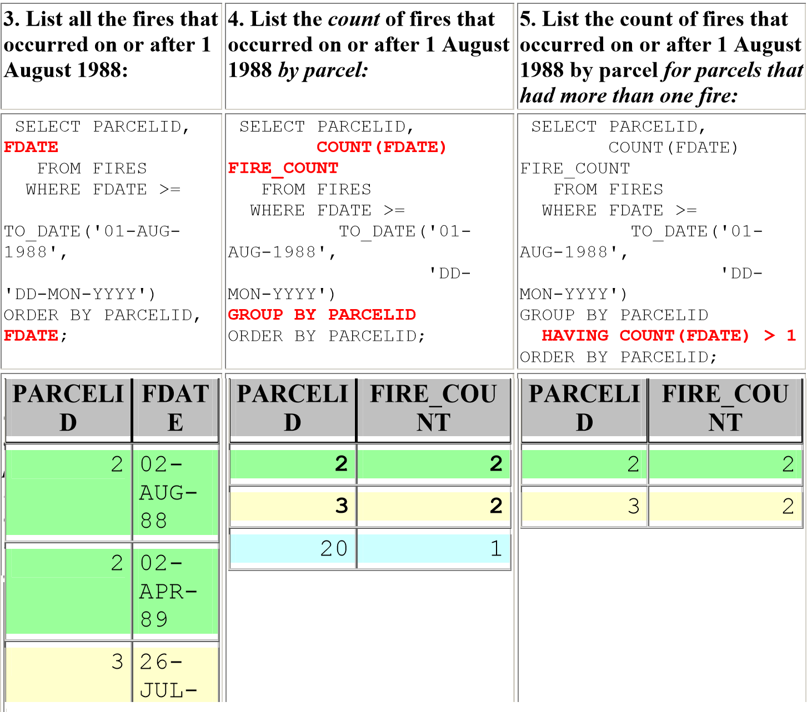

**Data types**

Certain functions work on some data types, but not others. For example, COUNT works with any data type, but SUM only works for numerical data.

Generally, numeric column types in various SQL databases do not support commas or currency symbols.
SQL databases can store numeric data in many different formats with different levels of precision.
E.g., the INTEGER data type only stores whole numbers—no decimals.

Other data types include string, number, booleans. In your SQL queries you can use e.g. if numeric data is stored as string you could use CAST or CONVERT to change the data type to a numeric one that will allow you to perform the sum.
CAST(column_name AS integer), column_name::integer

**Joins**

Inner join:

Left join:

**General query optimization**

SQL code, and its potential to execute with acceptable speed, is completely dependant on the underlying structure of a database model.
The way to make a query run faster is to reduce the number of calculations that need to be performed.
Some of the high-level things that will affect the number of calculations you need to make:

    Table size: e.g. If your query hits one or more tables with millions of rows or more
    Joins: If your query joins two tables in a way that substantially increases the row count of the result set
    Aggregations: Combining multiple rows to produce a result needs more computation than just retrieving the rows.

Filtering the data to include only the observations you need can dramatically improve query speed. E.g., if you’ve got time series data, limiting to a small time window
using a WHERE clause. Indexing has a very significant affect on how well WHERE clause filtering performs.

A LIMIT clause can be used to reduce number of rows, though note that with aggregrations these are perfomred before the LIMIT, thereby not speeding up the query.

A common way of retrieving the desired columns is to use the * symbol even though not all the columns are really needed.
If the table is small, retrieving additional columns won’t make much of a difference. For larger data sets the difference may be significant.

    SELECT * FROM users WHERE age > 20;

    SELECT id, last_name, sex, age FROM users WHERE age > 20;

    SELECT name, price FROM products;

    SELECT name, price FROM products LIMIT 10;

The more granular a database model, the more tables retrieved from at once. The manner in which fields are retrieved can also affect performance, but table numbers in joins are more significant, especially in larger databases.
The quality of SQL code depends completely on the quality of database model design, not only from a perspective of correct levels of normalization and denormalization, but also from the point of view of using appropriate structures. For example, a data warehouse database model design is needed for a data warehouse because over-normalized, granular, deep normal form tables, often used in OLTP databases, are completely inappropriate to the very large transactions, across many tables, required by data warehouses.
Complex queries may result in too many tables being joined at once and can have a highly significant impact on query performance. The database model design can have a most profound effect on join query performance if the database model has too many little-bitty tables (too much granularity or normalization).
Having some prior knowledge about the database that you want to query is crucial.

Having good indexing can greatly improve the performance of your SQL queries. Indexes allow for quicker access to the database in typical situations.
With no indexes at all, your queries are likely to be slow. If you index everything, your updates and insert triggers will be inefficient.

**Writing efficient subqueries**

A subquery is a SELECT statement within the WHERE or HAVING clause of an INSERT, UPDATE, MERGE, or DELETE SQL statement.

Correlated Subquery is a sub-query that uses values from the outer query. In this case the inner query has to be executed for every row of outer query.

Simple subquery doesn't use values from the outer query and is being calculated only once:

    SELECT id, first_name
      FROM student_details
      WHERE id IN (
        SELECT student_id
        FROM student_subjects
        WHERE subject= 'Science');

Correlated subquery:

     SELECT employee_number, name
       FROM employees AS emp
       WHERE salary > (
         SELECT AVG(salary)
           FROM employees
           WHERE department = emp.department);

In the above query the outer query is

     SELECT employee_number, name
       FROM employees AS emp
       WHERE salary > ...

and the inner query (the correlated subquery) is

     SELECT AVG(salary)
       FROM employees
       WHERE department = emp.department

Since the inner query has to be executed for every row of outer query, if there are millions of users in the database, the statement with the correlated subquery will most likely be less efficient than the INNER JOIN because it needs to run millions of times. But if you were to look for donations made by a single user, the correlated subquery might not be a bad idea. As a rule of thumb, if you look for many or most of the rows, try to avoid using correlated subqueries. Keep in mind, however, that using correlated subqueries might be inevitable in some cases.

To ensure the best performance from SQL statements that contain subqueries:
Follow these general guidelines:

    If efficient indexes are available on the tables in the subquery, then a correlated subquery is likely to be the most efficient kind of subquery.
    If no efficient indexes are available on the tables in the subquery, then a non-correlated subquery would be likely to perform better.
    If multiple subqueries are in any parent query, make sure that the subqueries are ordered in the most efficient manner.

Example how subquery ordering may affect performance:

    SELECT * FROM MAIN_TABLE
      WHERE TYPE IN (subquery 1) AND
            PARTS IN (subquery 2);

Depending on the DBMS, the subquery predicates will be evaluated in the order they appear in the WHERE clause. Subquery 1 may rejects 10% of the total rows, while subquery 2 rejects 80% of the total rows, so the ordering affects total number
of predicate checks. Depending on the time these checks took for the different subqueries, one may be quicker than the other.

It is useful to remember that having a correlated subquery isn’t always a good idea. You can always consider getting rid of them by, for example, rewriting them with an INNER JOIN:

    SELECT driverslicensenr, name
    FROM Drivers
    WHERE EXISTS
           (SELECT '1'
           FROM Fines
           WHERE fines.driverslicensenr = drivers.driverslicensenr);

    SELECT driverslicensenr, name
    FROM drivers
    INNER JOIN fines ON fines.driverslicensenr = drivers.driverslicensenr;

**GROUP BY**

An inner-join with aggregates on child level, with GROUP BY clause.

    SELECT      P.Name
                , P.Address
                , SUM(C.Amount)
    FROM        Parent P
    INNER JOIN  Child  C
        ON      C.ParentId = P.ParentId
    GROUP BY    P.Name
                , P.Address

All GROUP BY expressions should appear in the SELECT list.

The HAVING clause restricts the groups that are returned.
Note that while you can use the HAVING clause to screen out groups that the WHERE clause would have excluded, the WHERE is more efficient than the GROUP BY clause, because it operates while the rows are being retrieved and before they are aggregated, while the HAVING clause operates only after the rows have been retrieved and aggregated into groups.

List the count of fires by parcel, counting only fires with a loss of at least $40,000:

    SELECT PARCELID, COUNT(FDATE) FIRE_COUNT
    FROM FIRES
    WHERE ESTLOSS >= 40000
    GROUP BY PARCELID
    ORDER BY PARCELID;

**DISTINCT**

The SELECT DISTINCT statement is used to return only distinct (different) values. DISTINCT is a clause that you should definitely try to avoid if you can; Like you have read in other examples, the execution time only increases if you add this clause to your query. It’s therefore always a good idea to consider whether you really need this DISTINCT operation to take place to get the results that you want to accomplish.

**OR**

When you use the OR operator in your query, it’s likely that you’re not using an index.

Remember that an index is a data structure that improves the speed of the data retrieval in your database table, but it comes at a cost: there will be additional writes and additional storage space is needed to maintain the index data structure. Indexes are used to quickly locate or look up data without having to search every row in a database every time the database table is accessed. Indexes can be created by using one or more columns in a database table.

If you don’t make use of the indexes that the database includes, your query will inevitably take longer to run. That’s why it’s best to look for alternatives to using the OR operator in your query;

    SELECT driverslicensenr, name
    FROM Drivers
    WHERE driverslicensenr = 123456
    OR driverslicensenr = 678910
    OR driverslicensenr = 345678;

    SELECT driverslicensenr, name
    FROM Drivers
    WHERE driverslicensenr IN (123456, 678910, 345678);

**NOT and AND**

When your query contains these operators, it’s likely that the index is not used.

The query with the NOT operator will be slower mainly because it’s formulated a lot more complex than it could be.

    SELECT driverslicensenr, name
    FROM Drivers
    WHERE NOT (year > 1980);

    SELECT driverslicensenr, name
    FROM Drivers
    WHERE year <= 1980;

The following query in re-written with the BETWEEN operator:

    SELECT driverslicensenr, name
    FROM Drivers
    WHERE year >= 1960 AND year <= 1980;

**Cleaning strings**

As a practical example, we can see that the date field in this dataset begins with a 10-digit date, and include the timestamp to the right of it. The following query pulls out only the ogimage: “/images/og-images/sql-facebook.png” date:

    SELECT incidnt_num,
           date,
           LEFT(date, 10) AS cleaned_date
      FROM tutorial.sf_crime_incidents_2014_01

CONCAT - you can combine strings from several columns together using CONCAT. Simply order the values you want to concatenate and separate them with commas. If you want to hard-code values, enclose them in single quotes. Here’s an example:

    SELECT incidnt_num,
           day_of_week,
           LEFT(date, 10) AS cleaned_date,
           CONCAT(day_of_week, ', ', LEFT(date, 10)) AS day_and_date
      FROM tutorial.sf_crime_incidents_2014_01

**Read the Execution Plan**

The performance of your SQL queries depends on multiple factors, including your database model, the indexes available and the kind of information you wish to retrieve. The best way to keep track of what’s happening with your queries is to analyse the execution plan produced by the optimizer. You can use it to experiment and find the best solution for your statements.
In PostgreSQL use EXPLAIN to evaluate your queries.
