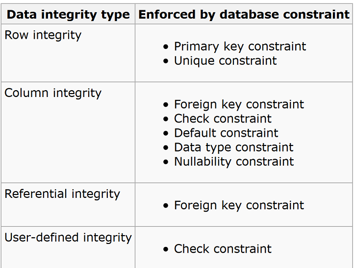
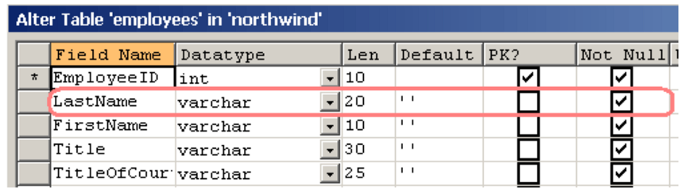
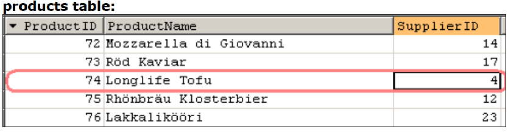
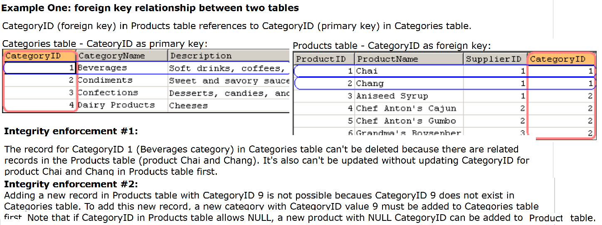
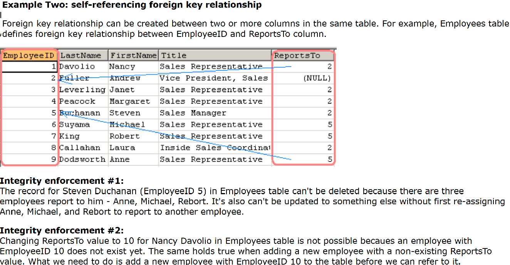

In its broadest use, “data integrity” refers to the accuracy and consistency of data stored in a database

**Data integrity is enforced by database constraints**

**Row integrity**

Row integrity refers to the requirement that all rows in a table must have a unique identifier that can be used to tell apart each record. This unique identifier is normally known as Primary Key of the table. A Primary Key can be formed by a single column or a combination of multiple columns.

**Column integrity**

Column integrity refers to the requirement that data stored in a column must adhere to the same format and definition. This includes data type, data length, default value of data, range of possible values, whether duplicate values are allowed, or whether null values are allowed.

**Referential integrity**

How do you tell who supplied product Longlife Tofu in products table? Referential integrity guarantees that a supplier exists.

**User-defined integrity**

Some applications have complex business logic that can't be enforced by defining criteria in the three data integrity types we have discussed so far (row integrity, column integrity, and referential integrity). In this circumstance, we need to implement our own code logic to make sure data is saved accurately and consistently across all business domains.

E.g. in a db transaction involving four tables:

    We roll back the transaction if inserting the new customer failed in customers table.
    We roll back the transaction if inserting a new order failed in orders table.
    We roll back the transaction if inserting the record in order_details table failed.
    We roll back the transaction if decrementing product quantity failed in products table.

When a transaction is rolled back, the four tables are restored back to their original state (which is prior to the start of the transaction). The logic here is implemented by using our own user-defined data integrity. What tools you use to enforce the data integrity depend on your system requirements.

**Use database constraints whenever possible**

There are two main reasons why using database constraints is a preferred way of enforcing data integrity.

First, constraints are inherent to the database engine and so use less system resources to perform their dedicated tasks. We resort to external user-defined integrity enforcement only if constraints are not sufficient to do the job properly.

Second, database constraints are always checked by the database engine before insert, update, or delete operation. Invalid operation is cancelled before the operation is undertaken. So they are more reliable and robust for enforcing data integrity.

**Nullability Constraint**

 In practice, avoid using ALLOW NULL in a column. To deal with the situation where users don't provide a value for a record in the column, I create a meaningful default value where possible such as NA or 0.

There are good reasons behind this practice of avoiding the use of nullable columns.
First, null means unknown and that brings in uncertainty and so potential code bugs later in your development. For example, when writing SQL statements, we often don't pay attention to the existence of NULL values in a column and so don't add logic in SQL to deal with it such as using IS NULL to test data. This SQL would definitely return less data than it should.

**Foreign key constraint**

Defines how referential integrity is enforced between two tables. It relates two tables together by common columns in a relational database.

**ENUM in MySQL**

A data type in MySQL, but not in any other major brand of SQL database.

For example:

    CREATE TABLE Foo ( color ENUM('red', 'green', 'blue', 'yellow') );

This column allows you to store one of the values in the enum list, but no other value.

In other databases besides MySQL, it's more typical to use a CHECK constraint to accomplish the same thing. A CHECK constraint is standard SQL.

    CREATE TABLE Foo ( color VARCHAR(6) CHECK (color IN ('red', 'green', 'blue', 'yellow')) );
