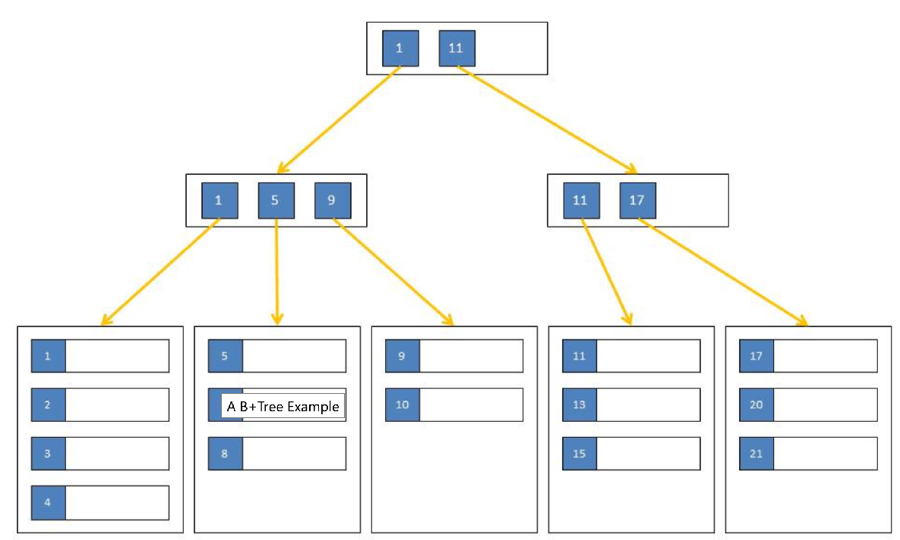

In its most basic form, the B-Tree index is a hierarchy of data pages. The lowest level is called the leaf level, the highest level is the index root, and all levels in between are the intermediate levels. This structure is an improvement over the Binary Tree index because its balanced nature greatly improved the performance of maintenance operations such as, `INSERT`, `DELETE`, and `UPDATE`.
All table data is stored in 8 KB data pages. The data pages are at the leaf level.

B Tree Index:
This is the default index for most of the storage engines in MySQL. The general idea of a B-Tree is that all the values are stored in order, and each leaf page is the same distance from the root.B Tree index speeds up the data access because storage engine don't have to scan the whole table instead it will start from root node. The slots in the root node hold pointers to child nodes, and the storage engine follows these pointers. It finds the right pointer by looking at the values in the node pages, which define the upper and lower bounds of the values in the child nodes. Eventually, the storage engine either determines that the desired value doesn't exist or successfully reaches a leaf page. Leaf pages are special, because they have pointers to the indexed data instead of pointers to other pages.

You add indexes on columns when you want to speed up searches on that column. Typically, only the primary key is indexed by the database. This means look ups using the primary key are optimized.

If you do a lot of lookups on a secondary column, consider adding an index to that column to speed things up.
Keep in mind, like most problems of scale, these only apply if you have a statistically large number of rows (10,000 is not large).

Remember when you add additional indexes, Read operations get faster but Write operations becomes slower because of recalculation of the indexes. So use them as per your use case demands.
When choosing to index a key, consider whether the performance gain for queries is worth the performance loss for INSERTs, UPDATEs, and DELETEs and the use of the space required to store the index. As always, you can only optimize what you can measure (e.g. with Django Debug Toolbar). Some general points to consider are:

    - Consider indexing keys that are used frequently in WHERE clauses.
    - Consider indexing keys that are used frequently to join tables in SQL statements.
    - Choose index keys that have high selectivity. An index's selectivity is optimal if few rows have the same value.
    - It follows: Do not use standard B-tree indexes on keys or expressions with few distinct values
    - Do not index columns that are modified frequently. UPDATE statements that modify indexed columns and INSERT and DELETE statements that modify indexed tables take longer than if there were no index. Such SQL statements must modify data in indexes as well as data in tables.

`db_index = True`  in Django e.g quereis frequent filter, order-by etc.

Additional Notes
----------------
A database index is very much like the index at the end of a book: it occupies its own space, it is highly redundant, and it refers to the actual information stored in a different place.
Searching it is like searching in a printed telephone directory - all entries are arranged in a well-defined order.

Finding data in an ordered data set is fast and easy because the sort order determines each entry's position.

A database index is, however, more complex than a printed directory because it undergoes constant change.
It must process insert, delete and update statements while keeping the index order.

**B+Trees – How SQL Server Indexes are Stored on Disk**

https://sqlity.net/en/2445/b-plus-tree/ 2014-06-18 - General, Series, SQL Server Internals, Storage Wednesday
Introduction

SQL Server organizes indexes in a structure known as B+Tree. Many think, B+Trees are binary trees. However, that is not correct. A binary tree is a hierarchical structure organizing nodes (table rows) in a manner that allows searches to be executed extremely efficiently. On the flipside, the binary tree structure is very volatile when it comes to updates, often requiring the entire structure to be rebuilt when a single data point was changed. (See Wikipedia for more details.) That makes binary tree a very poor choice when it comes to persisting data on disk.
The B-Tree

In 1972, Rudolf Bayer and Ed McCreight, both working at Boeing at the time, were looking for a way to overcome some of the shortfalls of the binary tree. Their solution was the B-Tree. The main difference between a binary tree and a B-Tree is that the latter allows for more than one data point (table row) per node. B-Trees are also balanced, which means that the time it takes to execute a search within this structure is mostly independent of the value to be found.

For a long time it was unclear what the "B" in the name represented. Candidates discussed in public where "Boeing", "Bayer", "Balanced", "Bushy" and others. In 2013, the B-Tree had just turned 40, Ed McCreight revealed in an interview, that they intentionally never published an answer to this question. They were thinking about many of these options themselves at the time and decided to just leave it an open question.
The B+Tree

B-Trees are a lot more efficient than binary trees when it comes to updates, but some operations can still turn out expensive, depending on where the node that will hold the new or updated data lives in the tree. Therefore, another optimization was made to B-Trees to help with this problem. Instead of treating all nodes equal, the new structure has two types of nodes. The lowest level nodes, also called leaf nodes, hold the actual data. All other nodes including the root node only hold the key values and pointers to the next nodes. This type of tree is called a B+Tree and you can see an example below:

A B+Tree Example

There are no limitations on the number of key-pointer-pairs or data rows within a node. The only limitation is that all leaf nodes have the same distance from the root node. That means that the work to seek for a particular data point is always the same, no matter what the key value is. It also keeps updates very localized in the tree. I might have to move a few rows to a new node during an update but then I probably only need to change a single parent node to integrate that new node. It is however possible for a single change to affect every level of the tree, but those changes are rare. You can find more information about B+Trees here.
B+Trees in SQL Server

SQL Server stores its indexes in B+Tree format. There are a few exceptions - for example temporary hash indexes, created during a hash join operation, or column store indexes, which are not really indexes at all. However, all key-based clustered and non-clustered persisted SQL Server indexes are organized and stored as B+Trees.

Each node in such a tree is a page in SQL Server terms and you will find two page types in each index. The first type are the data pages (pages of type 1). Each leaf level node in a SQL Server B+Tree index is a single data page. The second type are intermediate index pages (pages of type 2). Each node in an index B+Tree that is not a leaf level node is a single page of type 2. Those pages contain rows just like the data pages. But in addition they contain a pointer for each row that identifies the next child page. That child page can be either of type 1 or of type 2, depending on the location in the B+Tree.
Summary

SQL Server stores key-based persisted indexes in the form of a B+Tree. Each node in such a tree is represented by a single page. Data pages build the leaf level of the tree while all other nodes are made of single pages of type 2.

Glossary
--------

**Linked list**

a linear data structure where each element is a separate object. Each element (we will call it a node) of a list is comprising of two items - the data and a reference to the next node. The last node has a reference to null. The entry point into a linked list is called the head of the list.

**SQL injection**

One of the most common web hacking techniques, it is used to attack data-driven applications, whereby nefarious SQL statements are inserted into an entry field for execution.

