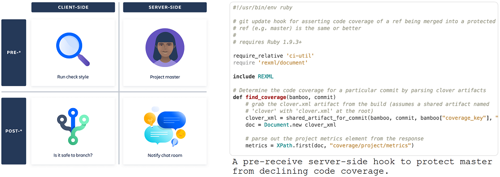
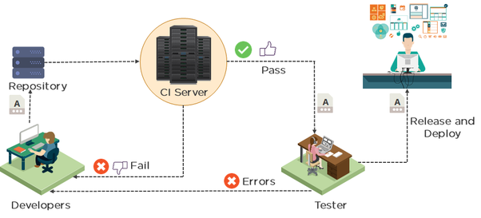
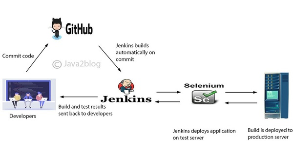
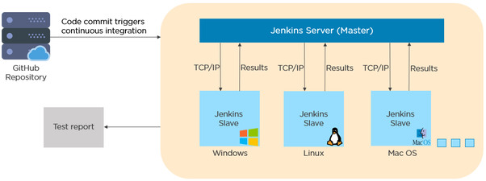
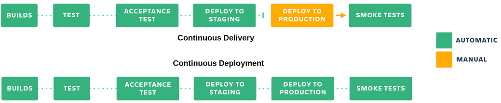
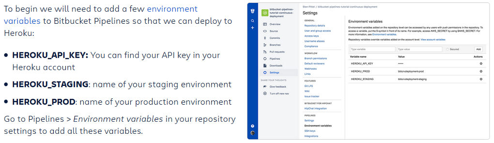
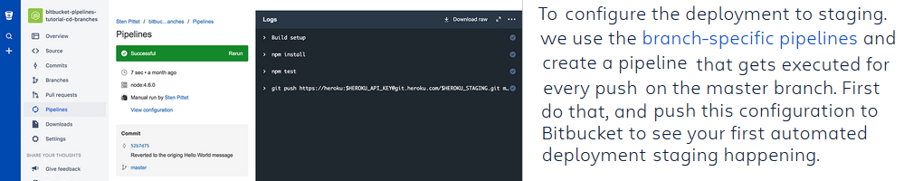
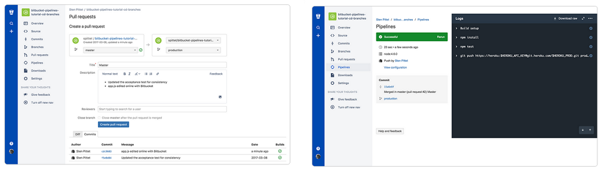

Continuous integration
----------------------
The practice of routinely integrating code changes into the main branch of a repository, and testing the changes, as early
and often as possible. Ideally, developers will integrate their code daily, if not multiple times a day.

**CI in 5 Steps**

1) Start writing tests for the critical parts of your codebase.
2) Get a CI service to run those tests automatically on every push to the main repository.
3) Make sure that your team integrates their changes everyday.
4) Fix the build as soon as it’s broken.
5) Write tests for every new story that you implement.

One recommendation is to start small with simple tests to get used to the new routine before moving on to implementing
a more complex test suite that may be hard to manage.

**Automated testing**

Tests that can be run without the need of human intervention in a repeatable way, at any time.
You typically have to write down a script to test some assertions or validate the behaviour of your application.
Automated testing is a key part of CI, but not enough by itself.

**Continuous delivery**

You practice CD when your codebase is always deployable, ready to go to production in one click. While it's recommended
to deploy to production as soon as you get a green build, releases maybe slowed down on purpose for business reasons.

**Continuous deployment**

Happens when every change to the main branch that passes the CI tests gets pushed to production without the need for human
interaction. Often results in many deployments per day which provide fast feedback to the development team.

**Benefits of CI**

A team that relies primarily on manual testing may get feedback in a couple hours, but in reality, comprehensive test
feedback comes a day–or several days–after the code gets changed. And by that time more changes have occurred, making
bug-fixes involve digging through several layers of code to get at the root of the problem.

**Protect quality with continuous builds and test automation**

Prevents productivity-killing occurrences of the latest source code not compiling or having a significant bug by the following:

- Continuous builds: Building the project as soon as a change is made. Ideally, the delta between each build is a single change-set.
- Automated tests: the quality of the code base is tested with each build

CI runs have two major phases. First is to make sure the code compiles (or pieces pull together for interpreted languages). Then automated tests which
are units tests, API tests and functional tests (e.g. Selenium which directly interacts with the UI to test the product).

**Running your tests automatically**

To adopt CI, you will need to run your tests on every change that gets pushed back to the main branch.

In fact tests should be run on every branch of your repository and not just focus on the main branch.
This way you will be able to capture issues early and minimise disruptions for your team.

In the past, you typically had to install a separate CI server like Bamboo or Jenkins, but now you can find solutions on the
Cloud that are much simpler to adopt. E.g. if your code is hosted on Bitbucket Cloud you can use the Pipelines feature in
your repository to run tests on every push without the need to configure a separate server or build agents

**Adopting a CI culture**

Integrate early and often: Ensure that developers do not work days on a feature without merging their changes back to the main branch.
If you let the code sitting on a branch or the developer workstation for too long, then you expose yourself to the risk of
having too many conflicts to look at when you decide to merge things back to the main branch.

Enforce a culture of a green build. If a developer breaks the build for the main branch, fixing it becomes the main priority.
The more changes get into the build while it’s broken, the harder it will be for you to understand what broke it.
Set notifications to make sure that developers are alerted when the build breaks.

It is worth spending time on your test suite to make sure that it can fail fast and give feedback to the developer that
pushed the changes as soon as possible. You can split your tests so that the fast ones (e.g. unit tests) run before the
long-running tests.

Git hooks for continuous integration
-------------------------------------
Git hooks can be used to enforce clean builds on feature branches.

Hooks are Git's native mechanism for triggering custom scripts before or after operations like commit and merge.
If you look in the .git directory of any Git repository you’ll see a directory named “hooks” which contains a
set of example hook scripts. Further reading: [customizing Git hooks](http://git-scm.com/book/en/Customizing-Git-Git-Hooks)

There are two broad classes of hooks: client-side (run on your local workstation) and server-side (run on your Git server).

You can also classify hooks as pre- or post-. Pre-receive hooks are invoked before certain Git operations, and can prevent
faulty code being committed. Post-receive hooks are used to automate pieces of your development workflow.

**Checking the status of branch builds**

[Example](https://bitbucket.org/tpettersen/post-checkout-build-status/src?_ga=2.182352928.643811762.1552639201-162649815.1552639201)
of a client-side Git hook: a post-checkout hook script that exposes branch build status right inside your terminal window
he script gets the branch's head revision number from your local copy, then queries the continuous integration server to see
whether that revision has been built – and if so, whether the build succeeded.

Let's say you want to branch from master. This hook will tell you whether the head commit on the master built successfully,
which means it's a "safe" commit to create a feature branch from.

Software Testing
----------------
**Unit tests** can be run very quickly by a continuous integration server.

**Integration tests** verify that different modules or services used by your application work well together.
E.g. testing the interaction with the database or making sure that microservices work together as expected.

**Functional tests** verify the output of an action meets business requirements; do not check the intermediate states
of the system when performing that action. Whereas integration test may simply verify that you can query the database while
a functional test would expect to get a specific value from the database as defined by the product requirements.

**Acceptance testing** are formal tests executed to verify if a system satisfies its business requirements.

**Performance testing** check the behaviors of the system when it is under significant load.
E.g. by observing response times when executing a high number of requests.
Quite costly, but they can help you understand if new changes are going to degrade your system.

**Smoke testing** is basic tests that check basic functionality of the application. Meant to be quick to execute and they can
be useful right after a new build is made to decide whether or not you can run more expensive tests, or right after a
deployment to make sure that they application is running properly in the newly deployed environment.

**End-to-end tests** replicates a user behavior with the software. useful, but they're expensive to perform and can
be hard to maintain when they're automated. It is recommended to only have a few key ones and to rely more on
lower level tests (unit and integration) for quickly identifying breaking changes.

Containers
----------
Containers are great for continuous integration and continuous delivery (CI/CD) workflows.

Consider the following example scenario:

- Your developers write code locally and share their work with their colleagues using Docker containers.
- They use Docker to push their applications into a test environment and execute automated and manual tests.
- When developers find bugs, they can fix them in the development environment and redeploy them to the test environment for testing and validation.
- When testing is complete, getting the fix to the customer is as simple as pushing the updated image to the production environment.

Jenkins
---------

One of the key parts of the DevOps tool suite is automation. By automating code integration and the build process companies
can move towards faster releases of their software and more reliable processes.

Jenkins is a CI server and automates multiple tasks including building, testing and delivering software.
It helps to provide information if all the tests working properly and getting fast feedback.
Fast feedback helps you whenever you broke the build and introduce changes.
So you get to know about the error codes and get rectified immediately.
Continuous deployment and delivery are built on the top of CI and Jenkins helps to speed up the deployment process.

Jenkins is a build automation tool that sits in the CI/CD space. It ties in with your existing source
control tools and provides a simple way to automate the testing and building process for your software.

The idea behind CI/CD is that a developer checks some new code into a code repository.
A push notification is sent to the build engine, in this case Jenkins. Jenkins clones a copy of
the code, builds it and runs all the defined tests. Jenkins will then set off any post-build steps.
These can be notifying another server that there is a new version of the software to deploy,
or it can deal with deployment itself.

If you only run your tests occasionally then a lot of code changes may have happened since
the last time and it is rather hard to figure out which change introduced any problems. When it is run automatically
on every push then it is immediately obvious. Built on top of Continuous Integration are Continuous Deployment/Delivery
where after a successful test run your instantly and automatically release the latest version of your codebase.

Jenkins can manually, periodically or automatically build projects (e.g. every 15 mins or new git commit).
Some of the steps executed by Jenkins are: Build the project, run the test automatically and generate test report, execute
any shell script. It has a master and slave architecture.

Master:

- Schedule build jobs
- Distribute the jobs to slaves
- Monitor the slaves and get the build results

Slave:

- Build the job distributed by Master.
- Jenkins starts a separate program named “slave agent”.When slaves are subscribed to master, master starts distributing
work to slaves.

Jenkins uses master-slave architecture to perform its tasks. Jenkins master pull the code every time there is a commit in the
remote source code repository. It uses TCP/IP protocol to interact with the slaves. Jenkins master distributes its
workload to all the slaves (which can be run on any platform). On request from Jenkins master, the slaves carry out builds,
tests and produce test reports.

Continuous Delivery
-------------------
The practice of making sure that your code is always ready to release even if you are not deploying every change to production.

It is recommended to update your production as often as possible to make sure that you keep the scope of the changes small.
In continuous deployment, new changes pushed to the repository are automatically deployed to production if they pass the tests.
This requires a strong testing culture.

**BitBucket example**

This is a simple continuous delivery pipeline that automatically deploys to staging when the build passes the test.

This configuration is suited for teams that have special release branches that can be mapped to a deployment. It also allows you to review changes in a pull-request before they are deployed to production.
In this setup we will use 2 different branches to trigger deployments:

- master: any push to master will deploy the code to a staging environment after running the tests.
- production: code merged to the production branch will be automatically released to the production environment.

Now we just need to add another branch pipeline for the production branch to automatically release the production environment
when changes get merged to the production branch.

We run the tests again on the production branch to make sure that nothing affected the build prior to releasing the application.
Our pipelines are now configured and we can restrict the production branch to only accept merges via pull requests.
This is important to prevent people from pushing straight to production from their local machine.

You can add a merge check to make sure that e.g. the source branch has at least one green build prior to merging the code.
When that's done, you can create a pull request to merge the code from *master* to *production* and subsequently release the new
changes to your production environment.

As soon as you merge the pull request, you'll be able to see a new pipeline being triggered for the production branch.
When it completes your new changes will have been successfully deployed to the production environment.

