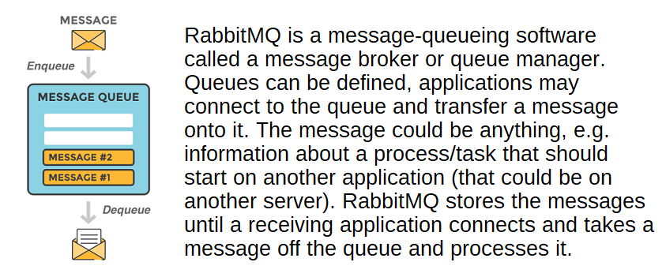
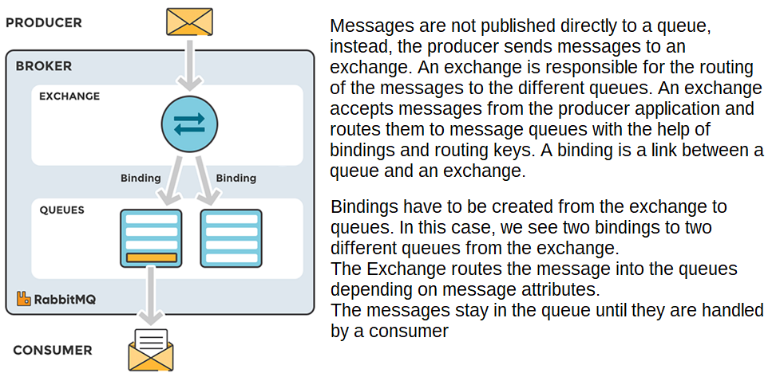
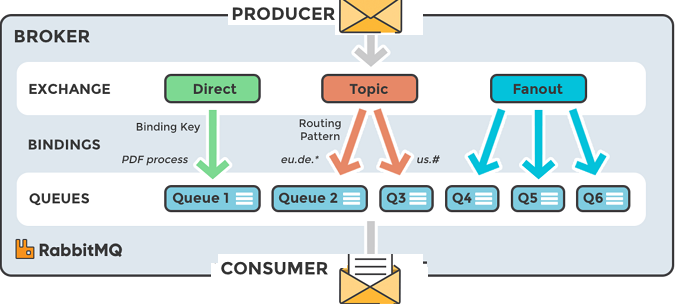
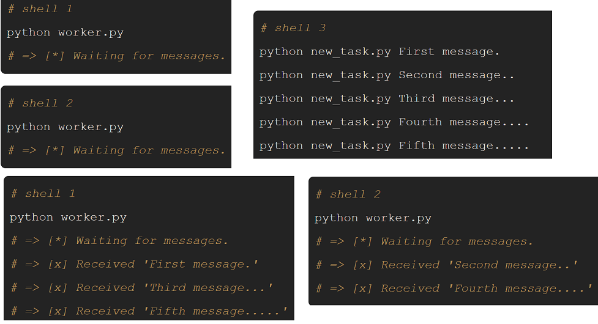
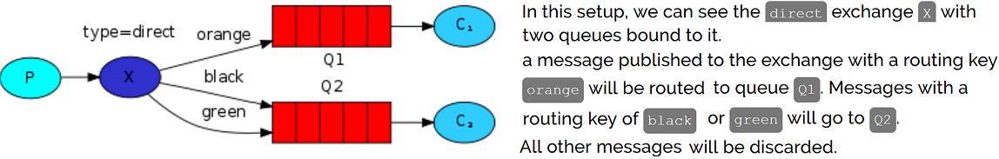
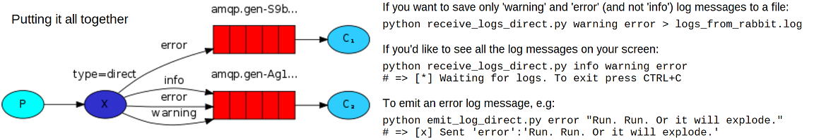

A message broker can be used to reduce loads and delivery times by web application servers since tasks, which would normally
take quite a bit of time to process, can be delegated to a third party whose only job is to perform them.

Message queueing allows web servers to respond to requests quickly instead of being forced to perform resource-heavy procedures
on the spot. Message queueing is also good when you want to distribute a message to multiple recipients for consumption or for
balancing loads between workers.

**Types of exchanges**

- Direct: delivers messages to queues whose binding key exactly matches the routing key of the message. E.g. if the queue is bound
to the exchange with the binding key *pdfprocess*, a message published to the exchange with a routing key *pdfprocess* is routed to that queue.
- Fanout: all of the queues that are bound to it.
- Topic: wildcard match between the routing key and the routing pattern specified in the binding.
- Headers: use the message header attributes for routing.

**Publish and subscribe messages**

RabbitMQ speaks the protocol AMQP by default, so to communicate with RabbitMQ you need a library
that understands the same protocol. You need to download the client-library (an API) for the programming language
of for your applications.

Steps in setting up a connection and publishing a message/consuming a message:
1) Set up/create a connection object. Here, the username, password, connection URL, port etc, will be
specified. A TCP connection will be set up  when the *start* method is called.
2) A channel needs to be opened in the TCP connection using the connection interface
3) Declare/create a queue.
4) Set up exchanges and bind a queue to an exchange. For messages to be routed to queues, queues need to be bound
to an exchange.
5) In publisher, publish a message to an exchange. In subscriber/consumer, consume a message from a queue.

Send and receive with Pika Python client
----------------------------------------
First, we'll write two small programs in Python; a producer that sends a single message, and a
consumer that receives messages and prints them out.

**Sending**

For `send.py` to send a message to the queue, the first thing we need to do is to establish a connection with RabbitMQ server.
This will connect us to a broker on the local machine. If we wanted to connect to a broker on a different machine we'd simply
specify its name or IP address here.

    #!/usr/bin/env python
    import pika

    connection = pika.BlockingConnection(pika.ConnectionParameters('localhost'))
    channel = connection.channel()

Next, before sending we need to make sure the recipient queue exists. If we send a message to non-existing location,
RabbitMQ will just drop the message.

    channel.queue_declare(queue='hello')

A message can never be sent directly to the queue, it always needs to go through an exchange.
Here we use a default exchange identified by an empty string. This exchange is special ‒ it allows us to specify exactly to which
queue the message should go. The queue name needs to be specified in the `routing_key` parameter:

**Receiving**

Again, first we need to connect to RabbitMQ server. The code responsible for connecting to Rabbit is the same as previously.
The next step, just like before, is to make sure that the queue exists. Creating a queue using `queue_declare` is idempotent ‒
we can run the command as many times as we like, and only one will be created.

    channel.queue_declare(queue='hello')

We're not yet sure which program to run first and in such cases it's a good practice to repeat declaring the queue in both programs
so we can be sure that the queue exists when needed. To see what queues RabbitMQ has and how many messages are in them. You can do it
(as a privileged user): `sudo rabbitmqctl list_queues`

Receiving messages from the queue works by subscribing a callback function to a queue. Whenever we receive a message, this callback
function is called by the Pika library. In our case this function will print on the screen the contents of the message.

    def callback(ch, method, properties, body):
        print(" [x] Received %r" % body)

Next, we need to tell RabbitMQ that this particular callback function should receive messages from our *hello* queue:

    channel.basic_consume(callback, queue='hello', no_ack=True)

Full code for `send.py`:

    #!/usr/bin/env python
    import pika

    connection = pika.BlockingConnection(pika.ConnectionParameters(host='localhost'))
    channel = connection.channel()

    channel.queue_declare(queue='hello')
    channel.basic_publish(exchange='',
                          routing_key='hello',
                          body='Hello World!')
    print(" [x] Sent 'Hello World!'")
    connection.close()

Full `receive.py` code:

    #!/usr/bin/env python
    import pika

    connection = pika.BlockingConnection(pika.ConnectionParameters(host='localhost'))
    channel = connection.channel()
    channel.queue_declare(queue='hello')

    def callback(ch, method, properties, body):
        print(" [x] Received %r" % body)

    channel.basic_consume(callback, queue='hello', no_ack=True)

    print(' [*] Waiting for messages. To exit press CTRL+C')
    channel.start_consuming()

Now we can try out our programs in a terminal. First, let's start a consumer, which will run continuously waiting for deliveries:

    python receive.py
    # => [*] Waiting for messages. To exit press CTRL+C
    # => [x] Received 'Hello World!'

Now start the producer. The producer program will stop after every run:

    python send.py
    # => [x] Sent 'Hello World!'

The `receive.py` program doesn't exit - it will stay ready to receive further messages.

Work queues with Pika Python client
-------------------------------------
Here we will distribute time-consuming tasks among multiple workers. Work Queues (aka Task Queues) are used
to avoid having to wait for a time-consuming task to complete (e.g. in web applications). We encapsulate a *task* as a message, and send it to the queue to
be picked up by a worker eventually.

We will send strings that stand for complex tasks. In place of real-world tasks, the following uses `time.sleep()`.
This code allows arbitrary messages to be sent from the command line. This program will schedule tasks to our work queue:

    import sys

    message = ' '.join(sys.argv[1:]) or "Hello World!"
    channel.basic_publish(exchange='', routing_key='hello', body=message)
    print(" [x] Sent %r" % message)

**Round-robin dispatching**

Task Queues make it easy to parallelise work. If we are building up a backlog of work, we can just add more workers and that
way, scale easily.

This code allows arbitrary messages to be sent from the command line and tasks scheduled to the work queue:

    message = ' '.join(sys.argv[1:]) or "Hello World!"
    channel.basic_publish(exchange='',
                          routing_key='hello',
                          body=message)
    print(" [x] Sent %r" % message)

In our example worker, every dot in the message body represents a second (as if a real task). It will pop messages from the queue and perform the task:

    def callback(ch, method, properties, body):
        print(" [x] Received %r" % body)
        time.sleep(body.count(b'.'))
        print(" [x] Done"

By default, RabbitMQ will send each message to the next consumer, in sequence. On average every consumer will get the same number of
messages. This way of distributing messages is called round-robin.

**Message acknowledgment and durability**

We don't want to lose any tasks if say one of the consumers starts a long task and dies with it only partly done.
If a worker dies, we'd like the task to be delivered to another worker.

An ack(nowledgement) is sent back by the consumer to tell RabbitMQ that a particular message had been received,
processed and that it can be deleted.

    def callback(ch, method, properties, body):
        ...
        ch.basic_ack(delivery_tag = method.delivery_tag)

    channel.basic_consume(callback, queue='hello')

It is important to remember to include the `basic_ack` in the worker. Otherwise RabbitMQ will eat more and more memory as it won't be
able to release any unacked messages.

When RabbitMQ quits or crashes it will forget the queues and messages unless we mark both the queue and messages as durable.
This `queue_declare` change needs to be applied to both the producer and consumer code:

    channel.queue_declare(queue='task_queue', durable=True)

**Fair dispatch**

If RabbitMQ just dispatches every n-th message to the n-th consumer then one worker may be constantly busy and the other one not.
Use the `basic.qos` method with the `prefetch_count=1` setting to tell RabbitMQ not to dispatch a new message to a worker until it has
processed and acknowledged the previous one. Instead, it will dispatch it to the next worker that is not still busy.

**Final code of our `new_task.py` script:**

    #!/usr/bin/env python
    import pika
    import sys

    connection = pika.BlockingConnection(pika.ConnectionParameters(host='localhost'))
    channel = connection.channel()

    channel.queue_declare(queue='task_queue', durable=True)

    message = ' '.join(sys.argv[1:]) or "Hello World!"
    channel.basic_publish(exchange='', routing_key='task_queue',body=message,
                          properties=pika.BasicProperties(delivery_mode=2))
    print(" [x] Sent %r" % message)
    connection.close()

**And our worker:**

    #!/usr/bin/env python
    import pika
    import time

    connection = pika.BlockingConnection(pika.ConnectionParameters(host='localhost'))
    channel = connection.channel()

    channel.queue_declare(queue='task_queue', durable=True)
    print(' [*] Waiting for messages. To exit press CTRL+C')

    def callback(ch, method, properties, body):
        print(" [x] Received %r" % body)
        time.sleep(body.count(b'.'))
        print(" [x] Done")
        ch.basic_ack(delivery_tag = method.delivery_tag)

    channel.basic_qos(prefetch_count=1)
    channel.basic_consume(callback, queue='task_queue')

    channel.start_consuming()

Publish/subscribe with Pika Python Client
-----------------------------------------
The assumption behind a work queue is that each task is delivered to exactly one worker. In this part we'll deliver a message to
multiple consumers. A pattern known as "publish/subscribe".

**Exchanges**

The exchange must know exactly what to do with a message it receives. Should it be appended to a particular queue? Should it be
appended to many queues? Or should it get discarded. The rules for that are defined by the *exchange type*. Here
we create an exchange of the type 'fanout' (broadcasts all the messages it receives to all the queues it knows.),
and call it 'logs':

    channel.exchange_declare(exchange='logs', exchange_type='fanout')

Previously we were using a default exchange, which we identify by the empty string (""):

    channel.basic_publish(exchange='', routing_key='hello', body=message)

The exchange parameter is the name of the exchange. The empty string denotes the default or nameless exchange: messages are routed
to the queue with the name specified by routing_key, if it exists.
Now, we can publish to our named exchange instead:

    channel.basic_publish(exchange='logs', routing_key='', body=message)

**Temporary queues**

For our logger, we're only interested in currently flowing messages not in the old ones. So whenever
we connect to Rabbit we need a fresh, empty queue. We can do this by let the server choose a random queue
name for us. We can do this by not supplying the `queue` parameter to `queue_declare`:

    result = channel.queue_declare()

Now `result.method.queue` will contain a random queue name e.g. `amq.gen-JzTY20BRgKO-HjmUJj0wLg`.
Since we want the queue to be deleted once the consumer connection is closed, we use the `exclusive` flag:

    result = channel.queue_declare(exclusive=True)

**Putting it all together**

The most important changes from previous example is that we now want to publish messages to our `logs` exchange instead of
the nameless one. We need to supply a `routing_key` when sending, but its value is ignored for
fanout exchanges.

Code for `emit_log.py` script:

    #!/usr/bin/env python
    import pika
    import sys

    connection = pika.BlockingConnection(pika.ConnectionParameters(host='localhost'))
    channel = connection.channel()
    channel.exchange_declare(exchange='logs', exchange_type='fanout')
    message = ' '.join(sys.argv[1:]) or "info: Hello World!"
    channel.basic_publish(exchange='logs', routing_key='', body=message)
    print(" [x] Sent %r" % message)
    connection.close()

As you see, after establishing the connection we declared the exchange. This step is necessary as
publishing to a non-existing exchange is forbidden. The messages will be lost if no queue is bound to the exchange yet, but that's okay in this case; if no
consumer is listening yet we can safely discard the message.

The code for `receive_logs.py`:

    #!/usr/bin/env python
    import pika

    connection = pika.BlockingConnection(pika.ConnectionParameters(host='localhost'))
    channel = connection.channel()
    channel.exchange_declare(exchange='logs', exchange_type='fanout')
    result = channel.queue_declare(exclusive=True)
    queue_name = result.method.queue
    channel.queue_bind(exchange='logs', queue=queue_name)
    print(' [*] Waiting for logs. To exit press CTRL+C')

    def callback(ch, method, properties, body):
        print(" [x] %r" % body)

    channel.basic_consume(callback, queue=queue_name, no_ack=True)
    channel.start_consuming()

Now to see the logs on your screen, spawn a new terminal and run `python receive_logs.py` and emit logs type:
with `python emit_log.py`. Using `rabbitmqctl list_bindings` you can verify that the code actually
creates bindings and queues as we want. With two `receive_logs.py` programs running, we should see
data from exchange `logs` goes to two queues with server-assigned names:

    sudo rabbitmqctl list_bindings
    # => Listing bindings ...
    # => logs    exchange        amq.gen-JzTY20BRgKO-HjmUJj0wLg  queue           []
    # => logs    exchange        amq.gen-vso0PVvyiRIL2WoV3i48Yg  queue           []
    # => ...done.

Routing with Pika Python Client
---------------------------------
Whereas before we broadcast log messages to many receivers, here we listen for a subset of messages.
E.g. we can direct only critical error messages to the log file, while still printing all of the log messages on
the console. Bindings can take an extra `routing_key` parameter (don't confuse with the `routing_key` paramter
supplied to `basic_publish`. The meaning of this parameter (think of as 'binding_key') depends on the exchange type, e.g.
`fanout` exchanges will ignore its value.

    channel.queue_bind(exchange=exchange_name, queue=queue_name, routing_key='black')

**Direct Exchange**

A message goes to the queues whose binding key exactly matches the routing key of the message:

You can bind multiple queues with the same binding (routing) key, whereby messages are broadcast to all the matching queues.

**Emitting log and Subscribing**

Here we will supply the log severity as a routing key. Like always we need to create an exchange first:

    channel.exchange_declare(exchange='direct_logs',
                             exchange_type='direct')

And we're ready to send a message:

    channel.basic_publish(exchange='direct_logs',
                          routing_key=severity,  # assume 'severity' is one of 'info', 'warning', 'error'
                          body=message)

In subscribing we create a new binding for each severity we're interested in:

    result = channel.queue_declare(exclusive=True)
    queue_name = result.method.queue

    for severity in severities:
        channel.queue_bind(exchange='direct_logs',
                           queue=queue_name,
                           routing_key=severity)

code for `emit_log_direct.py`:

    #!/usr/bin/env python
    import pika
    import sys

    connection = pika.BlockingConnection(pika.ConnectionParameters(host='localhost'))
    channel = connection.channel()

    channel.exchange_declare(exchange='direct_logs', exchange_type='direct')

    severity = sys.argv[1] if len(sys.argv) > 1 else 'info'
    message = ' '.join(sys.argv[2:]) or 'Hello World!'
    channel.basic_publish(exchange='direct_logs', routing_key=severity, body=message)
    print(" [x] Sent %r:%r" % (severity, message))
    connection.close()

The code for `receive_logs_direct.py`:

    #!/usr/bin/env python
    import pika
    import sys

    connection = pika.BlockingConnection(pika.ConnectionParameters(host='localhost'))
    channel = connection.channel()

    channel.exchange_declare(exchange='direct_logs', exchange_type='direct')

    result = channel.queue_declare(exclusive=True)
    queue_name = result.method.queue

    severities = sys.argv[1:]
    if not severities:
        sys.stderr.write("Usage: %s [info] [warning] [error]\n" % sys.argv[0])
        sys.exit(1)

    for severity in severities:
        channel.queue_bind(exchange='direct_logs', queue=queue_name,
                           routing_key=severity)

    print(' [*] Waiting for logs. To exit press CTRL+C')

    def callback(ch, method, properties, body):
        print(" [x] %r:%r" % (method.routing_key, body))

    channel.basic_consume(callback, queue=queue_name, no_ack=True)
    channel.start_consuming()

Celery with RabbitMQ
--------------------
What pika provides is just a small piece of what Celery is doing. You can use pika to implement a
distributed task queue if you want, especially if you have a fairly simple use-case. Celery is just providing a
"batteries included" solution for task scheduling, management, etc. that you'd have to manually implement
with pika.

RabbitMQ is a message broker, at its core, it just sends messages to/receives messages from queues.
It can be used as a task queue, but it could also just be used to pass messages between processes,
without actually distributing "work".
Celery implements an distributed task queue, optionally using RabbitMQ as a broker for IPC. Rather than just
providing a way of sending messages between processes, it's providing a system for distributing actual tasks/jobs
between processes.

