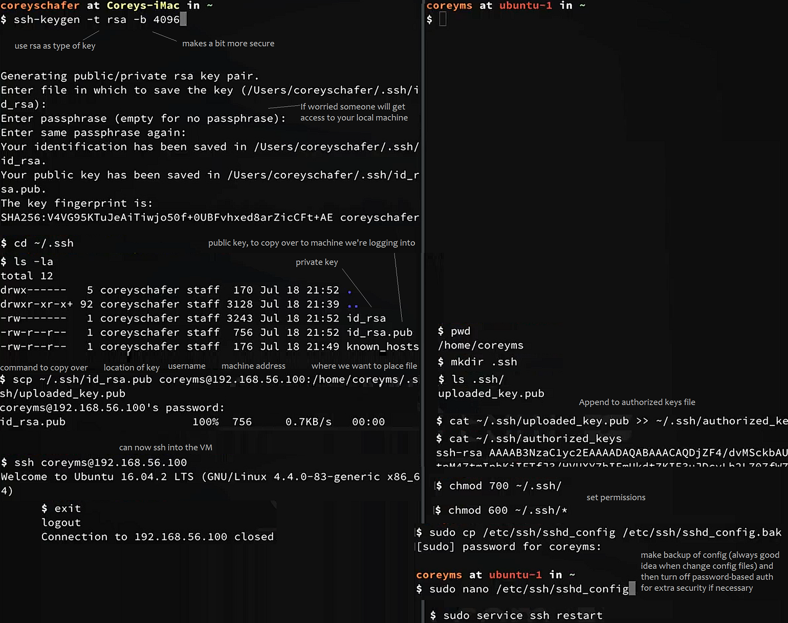
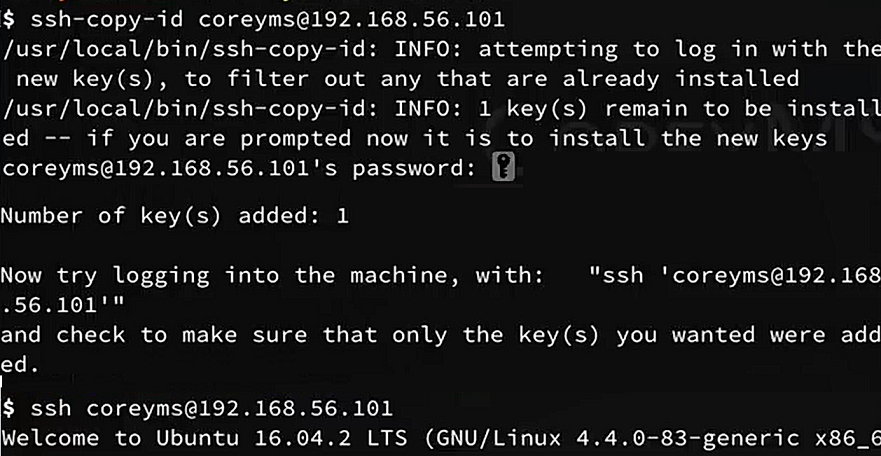

Secure Shell is an application level protocol which provides an encrypted channel for logging into
another computer over a network, executing commands on a remote computer, and moving files from one
computer to another. SSH provides strong user authentication and secure encrypted
communications over the internet. It comes with all Linux distributions and Unix variants.
It creates a secure channel for running commands on a remote computer.

You keep the private key a secret and store it on the computer you use to connect to the remote system.
Conceivably, you can share the public key with anyone without compromising the private key; you store
it on the remote system in a `.ssh/authorized_keys` directory.

To use SSH public-key authentication:

- The remote system must have a version of SSH installed.

- The computer you use to connect to the remote server must have a version of SSH installed.

- You need to be able to transfer your public key to the remote system.
Therefore, you must either be able to log into the remote system with an established account username
and password/passphrase, or have an administrator on the remote system add the public key to
the `~/.ssh/authorized_keys file` in your account.

sshing into a machine
---------------------
Assuming you have a VM that you can access via `ssh`.

Above is set up of key-based auth manually. Below is the `ssh-cp-id` command which is easier than above manual copy over
method (after key pair generated as above):

