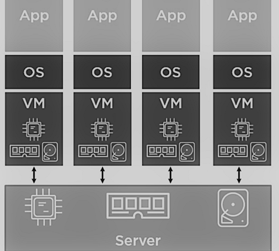
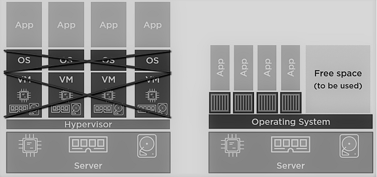
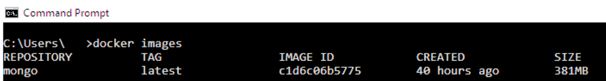
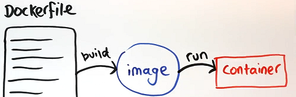
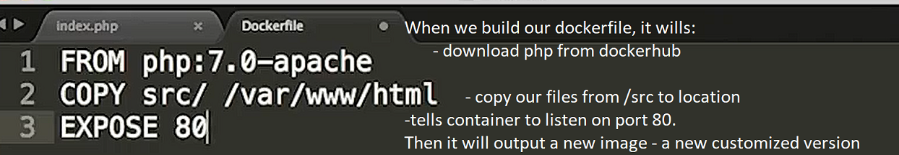
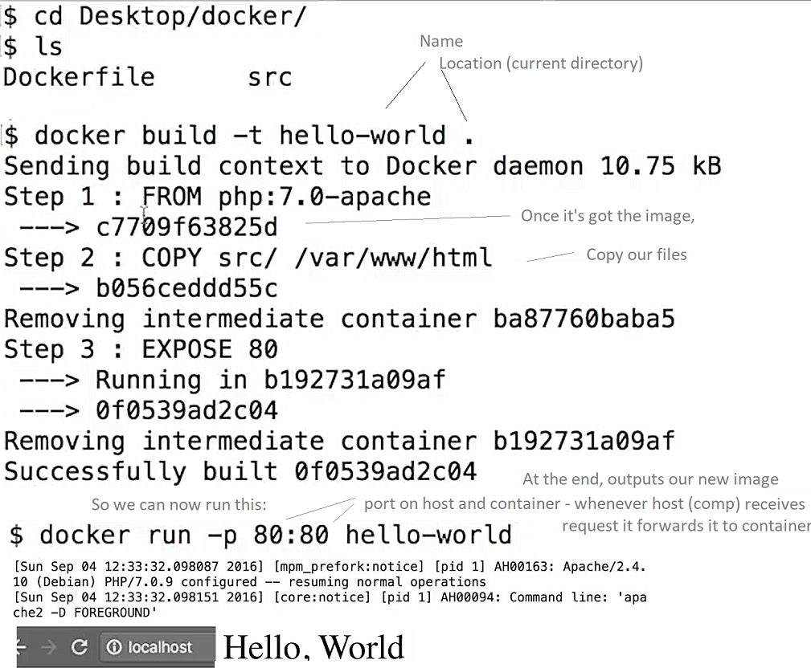

**Virtualization**

Is the process of running a virtual instance of a computer system in a layer abstracted from the actual hardware.
Most commonly, it refers to running multiple operating systems on a computer system simultaneously.
A virtual machine is the emulated equivalent of a computer system that runs on top of another system
and has access to its computing power and other resources.

Unlike other types of virtualization, containers are running at the top of the operating system kernel.
Vrtualization by the container is often called virtualization at the operating system level.
This kind of virtualization allows more isolated instances to run on a single machine.
Typically, containers are designed to run a single program, as opposed to emulating a full multi-purpose server.

VM's help development to run more efficiently and can improve the quality of work.
However, they represent additional tools need to be maintain and troubleshooted,
and development team need to learn how to use them properly.

**Provisioning VM's with Vagrant and Ansible**

In using a VM as described below, the host machine and virtual machine share the application files through the path configured under Vagrant.
So  all of the code modifications made on the host machine automatically show up on the virtual machine.
You just get to enjoy the convenience of local development, and an environment that mimics the server(s) where your code will be deployed.

The word "boxes" is often used in place of VM's with Vagrant. One approach involves
installing Vagrant, Ansible, and VirtualBox (or other provider)

Then, you will need a starting point for your virtual server, typically called a "base box."
For your first virtual machine, it is easiest to use an existing box.
There are many boxes up at HashiCorp's Atlas and at Vagrantbox.es .
Once you've chosen your box, bring it to life:

    $ vagrant box add name-of-box url-of-box $ vagrant init name-of-box $ vagrant up

Then you can use Ansible to load the system software, create databases, configure the server,
create users, set file ownership and permissions, set up services, etc.
Basically, to configure the virtual machine to include everything you need.
Once you have the Ansible scripts set up you will be able to re-use them with different
VMs and also run them against remote servers.

Docker
------
Often called virtualization at the OS level. Containers, like Docker, allow developers to isolate and run multiple applications on a
single operating system, rather than dedicating a Virtual Machine for each application on the server.
These more lightweight containers allows lower costs, better resource usage, and higher performance.

Historical context

Early to mid-2000s, most of the time we ran one application on one physical server,
a lot of people ended up with overpowered physical servers...a shameful waste of company capital and resources.
Then along came services like VMware and Hypervisor:

Since each application uses a virtual machine, another big chunk of these resources is sliced from the physical server,
just to run even without any applications deployed on the server. Each virtual machine also needs administrator supervision.

Containers

All of this leads us to containers as the current best solution to these problems.

This time we have a single operating system for all of the apps. Containers are a lot smaller and lot more efficient than VMs,
so this approach costs less and allows us to use our resources more efficiently. This means that we can deploy even more applications on the
same physical server as before.

A container is launched by running an image, which is an executable package that includes everything needed to run an application - code,
a runtime, libraries, environment variables, and config files. An image is built using layers.

The Docker *engine* is the core piece of software for building images, stopping, and running containers.
Docker Hub, the public Docker registry, is a place where you can store and retrieve Docker images. It is analogous to the App Store for the iphone.
There are lots of third-party registries out there too.

Containers run on images (a container is the runtime instance of an image). To pull a MongoDB image to our Docker host, you can run the `docker pull mongo`
command, then to see your list of images: `docker images`:

Layers

Every command you specify (`FROM`, `RUN`, `COPY`, etc.) in your Dockerfile causes the previous image to change, thus creating a new layer.

Consider the following Dockerfile:

    FROM rails:onbuild
    ENV RAILS_ENV production
    ENTRYPOINT ["bundle", "exec", "puma"]

First, we choose a starting image: `rails:onbuild`, which in turn has many layers. We add another layer on top of our starting image, setting the environment
variable `RAILS_ENV` with the `ENV` command. Then, we tell docker to run `bundle exec puma` (which boots up the rails server). That's another layer.

Another example is a Dockerfile with the following block:

    RUN yum -y update
    RUN yum -y install epel-release
    RUN yum -y groupinstall "Development Tools"
    RUN yum -y install python-pip git mysql-devel libxml2-devel libxslt-devel python-devel openldap-devel libffi-devel openssl-devel

The concept of layers comes in handy at the time of building images. Because layers are intermediate images,
if you make a change to your Dockerfile, docker will build only the layer that was changed and the ones after that. This is called layer caching.

Usage overview:

If you change the application code, it is not reflected when you refresh localhost. To see the change you would need to rebuild the image and spin up
a container from the updated image

This is where volumes come in (See 'Docker Persistence' below). There are 2 types: one to share and persist data between containers. The second allows share
between files between the host and the container. So you mount a local directory on your computer as a volume inside the container, which can then see the files that you're working on.

You can easily stop containers by ctrl + c. But containers will stop themselves when the main process exits.
You can easily make containers with short-running tasks. When main process
stops the container ends, so should endeavour to have one task per container.

Any production worthy app, is going to be composed of multiple interlinked containers, probably spanning multiple hosts, and maybe even multiple cloud
infrastructures. And if we're talking about a lot of component parts to our app - many microservices spanning thousands of containers on tens or hundreds
of hosts, honestly, we don't want to be manually hand-stitching all of that.

What want something that composes everything (different components or the services that make up the application) into the overall
app...fitting them together, networking, message queues, API calls, etc...

To deploy and scale the application, we just want a pool of hosts, and then be able to fire-up containers and have our orchestration tool
put the right containers on the right hosts.

This is all high-level, but this is what container orchestration is about. Defining our application, how all the parts interact,
provisioning the infrastructure, and then deploying the application potentially with a single click.

This is where products like Docker Compose come in, to define and compose our multi-container application - which images to use,
which network ports to open, and the config that glues our application containers together.
As always, there's the wider ecosystem. E.g. technologies and frameworks like Kubernetes.
These can all be used to orchestrate containerized apps, each with its own pros and cons.

Writing Dockerfiles

Do not write complex commands in the Dockerfile but rather use scripts that are to be copied and executed. E.g.:

    COPY apt_setup.sh /root/
    RUN sh -x /root/apt_setup.sh
    COPY install_pacakges.sh /root/
    RUN sh -x /root/install_packages.sh

and so on. The advice of binding several commands with && has only a limited scope.
It is much easier to write with scripts, where you can use functions, etc. to avoid redundancy or for documentation purposes.

**Docker Persistence**

(Full detailed article)[https://thenewstack.io/methods-dealing-container-storage/]
Containers are an outstanding fit for non-persistent workloads, but they can also persist data.
A goal that was critical to Docker was the separation of filesystems to create isolation between the host system and containers.
This isolation was core to the security of containerized applications, so Docker adopted a union filesystem architecture for the images and containers.
Union filesystems represent a logical filesystem by grouping different directories and filesystems together.
Each filesystem is made available as a branch, which becomes a separate layer.
Docker images are based on a union filesystem, where each branch represents a new layer.
It allows images to be constructed and deconstructed as needed instead of creating a large, monolithic image.

Since they are self-contained, Docker containers can be launched on any host with no dependencies or affinity to a specific host.
While this gives advantages, it becomes a challenge to run stateful applications that deal with persistent data.
Some workloads also require shared data access across multiple application instances.

When a Docker image is pulled from a container registry i.e. `docker image pull [OPTIONS] NAME[:TAG|@DIGEST]`,
the Docker engine downloads all the dependent layers to the host.

When a container is launched from a downloaded image comprised of many layers,
Docker uses the copy-on-write capabilities of the available union filesystem to add a writeable
“working directory” - or temporary filesystem - on top of the existing read-only layers.
So when a Docker image is created from an existing container, only the changes made are added into the new layer.
When a process attempts to write to an existing file, the filesystem implementing the copy-on-write feature creates a
copy of the file in the topmost working layer. All other processes using the original image’s layers will continue to
access the read-only, original version of the layer. This technique optimizes both image disk space usage and the performance of container start times.

