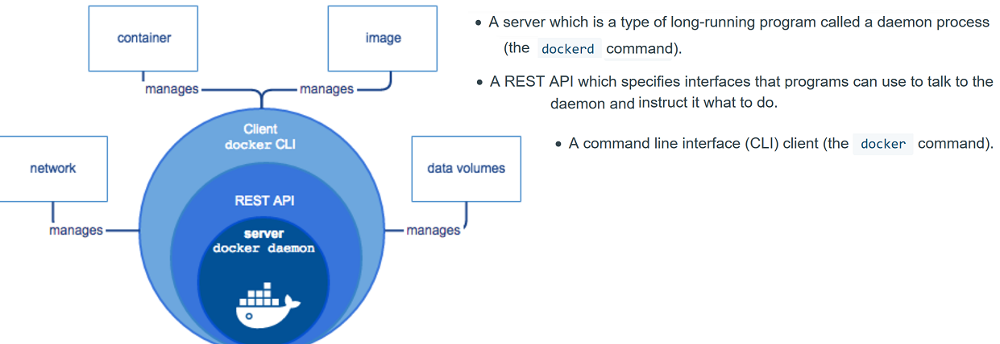
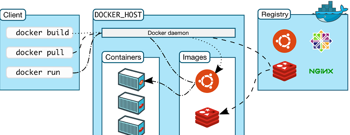
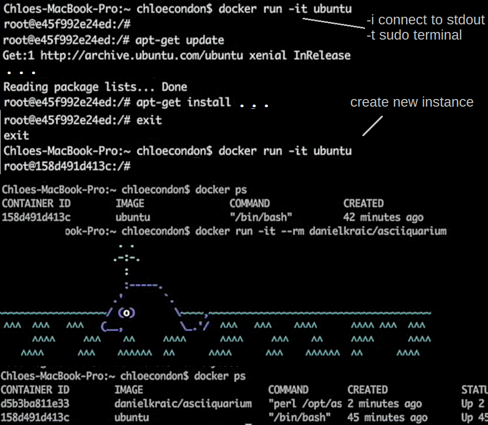
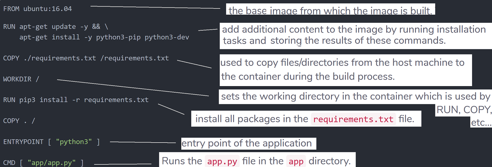

**Virtualization**

Is the process of running a virtual instance of a computer system in a layer abstracted from the actual hardware.
Most commonly, it refers to running multiple operating systems on a computer system simultaneously.
A virtual machine is the emulated equivalent of a computer system that runs on top of another system
and has access to its computing power and other resources.

Unlike other types of virtualization, containers are running at the top of the operating system kernel.
Vrtualization by the container is often called virtualization at the operating system level.
This kind of virtualization allows more isolated instances to run on a single machine.
Typically, containers are designed to run a single program, as opposed to emulating a full multi-purpose server.

**Provisioning VM's with Vagrant and Ansible**

In using a VM as described below, the host machine and virtual machine share the application files through the path configured under Vagrant.
So  all of the code modifications made on the host machine automatically show up on the virtual machine.
You just get to enjoy the convenience of local development, and an environment that mimics the server(s) where your code will be deployed.

The word "boxes" is often used in place of VM's with Vagrant. One approach involves
installing Vagrant, Ansible, and VirtualBox (or other provider)

Then, you will need a starting point for your virtual server, typically called a "base box."
For your first virtual machine, it is easiest to use an existing box.
There are many boxes up at HashiCorp's Atlas and at Vagrantbox.es .
Once you've chosen your box, bring it to life:

    $ vagrant box add name-of-box url-of-box $ vagrant init name-of-box $ vagrant up

Then you can use Ansible to load the system software, create databases, configure the server,
create users, set file ownership and permissions, set up services, etc.
Basically, to configure the virtual machine to include everything you need.
Once you have the Ansible scripts set up you will be able to re-use them with different
VMs and also run them against remote servers.

Docker overview
---------------
Docker provides tooling and a platform to manage the lifecycle of your containers:

- Develop your application and its supporting components using containers.
- The container becomes the unit for distributing and testing your application.
- When you’re ready, deploy your application into your production environment, as a container or an orchestrated service.
This works the same whether your production environment is a local data center, a cloud provider, or a hybrid of the two.

**Docker Engine** is a client-server application with these major components:

The CLI uses the Docker REST API to control or interact with the Docker daemon through scripting or direct CLI commands.
Many other Docker applications use the underlying API and CLI.
The daemon creates and manages Docker objects, such as images, containers, networks, and volumes.

**Docker architecture** uses a client-server model. The Docker client talks to the Docker daemon, which does the heavy
lifting of building, running, and distributing your Docker containers. The Docker client and daemon can run on the same
system, or you can connect a Docker client to a remote Docker daemon.
The Docker client and daemon communicate using a REST API, over UNIX sockets or a network interface.

The **Docker daemon** (`dockerd`) listens for Docker API requests and manages Docker objects such as images, containers, networks, and volumes.
A daemon can also communicate with other daemons to manage Docker services.

The **Docker client** (`docker`) is the primary way that many Docker users interact with Docker. When you use commands such
as docker run, the client sends these commands to dockerd, which carries them out. The docker command uses the Docker API.
The Docker client can communicate with more than one daemon.

A **Docker registry** stores Docker images. Docker Hub is a public registry that anyone can use, and Docker is configured to
look for images on Docker Hub by default. You can even run your own private registry. When you use the `docker pull` or
`docker run` commands, or `docker push` the required images are pulled or push from your configured registry.

**Docker objects**

When you use Docker, you are creating and using images, containers, networks, volumes, plugins, and other objects.

An *image* is a read-only template with instructions for creating a Docker container. Usually based on another image,
with some additional customization. You might create your own images or you might only use those created by others and
published in a registry. To build your own image, you create a Dockerfile with a simple syntax for defining the steps
needed to create the image and run it. Each instruction in a Dockerfile creates a layer in the image. When you change the
Dockerfile and rebuild the image, only those layers which have changed are rebuilt. This is part of what makes images so
lightweight, small, and fast.

A *container* is a runnable instance of an image. You can create, start, stop, move, or delete a container using the
Docker API or CLI. You can connect a container to one or more networks, attach storage to it, or even create a new image
based on its current state. A container is defined by its image as well as any configuration options you provide to it when
you create or start it. When a container is removed, any changes to its state that are not stored in persistent storage
disappear.

**Example `docker run` command**

The following command runs an `ubuntu` container, attaches interactively to your local command-line session, and runs `/bin/bash`.

    $ docker run -i -t ubuntu /bin/bash

When you run this command, the following happens:

- If you do not have the ubuntu image locally, Docker pulls it from your configured registry, as though you had run docker pull ubuntu manually.
- Docker creates a new container
- Docker allocates a read-write filesystem to the container, as its final layer. This allows a running container to create or
modify files and directories in its local filesystem.
- Docker creates a network interface to connect the container to the default network, since you did not specify any
networking options. This includes assigning an IP address to the container. By default, containers can connect to external
networks using the host machine’s network connection.
- Docker starts the container and executes `/bin/bash`. As the container is running interactively and attached to your
terminal (due to the `-i` and `-t` flags), you can provide input and the output is logged to your terminal.
- When you type `exit` to terminate the `/bin/bash` command, the container stops but is not removed. You can start it again or remove it.

**Services** allow you to scale containers across multiple Docker daemons, which all work together as a swarm with multiple
managers and workers. Each member of a swarm is a Docker daemon, and the daemons all communicate using the Docker API.
A service allows you to define the desired state, such as the number of replicas of the service that must be available at
any given time. By default, the service is load-balanced across all worker nodes. To the consumer, the Docker service appears
to be a single application.

Docker in-depth
---------------
Often called virtualization at the OS level. Containers, like Docker, allow developers to isolate and run multiple applications on a
single operating system, rather than dedicating a Virtual Machine for each application on the server.
These more lightweight containers allows lower costs, better resource usage, and higher performance.

Historical context

Early to mid-2000s, most of the time we ran one application on one physical server,
a lot of people ended up with overpowered physical servers...a shameful waste of company capital and resources.
Then along came services like VMware and Hypervisor:

Since each application uses a virtual machine, another big chunk of these resources is sliced from the physical server,
just to run even without any applications deployed on the server. Each virtual machine also needs administrator supervision.

Containers

All of this leads us to containers as the current best solution to these problems.

This time we have a single operating system for all of the apps. Containers are a lot smaller and lot more efficient than VMs,
so this approach costs less and allows us to use our resources more efficiently. This means that we can deploy even more applications on the
same physical server as before.

A container is launched by running an image, which is an executable package that includes everything needed to run an application - code,
a runtime, libraries, environment variables, and config files. An image is built using layers.

The Docker *engine* is the core piece of software for building images, stopping, and running containers.
Docker Hub, the public Docker registry, is a place where you can store and retrieve Docker images. It is analogous to the App Store for the iphone.
There are lots of third-party registries out there too.

Containers run on images (a container is the runtime instance of an image). To pull a MongoDB image to our Docker host, you can run the `docker pull mongo`
command, then to see your list of images: `docker images`:

Layers

Every command you specify (`FROM`, `RUN`, `COPY`, etc.) in your Dockerfile causes the previous image to change, thus creating a new layer.

Consider the following Dockerfile:

    FROM rails:onbuild
    ENV RAILS_ENV production
    ENTRYPOINT ["bundle", "exec", "puma"]

First, we choose a starting image: `rails:onbuild`, which in turn has many layers. We add another layer on top of our starting image, setting the environment
variable `RAILS_ENV` with the `ENV` command. Then, we tell docker to run `bundle exec puma` (which boots up the rails server). That's another layer.

Another example is a Dockerfile with the following block:

    RUN yum -y update
    RUN yum -y install epel-release
    RUN yum -y groupinstall "Development Tools"
    RUN yum -y install python-pip git mysql-devel libxml2-devel libxslt-devel python-devel openldap-devel libffi-devel openssl-devel

The concept of layers comes in handy at the time of building images. Because layers are intermediate images,
if you make a change to your Dockerfile, docker will build only the layer that was changed and the ones after that. This is called layer caching.

Usage overview:

If you change the application code, it is not reflected when you refresh localhost. To see the change you would need to rebuild the image and spin up
a container from the updated image

This is where volumes come in (See 'Docker Persistence' below). There are 2 types: one to share and persist data between containers. The second allows share
between files between the host and the container. So you mount a local directory on your computer as a volume inside the container, which can then see the files that you're working on.

You can easily stop containers by ctrl + c. But containers will stop themselves when the main process exits.
You can easily make containers with short-running tasks. When main process
stops the container ends, so should endeavour to have one task per container.

Any production worthy app, is going to be composed of multiple interlinked containers, probably spanning multiple hosts, and maybe even multiple cloud
infrastructures. And if we're talking about a lot of component parts to our app - many microservices spanning thousands of containers on tens or hundreds
of hosts, honestly, we don't want to be manually hand-stitching all of that.

What want something that composes everything (different components or the services that make up the application) into the overall
app...fitting them together, networking, message queues, API calls, etc...

To deploy and scale the application, we just want a pool of hosts, and then be able to fire-up containers and have our orchestration tool
put the right containers on the right hosts.

This is all high-level, but this is what container orchestration is about. Defining our application, how all the parts interact,
provisioning the infrastructure, and then deploying the application potentially with a single click.

This is where products like Docker Compose come in, to define and compose our multi-container application - which images to use,
which network ports to open, and the config that glues our application containers together.
As always, there's the wider ecosystem. E.g. technologies and frameworks like Kubernetes.
These can all be used to orchestrate containerized apps, each with its own pros and cons.

Writing Dockerfiles

Do not write complex commands in the Dockerfile but rather use scripts that are to be copied and executed. E.g.:

    COPY apt_setup.sh /root/
    RUN sh -x /root/apt_setup.sh
    COPY install_pacakges.sh /root/
    RUN sh -x /root/install_packages.sh

and so on. The advice of binding several commands with && has only a limited scope.
It is much easier to write with scripts, where you can use functions, etc. to avoid redundancy or for documentation purposes.

**Docker Persistence**

(Full detailed article)[https://thenewstack.io/methods-dealing-container-storage/]
Containers are an outstanding fit for non-persistent workloads, but they can also persist data.
A goal that was critical to Docker was the separation of filesystems to create isolation between the host system and containers.
This isolation was core to the security of containerized applications, so Docker adopted a union filesystem architecture for the images and containers.
Union filesystems represent a logical filesystem by grouping different directories and filesystems together.
Each filesystem is made available as a branch, which becomes a separate layer.
Docker images are based on a union filesystem, where each branch represents a new layer.
It allows images to be constructed and deconstructed as needed instead of creating a large, monolithic image.

Since they are self-contained, Docker containers can be launched on any host with no dependencies or affinity to a specific host.
While this gives advantages, it becomes a challenge to run stateful applications that deal with persistent data.
Some workloads also require shared data access across multiple application instances.

When a Docker image is pulled from a container registry i.e. `docker image pull [OPTIONS] NAME[:TAG|@DIGEST]`,
the Docker engine downloads all the dependent layers to the host.

When a container is launched from a downloaded image comprised of many layers,
Docker uses the copy-on-write capabilities of the available union filesystem to add a writeable
“working directory” - or temporary filesystem - on top of the existing read-only layers.
So when a Docker image is created from an existing container, only the changes made are added into the new layer.
When a process attempts to write to an existing file, the filesystem implementing the copy-on-write feature creates a
copy of the file in the topmost working layer. All other processes using the original image’s layers will continue to
access the read-only, original version of the layer. This technique optimizes both image disk space usage and the performance of container start times.

Dockerizing Python Applications
-------------------------------
Consider a basic Hello World Flask app with a requirements.txt file.

    docker-flask-tutorial
        ├── requirements.txt
        ├── Dockerfile
        └── app
            └── app.py
            └── <other .py files>

A Dockerfile is essentially a text file with clearly defined instructions on how to build a Docker image for our project.

File to create a Docker image based on Ubuntu 16.04 and Python 3.X:

The `ENTRYPOINT` specifies a command that will always be executed when the container starts.
The `CMD` specifies arguments that will be fed to the `ENTRYPOINT`.

**How Docker Images are Built**

Docker images are built using the `docker build` command. When building an image, Docker creates so-called
"layers". Each layer records the changes resulting from a command in the Dockerfile and the state of the image after
running the command.

Whenever any layer is re-built all the layers that follow it in the Dockerfile need to be rebuilt too.
E.g. Above we `COPY` the `requirements.txt` file first and install dependencies before `COPY`ing the rest of
the app. This results in a Docker layer containing all the dependencies. This layer need not be re-built
even if other files in the app change as long as there are no new dependencies.
Thus we optimize the build process for our container by separating the `pip install` from the deployment of
the rest of our app.

Building the Docker Image:

    $ docker build -t docker-flask:latest .

**Running Application in Debug Mode with Auto-Restart**

To enable auto-restart, we start the Docker container mapping our development directory to the app directory
within the container. This means Flask will watch the files in the host (through this mapping) for any changes and restart the application automatically when it detects any changes.

Additionally, we also need to forward the application ports from the container to the host. This is to
enable a browser running on the host to access the application.

To achieve this, we start the Docker container with volume-mapping and port-forwarding options:

    $ docker run --name flaskapp -v$PWD/app:/app -p5000:5000 docker-flask:latest

This starts a container based on the docker-flask image we built previously and sets its
name `flaskapp` using the `--name` option. The `-v` option mounts the app folder on the host to the container.
The `-p` option maps the port on the container to the host. Now the application can be accessed at `http://localhost:5000`.

To stop the container, press Ctrl-C and remove the container by running `docker rm flaskapp`.

**Running the Application in Production Mode**

In production we need to handle multiple parallel connections so the app will be
deployed over a WSGI-compliant web-server.

When a Docker container starts, it calls its entrypoint command.
Most of the time, this is the path to the service that should run in that
container. It is however very common to run wrapping scripts in order to
configure the container before starting the service.

First, create an entrypoint script, a simple shell script, which will start our application in either development or
production mode, i.e. runs either nginx or Python directly. Based on [entrypoint.sh](https://github.com/jazzdd86/alpine-flask/blob/master/entrypoint.sh). [Full article](https://stackabuse.com/dockerizing-python-applications/) containing original script.

    #!/bin/bash

    if [ ! -f /debug0 ]; then
      touch /debug0

      while getopts 'hd:' flag; do
        case "${flag}" in
          ...
        esac
      done
    fi

    if [ -e /debug1 ]; then
      echo "Running app in debug mode!"
      python3 app/app.py
    else
      echo "Running app in production mode!"
      nginx && uwsgi --ini /app.ini
    fi

Entrypoint sets the command and parameters that will be executed first when a container is run.
Any command line arguments passed to `docker run <image>` will be appended to the entrypoint
command, and will override all elements specified using `CMD`. E.g. `docker run <image> bash`
will add the command argument bash to the end of the entrypoint.

Recall the last two lines of the Dockerfile above:

    ENTRYPOINT [ "python3" ]
    CMD [ "app/app.py" ]

Docker has a default entrypoint which is `/bin/sh -c` but does not have a default command.

When you run docker like this: `docker run -i -t ubuntu bash` the entrypoint is the
default `/bin/sh -c`, the image is `ubuntu` and the command is `bash`.

Next, we need to create a `.ini` file which describes our application entry-point to uWSGI/nginx,
as referenced in our `.sh` script:

    [uwsgi]
    plugins = /usr/lib/uwsgi/plugins/python3
    chdir = /app
    module = app:app
    uid = nginx
    gid = nginx
    socket = /run/uwsgiApp.sock
    pidfile = /run/.pid
    processes = 4
    threads = 2

Finally, we modify our Dockerfile to include nginx and uWSGI.
Apart from installing nginx, uWSGI, and the uWSGI Python3 plugin,
it now also copies the `nginx.conf` to the appropriate location and sets up user permissions
required to run nginx. Also the Dockerfile `ENTRYPOINT` is set to the shell script:

    FROM ubuntu:16.04

    RUN apt-get update -y && \
        apt-get install -y python3-pip python3-dev && \
        apt-get install -y nginx uwsgi uwsgi-plugin-python3

    COPY ./requirements.txt /requirements.txt
    COPY ./nginx.conf /etc/nginx/nginx.conf

    WORKDIR /

    RUN pip3 install -r requirements.txt

    COPY . /

    RUN adduser --disabled-password --gecos '' nginx\
      && chown -R nginx:nginx /app \
      && chmod 777 /run/ -R \
      && chmod 777 /root/ -R

    ENTRYPOINT [ "/bin/bash", "/launcher.sh"]

Now, we can rebuild the image and run the app using nginx:

    $ docker build -t docker-flask:latest .
    $ docker run -d --name flaskapp --restart=always -p 80:80 docker-flask:latest

We can easily run the container in debug mode mounting our own version of the source tree:

    $ docker run -it --name flaskapp -p 5000:5000 -v$PWD/app:/app docker-flask:latest -d

A single file, checked in with your source code that specifies an environment, configuration, and access for your application.
In its purest form, that is Docker and Infrastructure as Code. With that basic building block in place,
you can use docker-compose to define composite applications with multiple services, each containing an individualized
Dockerfile, or an imported image for a Docker repository

Docker Compose
--------------
Allows configuring and starting multiple docker containers. This is mostly used as a helper when you want to start
multiple docker containers and don't want to start each one separately using `docker run ....` Docker compose is used for
starting containers on the **same** host.

(from the docs): Compose is a tool for defining and running multi-container Docker applications. With Compose, you use a YAML file to configure your application’s services. Then, with a single command, you create and start all the services from your configuration.

Compose has commands for managing the whole lifecycle of your application:

   - Start, stop, and rebuild services
   - View the status of running services
   - Stream the log output of running services
   - Run a one-off command on a service

i.e. It is a tool that takes a YAML file which describes your multi-container application and helps you create, start/stop,
remove all those containers without having to type multiple `docker ...` commands for each container.

Kubernetes and Docker Swarm Overview
------------------------------------
Containerization enables applications to be released and updated in an easy and fast way without downtime.
Kubernetes helps you make sure those containerized applications run where and when you want, and helps them find the resources
and tools they need to work.

These are container cluster management and orchestration tools. They manage containers running on **multiple** hosts and does
things like scaling, starting a new container when one crashes, networking containers.

