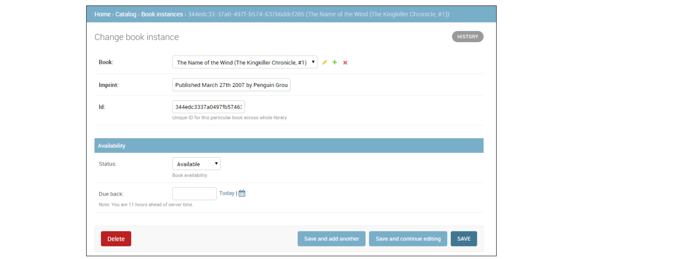

**Who should use the admin?**
Developers and site administrators (an organizations internal management tool). The admin should be configured to be helpful
to the business needs rather than being exposed to models etc. Not for end users.

**ModelAdmin objects**

`ModelAdmin` is a representation of a model in admin. The base ModelAdmin can
introspect your models (through the `_meta` API) and provide default representations which can be
configured to your needs.

The decorator for registering `ModelAdmin` classes is given one or more model classes to register with the ModelAdmin. If you’re using a custom AdminSite, pass it using the site keyword argument:

    from django.contrib import admin
    from .models import Author, Reader, Editor
    from myproject.admin_site import custom_admin_site

    @admin.register(Author)
    class AuthorAdmin(admin.ModelAdmin):
        pass

    @admin.register(Author, Reader, Editor, site=custom_admin_site)
    class PersonAdmin(admin.ModelAdmin):
        pass

**ModelAdmin options**

Various options are available for customizing the interface by defining them on
the subclass, such as:

    class AuthorAdmin(admin.ModelAdmin):
        date_hierarchy = 'pub_date'

For a name of a DateField or DateTimeField in your model, the change list page will include a date-based drilldown navigation by that field.
You can also specify a field on a related model using the __ lookup, for example:

    date_hierarchy = 'author__pub_date'

Since the Author model only has three fields, the forms from the following declarations will contain exactly the same fields.

    class AuthorAdmin(admin.ModelAdmin):
        fields = ('name', 'title')

    class AuthorAdmin(admin.ModelAdmin):
        exclude = ('birth_date',)

Some of the things you can do are:

List views: e.g. set `list_filter` and `list_display` attributes

Detail views: fields to display, ordering and grouping, widgets, inline editing of related objects

Ways of customizing of edit views include using: fieldsets to organize fields, read_only fields, inlines for related objects, custom forms and widgets.

`ModelAdmin.fieldset`

Set fieldsets to control the layout of admin “add” and “change” pages.

    class BookInstanceAdmin(admin.ModelAdmin):
        list_filter = ('status', 'due_back')

        fieldsets = (
            (None, {
                'fields': ('book', 'imprint', 'id')
            }),
            ('Availability', {
                'fields': ('status', 'due_back')
            }),

Each section has its own title (or None, if you don't want a title) and an associated tuple of fields in a dictionary:

`ModelAdmin.form`

By default a `ModelForm` is dynamically created for your model.
It is used to create the form presented on both the add/change pages.
 You can easily provide your own `ModelForm` to override any default form behavior on the
add/change pages. Alternatively, you can customize the default form rather than specifying an entirely new one by using the `ModelAdmin.get_form()` method.

`ModelAdmin.formfield_overrides`

 The most common use of `formfield_overrides` is to add a custom widget for a certain type of field. E.g. a RichTextEditorWidget that we’ve written:

    from myapp.widgets import RichTextEditorWidget
    from myapp.models import MyModel

    class MyModelAdmin(admin.ModelAdmin):
        formfield_overrides = {
            models.TextField: {'widget': RichTextEditorWidget},
        }

`ModelAdmin.list_display`

Set list_display to control which fields are displayed on the change list page of the admin.
If you don’t set `list_display`, the admin site will display a single column that displays the `__str__()` representation of each object.

May be a simple field name, or callable specified in various ways. Callables take the object instance as parameter.

    class Person(models.Model):
        name = models.CharField(max_length=50)
        birthday = models.DateField()

    def decade_born_in(self):
        return self.birthday.strftime('%Y')[:3] + "0's"
    decade_born_in.short_description = 'Birth decade'

    class PersonAdmin(admin.ModelAdmin):
        list_display = ('name', 'decade_born_in')

`ModelAdmin.list_filter`

Set `list_filter` to activate filters in the right sidebar of the change list page of the admin.

`list_filter` should be a list or tuple of elements, where each element should be of one of the following types:

1 - a field name, where the specified field should be either a BooleanField, CharField, DateField, DateTimeField, IntegerField, ForeignKey or ManyToManyField, for example:

    class PersonAdmin(admin.ModelAdmin):
        list_filter = ('is_staff', 'company')

Field names in `list_filter` can also span relations using the `__` lookup, for example:

    class PersonAdmin(admin.UserAdmin):
        list_filter = ('company__name',)

2 - a class inheriting from `django.contrib.admin.SimpleListFilter`, which you need to provide the title and parameter_name attributes to and override the lookups and queryset methods, e.g.:

    from datetime import date

    from django.contrib import admin
    from django.utils.translation import gettext_lazy as _

    class DecadeBornListFilter(admin.SimpleListFilter):
        title = _('decade born')

        # Parameter used in the URL query.
        parameter_name = 'decade'

        def lookups(self, request, model_admin):
            """
            The first element in each tuple is the value that will appear in
            the URL query. The second will appear in the right sidebar.
            """
            return (
                ('80s', _('in the eighties')),
                ('90s', _('in the nineties')),
            )

        def queryset(self, request, queryset):
            if self.value() == '80s':
                return queryset.filter(birthday__gte=date(1980, 1, 1),
                                        birthday__lte=date(1989, 12, 31))
            if self.value() == '90s':
                return queryset.filter(birthday__gte=date(1990, 1, 1),
                                        birthday__lte=date(1999, 12, 31))

    class PersonAdmin(admin.ModelAdmin):
        list_filter = (DecadeBornListFilter,)

As a convenience, the `HttpRequest` object is passed to the lookups and queryset methods, for example:

    class AuthDecadeBornListFilter(DecadeBornListFilter):

        def lookups(self, request, model_admin):
            if request.user.is_superuser:
                return super().lookups(request, model_admin)

        def queryset(self, request, queryset):
            if request.user.is_superuser:
                return super().queryset(request, queryset)

3 - a tuple, where the first element is a field name and the second element is a class inheriting from `django.contrib.admin.FieldListFilter`, for example:

    class PersonAdmin(admin.ModelAdmin):
        list_filter = (
            ('is_staff', admin.BooleanFieldListFilter),
        )

**InlineModelAdmin objects**

The admin interface has the ability to edit models on the same page as a parent model. These are called inlines. Suppose you have these two models:

    class Author(models.Model):
       name = models.CharField(max_length=100)

    class Book(models.Model):
       author = models.ForeignKey(Author, on_delete=models.CASCADE)
       title = models.CharField(max_length=100)

You can edit the books authored by an author on the author page. You add inlines to a model by specifying them in a ModelAdmin.inlines:

    from django.contrib import admin

    class BookInline(admin.TabularInline):
        model = Book

    class AuthorAdmin(admin.ModelAdmin):
        inlines = [
            BookInline,]

**InlineModelAdmin options**

`InlineModelAdmin` shares many of the same features as `ModelAdmin`, and adds some of its own (the shared features are actually defined in the BaseModelAdmin superclass)
You can edit the books authored by an author on the author page by specifying them in  `ModelAdmin.inlines`:

    class BooksInstanceInline(admin.TabularInline):
        model = BookInstance

    @admin.register(Book)
    class BookAdmin(admin.ModelAdmin):
        list_display = ('title', 'author', 'display_genre')
        inlines = [BooksInstanceInline]

**Using generic relations as an inline**

    from django.contrib.contenttypes.fields import GenericForeignKey

    class Image(models.Model):
        image = models.ImageField(upload_to="images")
        content_type = models.ForeignKey(ContentType, on_delete=models.CASCADE)
        object_id = models.PositiveIntegerField()
        content_object = GenericForeignKey("content_type", "object_id")

    class Product(models.Model):
        name = models.CharField(max_length=100)

    #admin.py
    from django.contrib.contenttypes.admin import GenericTabularInline

    from myproject.myapp.models import Image, Product

    class ImageInline(GenericTabularInline):
        model = Image

    class ProductAdmin(admin.ModelAdmin):
        inlines = [
            ImageInline, ]

    admin.site.register(Product, ProductAdmin)

Admin actions
-------------
If you need to make the same change to many objects at once, you write and register “actions” – simple functions that get called with a list of objects selected on the change list page.

A common task we might perform with a model like Article (fields: title, body, status)
is to update an article’s status from “draft” to “published”.

First, we’ll need to write a function that gets called when the action is triggered from the admin.

Our publish-these-articles function won’t need the `ModelAdmin` or the `request` object, but we will use the `queryset`:

    def make_published(modeladmin, request, queryset):
        queryset.update(status='p')
    make_published.short_description = "Mark selected stories as published"

By default, this action would appear in the action list as “Make published” – the function name. This can be made more human-readable by giving a short_description attribute:
Next, we’ll need to inform our `ModelAdmin` of the action. This works just like any other configuration option.

    class ArticleAdmin(admin.ModelAdmin):
        list_display = ['title', 'status']
        ordering = ['title']
        actions = [make_published]

We can move `make_published` into a method and rename the `modeladmin` parameter to `self`, and put the string `'make_published'` in `actions` instead of a direct function reference. This tells the `ModelAdmin` to look up the action as a method.

Defining actions as methods gives the action more straightforward, idiomatic access to the ModelAdmin itself, allowing the action to call any of the methods provided by the admin.

For example, we can use self to flash a message to the user informing her that the action was successful:

    class ArticleAdmin(admin.ModelAdmin):
        ...

        def make_published(self, request, queryset):
            rows_updated = queryset.update(status='p')
            if rows_updated == 1:
                message_bit = "1 story was"
            else:
                message_bit = "%s stories were" % rows_updated
            self.message_user(request, "%s successfully marked as published." % message_bit)

**Actions that provide intermediate pages**

By default, after an action is performed the user is simply redirected back to the original change list page. However, some actions, especially more complex ones, will need to return intermediate pages. For example, the built-in delete action asks for confirmation before deleting the selected objects.
To provide an intermediary page, simply return an `HttpResponse` from your action.

E.g., you might write a simple export function that dumps some selected objects as JSON:

    from django.http import HttpResponse
    from django.core import serializers

    def export_as_json(modeladmin, request, queryset):
        response = HttpResponse(content_type="application/json")
        serializers.serialize("json", queryset, stream=response)
        return response

Generally, something like the above isn’t considered a great idea. Most of the time, the best practice will be to return an HttpResponseRedirect and redirect the user to a view you’ve written, passing the list of selected objects in the GET query string. This allows you to provide complex interaction logic on the intermediary pages. For example, if you wanted to provide a more complete export function, you’d want to let the user choose a format, and possibly a list of fields to include in the export. The best thing to do would be to write a small action that simply redirects to your custom export view.
The action is the simple part; all the complex logic would belong in your export view. This would need to deal with objects of any type, i.e. logic involving `ContentType`.

**Making actions available site-wide**

`AdminSite.add_action`

Some actions are best if they’re made available to any object in the admin site – the export action defined above would be a good candidate

    admin.site.add_action(export_selected_objects)

This makes the `export_as_json` action globally available as an action named “export_as_json”. You can explicitly give the action a name, for if you later want to remove the action, by passing a second argument to `AdminSite.add_action()`:

    admin.site.add_action(export_as_json, 'export_selected')

`AdminSite.disable_action(name)`

    admin.site.disable_action('delete_selected')

Once you’ve done the above, that action will no longer be available site-wide.
You may still re-enable a globally-disabled action for one particular model.

The flatpages app
-----------------

Django comes with an optional “flatpages” application. It lets you store simple “flat” HTML content in a database and handles the management for you via Django’s admin interface and a Python API.

A flatpage is a simple object with a URL, title and content. Use it for one-off, special-case pages, such as “About” or “Privacy Policy” pages, that you want to store in a database but for which you don’t want to develop a custom Django application.
A flatpage can use a custom template or a default, systemwide flatpage template

After adding to `INSTALLED_APPS`, `URLconf` etc. `manage.py migrate` creates two tables in your database: django_flatpage and django_flatpage_sites. django_flatpage is a simple lookup table that simply maps a URL to a title and bunch of text content. django_flatpage_sites associates a flatpage with a site.

**Templates**

By default, flatpages are rendered via the template flatpages/default.html, but you can override that for a particular flatpage: in the admin, a collapsed fieldset titled “Advanced options” (clicking will expand it) contains a field for specifying a template name. If

Creating the flatpages/default.html template is your responsibility; in your template directory, just create a flatpages directory containing a file default.html.

Flatpage templates are passed a single context variable, flatpage, which is the flatpage object.

Here’s a sample flatpages/default.html template:

    <!DOCTYPE html>
    <html>
    <head>
    <title>{{ flatpage.title }}</title>
    </head>
    <body>
    {{ flatpage.content }}
    </body>
    </html>

The Django admin documentation generator
----------------------------------------
Django’s admindocs app pulls documentation from the docstrings of models, views, template tags, and template filters for any app in INSTALLED_APPS and makes that documentation available from the Django admin.

Setup: https://docs.djangoproject.com/en/2.0/ref/contrib/admin/admindocs/

Documentation helpers¶

The following special markup can be used in your docstrings to easily create hyperlinks to other components:

    Django Component 	reStructuredText roles
    Models 	:model:`app_label.ModelName`
    Views 	:view:`app_label.view_name`
    Template tags 	:tag:`tagname`
    Template filters 	:filter:`filtername`
    Templates 	:template:`path/to/template.html`

**Example - View reference**

Each URL in your site has a separate entry in the admindocs page, and clicking on a given URL will show you the corresponding view. Helpful things you can document in your view function docstrings include:

A short description of what the view does.

The context, or a list of variables available in the view’s template.

The name of the template or templates that are used for that view.

    from myapp.models import MyModel

    def my_view(request, slug):
        """
        Display an individual :model:`myapp.MyModel`.

        **Context**

        ``mymodel``
            An instance of :model:`myapp.MyModel`.

        **Template:**

        :template:`myapp/my_template.html`
        """
        context = {'mymodel': MyModel.objects.get(slug=slug)}
        return render(request, 'myapp/my_template.html', context)

