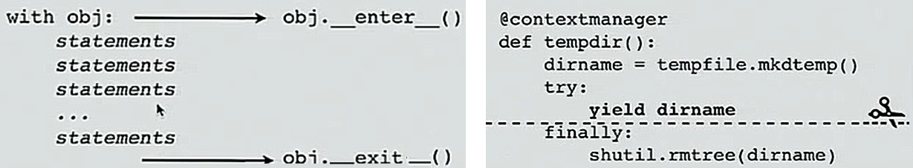
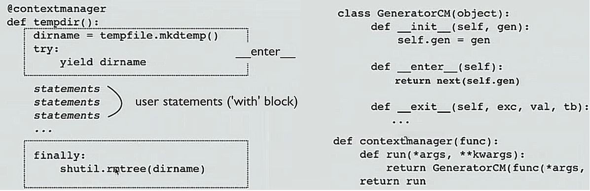

    def fib():
        a, b = 0, 1
        while True:
           yield b
           a, b = b, a+b
PEP255
-------
Simple Generators -- [https://www.python.org/dev/peps/pep-0255/](https://www.python.org/dev/peps/pep-0255/)

**Motivation**

When a producer function has a hard enough job that it requires maintaining state between values produced,
most programming languages offer no pleasant and efficient solution beyond adding a callback function to the
producer's argument list, to be called with each value produced.

**Specification: Yield**

The `yield` statement may only be used inside functions. A function that contains a `yield` statement is
a generator function. A generator function is an ordinary function object but are actually factory
functions that produce generator-iterators. In this respect they're radically different from
non-generator functions, acting more like a constructor than a function

When a generator function is called, the actual arguments are bound to function-local formal argument
names in the usual way, but no code in the body of the function is executed. Instead a generator-iterator
object is returned; this conforms to the iterator protocol, so in particular can be used in for-loops in a
natural way.

Note that the unqualified name "generator" may be used to refer either to a generator-function or a
generator-iterator. An iterator is an object with a `__next__` method.

Each time the `__next__` method of a generator-iterator is invoked, the code in the body of the
generator-function is executed until a yield or return statement is encountered, or until the end of the
body is reached.

If a yield statement is encountered, the state of the function is frozen, and the value of *expression_list*
is returned to `__next__`'s caller. By "frozen" we mean that all local state is retained: enough information
so that the next time `__next__` is invoked, the function can proceed exactly as if the yield statement
were just another external call.

**Yield in context managers**

Consider the following context manager for creating temporary directories which contains the `yield` keyword:

    @contextmanager
    def tempdir():
        outdir = tempfile.mkdtemp()
        try:
            yield outdir
        finally:
            shutil.rmtree(outdir)

    >>> with tempdir() as dirname:
            ...

In this case `yield` can be thought of as scissors which slices the function in half, where each half
maps to a context manager method. Yield is what makes this possible.

`yield from`
------------
Introduced in PEP 380 -- Syntax for Delegating to a Subgenerator.

[what are the main uses for the new “yield from” syntax?](https://stackoverflow.com/a/26109157/7159945)

What `yield from` does is it establishes a transparent bidirectional connection between the caller and the sub-generator:
- The connection is "transparent" in the sense that it will propagate everything correctly too, not just the elements being generated (e.g. exceptions are propagated).
- The connection is "bidirectional" in the sense that data can be both sent from and to a generator.

**Reading data from a generator using `yield from`**

    def reader():
        """A generator that fakes a read from a file, socket, etc."""
        for i in range(4):
            yield '<< %s' % i

    def reader_wrapper(g):
        # Manually iterate over data produced by reader
        for v in g:
            yield v

    wrap = reader_wrapper(reader())
    for i in wrap:
        print(i)

Instead of manually iterating over reader(), we can just yield from it.

    def reader_wrapper(g):
        yield from g

**Sending data to a generator (coroutine) using `yield from`**

*side note* `yield` must be parenthesized if not a top-level expression on RHS of an assignment.

    def writer():
        """A coroutine that writes data *sent* to it to fd, socket, etc."""
        while True:
            w = (yield)
            print('>> ', w)

How should the wrapper function handle sending data to the writer, so that any data that is sent to the wrapper
is transparently sent to the `writer()`?

The wrapper needs to accept the data that is sent to it  and should also handle the `StopIteration` when the for loop is exhausted.
Here is a version that works:

    def writer_wrapper(coro):
        coro.send(None)  # prime the coro
        while True:
            try:
                x = (yield)  # Capture the value that's sent
                coro.send(x)  # and pass it to the writer
            except StopIteration:
                pass

Or, we could do this. Much more readable and it just works:

    def writer_wrapper(coro):
        yield from coro

What if our `writer` function needs to handle exceptions?

    class SpamException(Exception):
        pass

    def writer():
        while True:
            try:
                w = (yield)
            except SpamException:
                print('***')
            else:
                print('>> ', w)

We could make this work by manually handling exceptions and sending them or throwing them into the sub-generator (writer):

    def writer_wrapper(coro):
        """Works. Manually catches exceptions and throws them"""
        coro.send(None)  # prime the coro
        while True:
            try:
                try:
                    x = (yield)
                except Exception as e:   # This catches the SpamException
                    coro.throw(e)
                else:
                    coro.send(x)
            except StopIteration:
                pass

    w = writer()
    wrap = writer_wrapper(w)
    wrap.send(None)  # "prime" the coroutine
    for i in [0, 1, 2, 'spam', 4]:
        if i == 'spam':
            wrap.throw(SpamException)
        else:
            wrap.send(i)

    # Output
    >>  0
    >>  1
    >>  2
    ***
    >>  4

This works the same:

    def writer_wrapper(coro):
        yield from coro

The `yield from` transparently handles sending the values or throwing values into the sub-generator.
It also covers a great range of corner cases. `yield from` as a keyword does not really make the two-way nature apparent.
Think of `yield from` as a transparent two way channel between the caller and the sub-generator.

***

**Actor model for concurrency**

There is a similarity betweens coroutines and actors. Actor systems utilize message passing to perform units of work.  Queues store messages that the actor uses to perform certain tasks. 

So above we have a sort of registry of named tasks which we can send things to. This sort of system allows us to do something like the following.

This doesn't work as you are trying to call something which is already executing. So it turns out generators do not allow concurrent execution and asynchronous message delivery, things you get in actor frameworks. 

One solution is to write a message scheduler, which involves re-implementing the `send` function slightly. This then just sends things to the queue. Would something like this work with the ping pong example?

This works and the above code runs forever. Although it lacks true concurrency and is easily blocked, maybe it is good enough?
 

