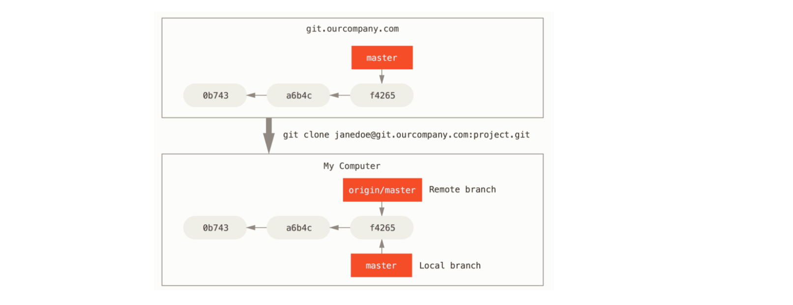
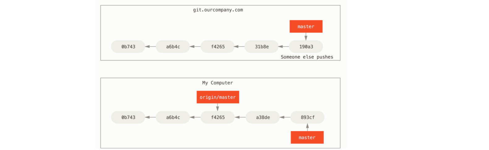
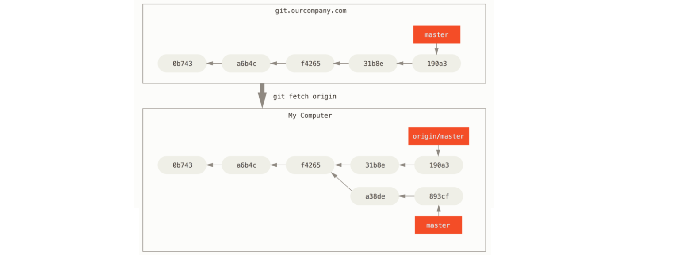

Remote references are references (pointers) in your *remote* repositories, including branches, tags, and so on.

Remote-tracking branches are references to the state of remote branches. They’re local references that you can’t move; Git moves them for you whenever you do any network communication, to make sure they accurately represent the state of the remote repository. Think of them as bookmarks, to remind you where the branches in your remote repositories were the last time you connected to them.

Remote-tracking branches take the form `<remote>/<branch>`. For instance, if you wanted to see what the master branch on your origin remote looked like as of the last time you communicated with it, you would check the origin/master branch.

Let’s say you have a Git server on your network at git.ourcompany.com. If you clone from this, Git’s clone command automatically names it origin for you, pulls down all its data, creates a pointer to where its master branch is, and names it origin/master locally. Git also gives you your own local master branch starting at the same place as origin’s master branch, so you have something to work from.

If you do some work on your local master branch, and, in the meantime, someone else pushes to git.ourcompany.com and updates its master branch, then your histories move forward differently. Also, as long as you stay out of contact with your origin server, your origin/master pointer doesn’t move.

To synchronize your work, you run a `git fetch origin` command. This command looks up which server “origin” is (in this case, it’s git.ourcompany.com), fetches any data from it that you don’t yet have, and updates your local database, moving your origin/master pointer to its new, more up-to-date position.

**Pushing**

Your local branches aren’t automatically synchronized to the remotes you write to — you have to explicitly push the branches you want to share. That way, you can use private branches for work you don’t want to share, and push up only the topic branches you want to collaborate on.

If you have a branch named serverfix that you want to work on with others, you can push it up the same way you pushed your first branch. Run `git push <remote> <branch>`:

    $ git push origin serverfix

The next time one of your collaborators fetches from the server, they will get a reference to where the server’s version of serverfix is under the remote branch origin/serverfix:

    $ git fetch origin
    remote: Counting objects: 7, done.
    remote: Compressing objects: 100% (2/2), done.
    remote: Total 3 (delta 0), reused 3 (delta 0)
    Unpacking objects: 100% (3/3), done.
    From https://github.com/schacon/simplegit
     * [new branch]      serverfix    -> origin/serverfix

It’s important to note that when you do a fetch that brings down new remote-tracking branches, you don’t automatically have local, editable copies of them. In other words, in this case, you don’t have a new `serverfix` branch — you only have an `origin/serverfix` pointer that you can’t modify.

To merge this work into your current working branch, you can run `git merge origin/serverfix`. If you want your own `serverfix` branch that you can work on, you can base it off your remote-tracking branch:

    $ git checkout -b serverfix origin/serverfix
    Branch serverfix set up to track remote branch serverfix from origin.
    Switched to a new branch 'serverfix'

This gives you a local branch that you can work on that starts where `origin/serverfix` is.

**Tracking Branches**

Checking out a local branch from a remote-tracking branch automatically creates what is called a “tracking branch” (and the branch it tracks is called an “upstream branch”). Tracking branches are local branches that have a direct relationship to a remote branch. If you’re on a tracking branch and type git pull, Git automatically knows which server to fetch from and which branch to merge in.

When you clone a repository, it generally automatically creates a master branch that tracks `origin/master`. However, you can set up other tracking branches if you wish — ones that track branches on other remotes, or don’t track the master branch. The simple case is the example you just saw, running `git checkout -b <branch> <remote>/<branch>`. This is a common enough operation that Git provides the `--track` shorthand:

    $ git checkout --track origin/serverfix
    Branch serverfix set up to track remote branch serverfix from origin.
    Switched to a new branch 'serverfix'

In fact, this is so common that there’s even a shortcut for that shortcut. If the branch name you’re trying to checkout (a) doesn’t exist and (b) exactly matches a name on only one remote, Git will create a tracking branch for you:

    $ git checkout serverfix
    Branch serverfix set up to track remote branch serverfix from origin.
    Switched to a new branch 'serverfix'

To set up a local branch with a different name than the remote branch, you can easily use the first version with a different local branch name:

    $ git checkout -b sf origin/serverfix
    Branch sf set up to track remote branch serverfix from origin.
    Switched to a new branch 'sf'

Now, your local branch sf will automatically pull from `origin/serverfix`.

If you already have a local branch and want to set it to a remote branch you just pulled down, or want to change the upstream branch you’re tracking, you can use the `-u` or `--set-upstream-to` option to git branch to explicitly set it at any time.

    $ git branch -u origin/serverfix
    Branch serverfix set up to track remote branch serverfix from origin.

