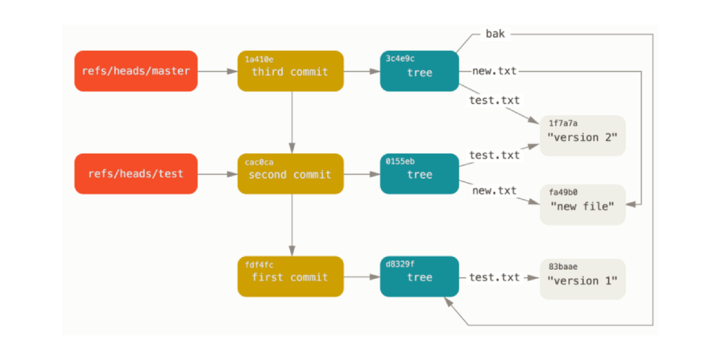
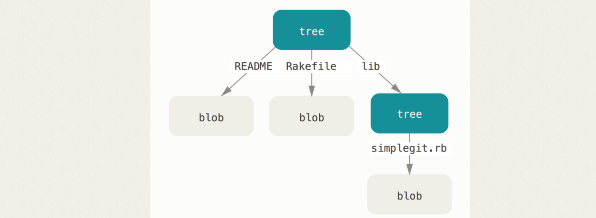

Plumbing and Porcelain
----------------------
When you run git init in a new or existing directory, Git creates the .git directory, which is where almost everything that Git stores and manipulates is located.

Here’s what a newly-initialized .git directory typically looks like:

    $ ls -F1
    config
    HEAD
    hooks/
    info/
    objects/
    refs/

The config file contains your project-specific configuration options, and the info directory keeps a global exclude file for ignored patterns that you don’t want to track in a .gitignore file. The hooks directory contains your client- or server-side hook scripts, which are discussed in detail in Git Hooks.

This leaves four important entries: the HEAD and (yet to be created) index files, and the objects and refs directories. These are the core parts of Git. The objects directory stores all the content for your database, the refs directory stores pointers into commit objects in that data (branches, tags, remotes and more), the HEAD file points to the branch you currently have checked out, and the index file is where Git stores your staging area information

After `git init` followed by a few commits, your Git database conceptually looks something like this:

Essentially what Git does when you run the git add and git commit commands — it stores blobs for the files that have changed, updates the index, writes out trees, and writes commit objects that reference the top-level trees and the commits that came immediately before them. There are three main Git objects — the blob, the tree, and the commit — these  are initially stored as separate files in your .git/objects directory.

Git Objects
------------

**Git objects**

Git is a content-addressable filesystem. Great. What does that mean? It means that at the core of Git is a simple key-value data store. What this means is that you can insert any kind of content into a Git repository, for which Git will hand you back a unique key you can use later to retrieve that content.

As a demonstration, let’s look at the plumbing command `git hash-object`, which takes some data, stores it in your .git/objects directory (the object database), and gives you back the unique key that now refers to that data object.

    $ echo 'some text' | git hash-object --stdin
    7f4255cd0100a992cab76f5b8d8906fe35ba7266

The -w option could be used to tell the command to not simply return the key, but to write that object to the database. Finally, the --stdin option tells git hash-object to get the content to be processed from stdin; otherwise, the command would expect a filename argument at the end of the command containing the content to be used.

The output from the above command is a 40-character checksum hash. This is the SHA-1 hash — a checksum of the content you’re storing plus a header

If you again examine your objects directory, you can see that it now contains a file for that new content, which is how git stores the data initially.
Once you have content in your object database, you can examine that content with the git cat-file command. This command is sort of a Swiss army knife for inspecting Git objects. Passing -p to cat-file instructs the command to first figure out the type of content, then display it appropriately:

    $ git cat-file -p d670460b4b4aece5915caf5c68d12f560a9fe3e4
    test content

But remembering the SHA-1 key for each version of your file isn’t practical; plus, you aren’t storing the filename in your system — just the content. This object type is called a blob. You can have Git tell you the object type of any object in Git, given its SHA-1 key, with `git cat-file -t`

**Tree objects**

The tree object solves the problem of storing the filename and also allows you to store a group of files together.

    $ git cat-file -p master^{tree}
    100644 blob a906cb2a4a904a152e80877d4088654daad0c859      README
    100644 blob 8f94139338f9404f26296befa88755fc2598c289      Rakefile
    040000 tree 99f1a6d12cb4b6f19c8655fca46c3ecf317074e0      lib

The `master^{tree}` syntax specifies the tree object that is pointed to by the last commit on your master branch. Notice that the lib subdirectory isn’t a blob but a pointer to another tree:

    $ git cat-file -p 99f1a6d12cb4b6f19c8655fca46c3ecf317074e0
    100644 blob 47c6340d6459e05787f644c2447d2595f5d3a54b      simplegit.rb

Simple version of the Git data model:

**Commit objects**

The format for a commit object is simple: it specifies the top-level tree for the snapshot of the project at that point; the author/committer information (which uses your user.name and user.email configuration settings and a timestamp); a blank line, and then the commit message.

Low-level way of creating commit objects, referencing the commit that came directly before it:

    $ echo 'second commit' | git commit-tree 0155eb -p fdf4fc3
    cac0cab538b970a37ea1e769cbbde608743bc96d
    $ echo 'third commit'  | git commit-tree 3c4e9c -p cac0cab
    1a410efbd13591db07496601ebc7a059dd55cfe9

Each of the three commit objects points to one of the three snapshot trees you created.

Refs
----

Many git commands operate on a commit in some form or another, and many of them accept a commit reference as a parameter.
For example, you can use `git checkout` to view an old commit by passing in a commit hash, or you can use it to switch branches by passing in a branch name.

**Hashes**

The most direct way to reference a commit is via its SHA-1 hash. This acts as the unique ID for each commit. You can find the hash of all your commits in the `git log` output.

    commit 0c708fdec272bc4446c6cabea4f0022c2b616eba
    Author: Mary Johnson <mary@example.com>
    Date: Wed Jul 9 16:37:42 2014 -0500
    Some commit message

When passing the commit to other Git commands, you only need to specify enough characters to uniquely identify the commit. For example:

    git show 0c708f

**Refs**

Instead of having to remember the hash, SHA-1 values are stored in files under a simple name so you could use that simple name rather than the raw SHA-1 value.

In Git, these simple names are called “references” or “refs”; you can find the files that contain those SHA-1 values in the .git/refs directory. In the current project, this directory contains no files, but it does contain a simple structure:

    $ find .git/refs
    .git/refs
    .git/refs/heads
    .git/refs/tags

A ref is an indirect way of referring to a commit. You can think of it as a user-friendly alias for a commit hash. This is Git’s internal mechanism of representing branches and tags.
Refs are stored as normal text files in the .git/refs directory.

In `.git/refs`. You should see the following::

    .git/refs/
    heads/
    remotes/
    tags/

The heads directory defines all of the local branches in your repository. Each filename matches the name of the corresponding branch, and inside the file you’ll find a commit hash. This commit hash is the location of the tip of the branch.
The remotes directory lists all remote repositories that you created with git remote as separate subdirectories. Inside each one, you’ll find all the remote branches that have been fetched into your repository.
If you add a remote and push to the remote reference, Git stores the value you last pushed to that remote for each branch in the refs/remotes directory. For instance, you can add a remote called origin and push your master branch to it:

    $ git remote add origin git@github.com:schacon/simplegit-progit.git
    $ git push origin master
    Counting objects: 11, done.
    Compressing objects: 100% (5/5), done.
    Writing objects: 100% (7/7), 716 bytes, done.
    Total 7 (delta 2), reused 4 (delta 1)
    To git@github.com:schacon/simplegit-progit.git
      a11bef0..ca82a6d  master -> master

Then, you can see what the master branch on the origin remote was the last time you communicated with the server, by checking the refs/remotes/origin/master file:

    $ cat .git/refs/remotes/origin/master
    ca82a6dff817ec66f44342007202690a93763949

Git has three main object types (blobs, trees and commits), but there is a fourth. The tag object is very much like a commit object — it contains a tagger, a date, a message, and a pointer. The main difference is that a tag object generally points to a commit rather than a tree. It’s like a branch reference, but it never moves — it always points to the same commit but gives it a friendlier name.

As discussed in Git Basics, there are two types of tags: annotated and lightweight. You can make a lightweight tag by running something like this:

    $ git update-ref refs/tags/v1.0 cac0cab538b970a37ea1e769cbbde608743bc96d

That is all a lightweight tag is — a reference that never moves. An annotated tag is more complex

**Relative refs**

You can also refer to commits relative to another commit. The `~` character lets you reach parent commits. For example, the following displays the grandparent of `HEAD`:

    git show HEAD~2

When working with merge commits, things get more complicated. Since merge commits have more than one parent, there is more than one path that you can follow. For 3-way merges, the first parent is from the branch that you were on when you performed the merge, and the second parent is from the branch that you passed to the `git merge` command.

The `~` character will always follow the first parent of a merge commit. If you want to follow a different parent, you need to specify which one with the `^` character.

Relative refs can be used with the same commands that a normal ref can be used. For example, all of the following commands use a relative reference:

    # Only list commits that are parent of the second parent of a merge commit
    git log HEAD^2
    # Remove the last 3 commits from the current branch
    git reset HEAD~3
    # Interactively rebase the last 3 commits on the current branch
    git rebase -i HEAD~3

The HEAD
----------
`HEAD` is a special ref in the top-level git directory and it points to checked-out commit/branch.
The special refs are all created and updated by Git when necessary. For example, The `git pul`l command first runs `git fetch`, which updates the `FETCH_HEAD` reference. Then, it runs `git merge FETCH_HEAD` to finish pulling the fetched branches into the repository.

If you were to switch to another branch, the contents of `HEAD` would be updated to reflect the new branch. But, if you were to check out a commit instead of a branch, `HEAD` would contain a commit hash instead of a symbolic ref. This is how Git knows that it’s in a `detached HEAD` state.