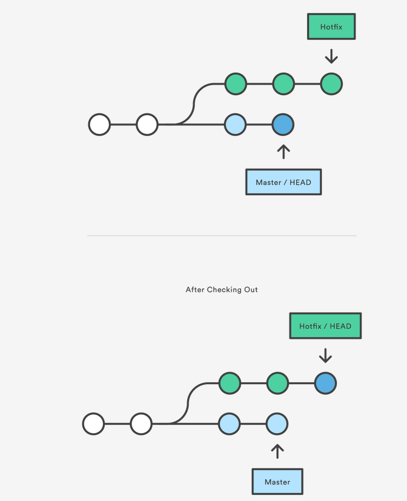
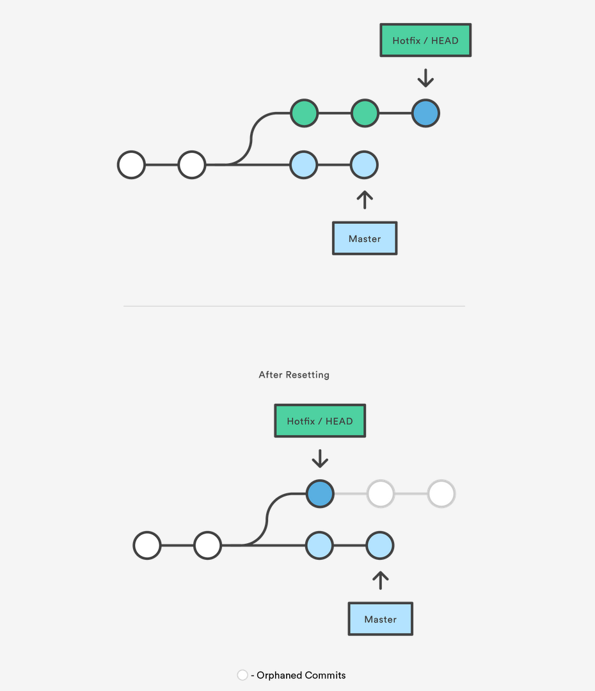
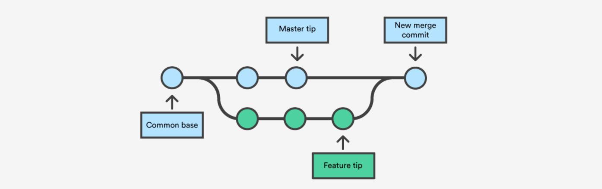

Git Basics
-------------
 
**Ignoring Files**
 
Often, you’ll have a class of files that you don’t want Git to add. Here is an example `.gitignore` file which will ignore .txt files:

    $ cat .gitignore
    *.txt

Glob patterns (e.g. wildcards such as `*`, `?`, `[ab]`, `[a-z]`) can be used. For more examples: https://github.com/github/gitignore.
 
**Skipping the staging area**
 
Adding the `-a` option to the `git commit` command makes Git automatically stage every file that is already tracked before doing the commit, letting you skip the `git add` part:]
 
    $ git commit -a -m 'added new benchmarks'
 
**Working with Remotes**

the `git remote` command lists the shortnames of each remote handle you’ve specified. If you’ve cloned your repository, you should at least see `origin` which is the default name of the server you cloned from:

    $ git clone https://github.com/schacon/ticgit
    Cloning into 'ticgit'...
    …
    $ cd ticgit
    $ git remote
    origin
 
You can also specify `-v`, which shows you the URLs stored for the shortname used when reading and writing to that remote:

    $ git remote -v
    origin  https://github.com/schacon/ticgit (fetch)
    origin  https://github.com/schacon/ticgit (push)
 
**Branches in a Nutshell**

When you make a commit, Git stores a commit object that contains a pointer to the snapshot of the content you staged. This object also contains metadata and pointers to the commit or commits that directly came before this commit

Assume that you have a directory containing three files, and you stage them all and commit.
Your Git repository now contains five objects: one blob for the contents of each of your three files, one tree that lists the contents of the directory and specifies which file names are stored as which blobs, and one commit with the pointer to that root tree and all the commit metadata:

If you make some changes and commit again, the next commit stores a pointer to the commit that came immediately before it:

A branch in Git is simply a lightweight movable pointer to one of these commits. The default branch name in Git is master. As you start making commits, you’re given a master branch that points to the last commit you made. Every time you commit, it moves forward automatically.

If you create a new branch it creates a new pointer for you to move around. Let’s say you create a new branch called testing with the `git branch` command:

    $ git branch testing

This creates a new pointer to the same commit you’re currently on.

How does Git know what branch you’re currently on? It keeps a special pointer called `HEAD`.
Switch to the new branch:

    $ git checkout testing

This moves `HEAD` to point to the testing branch:

You can easily see this by running a simple `git log` command that shows you where the branch pointers are pointing. This option is called `--decorate`.

    $ git log --oneline --decorate

Let’s do another commit:

    $ vim test.rb
    $ git commit -a -m 'made a change'

The `HEAD` branch moves forward when a commit is made

This is interesting, because now your testing branch has moved forward, but your master branch still points to the commit you were on when switched branches

Switching back to the master branches moves the HEAD pointer back to point to the master branch, and it reverted the files in your working directory back to the snapshot that master points to. This also means the changes you make from this point forward will diverge from an older version of the project. It essentially rewinds the work you’ve done in your testing branch so you can go in a different direction.

On the master branch, let’s make a few changes and commit again:

    $ vim test.rb
    $ git commit -a -m 'made other changes'

Now your project has diverged. Both of those changes are isolated in separate branches: you can switch back and forth between the branches and merge them together when you’re ready

`git reset`, `git checkout`
---------------------------

A checkout is an operation that moves the `HEAD` ref pointer to a specified commit.
Internally, all the above command does is move `HEAD` to a different branch and update the working directory to match. Since this has the potential to overwrite local changes, Git forces you to commit or stash any changes in the working directory that will be lost during the checkout operation. Unlike `git reset`, `git checkout` doesn’t move any branches around.

`git checkout` can also be provided with a commit instead of a branch. To demonstrate this consider the following example:

a12 <-- b34 <-- c56 <-- d78 (HEAD, Master)

This example demonstrates a sequence of commits on the master branch. The `HEAD` ref and master branch ref currently point to commit with example hash d78.

Normally you would provide a branch name to `git checkout`. However, you can also provide the SHA1 hash of a specific commit instead:

`git checkout b34` will move the `HEAD` ref pointer to this commit.

could also achieve this by:

    git checkout HEAD~2

This exact state - when a specific commit is checked out instead of a branch - is what's called a "detached HEAD".
Any changes do not belong to the branch. This may be useful for simply inspecting old commits but can be dangerous if you add commits.

 Reset A Specific Commit

On the commit-level, resetting is a way to move the tip of a branch to a different commit. This can be used to remove commits from the current branch. For example, the following command moves the hotfix branch backwards by two commits.

    git checkout hotfix
    git reset HEAD~2

The two commits that were on the end of hotfix are now dangling, or orphaned commits. This means they will be deleted the next time Git performs a garbage collection. In other words, you’re saying that you want to throw away these commits.

**Undo a commit and redo**

    $ git commit -m "Something terribly misguided"              (1)
    $ git reset HEAD~                                           (2)
    << edit files as necessary >>                               (3)
    $ git add ...                                               (4)
    $ git commit -c ORIG_HEAD                                   (5)

1 This is what you want to undo

2 This leaves your working tree (the state of your files on disk) unchanged but undoes the commit and leaves the changes you committed unstaged (so they'll appear as "Changes not staged for commit" in git status, and you'll need to add them again before committing). If you only want to add more changes to the previous commit, or change the commit message1, you could use git reset --soft HEAD~ instead, which is like git reset HEAD~ (where HEAD~ is the same as HEAD~1) but leaves your existing changes staged.

3 Make corrections to working tree files.

4 git add anything that you want to include in your new commit.

5 Commit the changes, reusing the old commit message. reset copied the old head to .git/ORIG_HEAD; commit with -c ORIG_HEAD will open an editor, which initially contains the log message from the old commit and allows you to edit it. If you do not need to edit the message, you could use the -C option.

**The above in other words**

`git checkout`, when used on branches, alters the target of the `HEAD` ref. It can be used to create branches, switch branches, and checkout remote branches. The `git checkout` command is a counterpart to `git merge`.
In modern versions of Git, you can then checkout the remote branch like a local branch.

    git checkout <remotebranch>
 
Additionally you can checkout a new local branch and reset it to the remote branches last commit.

    git checkout -b <branchname>
    git reset --hard origin/<branchname>
 
Remember that the `HEAD` is Git’s way of referring to the current snapshot. Internally, the git checkout command simply updates the HEAD to point to either the specified branch or commit. When it points to a branch, Git doesn't complain, but when you check out a commit, it switches into a “detached HEAD” state.
This is a warning telling you that everything you’re doing is “detached” from the rest of your project’s development. If you were to start developing a feature while in a detached HEAD state, there would be no branch allowing you to get back to it.
The point is, your development should always take place on a branch, never on a detached HEAD. This makes sure you always have a reference to your new commits. However, if you’re just looking at an old commit, it doesn’t really matter if you’re in a detached HEAD state or not.

Branching and Merging
---------------------

The git merge command lets you take the independent lines of development created by git branch and integrate them into a single branch.
Note that all of the commands presented below merge into the current branch. The current branch will be updated to reflect the merge, but the target branch will be completely unaffected. Again, this means that git merge is often used in conjunction with `git checkout` for selecting the current branch and `git branch -d` for deleting the obsolete target branch.

`git merge` will combine multiple sequences of commits into one unified history. `git merge` is usually used to combine two branches, where it takes two commit pointers and will find a common base commit between them and create a new "merge commit" that combines the changes of each queued merge commit sequence.

Merge commits are unique against other commits in the fact that they have two parent commits. When creating a merge commit Git will attempt to auto magically merge the separate histories for you. If Git encounters a piece of data that is changed in both histories it will be unable to automatically combine them. This scenario is a version control conflict and Git will need user intervention to continue.

Suppose you are doing some work on a feature development branch and do some commits. Doing so moves the `iss53` branch forward, because you have it checked out (that is, your `HEAD is pointing to it):

Then  receive a call that another issue is critical and you need a hotfix. You’ll do the following:

1) Switch to your production branch.

2) Create a branch to add the hotfix.

3) After it’s tested, merge the hotfix branch, and push to production.

4) Switch back to your original story and continue working.

    $ git checkout master
    Switched to branch 'master'

At this point, your project working directory is exactly the way it was before you started working on issue #53, and you can concentrate on your hotfix. This is an important point to remember: when you switch branches, Git resets your working directory to look like it did the last time you committed on that branch.
Next, you have a hotfix to make:

    $ git checkout -b hotfix
    Switched to a new branch 'hotfix'
    $ vim index.html
    $ git commit -a -m 'fixed the broken email address'
    [hotfix 1fb7853] fixed the broken email address
     1 file changed, 2 insertions(+)

You can run your tests, make sure the hotfix is what you want, and finally merge the hotfix branch back into your master branch to deploy to production. You do this with the `git merge` command:

    $ git checkout master
    $ git merge hotfix
    Updating f42c576..3a0874c
    Fast-forward
     index.html | 2 ++
     1 file changed, 2 insertions(+)

You’ll notice the phrase “fast-forward” in that merge. Because the commit C4 pointed to by the branch hotfix you merged in was directly ahead of the commit C2 you’re on

You can now delete the hotfix branch and switch back to your work-in-progress branch on issue #53 and continue working on it.

    $ git branch -d hotfix
    Deleted branch hotfix (3a0874c).
    $ git checkout iss53
    Switched to branch "iss53"
    $ vim index.html
    $ git commit -a -m 'finished the new footer [issue 53]'
    [iss53 ad82d7a] finished the new footer [issue 53]
    1 file changed, 1 insertion(+)

It’s worth noting here that the work you did in your hotfix branch is not contained in the files in your iss53 branch. If you need to pull it in, you can merge your master branch into your iss53 branch by running git merge master, or you can wait to integrate those changes

Suppose you’ve decided that your issue #53 work is complete and ready to be merged into your master branch.

    $ git checkout master
    Switched to branch 'master'
    $ git merge iss53
    Merge made by the 'recursive' strategy.
    index.html |    1 +
    1 file changed, 1 insertion(+)

This is a bit different than the hotfix merge you did earlier. In this case, your development history has diverged from some older point. Because the commit on the branch you’re on isn’t a direct ancestor of the branch you’re merging in, Git has to do some work. In this case, Git does a simple three-way merge, using the two snapshots pointed to by the branch tips and the common ancestor of the two:

Instead of just moving the branch pointer forward, Git creates a new snapshot that results from this three-way merge and automatically creates a new commit that points to it. This is referred to as a merge commit, and is special in that it has more than one parent.

**Basic Merge Conflicts**

Occasionally, this process doesn’t go smoothly. If you changed the same part of the same file differently in the two branches you’re merging together, Git won’t be able to merge them cleanly. If your fix for issue #53 modified the same part of a file as the hotfix branch, you’ll get a merge conflict that looks something like this:

    $ git merge iss53
    Auto-merging index.html
    CONFLICT (content): Merge conflict in index.html
    Automatic merge failed; fix conflicts and then commit the result.

Git hasn’t automatically created a new merge commit. It has paused the process while you resolve the conflict. If you want to see which files are unmerged at any point after a merge conflict, you can run git status:

    $ git status
    On branch master
    You have unmerged paths.
      (fix conflicts and run "git commit")

    Unmerged paths:
      (use "git add <file>..." to mark resolution)

        both modified:      index.html

    no changes added to commit (use "git add" and/or "git commit -a")

If you want to use a graphical tool to resolve these issues, you can run `git mergetool`, which fires up an appropriate visual merge tool and walks you through the conflicts.