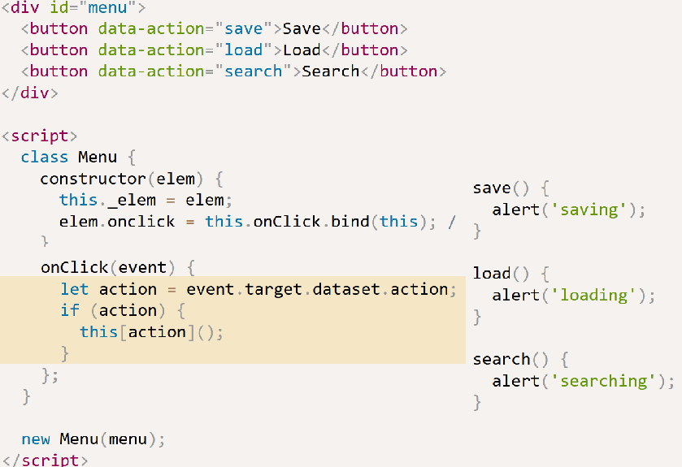
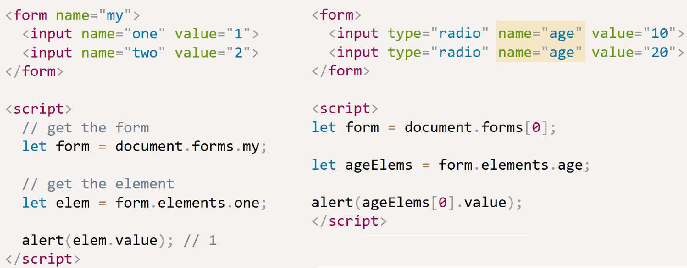
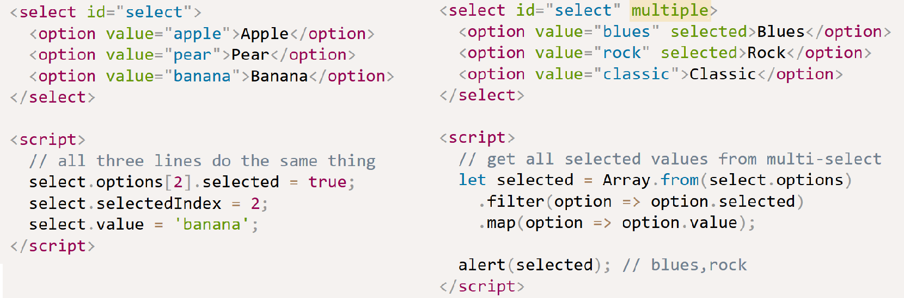

The DOM is a programming interface for HTML and XML documents is an essential part of making websites interactive.
It is an interface that allows a programming language to manipulate the content, structure, and style of a website.

In addition to parsing the style and structure of the HTML and CSS, the browser creates a representation of the document (the DOM).
The DOM represents the document as nodes and objects. That way, programming languages can connect to the page.
The DOM model represents a document with a logical tree. Each branch of the tree ends in a node,
and each node contains objects. DOM methods allow programmatic access to the tree;
with them you can change the document's structure, style or content.
Nodes can have event handlers attached to them. Once an event is triggered, the event handlers get executed.

To view exactly what the DOM is, in your web browser, right click on the current web page select Inspect. This will open up Developer Tools. The HTML code you see here is the DOM.

Each HTML element is considered a node in the DOM - an object that JavaScript can touch. These objects are arranged in a tree structure, with <html> being closer to the root, and each nested element being a branch further along the tree. JavaScript can add, remove, and change any of these elements.

If you right click on the site again and click View Page Source, you will see the raw HTML output of the website. It's easy at first to confuse the DOM with the HTML source, but they're different - the page source is exactly what is written in the HTML file. It is static and will not change, and will not be affected by JavaScript. The DOM is dynamic, and can change.

The outermost layer of the DOM, the layer that wraps the entire <html> node, is the document object. To begin manipulating the page with jQuery, we need to ensure the document is "ready" first, or JavaScript runs as page loaded.

Let's demonstrate how the DOM can be modified by client-side JavaScript. Type the following into the console:

    > document.body;

    <body>
      <h1>Document Object Model</h1>
    </body>

document is an object, body is a property of that object that we have accessed with dot notation.
In the console, we can change some of the live properties of the body object on this website. We'll edit the style attribute, changing the background color to fuchsia:

    > document.body.style.backgroundColor = 'fuchsia';

Switching to the Elements tab, or typing document.body into the console again, you will see that the DOM has changed:

    <body style="background-color: fuchsia;">
      <h1>Document Object Model</h1>
    </body>

Note: In order to change the background-color CSS property, we had to type backgroundColor in the JavaScript.
Any hyphenated CSS property will be written in camelCase in JavaScript.

However, right click on the page and select "View Page Source". You will notice that the source of the website does not contain the new style attribute we added via JavaScript. The source of a website will not change and will never be affected by client-side JavaScript.
If you refresh the page, the new code we added in the console will disappear.

Data Attributes
---------------

HTML5 is designed with extensibility in mind for data that should be associated with a particular element but need not have any defined meaning. data-* attributes allow us to store extra information on standard, semantic HTML elements

    <article
      id="electriccars"
      data-columns="3"
      data-index-number="12314"
      data-parent="cars">
    ...
    </article>

**Access in JavaScript**

To get a data attribute through the dataset object, get the property by the part of the attribute name after data- (note that dashes are converted to camelCase):

    var article = document.getElementById('electriccars');

    article.dataset.columns // "3"
    article.dataset.indexNumber // "12314"
    article.dataset.parent // "cars"

Browser Events
--------------

Useful DOM events include:

`mouseover` / `mouseout` – when the mouse cursor comes over / leaves an element

`mousedown` / `mouseup` – when the mouse button is pressed / released over an element

`submit` and `focus` – when the visitor submits form or focuses on an element, e.g. `<input>`

`keydown`/`keyup` – when the visitor presses and then releases the button.

**Event handlers**

To react on events we can assign a handler – a function that runs in case of an event.

    <input type="button" id="elem" value="Click me">

    function handler() {
      alert( 'Thanks!' );
    }

    input.addEventListener("click", handler);
    // ....
    input.removeEventListener("click", handler);

**Event objects**

When an event happens, the browser creates an event object, puts details into it and passes it as an argument to the handl

Properties of event object include `type` e.g. `"click"` and `currentTarget` which is usually accessed by `this`

**Event bubbling and `event.target`**

The most deeply nested element that caused the event is called a target element, accessible as `event.target`

Note the differences from `this` (same as `event.currentTarget`):

`event.target` – is the “target” element that initiated the event, it doesn’t change through the bubbling process.

`this` is the “current” element, the one that has a currently running handler on it.

E.g. for a single handler `form.onclick`, that “catches” all clicks inside the form,
`this` (=`event.currentTarget`) is the `<form>` element, because the handler runs on it.
`event.target` is the concrete element inside the form that actually was clicked.

Stop bubbling (from target element towards `document` and `window`) with `event.stopPropagation` (generally not recommended to do):

    <body onclick="alert(`the bubbling doesn't reach here`)">
      <button onclick="event.stopPropagation()">Click me</button>
    </body>

**Event delegation**

The idea is that if we have a lot of elements handled in a similar way, then instead of assigning a handler to each of them – we put a single handler on their common ancestor.
In the handler we get `event.target`, see where the event actually happened and handle it.

Suppose we had a table of many cells and wanted to highlight a cell `<td>` on click

    table.onclick = function(event) {
      let target = event.target; // where was the click?
      if (target.tagName != 'TD') return; // not TD then not interested
      highlight(target); // assume is defined
    };

We can also use a single handler as an entry point for many different actions:

In the following, we add a handler for the whole menu and data-action attributes for buttons that has the method to call:

**Browser default actions**

E.g. A click on a link, a click on submit button inside a form, selecting text with a mouse.

    <a href="/" onclick="return false">Click here</a>
    <a href="/" onclick="event.preventDefault()">here</a>

Often we use `<a>` in the markup but intend to handle clicks in JavaScript. So we should prevent the default browser action.

    <ul id="menu" class="menu">
      <li><a href="/html">HTML</a></li>
      <li><a href="/javascript">JavaScript</a></li>
    </ul>
    

Preventing further events, e.g. `mousedown` on an `<input>` field leads to focusing in it, an  `focus` event. If we prevent the `mousedown` event, there’s no focus. Below,
the second `input` cannot be focused on by clicking with the mouse:

    <input value="Focus works" onfocus="this.value=''">
    <input onmousedown="return false" onfocus="this.value=''" value="Click me">

By default the browser `contextmenu` event (right mouse click) shows a context menu with standard options. We can prevent it and show our own:

    <button oncontextmenu="alert('Draw our menu'); return false">Hello</button>

Say we want to implement our own document-wide context menu. And inside the document we may have other elements with their own context menus.
So event handlers on both levels may be triggered on a certain event.

One solution , rather than stopping event bubbling using `event.stopPropagation()`, is to check in the `document` handler if the default action was prevented and if it was then don't take action:

    
Right-click for the document menu (fixed with event.defaultPrevented)

    <button id="elem">Right-click for the button menu</button>

    

**Custom events**

Below the click event is initiated in JS:

    <button id="elem" onclick="alert('Click!');">Autoclick</button>

    

**Keyboard and scroll events**

The `keydown` events happens when a key is pressed down, and then `keyup` when released.
`event.key` and `event.code` allows us to get the character, e.g. the `event.code` from pressing the 'z' key is `KeyZ`

Default actions include text input appearing on the screen and page scrolling with the down key etc. These can be prevented.
For instance, the `<input>` below does not accept keys except digits, +, () or -:

    
    <input onkeydown="return checkPhoneKey(event.key)" placeholder="Phone, please" type="tel">

…But we still can enter anything by using a mouse and right-click + Paste. So the filter cannot be relied upon.

Scroll events allow to react on a page or element scrolling and e.g. control what is displayed depending where the user is on the page.
The `scroll` event works both on the `window` and on scrollable elements.

We can’t prevent scrolling by using `event.preventDefault()` in `onscroll` listener, because it triggers after the scroll has already happened.

But we can prevent scrolling by `event.preventDefault()` on an event that causes the scroll, e.g.`wheel` event
or `keydown` event for `pageUp` and `pageDown` keys.

**Page lifecycle events**

Scripts with `async` and `defer`: these work only for external script and are ignored if there’s no `src`.
Both of them tell the browser that it may go on working with the page, and load the script “in background”, then run the script when it loads. So the script doesn’t block DOM building and page rendering.

`async` is used for independent scripts, like counters or ads, that don’t need to access page content.
`defer` is used for scripts that need DOM and/or their relative execution order is important.

The example below correctly shows image sizes, because `window.onload` waits for all images:

    
    

**Form properties and methods**

Forms and control elements, such as `<input>`, have a lot of special properties and events which make it more convenient to work with them.

A `<select>` element has 3 important properties so we have three ways to set the value of it:

**Focusing: focus/blur**

Validation of an input field:

    

    Your email please: <input type="email" id="input">

    

    

By default `<button>`, `<input>`, `<select>`, `<a>` elements have focus/blur support, whereas `
`, `<table>` etc do not.

Any element supports focusing if it has `tabindex`. There are two special values: `tabindex="0"` makes the element the last one.
`tabindex="-1"` means that Tab should ignore that element.

    <ul>
      <li tabindex="1">One</li>
      <li tabindex="0">Zero</li>
      <li tabindex="2">Two</li>
      <li tabindex="-1">Minus one</li>
    </ul>

    

**Change and input events**

The `change` event triggers when the element has finished changing.
For text inputs that means that the event occurs when it loses focus.
E.g. below there is no `change` event when typing, only when we move the focus somewhere else.

    <input type="text" onchange="alert(this.value)">
    <input type="button" value="Button">

By contrast, the input event triggers every time a value is modified.

    <input type="text" id="input"> oninput: 
    

**Form submission: event and method submit**

The `submit` event triggers when the form is submitted and the `form.submit()` method allows initiate form sending from JS.

Note that pressing 'enter' on an input field as well as clicking on `<input type="submit">` leads to form being submitted.

To submit a form to the server manually, we can call `form.submit()`, in which case the 'submit' event is not generated.

