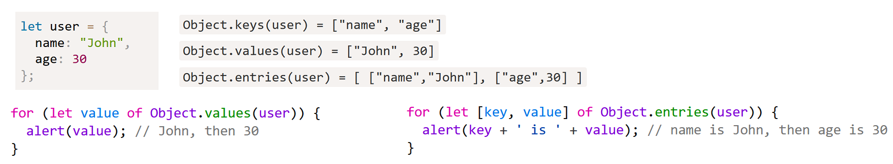

`String`, `Number`, `Boolean`, `Object`, `Function`, `Array`, `Date`, `RegExp`, `Error`

Their names seem to imply they are directly related to their simple primitives counter-parts, but in fact, their relationship is more complicated

Object
------

    // Object initialiser or literal
    { [ nameValuePair1[, nameValuePair2[, ...nameValuePairN] ] ] }

    // Called as a constructor
    new Object([value])

When called in a non-constructor context, `Object` behaves identically to `new Object()`.

The `Object` constructor creates an object wrapper.

`Object.prototype.constructor`
    Specifies the function that creates an object's prototype.

`Object.prototype.__proto__`
    Points to the object which was used as prototype when the object was instantiated.

`Object.prototype.valueOf()`

    greenCar.valueOf('color')  // Car {color: "green"}

The class keyword was introduced in 2015, they are same as those created with function constructors with prototype methods:

**Extending function constructors**

`Object.create()` lets you extend a constructor. Whereas in classical inheritance where you extend another class and effectively copy across its methods, here you just set a reference from a subclass to the base class, so it is just a prototype reference.

**Custom objects continued**

Consider the following:

    function Person(first, last) {
      this.first = first;
      this.last = last;
      this.fullName = function() {
        return this.first + ' ' + this.last;
      };
      this.fullNameReversed = function() {
        return this.last + ', ' + this.first;
      };
    }
    var s = new Person('Simon', 'Willison');

`new` is strongly related to `this`. It creates a brand new empty object, and then calls the function specified, with `this` set to that new object. Notice though that the function specified with `this` does not return a value but merely modifies the `this` object. It's new that returns the `this` object to the calling site. Functions that are designed to be called by `new` are called constructor functions. Common practice is to capitalize these functions as a reminder to call them with `new`.

Every time we create a person object we are creating two brand new function objects within it — wouldn't it be better if this code was shared? We can do better:

    function Person(first, last) {
      this.first = first;
      this.last = last;
    }
    Person.prototype.fullName = function() {
      return this.first + ' ' + this.last;
    };
    Person.prototype.fullNameReversed = function() {
      return this.last + ', ' + this.first;
    };

`Person.prototype` is an object shared by all instances of `Person`. It forms part of a lookup chain (that has a special name, "prototype chain"): any time you attempt to access a property of `Person` that isn't set, JavaScript will check `Person.prototype` to see if that property exists there instead.

**Object.keys, values, entries**

Functions
---------

See functions.md

Numbers
-------
"double-precision 64-bit format IEEE 754 values", there's no such thing as an integer in JS; In practice, integer values are treated as 32-bit ints.

The `parseInt()` and `parseFloat()` functions parse a string until they reach a character that isn't valid for the specified number format, then return the number parsed up to that point.

You can convert a string to an integer using the built-in parseInt() function. This takes the base for the conversion as an optional second argument, which you should always provide:

    parseInt('123', 10); // 123
    parseInt('010', 10); // 10
    parseInt('0x10'); // 16  treated as hexadecimal due to the leading "0x"
    parseInt('11', 2); // 3  convert a binary number to an integer

Similarly there is `parseFloat()` which, unlike `parseInt()`, always uses base 10.

Any mathematic operation you perform without both operands being numbers (or values that can be interpreted as regular numbers in base 10 or base 16) will result in the operation failing to produce a valid number, in which case you will get the NaN value.

`NaN` is a special type of ` number `. The label/description is very poor and misleading, it is more accurate to think of `NaN` as being "invalid number," "failed number," or even "bad number," than to think of it as "not a number."

    var a = 2 / "foo";		// NaN
    
    typeof a === "number";	// true

`NaN` is a very special value in that it's never equal to another `NaN` value (i.e., it's never equal to itself). It's the only value, in fact, that is not reflexive (without the Identity characteristic `x === x`). So, `NaN !== NaN`

So to test for it, use `Number.isNaN(..)`

String
------

    'foobar'.includes('foo')  \\ true
    ' foo'.concat('bar').trim()  \\ "foobar"
    ' foobar '.trimRight() \\ " foobar"

Various string methods, similar to in Python. Regex methods include `match()` and `search()`:

    var str = 'ABCDEFGHIJKLMNOPQRSTUVWXYZabcdefghijklmnopqrstuvwxyz';
    var regexp = /[A-E]/gi;
    console.log(str.match(regexp));
    // ['A', 'B', 'C', 'D', 'E', 'a', 'b', 'c', 'd', 'e']

If the regular expression includes the `g` flag, the method returns an `Array` containing all matched substrings rather than match objects.

    var my_str2 = 'my string was 25chars now its 40chars'
    my_str2.match(/[0-9]{2}[a-z]{4}/)
    // ["25char", index: 14, input: "my string was 25chars now its 40chars", groups: undefined]

    my_str2.match(/[0-9]{2}[a-z]{4}/g)
    // (2) ["25char", "40char"]

    my_str2.search(/[0-9]{2}[a-z]{4}/g)
    // 14

**String conversion**

It's possible to use String as a more reliable toString() alternative, as it works when used on null, undefined, and on symbols. For example:

    var outputStrings = [];
    for (var i = 0, n = inputValues.length; i < n; ++i) {
      outputStrings.push(String(inputValues[i]));
    }

Array
-----
    var myarr = [1, 2, 3, 'foo', 'bar']
    myarr.toString()  // "1,2,3,foo,bar"
    myarr.join('  ')  // "1  2  3  foo  bar"
    let p = myarr.pop()
    myarr.push(p)
    console.log(myarr)  // [1, 2, 3, "foo", "bar"]
    myarr.slice(1,3)  // [2, 3]
    myarr.splice(1, 3, 4, 8)
    console.log(myarr)  // [1, 4, 8, "bar"]

    var arr = ['apple','orange','pear'];
    console.log(arr.indexOf("orange"));  // 2

    arr.forEach(function(item,index){
	  // Do something
    });

    for (const a of arr) {
        // Do something with a
    }

    var arr = [
    {"name":"apple", "count": 2},
    {"name":"orange", "count": 5},
    {"name":"pear", "count": 3},
    {"name":"orange", "count": 16},
    ];
    var newArr = arr.filter(function(item){
        return item.name === "orange";
    });
    newArr[0]  // {name: "orange", count: 5}

This is a shortcut for:

    var newArr = [];
    for (const j of arr){
    if (j.name == 'orange'){
        newArr.push(j)
    }}

Another example:

    function avg(...args) {
      var sum = 0;
      for (let value of args) {
        sum += value;
      }
      return sum / args.length;
    }

    avg(2, 3, 4, 5); // 3.5

Sort method, note that numbers may be treated as strings, to sort numerically pass a callback function:

    const str_array = ['d', 'a', 't', 5, 'l']
    str_array.sort()  // [5, "a", "d", "l", "t"]

    const numbers = [15, 12, 8, 22]
    numbers.sort()  // [12, 15, 22, 8]

    numbers.sort((a, b) => a - b)  // [8, 12, 15, 22]

    const obj_array = [{ id : 1, name : "Fred", address : "12 Smith St"},
                      { id : 2, name : "Dan", address : "42 Some St"}]

    obj_array.sort(function(a,b){if (a.name < b.name)
                                     return -1;
                                 else if (a.name == b.name)
                                     return 0;
                                 else return 1; });

**`splice`**

How do I remove a particular element?
Find the index of the array element you want to remove, then remove that index with `splice`.

    The `splice()` method changes the contents of an array by removing existing elements and/or adding new elements.

    var array = [2, 5, 9];
    var index = array.indexOf(5);
    if (index > -1) {
      array.splice(index, 1);
    }
    console.log(array);  // array = [2, 9]

The second parameter of `splice` is the number of elements to remove. Note that splice modifies the array in place and returns a new array containing the elements that have been removed.

**`map()`**

The `map()` method creates a new array with the results of calling a provided function on every element in this array.

    var p = [1,2,3,4]
    p.map(n => n *2)
    // Array [ 2, 4, 6, 8 ]

    var oldArr = [{first_name:"Colin",last_name:"Toh"},{first_name:"Addy",last_name:"Osmani"},{first_name:"Yehuda",last_name:"Katz"}];
    function getNewArr(){
        return oldArr.map(function(item,index){
            item.full_name = [item.first_name,item.last_name].join(" ");
            return item;
        });
    }

**`findIndex()`**

    const myArray = ['abcd', '123', 'third', {name: 'foo', value: 'bar'}]
    myArray.findIndex(x => x.name === 'foo')  // 3
    myArray.findIndex(x => x.length === 3)  // 1

**Array.from**

The array constructor has a number of methods including `Array.isArray` and `Array.from`.

    [...'hey']  // [ "h", "e", "y" ]
    Array.from('hey')  // [ "h", "e", "y" ]

    [...new Set([2,2,3])]  // [ 2, 3 ]
    Array.from(new Set([2,2,3]))  // [ 2, 3 ]

Creating a custom array with and without using`Array.from`:

    Array.from({length: 4}, (val, ind) => 'item_' + ind)  // [ "item_0", "item_1", "item_2", "item_3" ]
    new Array(5).fill(0).map((val,ind) => 'item_' + ind)

In the following snippet, `arguments` would not otherwise have all the useful array methods:

    const func = function(){
        console.log(Array.from(arguments).join(''))
    }
    func('h', 'e', 'y')  // hey

**Arrays do not have negative indexes**

You cannot have a negative index, in the following assignment, it assigns a key-value pair and the length remains three,:

    cont ary = [1, 2, 3]
    ary[-1] = 5
    console.log(ary)  // [ 1, 2, 3 ]

This is because they are still just a special type of object.

Sets and Weaksets
-----------------
    const ary = [1,2,2,3]
    new Set(ary)  // Set(3) {1, 2, 3}
    [...new Set(ary)] // Array(3) [1, 2, 3]
    new Set(ary).add(4).add(5) // {1, 2, 3, 4, 5}

Whereas with Sets you can add primitive values, here you can only add objects or arrays. They have fewer prototype methods.

    const ws = new WeakSet([{a:1}, {b:2}])
    ws.add({c:3})

Maps and Weakmaps
-----------------
Unlike regular objects where if you want iterate through all values you have to use 'for in' loop.
Here can you 'for of' loop as for arrays, because Map has iteratory property.

    const map = new Map();

    map.set(a, 'a').set(b, 'b')
    map.delete(b)
    map.set(c, 'c')

    for (let [key, value] of map.entries()) {
      console.log(key, value);
    }

    const ary = [...map];
    console.dir(ary);  // converts to an array

Weakmaps are used where to want to enable garbage-collection of key no longer used.

Miscellaneous
-------------

