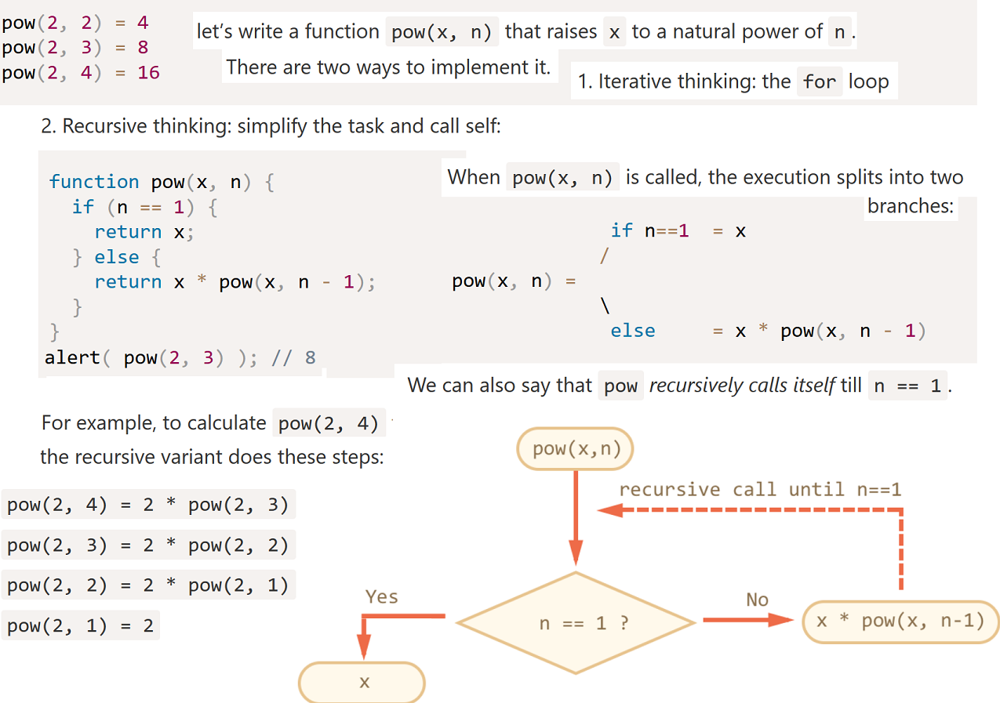
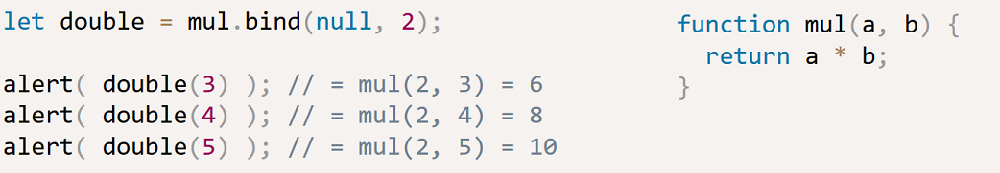
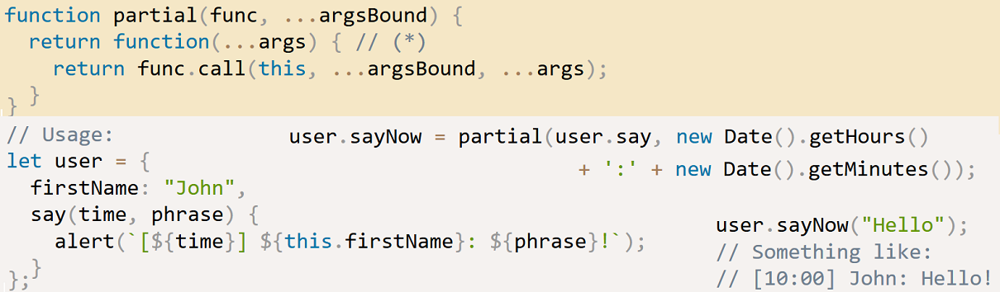
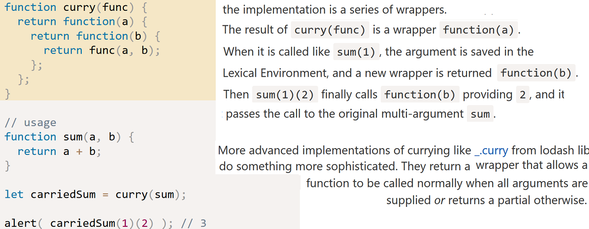
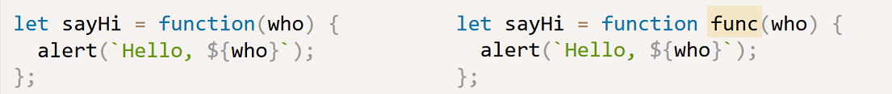
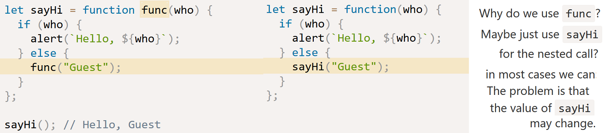

**What is a Function Declaration?**

A Function Declaration defines a named function variable without requiring variable assignment. Function Declarations occur as standalone constructs and cannot be nested within non-function blocks. It’s helpful to think of them as siblings of Variable Declarations. Just as Variable Declarations must start with “var”, Function Declarations must begin with “function”.

    function bar() {
        return 3;
    }

**What is a Function Expression?**

A Function Expression defines a function as a part of a larger expression syntax (typically a variable assignment ). Functions defined via Functions Expressions can be named or anonymous

    //anonymous function expression
    var a = function() {
        return 3;
    }

    //named function expression
    var a = function bar() {
        return 3;
    }

    //self invoking function expression
    (function sayHello() {
        alert("hello!");
    })();

Typically functions created by Function Expressions are unnamed. However, debugging with anonymous functions can be frustrating.

Function Binding
----------------
*See also* this_binding.md

It’s easy to lose `this`. Once a method is passed somewhere separately from the object – `this` is lost. E.g.:

    let user = {
      firstName: "John",
      sayHi() {
        alert(`Hello, ${this.firstName}!`);
      }
    };
    setTimeout(user.sayHi, 1000); // Hello, undefined!

When we pass an object method, how to make sure that it will be called in the right context??

Solution 1: a wrapper

This works because the wrapping function receives `user` from the outer lexical environment, and then calls the method normally.

    setTimeout(() => user.sayHi(), 1000); // Hello, John!

Solution 2: bind

Functions provide a built-in method bind that allows to fix `this`.

    let sayHi = user.sayHi.bind(user); // (*)

    setTimeout(sayHi, 1000); // Hello, John!

The function assigned to `sayHi` is a “bound” function, that can be called alone or passed to `setTimeout` – doesn’t matter, the context will be right.

**`call`, `apply`, `bind`**

*See also* this_binding.md

Function objects inherit from `Function.prototype`. This object has the following methods:

`Function.prototype.apply()`
    Calls a function and sets its `this` to the provided value, arguments can be passed as an Array object.

`Function.prototype.call()`
    Calls (executes) a function and sets its `this` to the provided value, arguments can be passed as they are.

Difference between the above: `apply` lets you invoke the function with arguments as an array; `call` requires the parameters be listed explicitly.

`Function.prototype.bind()`
    Creates a new function which, when called, has its this set to the provided value, with a given sequence of arguments preceding any provided when the new function was called.

Inner functions and Closures
------------------------------

An important detail of nested functions in JavaScript is that they can access variables in their parent function's scope:

    function parentFunc() {
      var a = 1;

      function nestedFunc() {
        var b = 4; // parentFunc can't use this
        return a + b;
      }
      return nestedFunc(); // 5
    }

If a called function relies on one or two other functions that are not useful to any other part of your code, you can nest those utility functions inside it. This keeps the number of functions that are in the global scope down, which is always a good thing.
When writing complex code it is often tempting to use global variables to share values between multiple functions — which leads to code that is hard to maintain. Nested functions can share variables in their parent, so you can use that mechanism to couple functions together when it makes sense without polluting your global namespace — "local globals" if you like.

    function makeAdder(a) {
      return function(b) {
        return a + b;
      };
    }
    var x = makeAdder(5);
    var y = makeAdder(20);
    x(6); // returns 11
    y(7); // returns 27

Here's what's actually happening. Whenever JavaScript executes a function, a 'scope' object is created to hold the local variables created within that function. It is initialized with any variables passed in as function parameters.

So when `makeAdder()` is called, a scope object is created with one property: `a`, which is the argument passed to `makeAdder()` which returns a newly created function. Normally JavaScript's garbage collector would clean up the scope object created for `makeAdder()` at this point, but the returned function maintains a reference back to that scope object. As a result, the scope object will not be garbage-collected until there are no more references to the function object that `makeAdder()` returned.

Scope objects form a chain called the scope chain, similar to the prototype chain used by JavaScript's object system.

A closure is the combination of a function and the scope object in which it was created. Closures let you save state — as such, they can often be used in place of objects.

    function foo(x) {
      var tmp = 3;
      function bar(y) {
        console.log(x + y + (++tmp)); // will log 16
      }
      bar(10);
    }
    foo(2);  // 16

Whenever you see the function keyword within another function, the inner function has access to variables in the outer function.

That is a closure. A function doesn't have to return in order to be called a closure. Simply accessing variables outside of your immediate lexical scope creates a closure.  JS function creates a closure.

    function sayHello2(name) {
        var text = 'Hello ' + name; // Local variable
        var say = function() { console.log(text); }
        return say;
    }
    var say2 = sayHello2('Bob');
    say2(); // logs "Hello Bob"

When a function (foo) declares other functions (bar and baz), the family of local variables created in foo is not destroyed when the function exits. The variables merely become invisible to the outside world. Foo can therefore cunningly return the functions bar and baz, and they can continue to read, write and communicate with each other through this closed-off family of variables ("the closure") that nobody else can meddle with, not even someone who calls foo again in future.

A closure is one way of supporting first-class functions; it is an expression that can reference variables within its scope (when it was first declared), be assigned to a variable, be passed as an argument to a function, or be returned as a function result.

Recursion
---------

HTML and XML documents are well-known example of recursive structures.
Trees like HTML elements tree are naturally recursive: they branch and every branch can have other branches.
Recursive functions can be used to walk them.

Another recursive structure is the “Linked list”, which is a better alternative for arrays in some cases.
Imagine, we want to store an ordered list of objects. The natural choice would be an array: `let arr = [obj1, obj2, obj3];`

…But there’s a problem with arrays. The “delete element” and “insert element” operations are expensive. For instance, `arr.unshift(obj)` operation has to renumber all elements to make room for a new `obj`, and if the array is big, it takes time. Same with `arr.shift()`.
The only structural modifications that do not require mass-renumbering are those that operate with the end of array: `arr.push/pop`.
If we really need fast insertion/deletion, we can implement a linked-list data structure.

Currying and partials
--------------------

First, examine this function with two parameters …

    const add = (x, y) => x + y
    add(2, 3) //=> 5

Here it is again in curried form …

    const add = x => y => x + y

Here is the same1 code without arrow functions …

    const add = function (x) {
      return function (y) {
        return x + y
      }
    }

So our `add` function returns a *function*:

    add(2) // returns (y => 2 + y)

In order to use our curried function, we have to call it a bit differently:

    add(2)(3)  // returns 5

The first (outer) function call returns a second (inner) function. Only after we call the second function do we actually get the result.
More than two arrow functions can be sequenced:

    const three = a => b => c => a + b + c
    three (1) (2) (3) // 6

**Partials**

We can bind not only `this`, but also arguments.
Below, the call to `mul.bind(null, 2)` creates a new function double that passes calls to `mul`, fixing `null` as the context and `2` as the first argument.

This is called a partial function application – we create a new function by fixing some parameters of the existing one.
This pattern is occasionally useful, e.g., we have a function `send(from, to, text)`. Then, inside a `user` object we may want to use a partial variant of it: `sendTo(to, text)` that sends from the current user.

**Going partial without context**

To fix some arguments, but not bind `this`, a `partial` function can be implemented:

**Currying**

Allows both to keep the function callable normally and to get partials easily
(a partial is returned if arguments count is not enough).

Currying is translating a function from callable as f(a, b, c) into callable as f(a)(b)(c).

Let’s make curry function that performs currying for binary functions. In other words, it translates `f(a, b)` into `f(a)(b)`:

Named function expresssions
---------------------------
In JavaScript, functions are objects.
A good way to imagine functions is as callable “action objects”. We can not only call them, but also treat them as objects: add/remove properties, pass by reference etc.

**The “name” property**

    function sayHi() {
      alert("Hi");
    }
    alert(sayHi.name); // sayHi

This works the same for object methods. It also assigns the correct name to functions that are used in assignments:

    let sayHi = function() {
      alert("Hi");
    }
    alert(sayHi.name); // sayHi

**The “length” property** returns the number of function parameters.

**Custom properties**

Here we add the counter property to track the total calls count:

    function sayHi() {
      alert("Hi");

      // let's count how many times we run
      sayHi.counter++;
    }
    sayHi.counter = 0; // initial value

    sayHi(); // Hi
    sayHi(); // Hi

    alert( `Called ${sayHi.counter} times` ); // Called 2 times

Adding a name to an ordinary function expression:

There are two special things about the name `func`:

- It allows the function to reference itself internally.
- It is not visible outside of the function.

The optional name which we can put into the Function Expression is meant to solve exactly these kinds of problems.

Above, `func` is function-local, how the function can call itself internally.
It is not taken from outside (and not visible there). The specification guarantees that it will always reference the current function.

