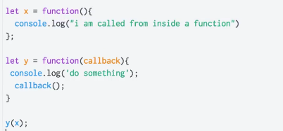
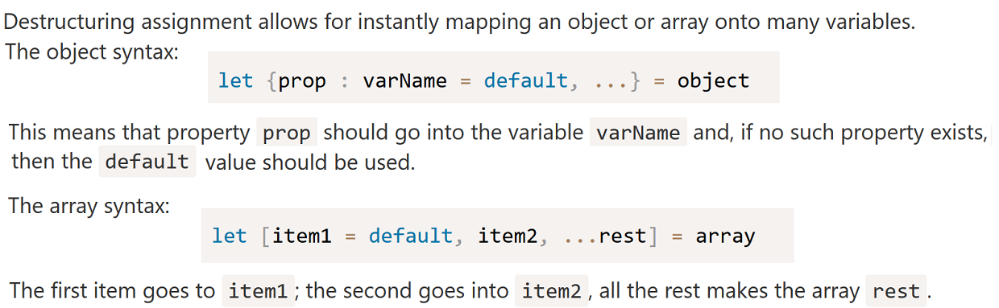

**Callbacks**

**Increment operator**

When used as a standalone statement, these mean the same thing:

    x++;
    ++x;

The difference comes when you use the value of the expression elsewhere (post- and pre-increment):

    x = 0;
    y = array[x++]; // This will get array[0]

    x = 0;
    y = array[++x]; // This will get array[1]

**Spread operator**

When `...` is used in front of an array (actually, any iterable, which we cover in Chapter 3), it acts to "spread" it out into its individual values.

	function foo(x,y,z) {
		console.log( x, y, z );
	}

	foo.apply( null, [1,2,3] );		// 1 2 3

In the following usage, `...` acts to give us a simpler syntactic replacement for the `apply(..)` method:

	foo( ...[1,2,3] );				// 1 2 3

But `...` can be used to spread out/expand a value in other contexts as well, such as inside another array declaration:

	var a = [2,3,4];
	var b = [ 1, ...a, 5 ];
	console.log( b );		// [1,2,3,4,5]

In this usage, ... is basically replacing concat(..), as it behaves like [1].concat( a, [5] ) here.

**Array and object destructuring**

The other common usage of ... can be seen as essentially the opposite; instead of spreading a value out, the ... gathers a set of values together into an array. Consider:

	function foo(x, y, ...z) {
		console.log( x, y, z );
	}

	foo( 1, 2, 3, 4, 5 );			// 1 2 [3,4,5]

	function foo(...args) {
		console.log( args );
	}

	foo( 1, 2, 3, 4, 5);			// [1,2,3,4,5]

In object destructuring, what if the object has more properties than we have variables? We take some and then assign the “rest” somewhere:

Overview:

Arrays:

    [foo, bar] = [1,2]
    console.log(foo)  // 1

    const [, , ,fourth, , , , , ,tenth] = states;
    console.log(fourth, tenth); // Akwa Ibom, Delta

Objects:

    const me = {name: 'Charles Odili', company: 'Andela'};

    const { name } = me;
    console.log(name); // Charles Odili

    const { name: chalu } = me;
    console.log(chalu); // Charles Odili

Nested destructuring:

For more complex cases, the left side must have the same structure as the right one.
In the code below `options` has another object in the property `size` and an array in the property `items`.

Note that `size` and `items` are not destructured.

Often we have a complex object with many properties that we want to extract

    // take size as a whole into a variable, ignore the rest
    let { size } = options;

**Default Parameters**

The boolean operators in JavaScript can be used where you need to get the first truthy or falsy value among a set of values, making it it easier to assign a default value. For default parameters

	function foo(x = 11, y = 31) {
		console.log( x + y );
	}

	foo();					// 42
	foo( 5, 6 );			// 11
	foo( 0, 42 );			// 42

	foo( 5 );				// 36
	foo( 5, undefined );	// 36 <-- `undefined` is missing
	foo( 5, null );			// 5  <-- null coerces to `0`

	foo( undefined, 6 );	// 17 <-- `undefined` is missing
	foo( null, 6 );			// 6  <-- null coerces to `0`

**What is a Function Declaration?**

A Function Declaration defines a named function variable without requiring variable assignment. Function Declarations occur as standalone constructs and cannot be nested within non-function blocks. It’s helpful to think of them as siblings of Variable Declarations. Just as Variable Declarations must start with “var”, Function Declarations must begin with “function”.

    function bar() {
        return 3;
    }

**What is a Function Expression?**

A Function Expression defines a function as a part of a larger expression syntax (typically a variable assignment ). Functions defined via Functions Expressions can be named or anonymous

    //anonymous function expression
    var a = function() {
        return 3;
    }

    //named function expression
    var a = function bar() {
        return 3;
    }

    //self invoking function expression
    (function sayHello() {
        alert("hello!");
    })();

Typically functions created by Function Expressions are unnamed. However, debugging with anonymous functions can be frustrating.

**try...catch and throw operator**

    let json = "{ bad json }";

    try {
      let user = JSON.parse(json);
    } catch (e) {
      alert( e.name );
      alert( e.message );
    }

Catch should only process errors that it knows and “rethrow” all others.

Catch gets all errors. In `catch(err) {...}` block we analyze the error object `err`.
If we don’t know how to handle it, then we do throw `err`.

In the code below, we use rethrowing so that catch only handles `SyntaxError`:

    let json = '{ "age": 30 }';
    try {
      let user = JSON.parse(json);
      if (!user.name) {
        throw new SyntaxError("Incomplete data: no name"); // (*)
      }
      alert( user.name );
    } catch(e) {
      alert( "JSON Error: " + e.message );
    }

**Extending `Error`**

We often need our own error classes to reflect specific cases, by creating e.g. `HttpError` or `ValidationError` which inherits from `Error`

    class ValidationError extends Error {
      constructor(message) {
        super(message); // (1)
        this.name = "ValidationError"; // (2)
      }
    }
    try {
      throw new ValidationError("Whoops!");
    } catch(err) {
      alert(err.message + err.name);
    }

The above class is very generic, below is a more concrete class:

    class PropertyRequiredError extends ValidationError {
      constructor(property) {
        super("No property: " + property);
        this.name = "PropertyRequiredError";
        this.property = property;
      }
    }

    // Usage
    function readUser(json) {
      let user = JSON.parse(json);
      if (!user.age) {
        throw new PropertyRequiredError("age");
      }
      if (!user.name) {
        throw new PropertyRequiredError("name");
      }
      return user;
    }

    try {
      let user = readUser('{ "age": 25 }');
    } catch (err) {
      if (err instanceof ValidationError) {
        alert("Invalid data: " + err.message); // Invalid data: No property: name
      } else {
        throw err; // unknown error, rethrow it
      }
    }

**Curried functions**

First, examine this function with two parameters …

    const add = (x, y) => x + y
    add(2, 3) //=> 5

Here it is again in curried form …

    const add = x => y => x + y

Here is the same1 code without arrow functions …

    const add = function (x) {
      return function (y) {
        return x + y
      }
    }

So our `add` function returns a *function*:

    add(2) // returns (y => 2 + y)

In order to use our curried function, we have to call it a bit differently:

    add(2)(3)  // returns 5

The first (outer) function call returns a second (inner) function. Only after we call the second function do we actually get the result.
More than two arrow functions can be sequenced:

    const three = a => b => c => a + b + c
    three (1) (2) (3) // 6

**Recursion**

HTML and XML documents are well-known example of recursive structures.
Trees like HTML elements tree are naturally recursive: they branch and every branch can have other branches.
Recursive functions can be used to walk them.

Another recursive structure is the “Linked list”, which is a better alternative for arrays in some cases.
Imagine, we want to store an ordered list of objects. The natural choice would be an array: `let arr = [obj1, obj2, obj3];`

…But there’s a problem with arrays. The “delete element” and “insert element” operations are expensive. For instance, `arr.unshift(obj)` operation has to renumber all elements to make room for a new `obj`, and if the array is big, it takes time. Same with `arr.shift()`.
The only structural modifications that do not require mass-renumbering are those that operate with the end of array: `arr.push/pop`.
If we really need fast insertion/deletion, we can implement a linked-list data structure.

