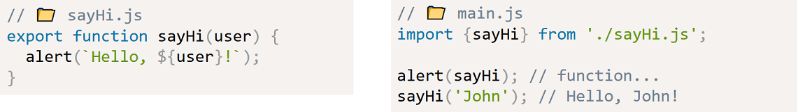
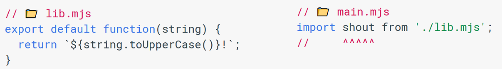
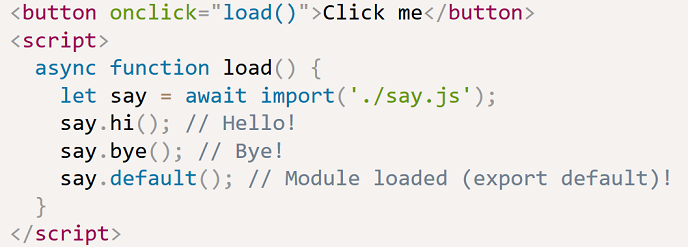

**Callbacks**

**Increment operator**

When used as a standalone statement, these mean the same thing:

    x++;
    ++x;

The difference comes when you use the value of the expression elsewhere (post- and pre-increment):

    x = 0;
    y = array[x++]; // This will get array[0]

    x = 0;
    y = array[++x]; // This will get array[1]

Spread operator
---------------

When `...` is used in front of an array (actually, any iterable, which we cover in Chapter 3), it acts to "spread" it out into its individual values.

	function foo(x,y,z) {
		console.log( x, y, z );
	}

	foo.apply( null, [1,2,3] );		// 1 2 3

In the following usage, `...` acts to give us a simpler syntactic replacement for the `apply(..)` method:

	foo( ...[1,2,3] );				// 1 2 3

But `...` can be used to spread out/expand a value in other contexts as well, such as inside another array declaration:

	var a = [2,3,4];
	var b = [ 1, ...a, 5 ];
	console.log( b );		// [1,2,3,4,5]

In this usage, ... is basically replacing concat(..), as it behaves like [1].concat( a, [5] ) here.

Array and object destructuring
------------------------------

The other common usage of ... can be seen as essentially the opposite; instead of spreading a value out, the ... gathers a set of values together into an array. Consider:

	function foo(x, y, ...z) {
		console.log( x, y, z );
	}

	foo( 1, 2, 3, 4, 5 );			// 1 2 [3,4,5]

	function foo(...args) {
		console.log( args );
	}

	foo( 1, 2, 3, 4, 5);			// [1,2,3,4,5]

In object destructuring, what if the object has more properties than we have variables? We take some and then assign the “rest” somewhere:

Overview:

Arrays:

    [foo, bar] = [1,2]
    console.log(foo)  // 1

    const [, , ,fourth, , , , , ,tenth] = states;
    console.log(fourth, tenth); // Akwa Ibom, Delta

Objects:

    const me = {name: 'Charles Odili', company: 'Andela'};

    const { name } = me;
    console.log(name); // Charles Odili

    const { name: chalu } = me;
    console.log(chalu); // Charles Odili

Nested destructuring:

For more complex cases, the left side must have the same structure as the right one.
In the code below `options` has another object in the property `size` and an array in the property `items`.

Note that `size` and `items` are not destructured.

Often we have a complex object with many properties that we want to extract

    // take size as a whole into a variable, ignore the rest
    let { size } = options;

----------------------------------------------------------
**Default Parameters**

The boolean operators in JavaScript can be used where you need to get the first truthy or falsy value among a set of values, making it it easier to assign a default value. For default parameters

	function foo(x = 11, y = 31) {
		console.log( x + y );
	}

	foo();					// 42
	foo( 5, 6 );			// 11
	foo( 0, 42 );			// 42

	foo( 5 );				// 36
	foo( 5, undefined );	// 36 <-- `undefined` is missing
	foo( 5, null );			// 5  <-- null coerces to `0`

	foo( undefined, 6 );	// 17 <-- `undefined` is missing
	foo( null, 6 );			// 6  <-- null coerces to `0`

try...catch and throw operator
----------------------------

    let json = "{ bad json }";

    try {
      let user = JSON.parse(json);
    } catch (e) {
      alert( e.name );
      alert( e.message );
    }

Catch should only process errors that it knows and “rethrow” all others.

Catch gets all errors. In `catch(err) {...}` block we analyze the error object `err`.
If we don’t know how to handle it, then we do throw `err`.

In the code below, we use rethrowing so that catch only handles `SyntaxError`:

    let json = '{ "age": 30 }';
    try {
      let user = JSON.parse(json);
      if (!user.name) {
        throw new SyntaxError("Incomplete data: no name"); // (*)
      }
      alert( user.name );
    } catch(e) {
      alert( "JSON Error: " + e.message );
    }

**Extending `Error`**

We often need our own error classes to reflect specific cases, by creating e.g. `HttpError` or `ValidationError` which inherits from `Error`

    class ValidationError extends Error {
      constructor(message) {
        super(message); // (1)
        this.name = "ValidationError"; // (2)
      }
    }
    try {
      throw new ValidationError("Whoops!");
    } catch(err) {
      alert(err.message + err.name);
    }

The above class is very generic, below is a more concrete class:

    class PropertyRequiredError extends ValidationError {
      constructor(property) {
        super("No property: " + property);
        this.name = "PropertyRequiredError";
        this.property = property;
      }
    }

    // Usage
    function readUser(json) {
      let user = JSON.parse(json);
      if (!user.age) {
        throw new PropertyRequiredError("age");
      }
      if (!user.name) {
        throw new PropertyRequiredError("name");
      }
      return user;
    }

    try {
      let user = readUser('{ "age": 25 }');
    } catch (err) {
      if (err instanceof ValidationError) {
        alert("Invalid data: " + err.message); // Invalid data: No property: name
      } else {
        throw err; // unknown error, rethrow it
      }
    }

Modules
-------

Import an entire module's contents (containing all the exports from the module):

    import * as myModule from '/modules/my-module.js';

Import an export with a more convenient alias:

    import {reallyReallyLongName as shortName} from '/modules/my-module.js';

Import a module for its side effects only (runs the module's global code, but doesn't actually import any values):

    import '/modules/my-module.js';

Export a *default* value from a module which can be imported using any name:

The `import()` function can be called from anywhere. It returns a promise that resolved into a module object. E.g:

`String.prototype.normalize()`
------------------------------

*TL;DR* In short, if you’re building a web application and you’re accepting input from users, you should always normalize it to a canonical form in Unicode using this method

This method is useful for dealing with the problem of characters appearing identical, but having different representations.

**When "Zoë" !== "Zoë"**

In order to be able to represent text, we are mapping each characters to a specific number, and have conventions for how display them.
E.g. in the ASCII standard, the letter M is encoded as number 77 (4D in hex).
Unicode 12.0 includes over 137,000 characters and can be implemented in multiple character encoding standards (UTF-8 and UTF-16).

UTF-8 uses between 1 and 4 bytes to represent all characters. It’s a superset of ASCII, so the first 128 characters are
identical to those in the ASCII table. On the other hand, UTF-16 uses between 2 and 4 bytes.

Why both? Western languages typically are most efficiently encoded with UTF-8 (since most characters would be represented
with 1 byte only), while Asian languages can usually produce smaller files when using UTF-16 as encoding.

Each character in the Unicode standard is assigned an identificative number, or code point. For example, the dog emoji 🐶 has the code point U+1F436.
When encoded, the dog emoji can be represented in multiple byte sequences:
- UTF-8: 4 bytes, 0xF0 0x9F 0x90 0xB6
- UTF-16: 4 bytes, 0xD83D 0xDC36

In a JS source file, the following three statements print the same result, filling your console with lots of puppies:

    console.log('🐶')  // 🐶  uses just includes the byte sequence on the file
    console.log('\u{1F436}') // 🐶  uses the Unicode code point (ES2015 and newer)
    console.log('\uD83D\uDC36') 🐶  uses the UTF-16 representation, with the two code units (each of 2 bytes)

Most JS interpreters (including Node.js and modern browsers) use UTF-16 internally.

Accented characters can be represented in multiple ways. E.g. The letter é could be represented using either:
- A single code point U+00E9
- The combination of the letter e and the acute accent, for a total of two code points: U+0065 and U+0301

These will not compare as equal:

    console.log('\u00e9') // => é
    console.log('\u0065\u0301') // => é
    console.log('\u00e9' == '\u0065\u0301') // => false

This can cause unexpected bugs, such as records not found in a database, passwords mismatching letting users unable to authenticate, etc.

Thankfully, there’s an easy solution, which is normalizing the string into the “canonical form”:

    const str = '\u0065\u0301'
    console.log(str == '\u00e9') // => false
    const normalized = str.normalize('NFC')
    console.log(normalized == '\u00e9') // => true
    console.log(normalized.length) // => 1
