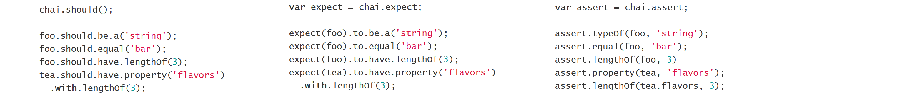
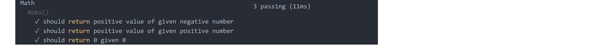

Mocha is a JS test runner that runs both on Node.js and in the browser.

Chai is a BDD / TDD assertion library for node and the browser that can be
paired with JS testing frameworks.

Chai
----

Has several interfaces:
the chain-capable BDD styles provide an expressive language & readable
style, while the TDD assert style provides a more classical feel.

Utilizing TDD, our test file may look something like this:

    const expect = require('chai').expect;
    const add = require('./add.js');

    describe('add', function() {
      it('should return the sum of two positive numbers', function() {
        expect(add(2, 4)).to.equal(6);
      });

      it('should return the sum of two negative numbers', function() {
        expect(add(-2, -4)).to.equal(-6);
      });

      it('should return the sum of an array of numbers', function() {
        expect(add([1,2,3,4,5])).to.equal(15);
      });
    });

Define a function which makes the tests pass:

    const add = function (num1, num2) {
      if (Array.isArray(num1)){
        let sum = 0;
        for ( let i of num1){sum += i;}
        return sum;
      }
      return num1 + num2;
    }

`expect` uses a more natural language API to write your assertions,
making it easier to translate requirements in to code

    var user = {name: 'Scott'};
    // Requirement: The object 'user' should have the property 'name'
    expect(user).to.have.property('name');

Various getters can be chained together and used with assertion
methods like `true`, `ok`, `exist`, and `empty` to create some complex assertions
in just one line. Full list of methods [here](http://chaijs.com/api/bdd/). For example:

    expect({}).to.exist;
    expect(26).to.equal(26);
    expect(false).to.be.false;
    expect('hello').to.be.string;

    // Modifiers ('not')
    expect([1, 2, 3]).to.not.be.empty;

    // Complex chains
    expect([1, 2, 3]).to.have.length.of.at.least(3);

Various plugin are available such as chai-http:

    var chai = require('chai');
    var chaiHttp = require('chai-http');

    chai.use(chaiHttp);

    chai.request(app)
        .put('/api/auth')
        .send({username: 'scott@stackabuse.com', passsword: 'abc123'})
        .end(function(err, res) {
            expect(err).to.be.null;
            expect(res).to.have.status(200);
        });

Mocha
-----

To identify exactly what failed and why, any uncaught exceptions are shown
alongside the test case in which it was thrown.

`describe()` is used to bring structure to your tests by grouping other
`describe()` calls and `it()` methods together, which is where the actual
tests are located:

    "use strict";

    var expect = require('chai').expect;

    describe('Math', function() {
        describe('#abs()', function() {
            it('should return positive value of given negative number', function() {
                expect(Math.abs(-5)).to.be.equal(5);
            });
        });
    });

It is recommended to keep all of your projects tests within a `/test`
directory. By default, Mocha checks for unit tests using the
glob `./test/*.js` and then loads and
executes any file that calls the `describe()` method.
The output is a breakdown of the tests that ran and their results.
The nested `describe()` calls carry over to the results output and
so it's useful to have all of the tests for a given method
nested together. The following tests are organized by function:

    describe('Math', function() {
        describe('#abs()', function() {
            it('should return positive value of given negative number', function() {
                expect(Math.abs(-5)).to.be.equal(5);
            });

            it('should return positive value of given positive number', function() {
                expect(Math.abs(3)).to.be.equal(3);
            });

            it('should return 0 given 0', function() {
                expect(Math.abs(0)).to.be.equal(0);
            });
        });
    });

Running the tests would give the following output:

Often you will need other resources to perform tests, e.g. a database.

