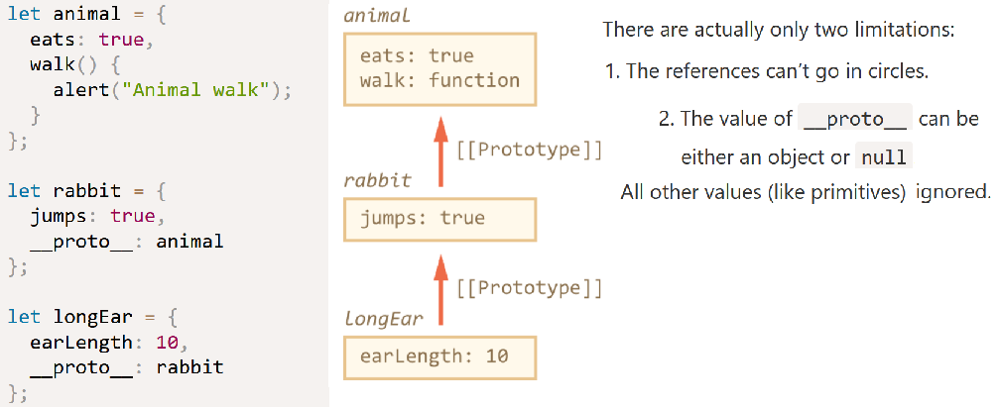
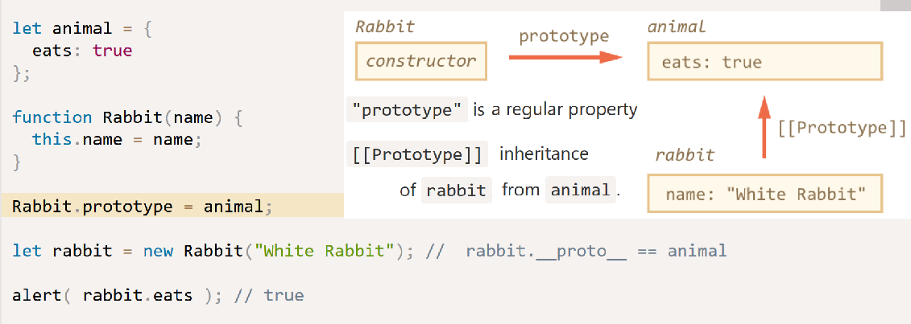
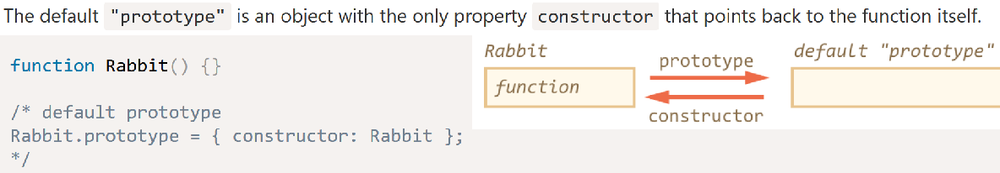
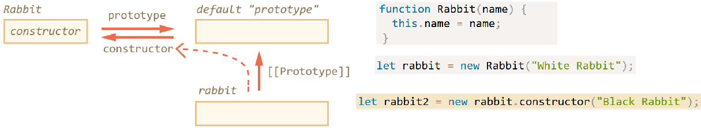
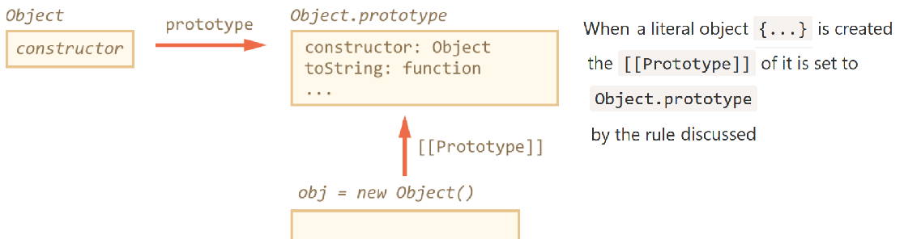
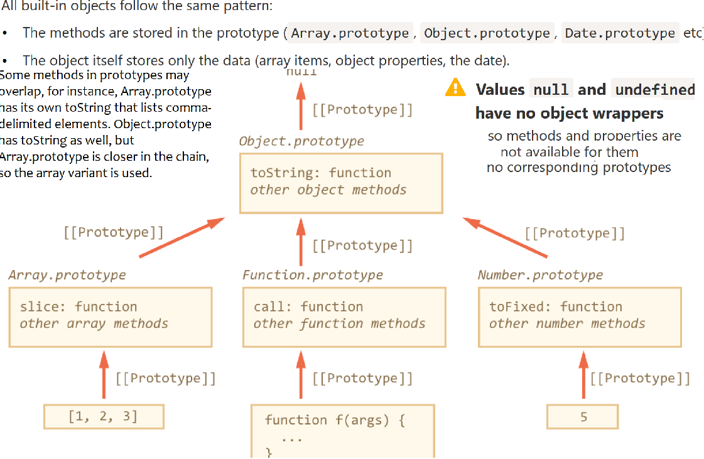
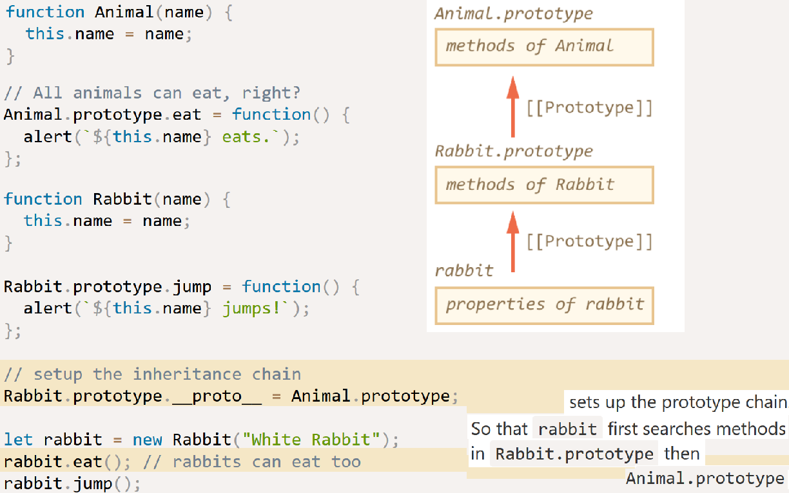
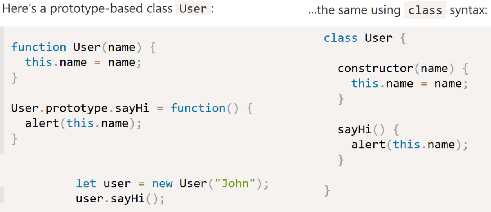
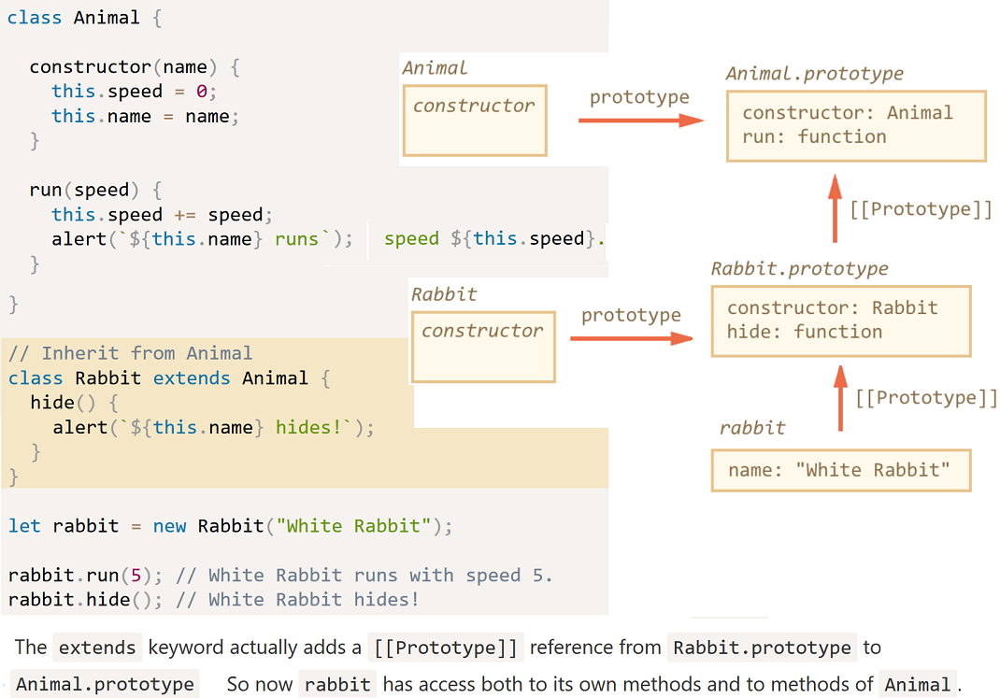

A special hidden property that objects have that is either `null` or references another object.

The property `[[Prototype]]` is internal and hidden, but there are many ways to set it.

One of them is to use `__proto__`, which is not the same as `[[Prototype]]`. but a getter/setter for it.

`[[Prototype]]` defines a "prototype chain" (somewhat similar to a nested scope chain) of objects to traverse for property resolution.

All normal objects have the built-in `Object.prototype` as the top of the prototype chain (like the global scope in scope look-up), where property resolution will stop if not found anywhere prior in the chain. This is why all objects can access `toString()`, `valueOf()`, etc.

While this resembles inheritance in OOP, the key distinction is that in JavaScript, no copies are made. Rather, objects end up linked to each other via an internal `[[Prototype]]` chain. So "delegation" is a more appropriate term than inheritance, because these relationships are not copies but delegation links.

**Reading and writing**

The prototype is only used for reading properties.

For data properties (not getters/setters) write/delete operations work directly with the object.

Getters and setters are looked up in the prototype and invoked. Notice in the following that in the setter method call,
the method uses `foo` as `this`, not `user`. In a method call, `this` is always the object before the dot.

    let user = {
        name: "John",
        surname: "Smith",

        set fullName(value) {
            [this.name, this.surname] = value.split(" ");
        },

        get fullName() {
            return `${this.name} ${this.surname}`;
        }
    };

    let foo = {
        __proto__: user,
    };
    let bar = {
        __proto__: user,
    }

    foo.fullName = "Paul Davis";
    console.log(foo.fullName); // "Paul Davis"
    console.log(bar.fullName); // "John Smith"

**The “prototype” property**

For a function named 'F', `new F()` creates a new object.

When a new object is created with `new F()`, the object’s `[[Prototype]]` is set to `F.prototype`.

So if `F` has a prototype property with a value of the object type, then new operator uses it to set `[[Prototype]`] for the new object.

*n.b.* `F.prototype` here means a regular property named "prototype" on `F`. It sounds something similar to the term “prototype”, but here we really mean a regular property with this name.

Every function has the "prototype" property even if we don’t supply it.

The constructor property is available to all rabbits through `[[Prototype]]`:

Note that if we replace the default prototype as a whole, then there will be no "constructor" in it:

    function Rabbit() {}
    Rabbit.prototype = {
      jumps: true
    };

    let rabbit = new Rabbit();
    alert(rabbit.constructor === Rabbit); // false

To keep the right constructor by not overwriting the default "prototype":

    Rabbit.prototype.jumps = true
    Rabbit.prototype = {
      jumps: true,
      constructor: Rabbit
    };

**Native prototypes**

All built-in constructor functions use the "prototype" property. Consider:

    let obj = {};
    alert( obj ); // "[object Object]"

`obj = {}` is the same as `obj = new Object()`, where `Object` – is a built-in object constructor function. And that function has `Object.prototype` that references a huge object with toString and other functions.

Afterwards when `obj.toString()` is called – the method is taken from `Object.prototype`.

Borrowing from prototypes:

    function showArgs(...args) {
      // borrow join from array and call in the context of arguments
      console.log( [].join.call(args, " - ") );
    }

    showArgs("John", "Pete", "Alice")
    John - Pete - Alice

Because join resides in `Array.prototype`, we can call it directly from there:

    function showArgs(...args) {
        Array.prototype.join.call(args, " - ") );
    }

**`Object.create(proto[, descriptors])`**

Creates an empty object with given proto as `[[Prototype]]` and optional property descriptors.

let rabbit = Object.create(animal, {
    jumps: {
        value: true
        }
    });

**Brief history of ways to managed `[[Prototype]]`**

The "prototype" property of a constructor function works since very ancient times.

In 2012, `Object.create` appeared in the standard.

In 2015, `Object.setPrototypeOf` and `Object.getPrototypeOf` were added to the standard. The `__proto__` was de-facto implemented everywhere

**Very plain objects**

If we want to use an object as an associative array:

    let obj = Object.create(null);

We can call such object “very plain” or “pure dictionary objects”, because they are even simpler than regular plain object.
There is no inherited `getter/setter` for `__proto__` and they lack any built-in object methods, e.g. `toString`.

**Getting all properties**

`Object.keys(obj)` / `Object.values(obj)` / `Object.entries(obj)` – returns an array of enumerable own string property names/values/key-value pairs

    var obj = {foo: 'abc', bar: 45}
    for (let v in obj){console.log(v)} // 'foo' 'bar'
    obj.hasOwnProperty('foo') // true

Class Patterns
--------------
**Functional class pattern**

    function User(name, birthday) {
      // only visible from other methods inside User
      function calcAge() {
        return new Date().getFullYear() - birthday.getFullYear();
      }
      this.sayHi = function() {
        alert(`${name}, age:${calcAge()}`);
      };
    }

    let user = new User("John", new Date(2000, 0, 1));
    user.sayHi(); // John, age:17

In this code variables `name`, `birthday` and the function `calcAge()` are internal, private to the object. They are only visible from inside of it.

On the other hand, `sayHi` is the external, public method. The external code that creates user can access it.

This way we can hide internal implementation details and helper methods from the outer code. Only what’s assigned to `this` becomes visible outside.

**Factory class pattern**

We can create a class without using new at all:

    function User(name, birthday) {
      // only visible from other methods inside User
      function calcAge() {
        return new Date().getFullYear() - birthday.getFullYear();
      }

      return {
        sayHi() {
          alert(`${name}, age:${calcAge()}`);
        }
      };
    }

    let user = User("John", new Date(2000, 0, 1));
    user.sayHi(); // John, age:17

**Prototype-based classes**

    function User(name, birthday) {
      this._name = name;
      this._birthday = birthday;
    }

    User.prototype._calcAge = function() {
      return new Date().getFullYear() - this._birthday.getFullYear();
    };

    User.prototype.sayHi = function() {
      alert(`${this._name}, age:${this._calcAge()}`);
    };

    let user = new User("John", new Date(2000, 0, 1));

The constructor `User` only initializes the current object state. Methods are added to `User.prototype`

According to the prototypal pattern: Methods are stored in `Class.prototype` and prototypes inherit from each other.

The prototypal pattern is more powerful and memory-efficient

- In the functional pattern, each object has its own copy of every method. We assign a separate copy of `this.sayHi = function() {...}` and other methods in the constructor.

- In the prototypal pattern, all methods are in `User.prototype` that is shared between all user objects. An object itself only stores the data.

**`class` syntax**

Classes may also include getters/setters:

    class User {

      constructor(name) {
        // invokes the setter
        this.name = name;
      }

      get name() {
        return this._name;
      }

      set name(value) {
        if (value.length < 4) {
          alert("Name is too short.");
          return;
        }
        this._name = value;
      }

    }

    let user = new User("John");
    alert(user.name); // John

    user = new User(""); // Name too short.

**Class inheritance**

We can override methods, either replace them or build on top of them using `super()`:

    class Rabbit extends Animal {
      hide() {
        alert(`${this.name} hides!`);
      }

      stop() {
        super.stop(); // call parent stop
        this.hide(); // and then hide
      }
    }

If we’re making a constructor of our own, then we must call `super` first, because otherwise the object with `this` reference to it won’t be created.

    class Rabbit extends Animal {
      constructor(name, earLength) {
        super(name);
        this.earLength = earLength;}}

The `instanceof` operator has the syntax: `obj instanceof Class` and returns `true` if `obj` belongs to the `Class` (or a class inheriting from it).

**Mixins**

JS does not support multiple inheritance, but mixins can be implemented by copying them into the prototype:

    let sayHiMixin = {
      sayHi() {
        alert(`Hello ${this.name}`);
      },
    };
    class User {
      constructor(name) {
        this.name = name;
      }
    }
    Object.assign(User.prototype, sayHiMixin);
    new User("Dude").sayHi(); // Hello Dude!

`User` may extend some other class and also include the mixin:

    class User extends Person {
      // ...
    }

    Object.assign(User.prototype, sayHiMixin);

Additional
------------

**Prototypal Inheritance**

	function Foo(name) {
		this.name = name;
	}

	Foo.prototype.myName = function() {
		return this.name;
	};

	function Bar(name,label) {
		Foo.call( this, name );
		this.label = label;
	}

	// Object.setPrototypeOf( Bar.prototype, Foo.prototype );
	Bar.prototype = Object.create( Foo.prototype );

	Bar.prototype.myLabel = function() {
		return this.label;
	};

	var a = new Bar( "a", "obj a" );

	a.myName(); // "a"
	a.myLabel(); // "obj a"

**Inspecting "Class" Relationships**

Consider:

	function Foo() {
		// ...
	}

	Foo.prototype.blah = ...;

	var a = new Foo();

How do we then introspect `a` to find out its "ancestry"?:

	a instanceof Foo; // true

The question instanceof answers is: in the entire `[[Prototype]]` chain of `a`, does the object arbitrarily pointed to by `Foo.prototype` ever appear? The second, and much cleaner, approach to [[Prototype]] reflection is:

	Foo.prototype.isPrototypeOf( a ); // true

**`__proto__`**

	a.__proto__ === Foo.prototype; // true

The `.__proto__` property retrieves the internal `[[Prototype]]` of an object as a reference, allowing you to directly inspect (or even traverse: `.__proto__.__proto__...`) the chain.

Just as with `.constructor`, `.__proto__` doesn't actually exist on the object you're inspecting, it exists on the built-in `Object.prototype`, along with the other common utilities (`.toString()`, `.isPrototypeOf(..)`, etc).

	function Foo(name) { this.name = name; }
	var foo = new Foo('sam')
	h.prototype // undefined
	h.constructor //function Foo()
	h.constructor.prototype // Object { myName: myName(), … }
	h.__proto__ // Object { myName: myName(), … }

**`Object.create(..)`**

Creates a new object (`bar`) linked to the object we specified (`foo`), which gives us all the power (delegation) of the `[[Prototype]]` mechanism, but without any of the unnecessary complication of `new` functions acting as classes and constructor calls, confusing `.prototype` and `.constructor` references, or any of that extra stuff.

	var foo = {
		something: function() {
			console.log( "Tell me something good..." );
		}
	};

	var bar = Object.create( foo );

	bar.something(); ; // Tell me something good...

We don't *need* classes to create meaningful relationships between two objects. The only thing we should really care about is objects linked together for delegation, and `Object.create(..)` gives us that linkage without all the class cruft.

*n.b.* It may be tempting to think that these links between objects primarily provide a sort of fallback for "missing" properties or methods, however it's not very common or idiomatic in JS. For instance, call `bar.something()` and have that work even though there is no `something()` method on `myObject` introduces some "magic" into your API design that can be surprising for future developers who maintain your software.

You can however design your API with less "magic" to it, but still take advantage of the power of `[[Prototype]]` linkage:

	bar.doSomething = function() {
		this.something(); // internal delegation!
	};
	bar.doSomething(); ; // Tell me something good...

Ths makes our API design more explicit (less "magical"). Internally, our implementation follows the delegation design pattern, taking advantage of `[[Prototype]]` delegation to `foo.something()`.