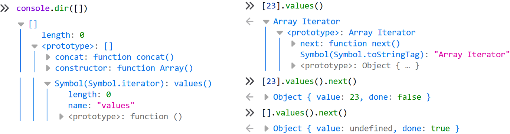
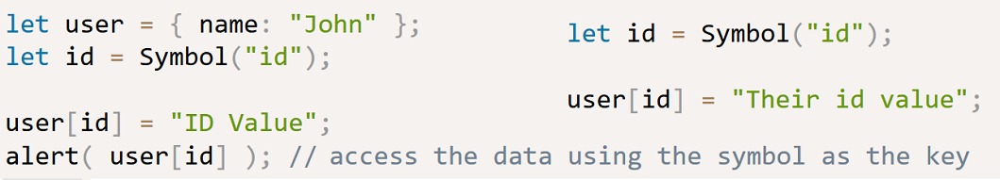
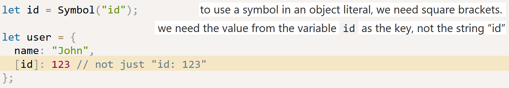
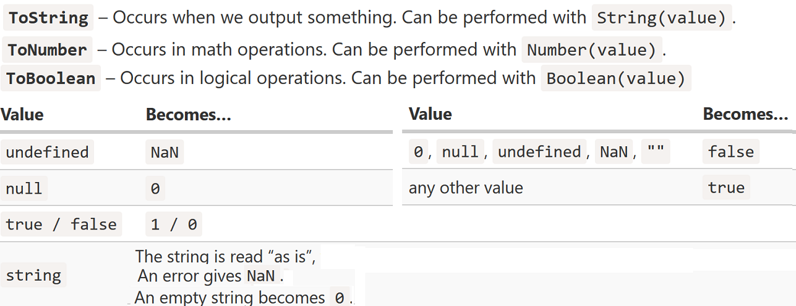
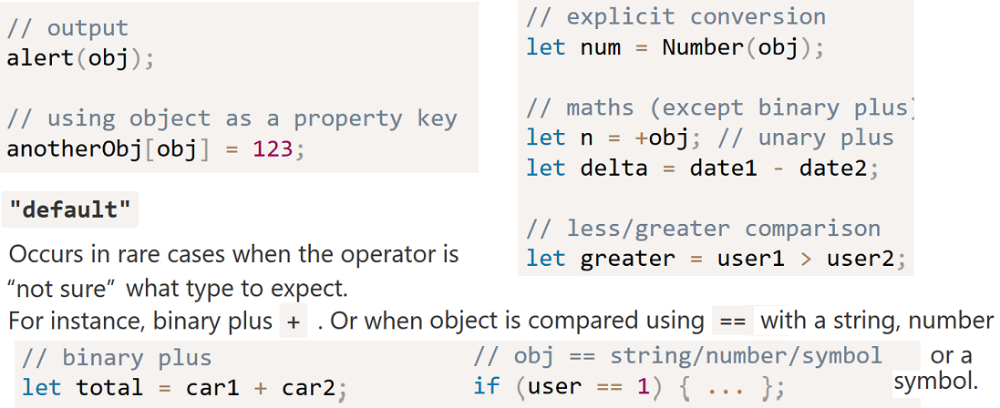
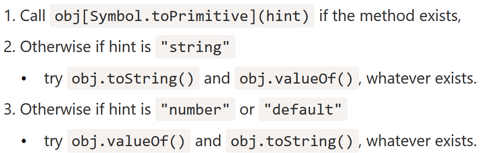
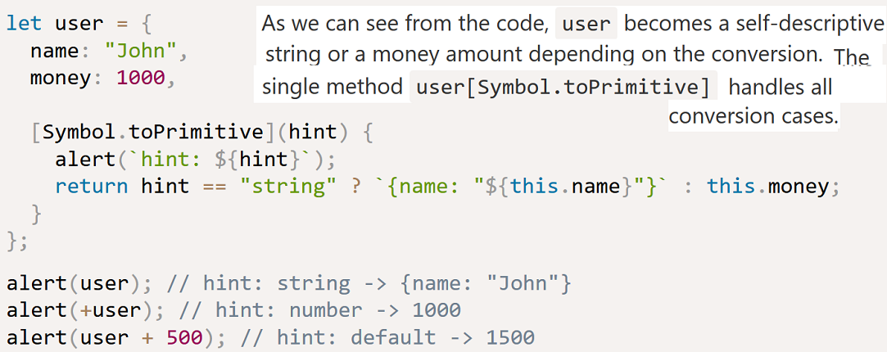
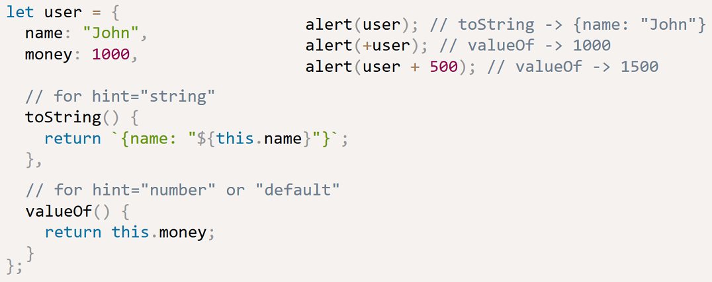
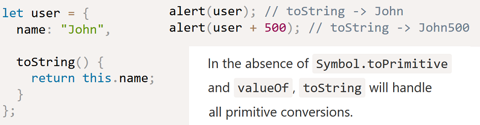
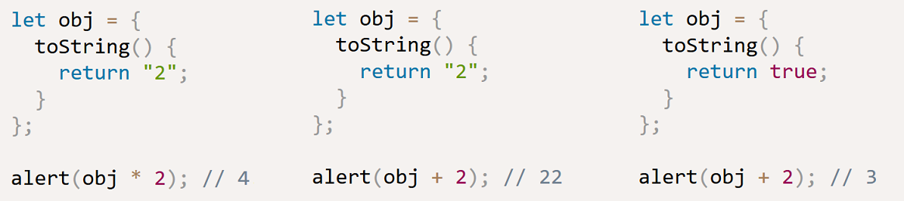

Objects are one of the 6 primary types in JS. Note that the simple primitives (`string`, `number`, `boolean`, `null`, and `undefined`) are not themselves an `object`.

`function` is a sub-type of object (technically, a "callable object"). Functions in JS are said to be "first class" in that they are basically just normal objects (with callable behavior semantics bolted on), and so they can be handled like any other plain object.

Arrays are also a form of objects, with extra behavior.

**Built-in Objects**

`String`, `Number`, `Boolean`, `Object`, `Function`, `Array`, `Date`, `RegExp`, `Error`

Their names seem to imply they are directly related to their simple primitives counter-parts, but in fact, their relationship is more complicated

These built-ins have the appearance of being actual types, even classes as in traditional OOP languages.

But these are actually just built-in functions, each of which can be used as a constructor (function call with the `new` operator, with the result being a newly constructed `object` of the sub-type in question. For instance:

    var strPrimitive = "I am a string";
    typeof strPrimitive;							// "string"
    strPrimitive instanceof String;					// false

    var strObject = new String( "I am a string" );
    typeof strObject; 								// "object"
    strObject instanceof String;					// true

    // inspect the object sub-type
    Object.prototype.toString.call( strObject );	// [object String]

The primitive value `"I am a string"` is not an `object`, it's a primitive literal and immutable value. To perform operations on it, such as checking its length, accessing its individual character contents, etc, a `String` object is required.

Luckily, the language automatically coerces a `"string"` primitive to a `String` object when necessary, which means you almost never need to explicitly create the Object form. It is strongly preferred to use the literal form for a value, rather than the constructed object form.

The same sort of coercion happens between the number literal primitive `42` and the `new Number(42)` object wrapper, when using methods like `42.359.toFixed(2)`. Likewise for `Boolean` objects from "boolean" primitives.

`null` and `undefined` have no object wrapper form, only their primitive values. By contrast, Date values can only be created with their constructed object form, as they have no literal form counter-part.

`Objects`, `Arrays`, `Functions`, and `RegExps` are all objects regardless of whether the literal or constructed form is used.

Contents
--------
the contents of an object consist of values (any type) stored at specifically named locations, which we call properties.

Note that while we say "contents" which implies that these values are actually stored inside the object, this can be misleading. What is stored in the container are these property names, which act as pointers/references to where the values are stored.

For access, The `.a` syntax is usually referred to as "property" access, whereas the `["a"]` syntax is usually referred to as "key" access.

In objects, property names are always strings. Any other value besides a string (primitive) will first be converted to a string. This includes numbers.

**Property vs. Method**

It's tempting to think of the function as belonging to the object, and in other languages, functions which belong to objects (aka, "classes") are referred to as "methods".
Technically, functions never "belong" to objects, so saying that a function that just happens to be accessed on an object reference is automatically a "method" seems a bit of a stretch of semantics.
The safest conclusion is probably that "function" and "method" are interchangeable in JS.

**Arrays**

Arrays are objects, so even though each index is a positive integer, you can also add properties onto the array:

    var myArray = [ "foo", 42, "bar" ];

    myArray.baz = "baz";

    myArray.length;	// 3

    myArray.baz;	// "baz"

Notice that adding named properties does not change the reported length of the array.

**Duplicating objects**

It would seem like there should just be a built-in `copy()` method, right? It turns out that it's not that clear-cut.

A shallow copy is fairly understandable and has far less issues, so ES6 has now defined `Object.assign(..)`.

    var myObject = {
        a: 2,
        b: anotherObject,	// reference, not a copy!
        c: anotherArray,	// another reference!
        d: anotherFunction
    };

    var newObj = Object.assign( {}, myObject );

    newObj.a;						// 2
    newObj.b === anotherObject;		// true
    newObj.c === anotherArray;		// true
    newObj.d === anotherFunction;	// true

Iteration and Iterables
-----------------------
Some statements and expressions expect iterables, e.g. `for..of` loops, spread syntax, `yield*`, and destructuring assignment

**ES6 `for..of` loop syntax**

*Iterable* objects is a generalization of arrays and allows to make any object useable in a `for..of` loop.
Many other built-in objects besides arrays, e.g. strings, are iterable. Many built-in operators and methods rely on them.

The `for..of` loop asks for an iterator object (from a default internal function known as `@@iterator`) of the thing to be iterated, and the loop then iterates over the successive return values from calling that iterator object's `next()` method, once for each loop iteration.
Regular objects do not have a built-in `@@iterator` but you can define one for them.

In other words: in order to be iterable, an object must implement the `@@iterator` method, meaning that the object (or one of the objects up its prototype chain) must have a property with a `@@iterator` key which is available via constant `Symbol.iterator`

**Symbol.iterator**

An object is an iterator when it implements a `next()` method with the correct semantics
(i.e. a zero arguments function which returns object containing at least `done` and `value` properties.

e.g. `String.prototype[@@iterator]()` returns a new Iterator object that iterates over the code points of a String value, returning each code point as a String value.

    var someString = 'hi';
    var iterator = someString[Symbol.iterator]();
    terator.next();  // { value: "h", done: false }

Lets say we have an object that is not an array, but looks suitable for `for..of`:
To make the object iterable we need to add a method to the object named `Symbol.iterator` (a special built-in symbol just for that).

    let range = {
      from: 1,
      to: 5,

      [Symbol.iterator]() {
        this.current = this.from;
        return this;
      },

      next() {
        if (this.current <= this.to) {
          return { done: false, value: this.current++ };
        } else {
          return { done: true };
        }
      }
    };

**Iterables and array-likes**

*Iterables* are objects that implement the `Symbol.iterator` method, as described above.

*Array-likes* are objects that have indexes and `length`, so they look like arrays.

The object `range` in the example above it iterable but not array-like. This object is array-like, but not iterable:

    let arrayLike = { // has indexes and length => array-like
      0: "Hello",
      1: "World",
      length: 2
    };

Both iterables and array-likes are usually not arrays, they don’t have `push`, `pop` etc. That’s rather inconvenient if we have such an object and want to work with it as with an array.
`Array.from` takes an iterable or array-like value and makes an `Array` from it. Then we can call array methods on it.

    let arr = Array.from(arrayLike);
    alert(arr.pop()); // World

Properties
------------

Two kinds: *data properties* and *accessor properties*. The latter are essentially functions that work on getting and setting a value, but look like regular *data properties* to an external code.

**Flags and Descriptors**

Normal *data properties* on an object, besides a ` value `, have three special attributes (“flags”):

`writable` – if true, can be changed, otherwise it’s read-only.

`enumerable` – if true, then listed in loops, otherwise not listed.

`configurable` – if true, the property can be deleted and these attributes can be modified, otherwise not.

    let user = {
      name: "John"
    };
    Object.getOwnPropertyDescriptor(user, 'name');
    // Object { value: "John", writable: true, enumerable: true, configurable: true }

When we create a property “the usual way”, all of them are true. But we also can change them anytime.

To change the flags, we can use `Object.defineProperty`. If the property exists, `defineProperty` updates its flags. Otherwise, it creates the property with the given value and flags; in that case, if a flag is not supplied, it is assumed `false`.

    let user = {};
    Object.defineProperty(user, "name", {
      value: "John"
    });
    Object.getOwnPropertyDescriptor(user, 'name');
    // Object { value: "John", writable: false, enumerable: false, configurable: false }

The `writable` flag specifies whether property is read-only. `configurable`: a non-configurable property can not be deleted or altered with `defineProperty`. `enumerable` controls whether the property shows up in `for..in` loops, and also whether they are include in `Object.keys`:

    Object.keys(user)  \\ Array []
    let user2 = {name: "Sam"}
    Object.keys(user2)  \\ Array [ "name" ]

**Property getters and setters**

    let user = {
      name: "John",
      surname: "Smith",

      get fullName() {
        return `${this.name} ${this.surname}`;
      },

      set fullName(value) {
        [this.name, this.surname] = value.split(" ");
      }
    };

    // set fullName is executed with the given value.
    user.fullName = "Alice Cooper";

    alert(user.name); // Alice
    alert(user.surname); // Cooper

Now we have a “virtual” property. It is readable and writable, but in fact does not exist.

Descriptors for accessor properties are different – as compared with data properties.
For accessor properties, there is no value and writable, but instead there are get and set functions:

`get` – a function without arguments, that works when a property is read. `set` – a function with one argument, that is called when the property is set

`enumerable` – same as for data properties. `configurable` – same as for data properties

Getters/setters can be used as wrappers over “real” property values to gain more control over them:

    let user = {
      ...
      set name(value) {
        if (value.length < 4) {
          alert("Name is too short, need at least 4 characters");
          return;
        }
        this._name = value;
      }
    };

**Computed property names**

Object initializer syntax supports computed property names, which allows you to put an expression in brackets `[]`, that will be computed as the property name.
For example:

    const myKey = 'foo'
    let obj =  {[myKey]: 'bar'}  // Object { foo: "bar" }
    let obj2 = {[obj.foo]: 5}  // Object { bar: 5 }

Symbol type
-----------

`Symbol` is a primitive type for unique identifiers.
They are created with `Symbol()` call with an optional description. Symbols are always different values, even if they have the same name.

By specification, object property keys may be either of string type, or of symbol type. Not numbers, not booleans, only strings or symbols, these two types.

While most values in JavaScript support implicit conversion to a string, Symbol does not:

    let id = Symbol("id");
    alert(id); // TypeError: Cannot convert a Symbol value to a string

Symbols have two main use cases:

- “Hidden” object properties. If we want to add a property into an object that “belongs”
  to another script or a library, we can create a symbol and use it as a property key.
  A symbolic property does not appear in `for..in`, also it won’t be accessed directly,
   because another script does not have our symbol,

- There are many system symbols used by JS which are accessible as `Symbol.*`.
 We can use them to alter some built-in behaviors. E.g., `Symbol.iterator` for iterables, `Symbol.toPrimitive` to setup object-to-primitive conversion.

Suppose we want to store an “identifier” for the object user, we can use a symbol as a key for it.
Imagine that another script wants to have its own “id” property inside `user`, for its own purposes.
Then that script can create its own `Symbol("id")`:

There will be no conflict, because symbols are always different, even if they have the same name, whereas there would
be if we used a string `"id"`.

Symbols in an object literal:

System symbols are used by JS internally. We can use them to fine-tune various aspects of our objects. E.g. `Symbol.toPrimitive` allows us to describe object to primitive conversion.

Object to primitive conversion
------------------------------
First consider type conversion on primitives:

For objects, there’s no to-boolean conversion, because all objects are `true` in a boolean context. So there are only string and numeric conversions.

The numeric conversion happens when we apply mathematical functions. E.g. `Date` objects can be subtracted to give the time difference.

When an object is used in the context where a primitive is required, e.g. `alert`, it’s converted to a primitive value using the `ToPrimitive` algorithm.

That algorithm allows us to customize the conversion using a special object method.
Depending on the context, the conversion has a so-called “hint”. There are three variants:

To do the conversion, JS tries to find and call three object methods:

**Symbol.toPrimitive**

**toString/valueOf**

If there’s no `Symbol.toPrimitive` then JS tries to find `toString` for 'string' hint, otherwise `valueOf`:

In practice, it’s often enough to implement only a single “catch-all” to handle all primitive conversions. In this case we can implement `toString` only:

An operation that initiated the conversion gets that primitive, and then continues to work with it, applying further conversions if necessary. E.g:

