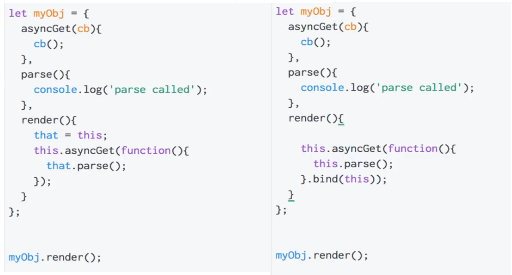

`this` is a special identifier keyword that's automatically defined in the scope of every function. It is a binding made for each function invocation, based entirely on its call-site (how the function is called).

    function identify() {
        return this.name.toUpperCase();
    }

    function speak() {
        var greeting = "Hello, I'm " + identify.call( this );
        console.log( greeting );
    }

    var me = {
        name: "Kyle"
    };

    var you = {
        name: "Reader"
    };

    identify.call( me ); // KYLE
    identify.call( you ); // READER

    speak.call( me ); // Hello, I'm KYLE
    speak.call( you ); // Hello, I'm READER

Instead of relying on `this`, you could have explicitly passed in a context object to both `identify()` and `speak()`

    function identify(context) {
        return context.name.toUpperCase();
    }

    function speak(context) {
        var greeting = "Hello, I'm " + identify( context );
        console.log( greeting );
    }

    identify( you ); // READER
    speak( me ); // Hello, I'm KYLE

However, the `this` mechanism provides a more elegant way of implicitly "passing along" an object reference, leading to cleaner API design and easier re-use.

`this` binding is a constant source of confusion. To learn this, you first have to learn what `this` is not, despite any assumptions or misconceptions that may lead you down those paths. `this` is neither a reference to the function itself, nor is it a reference to the function's lexical scope.

`this` is actually a binding that is made when a function is invoked, and what it references is determined entirely by the call-site where the function is called.

**Call-site**

The location in code where a function is called (not where it's declared).

What's important is to think about the call-stack. The call-site we care about is in the invocation before the currently executing function:

    function baz() {
        // call-stack is: `baz`
        // so, our call-site is in the global scope

        console.log( "baz" );
        bar(); // <-- call-site for `bar`
    }

    function bar() {
        // call-stack is: `baz` -> `bar`
        // so, our call-site is in `baz`

        console.log( "bar" );
        foo(); // <-- call-site for `foo`
    }

    function foo() {
        // call-stack is: `baz` -> `bar` -> `foo`
        // so, our call-site is in `bar`

        console.log( "foo" );
    }

    baz(); // <-- call-site for `baz`

The actual call-site (found from the call-stack) is the only thing that matters for `this` binding.

Binding Rules
-------------
*See notes on* `call()`, `apply()` *and* `bind()`.

Determining the this binding for an executing function requires finding the direct call-site of that function. Once examined, four rules can be applied to the call-site, in this order of precedence:

    Called with new? Use the newly constructed object.

    Called with call or apply (or bind)? Use the specified object.

    Called with a context object owning the call? Use that context object.

    Default: undefined in strict mode, global object otherwise.

This is how the call-site determines where `this` will point during the execution of a function

**Default Binding**

The case with a standalone function invocation and the catch-all rule when none of the other rules apply

    function foo() {
        // "use strict";
        console.log( this.a );
    }

    var a = 2;

    foo(); // 2

When `foo()` is called, `this.a` resolves to our global variable a. Why? Because in this case, the default binding for this applies to the function call, and so points this at the global object.
If `strict mode` is in effect, the global object is not eligible for the default binding, so the this is instead set to `undefined`.

**Implicit Binding**

Does the call-site have a context object?

    function foo() {
        console.log( this.a );
    }

    var obj = {
        a: 2,
        foo: foo
    };

    obj.foo(); // 2

Notice that `foo()` is declared and then later added as a reference property onto `obj`. Regardless of whether `foo()` is initially declared on `obj`, or is added as a reference later, in neither is the function really "owned" or "contained" by the `obj` object.
However, the call-site uses the obj context to reference the function, so you could say that the obj object "owns" or "contains" the function reference at the time the function is called.

Because obj is the this for the `foo()` call, this.a is synonymous with `obj.a` Only the last level of an object property reference chain matters to the call-site. For instance:

    function foo() {
        console.log( this.a );
    }

    var obj2 = {
        a: 42,
        foo: foo
    };

    var obj1 = {
        a: 2,
        obj2: obj2
    };

    obj1.obj2.foo(); // 42

One of the most common frustrations that `this` binding creates is when an implicitly bound function loses that binding, which usually means it falls back to the *default binding*, of either the global object or undefined, depending on `strict mode`.
One example is where we pass a callback function:

    function foo() {
        console.log( this.a );
    }

    function doFoo(fn) {
        // `fn` is just another reference to `foo`

        fn(); // <-- call-site!
    }

    var obj = {
        a: 2,
        foo: foo
    };

    var a = "oops, global"; // `a` also property on global object

    doFoo( obj.foo ); // "oops, global"

**Explicit Binding**

What if you want to force a function call to use a particular object for the this binding, instead of creating an *implicit binding* by putting a property function reference on the object?

'All' functions have, via their `Prototype`, `call(..)` and `apply(..)` methods. Invoking `foo` with explicit binding by `foo.call(..)` allows us to force its this to be `obj`:

    function foo() {
        console.log( this.a );
    }

    var obj = {
        a: 2
    };

    foo.call( obj ); // 2

*Explicit binding* alone still doesn't offer any solution to the issue mentioned previously, of a function "losing" its intended `this` binding. *Hard Binding*, a variation pattern around *explicit binding*, actually does the trick.

Since hard binding is such a common pattern, it's provided with a built-in utility as of ES5: `Function.prototype.bind`, and it's used like this:

    function foo(something) {
        console.log( this.a, something );
        return this.a + something;
    }

    var obj = {
        a: 2
    };

    var bar = foo.bind( obj );

    var b = bar( 3 ); // 2 3
    console.log( b ); // 5

`bind(..)` returns a new function that is hard-coded to call the original function with the this context set as you specified.

As of ES6, the hard-bound function produced by `bind(..)` has a `.name` property that derives from the original target function. For example: `bar = foo.bind(..)` should have a `bar.name` value of `"bound foo"`, which is the function call name that should show up in a stack trace.

**`new` Binding**

In JS, constructors are just functions that happen to be called with the `new` operator in front of them. They are not attached to classes, nor are they instantiating a class. They are not even special types of functions.
Putting a `new` in front of a function makes it function call a constructor call.

When a function is invoked with `new` in front of it, otherwise known as a constructor call, the following things are done automatically:

    a brand new object is created (aka, constructed) out of thin air
    the newly constructed object is [[Prototype]]-linked
    the newly constructed object is set as the this binding for that function call
    unless the function returns its own alternate object, the new-invoked function call will automatically return the newly constructed object.

    function foo(a) {
        this.a = a;
    }

    var bar = new foo( 2 );
    console.log( bar.a ); // 2

By calling `foo(..)` with `new` in front of it, we've constructed a new object and set that new object as the `this` for the call of `foo(..)`. So `new` is the final way that a function call's `this` can be bound.

**Determining `this`**

Now, we can summarize the general rules (there are exceptions) for determining `this` from a function call's call-site, in their order of precedence. Ask these questions in this order, and stop when the first rule applies.

    Is the function called with new (new binding)? If so, this is the newly constructed object.

    var bar = new foo()

    Is the function called with call or apply (explicit binding), even hidden inside a bind hard binding? If so, this is the explicitly specified object.

    var bar = foo.call( obj2 )

    Is the function called with a context (implicit binding), otherwise known as an owning or containing object? If so, this is that context object.

    var bar = obj1.foo()

    Otherwise, default the this (default binding). If in strict mode, pick undefined, otherwise pick the global object.

    var bar = foo()

