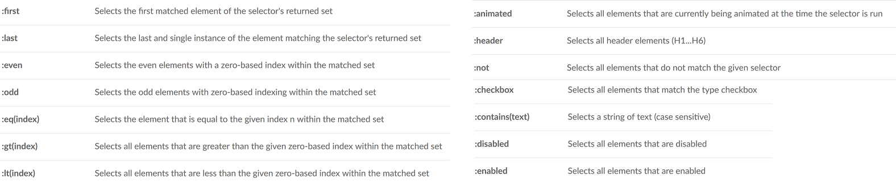

Intro
-----
HTML, CSS, and JavaScript are the three fundamental languages of the web. We structure our websites with HTML, style them with CSS, and add interactive functionality with JavaScript.

jQuery is not a programming language, but rather a tool used to make writing common JavaScript tasks more concise. jQuery has the added benefit of being cross-browser compatible.

Prerequisite: understand the DOM. To begin manipulating the page with jQuery, we need to ensure the document is "ready" first.

**Selectors**

How we tell jQuery which elements we want to work on. Most jQuery selectors are similar to in CS

Generally, classes and ids are what you will encounter the most — classes when you want to select multiple elements, and ids when you want to select only one.

Class Selector (“.class”)

ID Selector (“#id”)

    $("*") - Wildcard: selects every element on the page.
    $(this) - Current: selects the current element being operated on within a function.
    $("p") - Tag: selects every instance of the 
 tag.
    $(".example") - Class: selects every element that has the example class applied to it.
    $("#example") - Id: selects a single instance of the unique example id.
    $("[type='text']") - Attribute: selects any element with text applied to the type attribute.
    $("p:first-of-type") - Pseudo Element: selects the first 
.

**jQuery Events**

In the "Hello, World!" example in step_1, the code ran as soon as the page loaded and the document was ready, and therefore required no user interaction.

An event is any time the user interacts with the browser. Usually this is done with the mouse or keyboard. The example we just created used a click event. From the official jQuery documentation, you can view a full list of jQuery event methods. Below is a brief overview of some of the most commonly used event methods.

    click()- Click: executes on a single mouse click.
    hover() - Hover: executes when the mouse is hovered over an element. mouseenter() and mouseleave() apply only to the mouse entering or leaving an element, respectively.
    submit() - Submit: executes when a form is submitted.
    scroll() - Scroll: executes when the screen is scrolled.
    keydown() - Keydown: executes when you press down on a key on the keyboard.

To make images animate or fade in as a user scrolls down the screen, use the scroll() method. To exit a menu using the ESC key, use the keydown() method. To make a dropdown accordion menu, use the click() method.

**jQuery Effects**

jQuery effects work hand-in-hand with events by allowing you to add animations and otherwise manipulate elements on the page.

In step_3 use the toggle() method, which will toggle the CSS display property between none and block, hiding and showing the overlay when clicked.

Below is a brief overview of some of the most commonly used effect methods.

    toggle() - Toggle: switches the visibility of an element or elements. show() and hide() are the related one-way effects.
    fadeToggle() - Fade Toggle: switches the visibility and animates the opacity of an element or elements. fadeIn() and fadeOut() are the related one-way effects.
    slideToggle() - Slide Toggle toggles the visibility of an element or elements with a sliding effect. slideDown() and slideUp() are the related one-way effects.
    animate() - Animate performs custom animation effects on the CSS property of an element.

We use jQuery events to listen for a user interaction such as the click of a button, and we use jQuery effects to further manipulate elements once that action takes place.

**`jQuery.each( array, callback )`**

array: the array or array-like object to iterate over. For an array, the callback is passed an array index and a corresponding array value each time.

callback: the function that will be executed on every value.

    $.each([ 52, 97 ], function( index, value ) {
      alert( index + ": " + value );
    });

    // 0: 52
    // 1: 97

    // ajax jsonresponse python list to give appropriate options in select field
    $.each(data.mechanisms, function(key, value) {
        $("#mechanism_id")
            .append($('<option>', { value : key })
            .text(value.name));
    });

**`jQuery.each( object, callback )`**

If an object is used as the collection, the callback is passed a key-value pair each time:

    var obj = {
      "flammable": "inflammable",
      "duh": "no duh"
    };
    $.each( obj, function( key, value ) {
      alert( key + ": " + value );
    });

    // flammable: inflammable
    // duh: no duh

We can break the `$.each()` loop at a particular iteration by making the callback function return `false`.
The `$.each()` function is not the same as `$(selector).each()`, which is used to iterate, exclusively, over a jQuery object.

Tree Traversal and DOM Filtering
--------------------------------
Child Selector (“parent > child”) Selects all direct child elements specified by “child” of elements specified by “parent”.

Next Adjacent Selector (“prev + next”) to select all next elements matching “next” that are immediately preceded by a sibling “prev”.

    <ul>
      <li>list item 1</li>
      <li>list item 2</li>
      <li>list item 3</li>
      <li>list item 4</li>
      <li>list item 5</li>
    </ul>

**`first()`, `last()`, `eq()`**

These return only one element from the selected elements, either the first or last, or provided index number:

    $("ul li").eq(1).addClass("highlight");

When using one of the traversing methods, like `.children()`, you may get multiple elements: with `.eq(i)` you can select the element with the position indicated by the index `i`:

    $(‘ul’).children().eq(0)

**`jQuery.filter()`**

Takes the selector or a function as its argument to filter to selected elements, e.g. only elements with odd number index pass this functions test:

    $(document).ready(function(){
        $("ul li").filter(function(index){
            return index % 2 !== 0;
        }).addClass("highlight");
    });

Filtering is often used in conjunction with traversing: we get a collection of items and we refine the choice in a more specific way, e.g:

    $('ul').children().filter(':gt(1)').css('color', 'violet')

**`jQuery.slice(start [,end])`**

The result of this call is a red background for items 3, 4, and 5:

    $( "li" ).slice( 2 ).css( "background-color", "red" )

Now only items 3 and 4 are selected:

    $( "li" ).slice( 2, 4 ).css( "background-color", "red" );

StackOverflow forum snippets
----------------------------

    $('input[name=checkBoxName]').parents('span').addClass("checked");
    $("input[name=checkBoxName]").prop('checked', 'checked');

I have two check boxes, that I want to make to behave like they are radio buttons (only one of them is checked at time).
...You need to be setting the checked status by it's property to achieve what you want:

    $("input:checkbox").click(function(){
        var group = "input:checkbox[name='"+$(this).attr("name")+"']";
        $(group).prop("checked", false);
        $(this).prop("checked", true);
    });

[sFiddle here.](http://jsfiddle.net/FGecS/)

**In jQuery, how to attach events to dynamic html elements?**

Suppose I have some jQuery code that attaches an event handler to all elements with class "myclass". For example:

    $(function(){
        $(".myclass").click( function() {
            // do something
        });
    });

And my html might be as follows:

    <a class="myclass" href="#">test1</a>
    <a class="myclass" href="#">test2</a>
    <a class="myclass" href="#">test3</a>

That works with no problem. However, consider if the "myclass" elements were written to the page at some future time. E.g:

    <a id="anchor1" href="#">create link dynamically</a>
    

In this case, the "test4" link is created when a user clicks on `#anchor1`
The "test4" link does not have the `click()` handler associated with it, even though it has `class="myclass"`. Any idea how I can fix this?

**Store JSON object in data attribute in HTML jQuery**

I am storing data using the data- approach in a HTML tag...

just use `$('#myElement').data('key',jsonObject);`. To get the JSON back don't parse it, just call:

    var getBackMyJSON = $('#myElement').data('key');

If you are getting `[Object Object]` instead of direct JSON, just access your JSON by the data key:

    var getBackMyJSON = $('#myElement').data('key').key;

E.g.: `

` access by:

    $('div').data('foobar').foo

