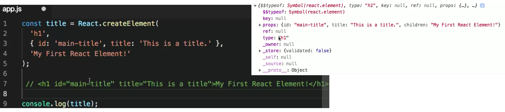

**Intro**

The other big benefit is that React keeps your application's data or at state and the UI in-sync and can efficiently update you UI when data changes.
This is one of the most difficult parts of building interactive user interfaces.

One of the benefits of using React is that it's component based. You create your UI as individual self contained components.

At it's core React is only a library for creating and updating HTML elements in your UI.

To understand how React creates UI, start by using the React API to create React elements, which are the smallest building blocks of React apps.

We could describe our application's UI by using the React.createElement method over and over again, it really is possible to do. However, it's not convenient. It's a lot of extra typing, and all of those React.createElement calls make things pretty confusing, especially when working with larger apps. This is where JSX comes in. JSX is an extension to the to the JavaScript language that uses mark-up-like syntax to create React elements.

It does not create actual DOM nodes - HTML elements in the way you would expect. Creates an `object` representation of a DOM node

