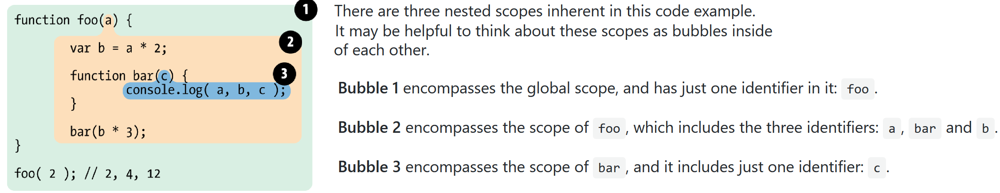

The first traditional phase of a standard language compiler is called lexing (aka, tokenizing), where tokens are assigned semantic meanings.
Lexical scope is based on where variables and blocks of scope are authored, by you, at write time.

Notice that these nested bubbles are strictly nested. In other words, no bubble for some function can simultaneously exist inside two other outer scope bubbles.

The structure and relative placement of these scope bubbles fully explains to the Engine all the places it needs to look to find an identifier.

In the above code snippet, the `Engine` executes the `console.log(..)` statement and goes looking for the three referenced variables `a`, `b`, and `c`. It first starts with the innermost scope bubble, the scope of the `bar(..)` function. It won't find `a` there, so it goes up one level, out to the next nearest scope bubble, the scope of `foo(..)`. It finds `a` there, and so it uses that `a`.

Scope look-up stops once it finds the first match. The same identifier name can be specified at multiple layers of nested scope, which is called "shadowing". Regardless, scope look-up always starts at the innermost scope being executed at the time, and works its way outward/upward until the first match, and stops.

Note: Global variables are also automatically properties of the global object (window in browsers, etc.), so it is possible to reference a global variable not directly by its lexical name, but instead indirectly as a property reference of the global object.

    window.a

This technique gives access to a global variable which would otherwise be inaccessible due to it being shadowed. However, non-global shadowed variables cannot be accessed.

The lexical scope look-up process only applies to first-class identifiers, such as the a, b, and c. If you had a reference to foo.bar.baz in a piece of code, the lexical scope look-up would apply to finding the foo identifier, but once it locates that variable, object property-access rules take over to resolve the bar and baz properties, respectively.

**Function vs Block Scope**

**Hoisting**

There's a temptation to think that code in a JS program is interpreted line-by-line, top-down in order, as the program executes.

 Consider this code:

    a = 2;
    var a;
    console.log( a );

What do you expect to be printed in the `console.log(..)` statement?

To answer this question, recall that the `Engine` will compile code before it interprets it. Part of the compilation phase was to find and associate all declarations with their scopes. This is the heart of the lexical scope.

When you see: `var a = 2;`, JS actually thinks of it as two statements: `var a;` and `a = 2;`.

The first statement, the declaration, is processed during the compilation phase. The second statement, the assignment, is left in place for the execution phase.

Our first snippet then should be thought of as being handled like this:

    // compilation stage
    var a;

    // execution stage
    a = 2;
    console.log( a );  // 2

Consider another piece of code:

    console.log( a );
    var a = 2;

Handled like this:

    // compilation stage
    var a;

    // execution stage
    console.log( a );  // undefined
    a = 2;

