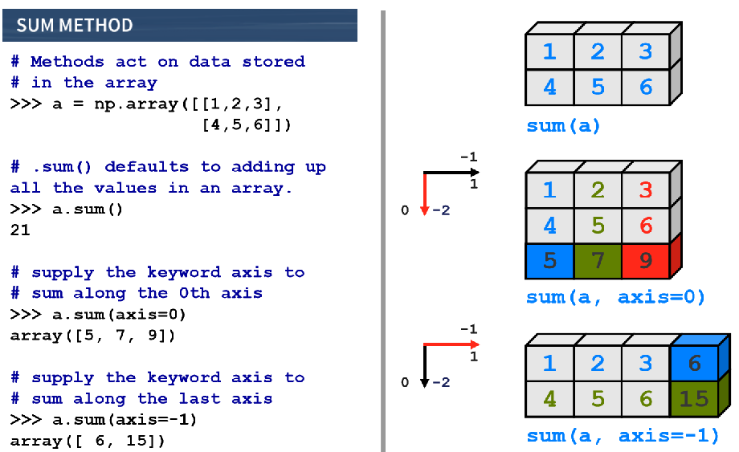
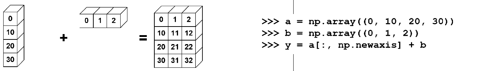
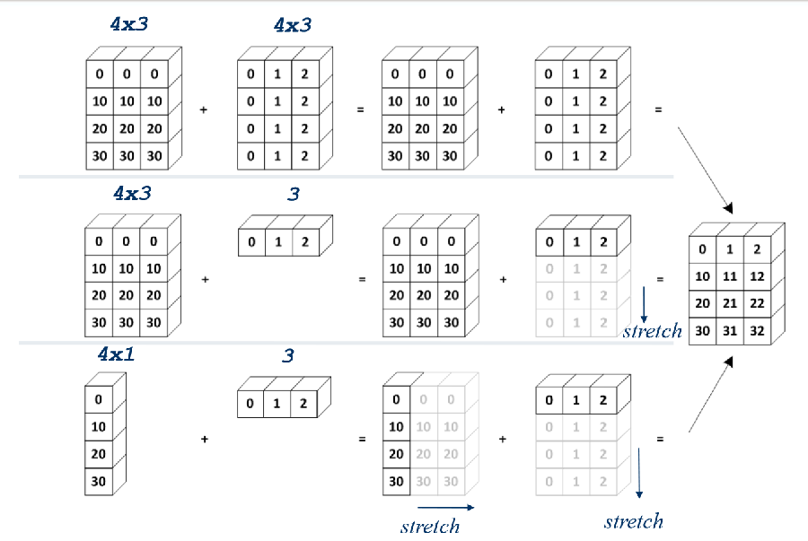
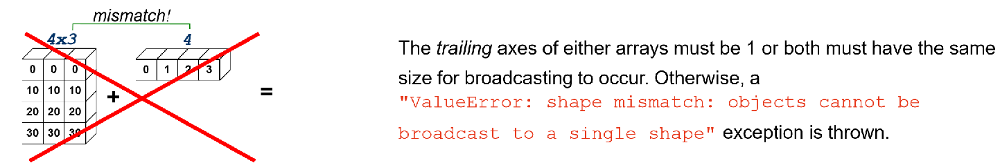
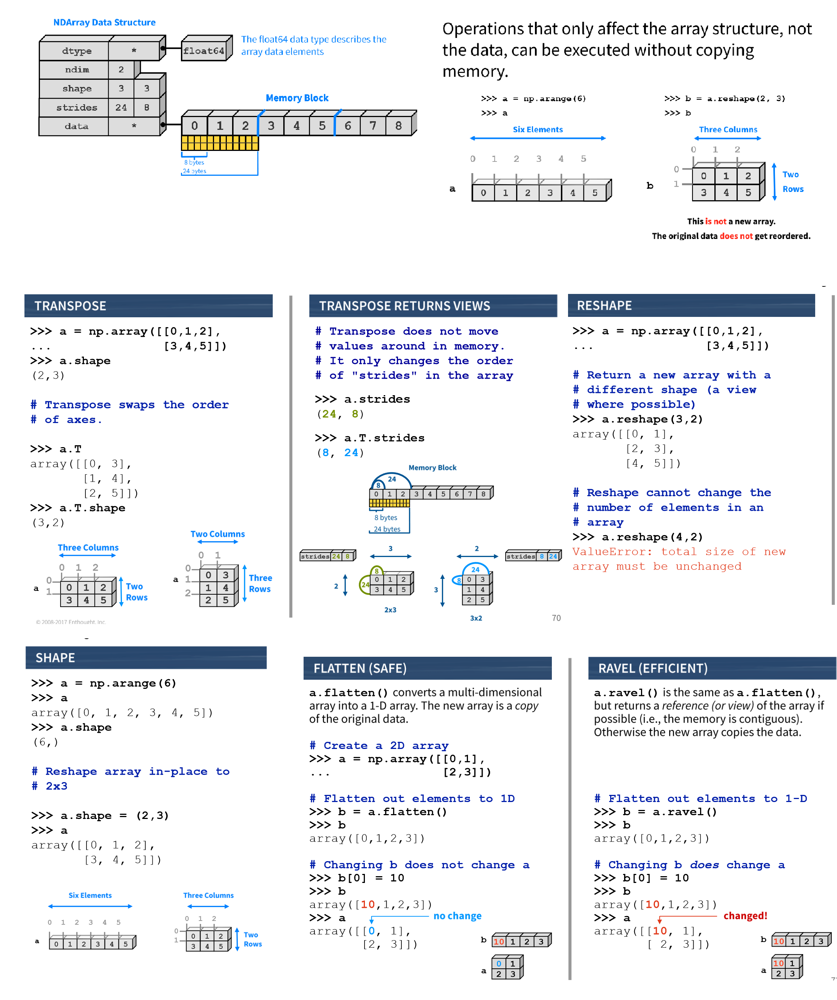

    >>> a = np.array([1, 2, 3, 4])
    >>> a + np.array([2, 3, 4, 5])
    array([3, 5, 7, 9])
    >>> y = np.sin(a)

Inplace operations:

    >>> ary = np.arange(10, 22).reshape((3,4))
    >>> ary[:, 2] += 5
    >>> ary
    array([[10, 11, 17, 13],
           [14, 15, 21, 17],
           [18, 19, 25, 21]])
    >>> ary[:, 2] *= 5

**Mathematical functions**

`sum`, `prod`, `min`, `max`, `argmin`, `argmax`, `ptp` (max – min)

**Broadcasting**

    >>>  np.arange(10, 22).reshape((3,4)) + np.arange(10, 22).reshape((3,4))
    array([[20, 22, 24, 26],
           [28, 30, 32, 34],
           [36, 38, 40, 42]])

Unless arrays that you're operating on are the exact same shape (as they are above), it's not possible to do elementwise operations. In cases like this, NumPy performs broadcasting to try to match up elements.

    >>> a = np.arange(0, 9).reshape(3, 3)
    >>> b = np.array([1, 2, 3]).reshape(3, 1)
    >>> a * b
    array([[ 0,  1,  2],
           [ 6,  8, 10],
           [18, 21, 24]])
    >>> a * np.array([1, 2, 3])
    array([[ 0,  2,  6],
           [ 3,  8, 15],
           [ 6, 14, 24]])

If the two arrays don't have a matching trailing dimension, a `ValueError` will be raised

