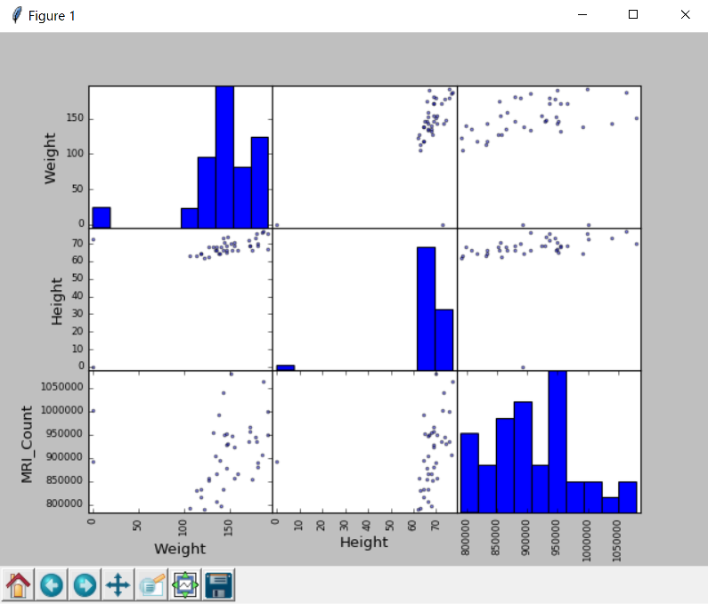
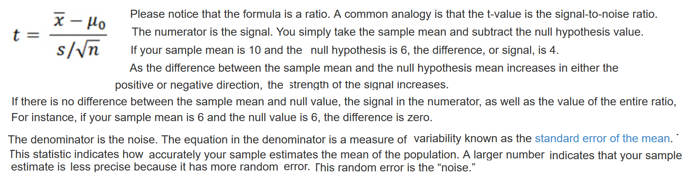
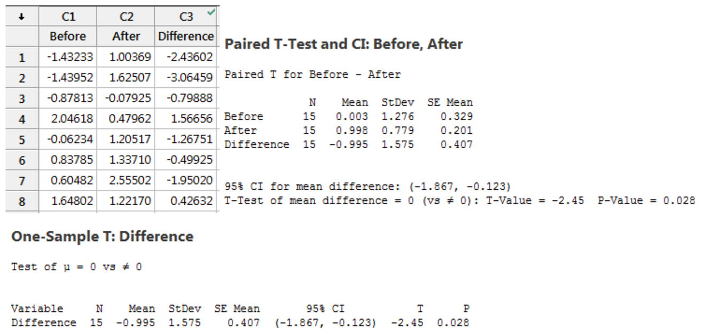

Descriptive statistics uses the data to provide descriptions of the population. Inferential statistics makes inferences and predictions about a population based on a sample of data

*See also statistics.md in algorithms*

Data representation and interaction
-----------------------------------

**Data as a table**

Statistical analysis - multiple observations or samples described by a set of different attributes or features

Pandas dataframe - It is different from a 2D numpy array as it has named columns, can contain a mixture of different data types by column, and has elaborate selection and pivotal mechanisms.

Creating dataframes: Reading a table from a CSV file or creating from arrays: A `pandas.DataFrame` can also be seen as a dictionary of 1D ‘series’:

    >>> t = np.linspace(-6, 6, 20)
    >>> sin_t = np.sin(t)
    >>> cos_t = np.cos(t)
    >>> pandas.DataFrame({'t': t, 'sin': sin_t, 'cos': cos_t})

    >>> data = pd.read_csv('examples/brain_size.csv')
    >>> data.head()
        Unnamed: 0  Gender  FSIQ  VIQ  PIQ  Weight  Height  MRI_Count
    0            1  Female   133  132  124     118    64.5     816932
    1            2    Male   140  150  124       0    72.5    1001121
    2            3    Male   139  123  150     143    73.3    1038437
    3            4    Male   133  129  128     172    68.8     965353
    4            5  Female   137  132  134     147    65.0     951545

    >>> print(data['Gender'])  # Columns can be addressed by name
    >>> data[data['Gender'] == 'Female']['VIQ'].mean()  # Simpler selector
    109.45

    >>> groupby_gender = data.groupby('Gender')  # returns a generator
    >>> list((type(a), type(b)) for a, b in groupby_gender)
    [(str, pandas.core.frame.DataFrame), (str, pandas.core.frame.DataFrame)]
    >>> list((type(a), type(b)) for a, b in groupby_gender['VIQ'])
    [(str, pandas.core.series.Series), (str, pandas.core.series.Series)]

groupby_gender is a powerful object that exposes many operations on the resulting group of dataframes:

    >>> groupby_gender.mean()
    Unnamed: 0   FSIQ     VIQ     PIQ  Weight  Height  MRI_Count
    Gender
    Female       19.65  111.9  109.45  110.45   137.2  65.765   862654.6
    Male         21.35  115.0  115.25  111.60   149.8  67.860   954855.4

Use tab-completion on groupby_gender to find more. Other common grouping functions are median, count (useful for checking to see the amount of missing values in different subsets) or sum. Groupby evaluation is lazy, no work is done until an aggregation function is applied.

    >>> from pandas.tools import plotting
    >>> plotting.scatter_matrix(data[['Weight', 'Height', 'MRI_Count']])

Hypothesis testing
------------------

**1-sample t-test: testing the value of a population mean**

`scipy.stats.ttest_1samp()` tests if the population mean of data is likely to be equal to a given value (technically if observations are drawn from a Gaussian distributions of given population mean). It returns the T statistic, and the p-value (see the function’s help):

    >>> stats.ttest_1samp(data['VIQ'], 0)
    Ttest_1sampResult(statistic=30.088099970..., pvalue=1.32891964...e-28)

With a p-value of 10^-28 we can claim that the population mean for the IQ (VIQ measure) is not 0.

**2-sample t-test: testing for difference across populations**

We have seen above that the mean VIQ in the male and female populations were different. To test if this is significant, we do a 2-sample t-test with `scipy.stats.ttest_ind()`:

    >>> female_viq = data[data['Gender'] == 'Female']['VIQ']
    >>> male_viq = data[data['Gender'] == 'Male']['VIQ']
    >>> stats.ttest_ind(female_viq, male_viq)
    Ttest_indResult(statistic=-0.77261617232..., pvalue=0.4445387766858...)

**Paired tests: repeated measurements on the same indivuals**

PIQ, VIQ, and FSIQ give 3 measures of IQ. Let us test if FISQ and PIQ are significantly different. We can use a 2 sample test:

    >>> stats.ttest_ind(data['FSIQ'], data['PIQ'])
    Ttest_indResult(statistic=0.434341903..., pvalue=0.64234434...)

The problem with this approach is that it forgets that there are links between observations: FSIQ and PIQ are measured on the same individuals. Thus the variance due to inter-subject variability is confounding, and can be removed, using a “paired test”, or “repeated measures test”:

    >>> stats.ttest_rel(data['FSIQ'], data['PIQ'])
    Ttest_relResult(statistic=1.78421903..., pvalue=0.082172632434...)

This is equivalent to a 1-sample test on the difference:

    >>> stats.ttest_1samp(data['FSIQ'] - data['PIQ'], 0)
    Ttest_1sampResult(statistic=1.78421903..., pvalue=0.082172632434...)

T Test
------
compares two samples of data and tells you if they are different from each other. The t test also tells you how significant the differences are; In other words it lets you know if those differences could have happened by chance.

The t score is a ratio between the difference between two groups and the difference within the groups.
The larger the t score, the more difference there is between groups. The smaller the t score, the more similarity there is between groups.

T-Values and P-values.
How big is “big enough”? Every t-value has a p-value to go with it. A p-value is the probability that the results from your sample data occurred by chance. P-values are from 0% to 100%. They are usually written as a decimal. For example, a p value of 5% is 0.05. Low p-values are good; They indicate your data did not occur by chance. For example, a p-value of .01 means there is only a 1% probability that the results from an experiment happened by chance. In most cases, a p-value of 0.05 (5%) is accepted to mean the data is valid.

**Understanding t-Tests: 1-sample, 2-sample, and Paired t-Tests**

If your signal is 6 and the noise is 2, your t-value is 3. This t-value indicates that the difference is 3 times the size of the standard error. However, if there is a difference of the same size but your data have more variability (6), your t-value is only 1. The signal is at the same scale as the noise.

In this manner, t-values allow you to see how distinguishable your signal is from the noise. Relatively large signals and low levels of noise produce larger t-values. If the signal does not stand out from the noise, it’s likely that the observed difference between the sample estimate and the null hypothesis value is due to random error in the sample rather than a true difference at the population level.

**A Paired t-test Is Just A 1-Sample t-Test**

As we saw above, a 1-sample t-test compares one sample mean to a null hypothesis value. A paired t-test simply calculates the difference between paired observations (e.g., before and after) and then performs a 1-sample t-test on the differences.

For example, let’s assume that “before” and “after” represent test scores, and there was an intervention in between them. If the before and after scores in each row of the example worksheet represent the same subject, it makes sense to calculate the difference between the scores in this fashion—the paired t-test is appropriate. However, if the scores in each row are for different subjects, it doesn’t make sense to calculate the difference. In this case, you’d need to use another test, such as the 2-sample t-test, which I discuss below.
A paired t-test can be more powerful than a 2-sample t-test because the latter includes additional variation occurring from the independence of the observations.

**How Two-Sample T-tests Calculate T-Values**

Unlike the paired t-test, the 2-sample t-test requires independent groups for each sample.

For the 2-sample t-test, the numerator is again the signal, which is the difference between the means of the two samples. For example, if the mean of group 1 is 10, and the mean of group 2 is 4, the difference is 6.

Just like with the 1-sample t-test, for any given difference in the numerator, as you increase the noise value in the denominator, the t-value becomes smaller. To determine that the groups are different, you need a t-value that is large.

**What Do t-Values Mean?**

Each type of t-test uses a procedure to boil all of your sample data down to one value, the t-value. The calculations compare your sample mean(s) to the null hypothesis and incorporates both the sample size and the variability in the data. A t-value of 0 indicates that the sample results exactly equal the null hypothesis. In statistics, we call the difference between the sample estimate and the null hypothesis the effect size. As this difference increases, the absolute value of the t-value increases.

That’s all nice, but what does a t-value of, say, 2 really mean? From the discussion above, we know that a t-value of 2 indicates that the observed difference is twice the size of the variability in your data
