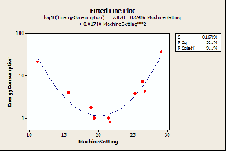
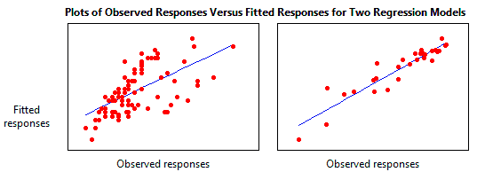
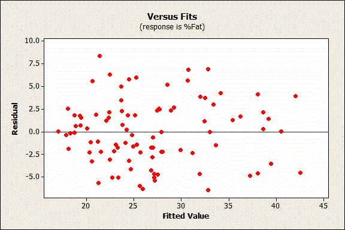
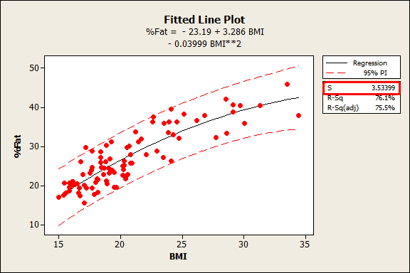

Descriptive statistics uses the data to provide descriptions of the population. nferential statistics makes inferences and predictions about a population based on a sample of data

In the output below, we can see that the predictor variables of South and North are significant because both of their p-values are 0.000. However, the p-value for East (0.092) is greater than the common alpha level of 0.05, which indicates that it is not statistically significant.

Typically, you use the coefficient p-values to determine which terms to keep in the regression model. In the model above, we should consider removing East.
Regression coefficients represent the mean change in the response variable for one unit of change in the predictor variable while holding other predictors in the model constant. This statistical control that regression provides is important because it isolates the role of one variable from all of the others in the model.

*Statistical control* - Multiple regression estimates how the changes in each predictor variable relate to changes in the response variable. Importantly, regression automatically controls for every variable that you include in the model.
What does it mean to control for the variables in the model? It means that when you look at the effect of one variable in the model, you are holding constant all of the other predictors in the model. Or "ceteris paribus," as the Romans would’ve said. You explain the effect that changes in one predictor have on the response without having to worry about the effects of the other predictors. In other words, you can isolate the role of one variable from all of the others in the model. And, you do this simply by including the variables in your model. It's beautiful!
For instance, a recent study assessed how coffee consumption affects mortality. Initially, the results showed that higher coffee consumption is correlated with a higher risk of death. However, many coffee drinkers also smoke. After the researchers included a variable for smoking habits in their model, they found that coffee consumption lowered the risk of death while smoking increased it. So, by including coffee consumption, smoking habits, and other important variables, the researchers held everything that is important constant and were able to focus on the role of coffee consumption.

If the fitted line was flat (a slope coefficient of zero), the expected value for weight would not change no matter how far up and down the line you go. So, a low p-value suggests that the slope is not zero, which in turn suggests that changes in the predictor variable are associated with changes in the response variable.
I used a fitted line plot because it really brings the math to life. However, fitted line plots can only display the results from simple regression, which is one predictor variable and the response. The concepts hold true for multiple linear regression, but I would need an extra spatial dimension for each additional predictor to plot the results. That's hard to show with today's technology!
In the above example, height is a linear effect; the slope is constant, which indicates that the effect is also constant along the entire fitted line. However, if your model requires polynomial or interaction terms, the interpretation is a bit less intuitive.
As a refresher, polynomial terms model curvature in the data, while interaction terms indicate that the effect of one predictor depends on the value of another predictor.
The next example uses a data set that requires a quadratic (squared) term to model the curvature. In the output below, we see that the p-values for both the linear and quadratic terms are significant.

You can see how the relationship between the machine setting and energy consumption varies depending on where you start on the fitted line. For example, if you start at a machine setting of 12 and increase the setting by 1, you’d expect energy consumption to decrease. However, if you start at 25, an increase of 1 should increase energy consumption. And if you’re around 20, energy consumption shouldn’t change much at all.
A significant polynomial term can make the interpretation less intuitive because the effect of changing the predictor varies depending on the value of that predictor. Similarly, a significant interaction term indicates that the effect of the predictor varies depending on the value of a different predictor.
Take extra care when you interpret a regression model that contains these types of terms. You can’t just look at the main effect (linear term) and understand what is happening! Unfortunately, if you are performing multiple regression analysis, you won't be able to use a fitted line plot to graphically interpret the results. This is where subject area knowledge is extra valuable

Make a plot of residual values to see: is there a non-random pattern in the residuals indicates that the deterministic portion (predictor variables) of the model is not capturing some explanatory information that is “leaking” into the residuals. The graph could represent several ways in which the model is not explaining all that is possible. Possibilities include:

A missing variable

A missing higher-order term of a variable in the model to explain the curvature

A missing interaction between terms already in the model

Identifying and fixing the problem so that the predictors now explain the information that they missed before should produce a good-looking set of residuals!
In addition to the above, here are two more specific ways that predictive information can sneak into the residuals:
The residuals should not be correlated with another variable. If you can predict the residuals with another variable, that variable should be included in the model. In Minitab’s regression, you can plot the residuals by other variables to look for this problem.
Adjacent residuals should not be correlated with each other (autocorrelation). If you can use one residual to predict the next residual, there is some predictive information present that is not captured by the predictors. Typically, this situation involves time-ordered observations. For example, if a residual is more likely to be followed by another residual that has the same sign, adjacent residuals are positively correlated.

The regression model on the left accounts for 38.0% of the variance while the one on the right accounts for 87.4%. The more variance that is accounted for by the regression model the closer the data points will fall to the fitted regression line. Theoretically, if a model could explain 100% of the variance, the fitted values would always equal the observed values and, therefore, all the data points would fall on the fitted regression line.

*Key Limitations of R-squared:*

R-squared cannot determine whether the coefficient estimates and predictions are biased, which is why you must assess the residual plots.

R-squared does not indicate whether a regression model is adequate. You can have a low R-squared value for a good model, or a high R-squared value for a model that does not fit the data!

*Are Low R-squared Values Inherently Bad?*

No! There are two major reasons why it can be just fine to have low R-squared values.
In some fields, it is entirely expected that your R-squared values will be low. For example, any field that attempts to predict human behavior, such as psychology, typically has R-squared values lower than 50%. Humans are simply harder to predict than, say, physical processes.
Furthermore, if your R-squared value is low but you have statistically significant predictors, you can still draw important conclusions about how changes in the predictor values are associated with changes in the response value. Regardless of the R-squared, the significant coefficients still represent the mean change in the response for one unit of change in the predictor while holding other predictors in the model constant. Obviously, this type of information can be extremely valuable.See a graphical illustration of why a low R-squared doesn't affect the interpretation of significant variables.
“how high should R-squared be” is . . . it depends. what you really want to know is whether your regression model can meet your objectives. Is the model adequate given your requirements? …..“In closing, the regression constant is generally not worth interpreting.”
A low R-squared is most problematic when you want to produce predictions that are reasonably precise (have a small enough prediction interval). How high should the R-squared be for prediction? Well, that depends on your requirements for the width of a prediction interval and how much variability is present in your data. While a high R-squared is required for precise predictions, it’s not sufficient by itself, as we shall see.the answer for

*Predicted r-squared*

indicates how well the model predicts new observations. Here’s the Summary of Model table from General Regression.
For our model, the predicted R-squared is 74.14%. Because this value is close to the R-squared of 76.06%, the model provides valid predictions.However, in the case of a model where the regular R-squared is good but the predicted R-squared is significantly lower, it indicates that the model fits the original data but fails to provide valid predictions. .when the model is overly complicated and it starts to model the noise in the data. This condition is known as "overfitting the model."
A high R-squared does not necessarily indicate that the model has a good fit. look at the fitted line plot and residual plot below. The fitted line plot displays the relationship between semiconductor electron mobility and the natural log of the density for real experimental data.

The fitted line plot shows that these data follow a nice tight function and the R-squared is 98.5%, which sounds great. However, look closer to see how the regression line systematically over and under-predicts the data (bias) at different points along the curve. You can also see patterns in the Residuals versus Fits plot, rather than the randomness that you want to see. This indicates a bad fit, and serves as a reminder as to why you should always check the residual plots….similar biases can occur when your linear model is missing important predictors, polynomial terms, and interaction terms. Statisticians call this specification bias, and it is caused by an underspecified model. For this type of bias, you can fix the residuals by adding the proper terms to the model.

Systematic errors/Biases can be observed from the residual plot – a non-random variance e.g. tend above on left and below on right..

In regression anaylsis, both R-squared and standard error are measures of the goodness-of-fit.

When doing linear regression, it is advisable to:

Remove Noise. Linear regression assumes that your input and output variables are not noisy. Consider using data cleaning operations that let you better expose and clarify the signal in your data.

Remove Collinearity. Linear regression will over-fit your data when you have highly correlated input variables. Consider calculating pairwise correlations for your input data and removing the most correlated.

Gaussian Distributions. Linear regression will make more reliable predictions if your input and output variables have a Gaussian distribution. You may get some benefit using transforms (e.g. log or BoxCox) on you variables to make their distribution more Gaussian looking.

Rescale Inputs: Linear regression will often make more reliable predictions if you rescale input variables using standardization or normalization.

*Data normalization* is the process of rescaling one or more attributes to the range of 0 to 1. This means that the largest value for each attribute is 1 and the smallest value is 0.
Normalization is a good technique to use when you do not know the distribution of your data or when you know the distribution is not Gaussian (a bell curve).

**Standard Error**

When the standard error is large relative to the statistic, the statistic will typically be non-significant. However, if the sample size is very large, for example, sample sizes greater than 1,000, then virtually any statistical result calculated on that sample will be statistically significant. For example, a correlation of 0.01 will be statistically significant for any sample size greater than 1500. However, a correlation that small is not clinically or scientifically significant. When effect sizes (measured as correlation statistics) are relatively small but statistically significant, the standard error is a valuable tool for determining whether that significance is due to good prediction, or is merely a result of power so large that any statistic is going to be significant. The answer to the question about the importance of the result is found by using the standard error to calculate the confidence interval about the statistic. When the finding is statistically significant but the standard error produces a confidence interval so wide as to include over 50% of the range of the values in the dataset, then the researcher should conclude that the finding is clinically insignificant (or unimportant). This is true because the range of values within which the population parameter falls is so large that the researcher has little more idea about where the population parameter actually falls than he or she had before conducting the research.

The fitted line plot shown above is from my post where I use BMI to predict body fat percentage. S is 3.53399, which tells us that the average distance of the data points from the fitted line is about 3.5% body fat.Unlike R-squared, you can use the standard error of the regression to assess the precision of the predictions. Approximately 95% of the observations should fall within plus/minus 2*standard error of the regression from the regression line, which is also a quick approximation of a 95% prediction interval.For the BMI example, about 95% of the observations should fall within plus/minus 7% of the fitted line, which is a close match for the prediction interval.

T Test
------
compares two samples of data and tells you if they are different from each other. The t test also tells you how significant the differences are; In other words it lets you know if those differences could have happened by chance.

The t score is a ratio between the difference between two groups and the difference within the groups.
The larger the t score, the more difference there is between groups. The smaller the t score, the more similarity there is between groups.

T-Values and P-values.
How big is “big enough”? Every t-value has a p-value to go with it. A p-value is the probability that the results from your sample data occurred by chance. P-values are from 0% to 100%. They are usually written as a decimal. For example, a p value of 5% is 0.05. Low p-values are good; They indicate your data did not occur by chance. For example, a p-value of .01 means there is only a 1% probability that the results from an experiment happened by chance. In most cases, a p-value of 0.05 (5%) is accepted to mean the data is valid.

**Understanding t-Tests: 1-sample, 2-sample, and Paired t-Tests**

If your signal is 6 and the noise is 2, your t-value is 3. This t-value indicates that the difference is 3 times the size of the standard error. However, if there is a difference of the same size but your data have more variability (6), your t-value is only 1. The signal is at the same scale as the noise.

In this manner, t-values allow you to see how distinguishable your signal is from the noise. Relatively large signals and low levels of noise produce larger t-values. If the signal does not stand out from the noise, it’s likely that the observed difference between the sample estimate and the null hypothesis value is due to random error in the sample rather than a true difference at the population level.

**A Paired t-test Is Just A 1-Sample t-Test**

As we saw above, a 1-sample t-test compares one sample mean to a null hypothesis value. A paired t-test simply calculates the difference between paired observations (e.g., before and after) and then performs a 1-sample t-test on the differences.

For example, let’s assume that “before” and “after” represent test scores, and there was an intervention in between them. If the before and after scores in each row of the example worksheet represent the same subject, it makes sense to calculate the difference between the scores in this fashion—the paired t-test is appropriate. However, if the scores in each row are for different subjects, it doesn’t make sense to calculate the difference. In this case, you’d need to use another test, such as the 2-sample t-test, which I discuss below.
A paired t-test can be more powerful than a 2-sample t-test because the latter includes additional variation occurring from the independence of the observations.

**How Two-Sample T-tests Calculate T-Values**

Unlike the paired t-test, the 2-sample t-test requires independent groups for each sample.

For the 2-sample t-test, the numerator is again the signal, which is the difference between the means of the two samples. For example, if the mean of group 1 is 10, and the mean of group 2 is 4, the difference is 6.

Just like with the 1-sample t-test, for any given difference in the numerator, as you increase the noise value in the denominator, the t-value becomes smaller. To determine that the groups are different, you need a t-value that is large.

**What Do t-Values Mean?**

Each type of t-test uses a procedure to boil all of your sample data down to one value, the t-value. The calculations compare your sample mean(s) to the null hypothesis and incorporates both the sample size and the variability in the data. A t-value of 0 indicates that the sample results exactly equal the null hypothesis. In statistics, we call the difference between the sample estimate and the null hypothesis the effect size. As this difference increases, the absolute value of the t-value increases.

That’s all nice, but what does a t-value of, say, 2 really mean? From the discussion above, we know that a t-value of 2 indicates that the observed difference is twice the size of the variability in your data
