React facilitates the idea of reusable components, and keeps your application's data or at state and the UI in-sync and can efficiently update you UI when data changes.
This is one of the most difficult parts of building interactive user interfaces.

Being component based, you create your UI as individual self contained components.
At it's core React is only a library for creating and updating HTML elements in your UI.

To understand how React creates UI, start by using the React API to create React elements, the smallest building blocks of React apps.

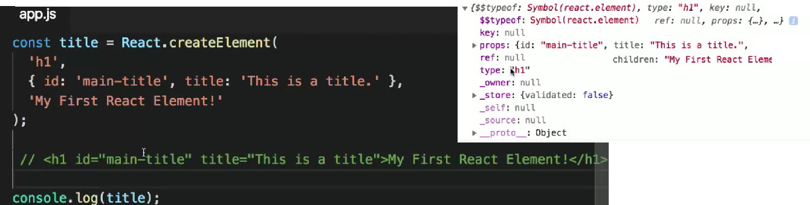

It does not create actual DOM nodes - HTML elements in the way you would expect. Creates an `object` representation of a DOM node

We could describe our application's UI by using the React.createElement method over and over again. However, it's a lot of extra typing, and all of those `React.createElement` calls make things pretty confusing. This is where JSX comes in. JSX is an extension to the to the JS language that uses mark-up-like syntax to create React elements.

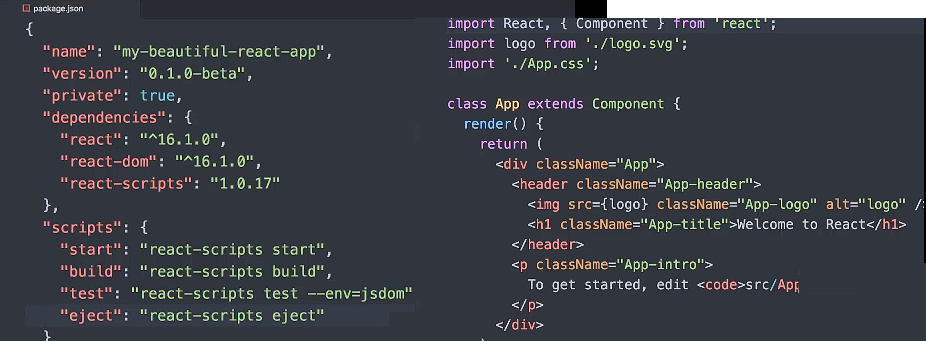

JSX is not valid JavaScript. It needs to be transpiled into `react.createElement` calls.
Normally during development, you'd have a build system set up with Babel in a tool like webpack. E.g. the tool create app provides a built system out of the box to do this.
But it's also possible to use babel directly in the browser (no build step) via a script tag that points to Babel stand alone:

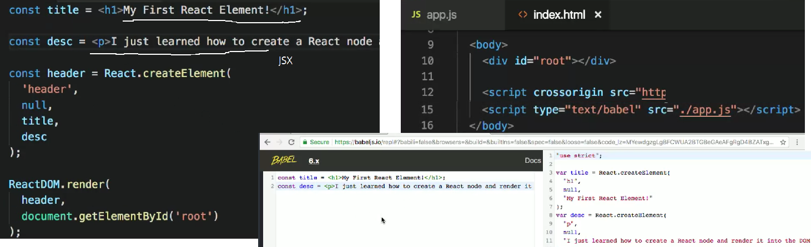

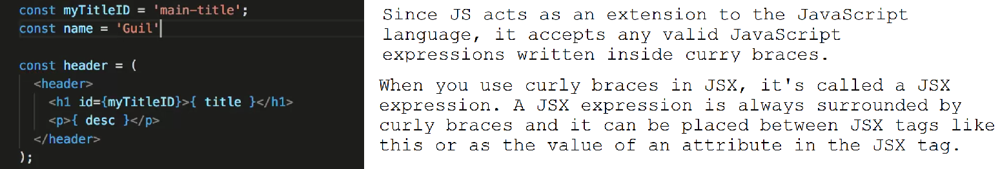

**Components**

React elements are the smallest building blocks of React applications.
Now understand components, which are at the heart of React.
Everything in React is considered to be a component.

A component is a piece of UI that you can reuse. Just like you're able to reuse code in JavaScript with functions, a component lets you reuse code that renders a part of your UI. This enables you to split your UI code into independent, reusable pieces, and think about each piece in isolation.

So to start, our app might consist of three components.
A header component, a player component we can reuse to display each player and
score, and the container component that brings everything together.

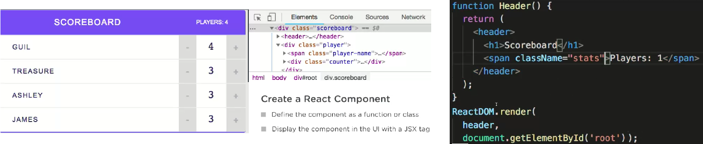

JSX lets you define your own tags. A JSX tag can not only represent an HTML element e.g. `<h1>`, but it can also represent a user-defined component.  In `ReactDOM.render()`, replace the `header` variable with a header tag which exactly matches the name of the function:

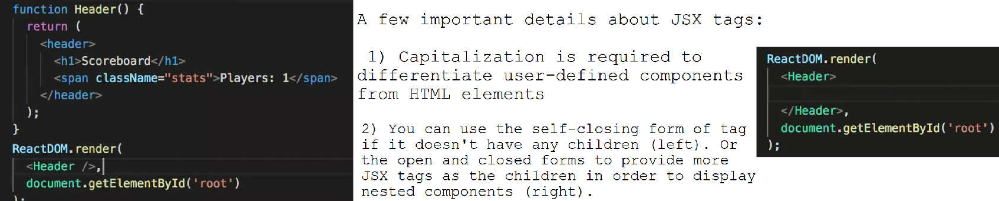

A component's JSX tag is actually a function call the `ReactDOM.createElement()` under the hood.

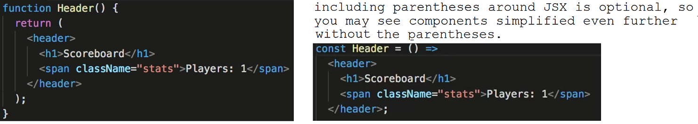

Create the player component which will a player's name and a counter that displays the player's score, with buttons that let you change the score.:

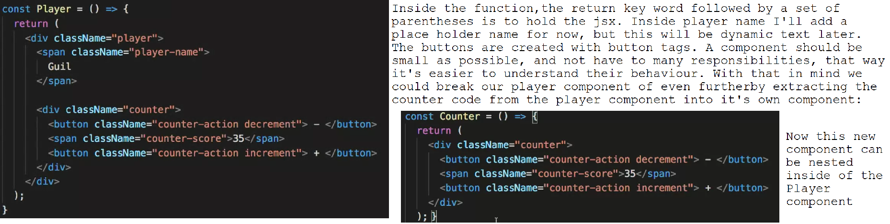

Having parent components like `Player` with one or many child components (composition) gives the parent component the ability to control how its child components are rendered.

Typically, React applications have a single top level component that wraps the entire application and composes all the main components together.
`ReactDOM.render` usually renders your top level element into the DOM.
So now to create a new function component named App and pass it to `ReactDOM.render` using its JSX tag.

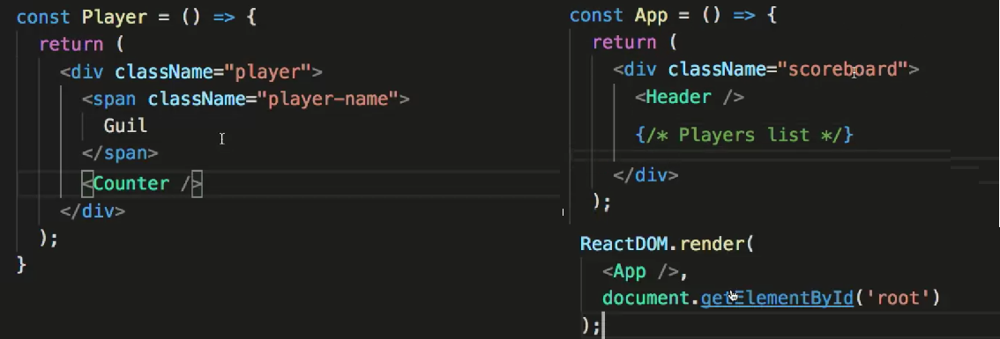

With React, we never touch the actual DOM directly - React only manages what gets rendered into the DOM - so it can be tricky to debug your UI in the browser. The React Developer Tools extension allows you to inspect your component hierarchy similar to how your inspect your HTML elements in the elements pane. Also notice and make use of the React tab and the search bar

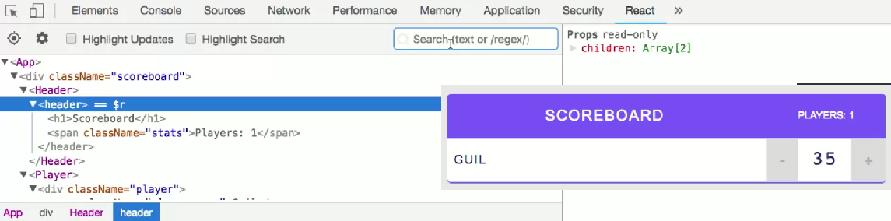

**Props**

We use properties, or props, to customize our components and pass dynamic information into them.
HTML elements accept attributes that give them further meaning and additional behavior. Every React component and element can receive a list of attributes just like HTML elements. These are props, a core concept in React, because it's how we get data into a component.

First, you write props in a component's JSX tag, using an attribute syntax.
Then the component needs to be able to take in that information and use it in some way.

We can inspect the props of a element and a component in React DevTools:

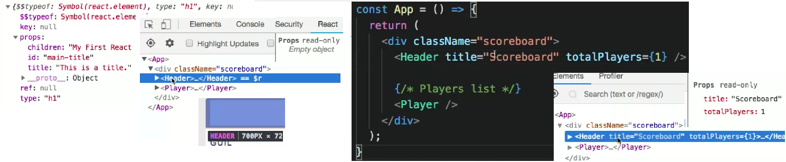

Let's enable the use of props in our Header component by giving our function a parameter called props.
Remember, the JavaScript you write between the curly braces needs to be an expression or something that returns a value.

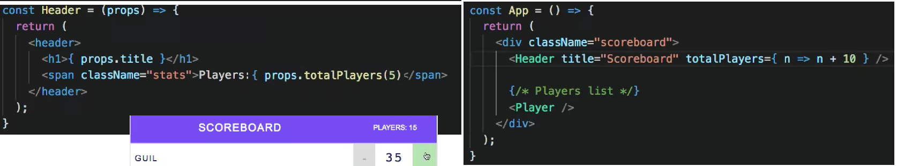

Props pass data from a parent component down to a child component. E.g. in the `App` component we're passing data to the header component
which are then consumed by header and displayed as content. Set up our `Player` component to receive props and pass the down to its child `Counter` component:

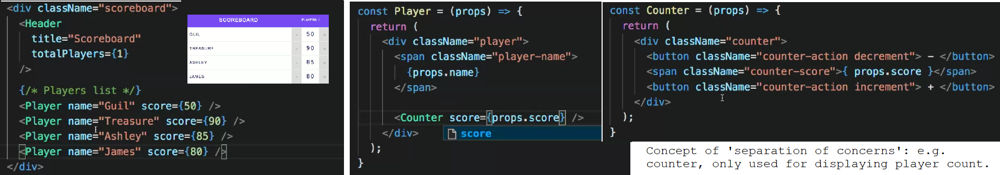

Instead of hardcoding the list of players, create an array and pass these to the App component:

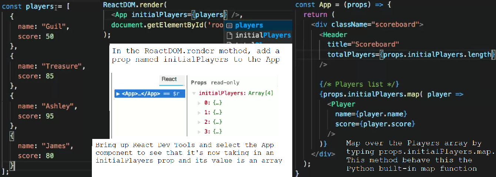

Now it should be made so that the data model can be updated from the UI (players added and removed via the scoreboard).

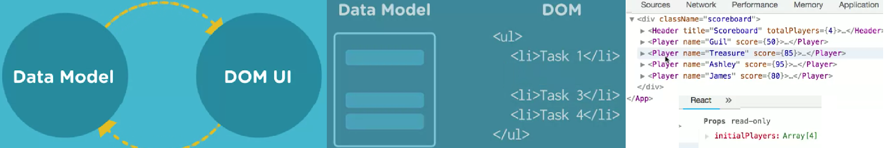

To keep track of each item (Player) returned by the `Array.map()` function should have a unique key prop, to keep track of it and differentiate each component from its sibling.
Since players if a static, add it manually, but data from e.g. an API will usually provide this. Not all React elements need a key prop. Pass a key prop anytime you're creating elements by iterating over
an array of items that will be rearranged, added or deleted in your UI. The key will help React identify which items were changed, added or removed from the DOM.

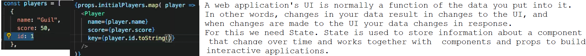

**State**

State is what allows you to create components that are dynamic and interactive, and it's the only data that changes over time.

Currently the UI is static because our data is static. Since props are read-only or immutable, a component can only read the props given to it, never change them.
For any data that's going to change, we have to use state.

When the user performs any action in the app like increase the score, they are changing the state of the application.
All those changes will need to be stored as data somewhere.

State itself is a regular JS object with properties that define the pieces of data that change.
Unlike the players array currently passed to App via props, the data in state is not read-only. Sstate is what keeps your UI in sync with your data.
E.g. click to remove a player and notice how the array changes from 3 to 2 objects. This triggers a State change that affects all the components that taken this data.
React provides State as a convenient way to store and maintain your data. State is only available to components that are class components:

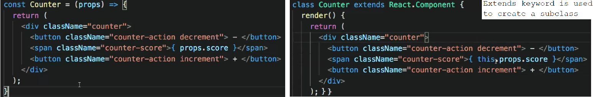

When do you need to use a class instead of a function for components? If it is only receiving input through props to render UI, then use a stateless functional component may be used (which can be thought of as just a `render()`
method from class components with props passed in as an argument.

Consider what part of the counter when change when users interact with it.
The score will increase or decrease depending on the button they click. Score is the State.

Since state is an object, you create and initialize state within a class inside the constructor method.
Inside the constructor, super needs to be called before we can use the this keyword
within the constructor. Then to initialize component state,
write this.state and set it equal to an object.

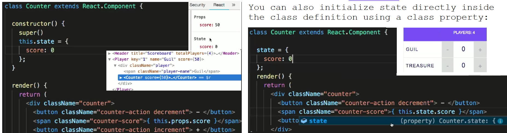

Now to enable the state to be modified from inside a component, something you are not able to do with props.
This involves listening for the click event and running the `setState()` method.

    this.setState({ ... })
    this.setState(state => { ... })

`setState` does two things: It will update the value of the score state, and it will tell React that this component needs to be
re-rendered to make sure that everything is up to date in the UI.

Never mutate `this.state` directly, as calling `setState()` afterwards may replace the mutation you made. Treat `this.state` as if it were immutable.

For now there is no binding to the component, so we're not able to reference it with this from within the `incrementScore()` method.

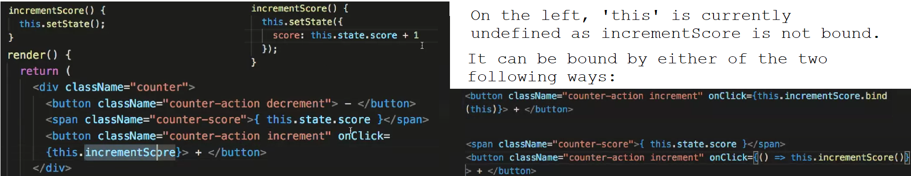

Another way to bind the click event handler is to write the `incrementScore()` method as an arrow function, as `this` will then take on the context of the Counter class. This avoids
having to worry about it in the click event, or in the constructor (which is another way to bind it):

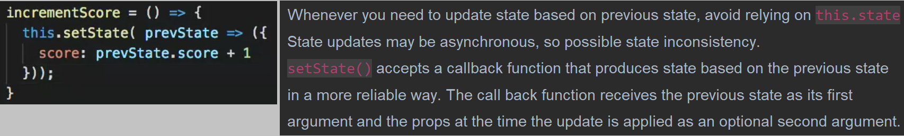

Now to enable players to be deleted from the scoreboard, i.e. remove items from state.
Create and wire up an event handler that removes a player on click.
Since the app component is responsible for rendering the player component,
It's going to own and maintain the player state.
That state will then be passed down and available to the player component as well as all children of `App` via props.

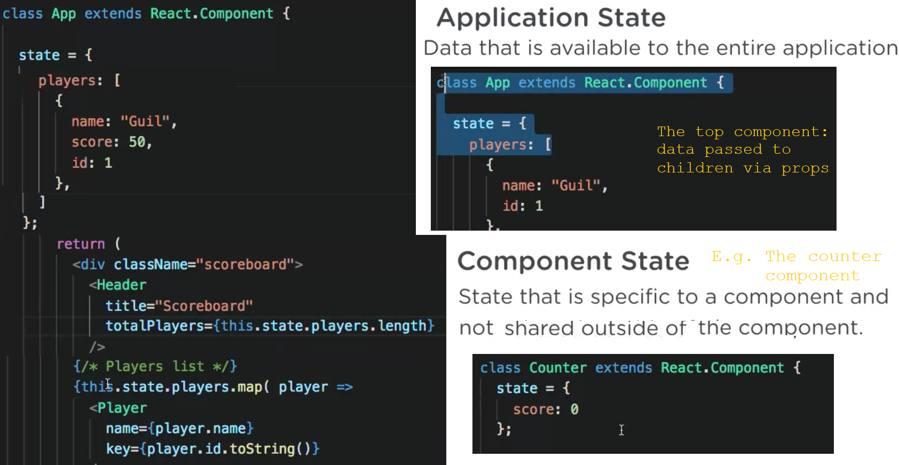

We should never modify or mutate state directly. In order to remove a player from the players array and state, we need to produce a new array
that no longer contains the player object we want to remove. a common and reliable way is with the `filter()` array iteration method.

Like the `map()` method, the `filter()` method takes a callback function. The first parameter of the callback represents the current
item being processed in the array. Then we need to return all player objects and state except for the one we want to remove, using the player id.

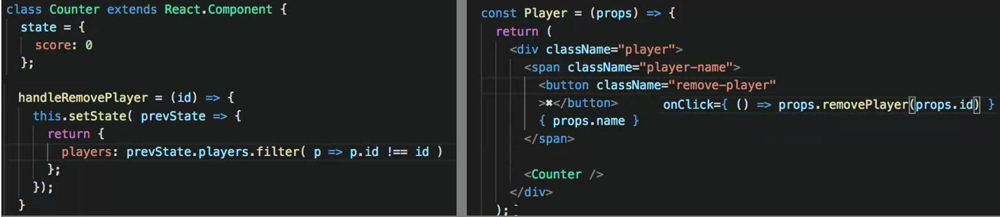

The `Player` component is a child of `App` and so can access to the function written in the `App` class through props.
