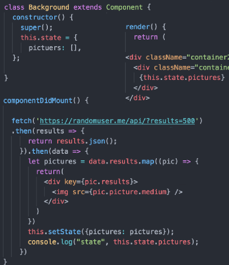

https://facebook.github.io/react-native/docs/network.html

https://developer.mozilla.org/en-US/docs/Web/API/Fetch_API/Using_Fetch

JS interface for accessing and manipulating requests and responses. It provides a global `fetch()` method that provides an easy, logical way to fetch resources asynchronously across the network.

    import React, { Component } from 'react';
    
    const API = 'https://hn.algolia.com/api/v1/search?query=';
    const DEFAULT_QUERY = 'redux';
    
    class App extends Component {
      constructor(props) {
        super(props);
    
        this.state = {
          hits: [],
        };
      }
    
      componentDidMount() {
        fetch(API + DEFAULT_QUERY)
          .then(response => response.json())
          .then(data => this.setState({ hits: data.hits }));
      }
    
      ...
    }
    
    export default App;

    function getMoviesFromApiAsync() {
       return fetch('https://facebook.github.io/react-native/movies.json')
       .then((response) => response.json())
       .then((responseJson) => {
         return responseJson.movies;
       })
       .catch((error) => {
         console.error(error);
       });
    }

    fetch('http://example.com/movies.json')
      .then(function(response) {
        return response.json();
      })
      .then(function(myJson) {
        console.log(JSON.stringify(myJson));
      });

Above, `fetch()` returns a promise containing the response (a `Response` object).
   
To extract the JSON body content from the HTTP response, we use the `json()` method (defined on the Body mixin, which is implemented by both the `Request` and `Response` objects.)

**Example POST method implementation:**
    
    postData(`http://example.com/answer`, {answer: 42})
      .then(data => console.log(JSON.stringify(data))) // JSON-string from `response.json()` call
      .catch(error => console.error(error));
    
    function postData(url = ``, data = {}) {
      // Default options are marked with *
        return fetch(url, {
            method: "POST", // *GET, POST, PUT, DELETE, etc.
            mode: "cors", // no-cors, cors, *same-origin
            cache: "no-cache", // *default, no-cache, reload, force-cache, only-if-cached
            credentials: "same-origin", // include, *same-origin, omit
            headers: {
                "Content-Type": "application/json",
                // "Content-Type": "application/x-www-form-urlencoded",
            },
            redirect: "follow", // manual, *follow, error
            referrer: "no-referrer", // no-referrer, *client
            body: JSON.stringify(data), // body data type must match "Content-Type" header
        })
        .then(response => response.json()); // parses response to JSON
    }

