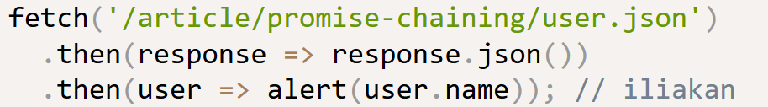
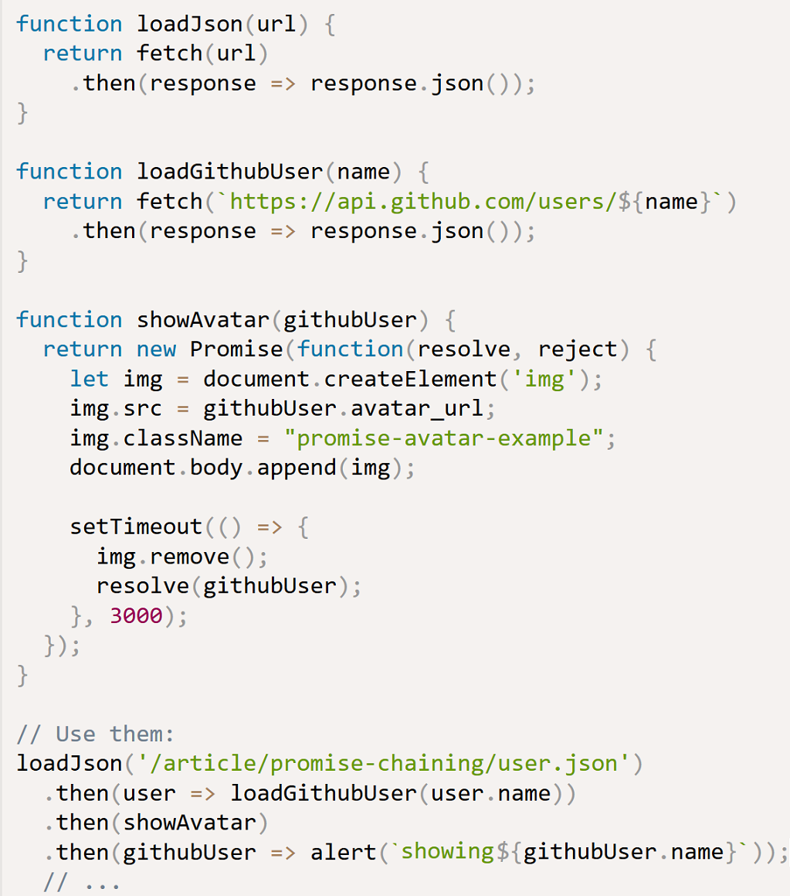
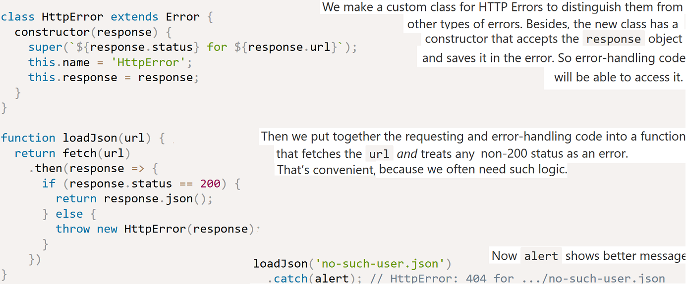
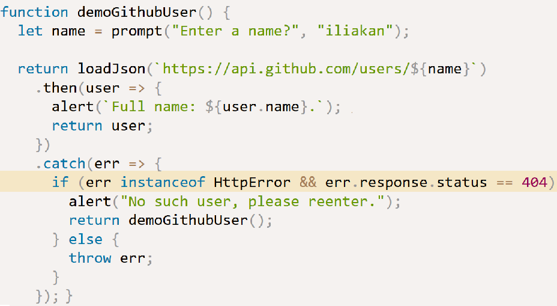
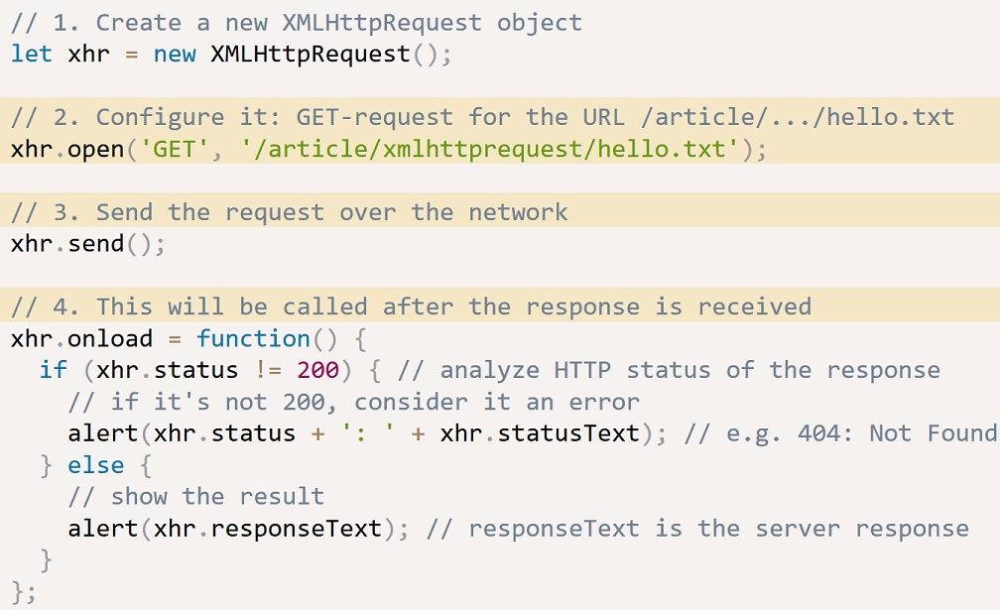

https://facebook.github.io/react-native/docs/network.html

https://developer.mozilla.org/en-US/docs/Web/API/Fetch_API/Using_Fetch

How can I make an AJAX call in React?

You can use any AJAX library you like with React. Some popular ones are Axios, jQuery AJAX, and the browser built-in window.fetch.

window.fetch is a JS interface for accessing and manipulating requests and responses. It provides a global `fetch()` method that provides an easy, logical way to fetch resources asynchronously across the network.

    import React, { Component } from 'react';
    
    const API = 'https://hn.algolia.com/api/v1/search?query=';
    const DEFAULT_QUERY = 'redux';
    
    class App extends Component {
      constructor(props) {
        super(props);
    
        this.state = {
          hits: [],
        };
      }
    
      componentDidMount() {
        fetch(API + DEFAULT_QUERY)
          .then(response => response.json())
          .then(data => this.setState({ hits: data.hits }));
      }
    
      ...
    }
    
    export default App;

    function getMoviesFromApiAsync() {
       return fetch('https://facebook.github.io/react-native/movies.json')
       .then((response) => response.json())
       .then((responseJson) => {
         return responseJson.movies;
       })
       .catch((error) => {
         console.error(error);
       });
    }

    fetch('http://example.com/movies.json')
      .then(function(response) {
        return response.json();
      })
      .then(function(myJson) {
        console.log(JSON.stringify(myJson));
      });

Above, `fetch()` returns a promise containing the response (a `Response` object).
   
To extract the JSON body content from the HTTP response, we use the `json()` method (defined on the Body mixin, which is implemented by both the `Request` and `Response` objects.)

**Example POST method implementation:**
    
    postData(`http://example.com/answer`, {answer: 42})
      .then(data => console.log(JSON.stringify(data))) // JSON-string from `response.json()` call
      .catch(error => console.error(error));
    
    function postData(url = ``, data = {}) {
      // Default options are marked with *
        return fetch(url, {
            method: "POST", // *GET, POST, PUT, DELETE, etc.
            mode: "cors", // no-cors, cors, *same-origin
            cache: "no-cache", // *default, no-cache, reload, force-cache, only-if-cached
            credentials: "same-origin", // include, *same-origin, omit
            headers: {
                "Content-Type": "application/json",
                // "Content-Type": "application/x-www-form-urlencoded",
            },
            redirect: "follow", // manual, *follow, error
            referrer: "no-referrer", // no-referrer, *client
            body: JSON.stringify(data), // body data type must match "Content-Type" header
        })
        .then(response => response.json()); // parses response to JSON
    }

**Response Metadata**

    fetch('users.json').then(function(response) {
        alert(response.headers.get('Content-Type'));
        alert(response.status);
        alert(response.type);
        alert(response.url);
    });

`response.type` will be either of `"basic"`, `"cors"` or `"opaque"`.
You can define a mode for a fetch request such that only certain requests will resolve. The modes you can set include
`same-origin`, which only succeeds for requests for assets on the same origin, and
`cors` will allow requests for assets on the same-origin and other origins which return the appropriate CORs headers.

    fetch('http://some-site.com/cors-enabled/some.json', {mode: 'cors'})
      .then(function(response) {
        return response.text();
      })

**Chaining Promises**

If you are working with a JSON API, you'll need to check the status and parse the JSON for each response. You can simplify your code by defining the status and JSON parsing in separate functions which return promises, freeing you to only worry about handling the final data and the error case.

    function status(response) {
      if (response.status >= 200 && response.status < 300) {
        return Promise.resolve(response)
      } else {
        return Promise.reject(new Error(response.statusText))
      }
    }

    function json(response) {
      return response.json()
    }

    fetch('users.json')
      .then(status)
      .then(json)
      .then(function(data) {
        alert('Request succeeded with JSON response', data);
      }).catch(function(error) {
        alert('Request failed', error);
      });

The great thing with this is that you can share the logic across all of your fetch requests, making code easier to maintain, read and test.

**Notes from https://javascript.info/promise-chaining**

`let promise = fetch(url);` makes a network request to the url and returns a promise. The promise resolves with a `response` object when the remote server responds with headers, but before the full response is downloaded.

To read the full response, we should call `response.text()` or `response.json()`, which returns a promise that resolves when the full text downloaded from the remote server, with that text as a result.

As a rule, an asynchronous action should always return a promise.

That makes possible to plan actions after it. Even if we don’t plan to extend the chain now, we may need it later.

**Error handling**

When a promise rejects, e.g. `fetch` fails if the remote server is not available, the control jumps to the closest rejection handler down the chain.

If we throw inside `.then` handler, that means a rejected promise, so the control jumps to the nearest error handler.
That’s so not only for throw, but for any errors, including programming errors as well:

    new Promise(function(resolve, reject) {
      resolve("ok");
    }).then(function(result) {
      blabla(); // no such function
    }).catch(alert); // ReferenceError: blabla is not defined

`.catch` behaves like `try..catch`. We may have as many .then as we want, and then use a single `.catch` at the end to handle errors in all of them.

In a regular `try..catch` we can analyze the error and maybe rethrow it if can’t handle. The same thing is possible for promises.

The promise returned by fetch only rejects when it’s impossible to make a request, e.g. remote server not available, or URL is malformed.
But if the remote server responds with error 404, or even error 500, then it’s considered a valid response.

What if the server returns a non-JSON page with error 500 in the line (*)? What if there’s no such user, and github returns a page with error 404 at (**)?

    fetch('no-such-user.json') // (*)
      .then(response => response.json())
      .then(user => fetch(`https://api.github.com/users/${user.name}`)) // (**)
      .then(response => response.json())
      .catch(alert); // SyntaxError: Unexpected token < in JSON at position 0
      // ...

As of now, the code tries to load the response as JSON no matter what and dies with a syntax error.
The error just falls through the chain, without details: what failed and where.

So we should check the `response.status` property and if it’s not `200`, then `throw` an error:

*Extending Error* see notes in ./miscellaneous.md. In having our own class for errors we can easily check for it in error-handling code:

XMLHttpRequest
--------------

`fetch(url)` is a more modern method named than `XMLHttpRequest` , but this is still widely used.

`xhr.open(method, URL, async, user, password)`, contrary to its name, does not open the connection. It only configures the request.

`xhr.send([body])` opens the connection and sends the request to server. The optional body parameter contains the request body (e.g. in `POST` request).

After the request is sent, `xhr` starts to generate events. We can use `addEventListener` or `on<event>` properties to handle them, just like with DOM objects.

    function load(url) {
      let xhr = new XMLHttpRequest();
      xhr.open('GET', url);
      xhr.timeout = 1000;
      xhr.send();
      xhr.onload = function() {
        alert(`Loaded: ${this.status} ${this.responseText}`);
      };
      xhr.onerror = () => alert('Error');
      xhr.ontimeout = () => alert('Timeout!');
    }

**HTTP-headers**

`setRequestHeader(name, value)` sets the request header with the given name and value. E.g. `xhr.setRequestHeader('Content-Type', 'application/json');`

Several headers are managed exclusively by the browser, e.g. `Referer` and `Host`.

`getResponseHeader(name)` gets the response header with the given name, e.g. `xhr.getResponseHeader('Content-Type')`

