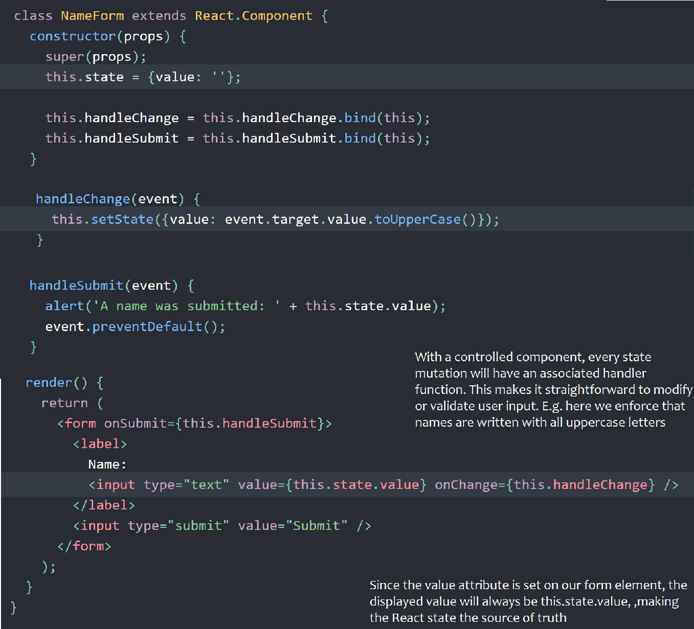
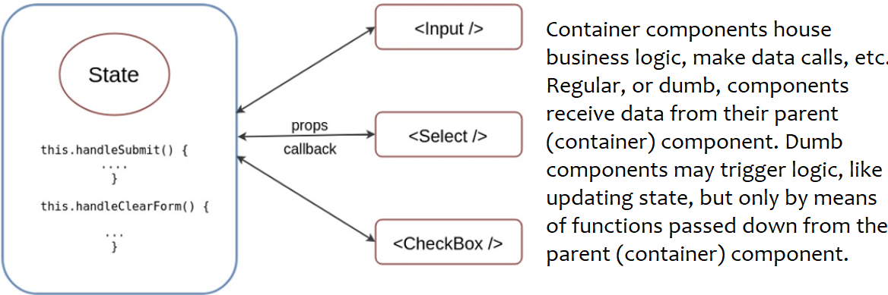
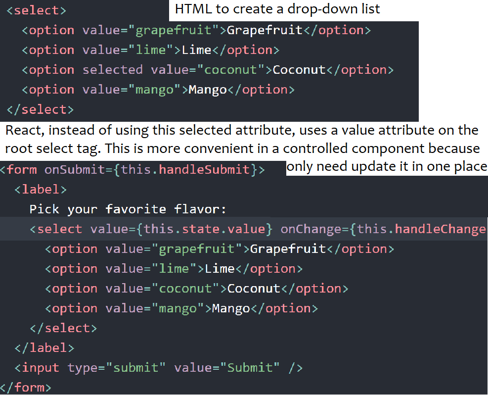
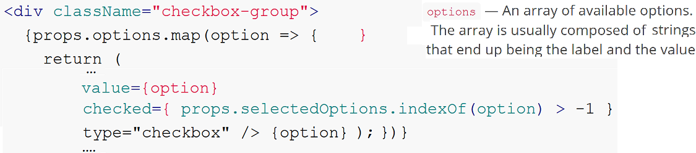
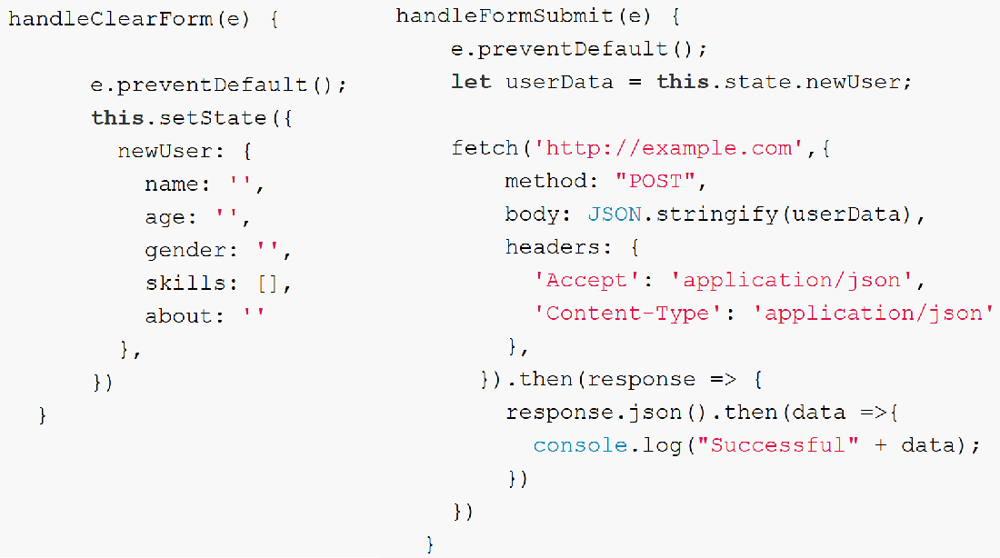
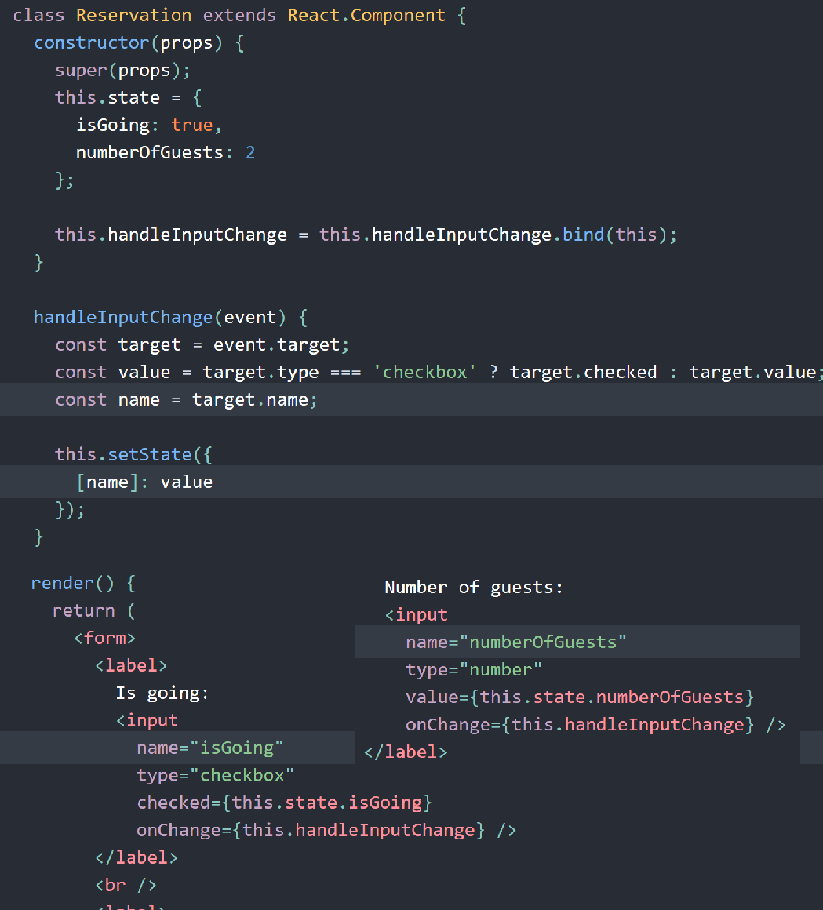

Because form elements naturally keep some internal state, HTML form elements work a little bit differently from other DOM elements in React.
To handle form submission with JS, the standard way is using “controlled components”

**Controlled Components**

In HTML, form and control elements such as `<input>`, `<textarea>`, and `<select>` typically maintain their own state and update it based on user input.
We can combine it with the React state which can be the “single source of truth”.

We use callback functions to handle form events and then use the container’s state to store the form data.
Since the `value` attribute is set on our form element, the displayed value will always be `this.state.value`, making the React state the source of truth. Since `handleChange` runs on every keystroke to update the React state, the displayed value will update as the user types.
An input form element whose value is controlled by React in this way is called a “controlled component”.

A recommended architecture is to give each form element a component of its own, which can be
reused in container components which house business logic, taking care of updating the state of the form, handling form submission, and making API calls/dispatching Redux actions.
The so-called regular, or dumb, components receive data from their parent (container) component. Dumb components are concerned with presentation and contain the actual DOM markup. They may trigger logic, like updating state, but only by means of functions passed down to them.

**Selected value on a select tag**

Instead of defining `selected` on each option, you can (and should) simply write `value={optionsState}` on the select tag itself:

    <select value={optionsState}>
      <option value="A">Apple</option>
      <option value="B">Banana</option>
      <option value="C">Cranberry</option>
    </select>

**Multiple options in a `select` tag**

    <select multiple={true} value={['B', 'C']}>

**Checkbox example**

Checkbox can be interacted with in two ways: check or uncheck an item. This corresponds to two actions: adding an item into the array, or removing an existing item from the array.

Consider the following where `selectedOptions` is array of selected values passed to the component as props. If the user had selected choices beforehand, this array would be populated with those.

The `indexOf` method checks whether a particular item exists within an array and returns its index, or `-1` is it doesn't.

In the following function for handling checkboxes, the `newSelection` variable has the value of the newly selected (or deselected) item. We compare it with the existing selection of items stored at `this.state.newUser.skills`
Note: If a checkbox is unchecked when its form is submitted, there is no value submitted to the server.
If it's part of the array, the condition falls true and the new selection item is filtered out??. Otherwise, the `newSelection` item is concatenated into the array using spread operator.

    handleSkillsCheckBox(e) {
      const newSelection = e.target.value;
      let newSelectionArray;
      if (this.state.newUser.skills.indexOf(newSelection) > -1) {
        newSelectionArray = this.state.newUser.skills.filter(s => s !== newSelection)
      } else {
        newSelectionArray = [...this.state.newUser.skills, newSelection];
      }
      this.setState( prevState => ({ newUser:
        {...prevState.newUser, skills: newSelectionArray }
      })
      )
    }

**Form Actions: `handleClearForm` and `handleFormSubmit`**

The line `e.preventDefault()` prevents the page from being refreshed on form submission, which is the default form behavior.
Form submission involving making an AJAX request to the server. The data that needs to be sent is available at `this.state.newUser`

**Handling Multiple Inputs**

When you need to handle multiple controlled input elements, you can add a name attribute to each element and let the handler function choose what to do based on the value of `event.target.name`

