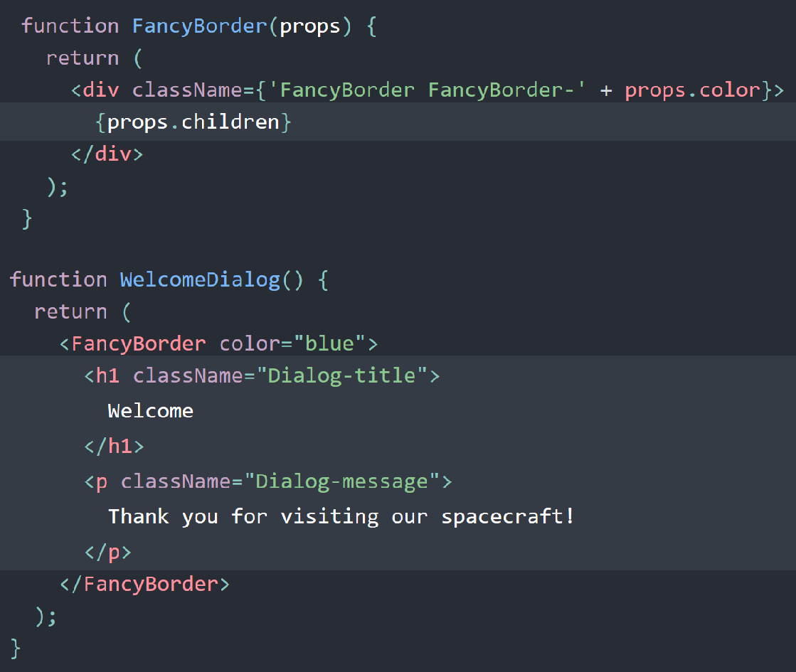

[React cheatsheet](https://devhints.io/react)

Refs
----
Refs provide a way to access DOM nodes or React elements created in the render method.

While there are a few good use cases for refs, e.g. managing focus and text selection, they should not be overused. E.g. think more critically about where state should be owned in the component hierarchy. Often, it becomes clear that the proper place to “own” that state is at a higher level in the hierarchy.

    class MyComponent extends Component {
      render () {
        return 

          <input ref={el => this.input = el} />
        

      }

      componentDidMount () {
        this.input.focus()
      }
    }

When a ref is passed to an element in `render`, a reference to the node becomes accessible at the `current` attribute of the ref.
The value of the ref differs depending on the type of the node:

When the `ref` attribute is used on an HTML element, the `ref` created in the constructor with `React.createRef()` receives the underlying DOM element as its `current` property.

When the `ref` attribute is used on a custom class component, the ref object receives the mounted instance of the component as its `current`.

    class CustomTextInput extends React.Component {
        constructor(props) {
            super(props);
            // create a ref to store the textInput DOM element
            this.textInput = React.createRef();
            this.focusTextInput = this.focusTextInput.bind(this);
        }

        focusTextInput() {
            this.textInput.current.focus();
        }

        render() {
            return (
                

                    <input
                        type="text"
                        ref={this.textInput} />
                    <input
                        type="button"
                        value="Focus the text input"
                        onClick={this.focusTextInput}
                    />
                

            );
        }
    }

Fragments
---------
Used to return multiple children without adding extra wrapping nodes to the DOM. Example using the shorter syntax:

    class Columns extends React.Component {
      render() {
        return (
          <>
            <td>Hello</td>
            <td>World</td>
          </>
        );
      }
    }

Inline styles
-------------
    const style = { height: 10 }
    return 

    return 

Pure components
---------------
Performance-optimized version of `React.Component`. Doesn’t rerender if props/state hasn’t changed.

    import React, {PureComponent} from 'react'

    class MessageBox extends PureComponent {
      ···
    }

Conditionals and Short-circuit evaluation
-----------------------------------------
    <Fragment>
      {showMyComponent
        ? <MyComponent />
        : <OtherComponent />}
    </Fragment>

    <Fragment>
      {showPopup && <Popup />}
      ...
    </Fragment>

Default props
-------------
`defaultProps` can be defined as a property on the component class itself, to set the default props for the class.

    class CustomButton extends React.Component {
      // ...
    }

    CustomButton.defaultProps = {
      color: 'blue'
    };

If props.color is not provided, it will be set by default to 'blue':

      render() {
        return <CustomButton /> ; // props.color will be set to blue
      }
      render() {
        return <CustomButton color={null} /> ; // props.color will remain null
      }

Lifting state up
----------------
Often, several components need to reflect the same changing data. We recommend lifting the shared state up to their closest common ancestor. Let’s see how this works in action.
In this section, we will create a temperature calculator that calculates whether the water would boil at a given temperature...
 In React, sharing state is accomplished by moving it up to the closest common ancestor of the components that need it. This is called “lifting state up”. We will remove the local state from the TemperatureInput and move it into the Calculator instead. If the `Calculator` owns the shared state, it becomes the “source of truth” for the current temperature in both inputs. It can instruct them both to have values that are consistent with each other. Since the props of both `TemperatureInput` components are coming from the same parent `Calculator` component, the two inputs will always be in sync.
https://reactjs.org/docs/lifting-state-up.html

Composition and children
------------------------------
The component below contains an `` that is receiving some `props` and then it is displaying `{props.children}`.

Whenever this component is invoked `{props.children}` will also be displayed and this is just a reference to what is between the opening and closing tags of the component.

    const Picture = (props) => {
      return (
        

          
          {props.children}
        

      )
    }

    //App.js
    render () {
      return (
        

          <Picture key={picture.id} src={picture.src}>
              //what is placed here is passed as props.children
          </Picture>
        

      )
    }

This de-couples the `<Picture>` component from its content and makes it more reusable.
Common for components like `Sidebar` or `Dialog` that represent generic “boxes”.

In composition, a more “specific” component renders a more “generic” one and configures it with props:

PropTypes
---------

Now a separate package to React, it is for type checking for reducing bugs relating to types.
It also serves as a handy documentation on how a component has to be used in terms of passing props. Many code editors support code completion for props.

Example for basic data types:

    Person.propTypes = {
      email: PropTypes.string,
      age: PropTypes.number,
      worksRemote: PropTypes.bool,
      updateCallback: PropTypes.func
    }

Further types that can be used are:

    PropTypes.array,
    PropTypes.arrayOf(PropTypes.string),
    PropTypes.object,
    PropTypes.objectOf(PropTypes.number)

You can enforce that props are passed by using `isRequired`:

    Article.propTypes = {
      title: PropTypes.string.isRequired,
      url: PropTypes.string.isRequired,
      author: PropTypes.string.isRequired
    };

**Complex data types**

Validate a plain JS object against a certain shape:

    Person.propTypes = {
      car: PropTypes.shape({
        registrationNumber: PropTypes.string,
        year: PropTypes.number
      })
    }

**Specifying a Range of Valid Prop Values**

From time to time you might want to have a prop value passed, that is exactly one out of a given set of values. Doing so, could look like this:

    Person.propTypes = {
      gender: PropTypes.oneOf([
        'female', 'male'
      ])
    }

In cases where a prop is optional (i.e. not using isRequired), you can set a default value to make sure something gets passed:

    Developer.defaultProps = {
      language: 'JavaScript'
    }

The `propTypes` typechecking happens after `defaultProps` are resolved, so typechecking will also apply to the `defaultProps`.

Pure Components
---------------
A component is said to be pure if it is guaranteed to return the same result given the same props and state.
A functional component is a good example of a pure component because, given an input, you know what will be rendered.

    const HelloWorld = ({name}) => (
     
{`Hi ${name}`}

    );

Pure components defined as function will always re-render once new props get passed down it.
You can wrap those in `React.memo()` to avoid that (unless obviously the properties changed)

Class components can be pure too as long as their props and state are immutable.
`React.PureComponent` is used for optimizing performance and relates to re-rendering.

When `setState` is called in a component then it will be re-rendered, and this is somewhat
'blind', i.e. even if the state in unchanged. Often re-rendering will not be necessary.
This unnecessary re-rendering can avoided by using `shouldComponentUpdate` (which otherwise defaults to `true`):

    shouldComponentUpdate(nextProps, nextState) {
      return this.state.value != nextState.value;
    }

Here, `nextState` is whatever the next state used in `setState`. So this can be compared
with the current state to find out if it has changed. If the method returns `false` then it will not re-render, if `true` then it will.
It works for both props and state.

An alternative approach is to use pure components. This simply involves extending from `PureComponent` instead of `Component`
Care should be taken when using them however, since they only do a shallow comparison, for performance reasons.
Shallow comparison means that you compare the immediate contents of the objects instead of recursively comparing all the key/value pairs of the object. So only the object references are compared, and if the state/props are mutated, this might not work as intended.

Higher Order Components
-----------------------
Allow you to abstract out common functionality in components into a function which
you can pass your components to to wrap them and give them the common functionality.

