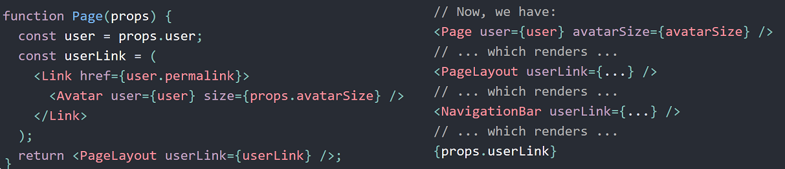
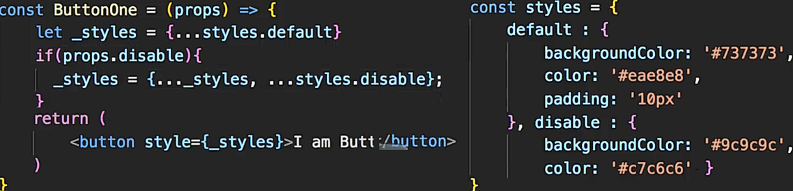
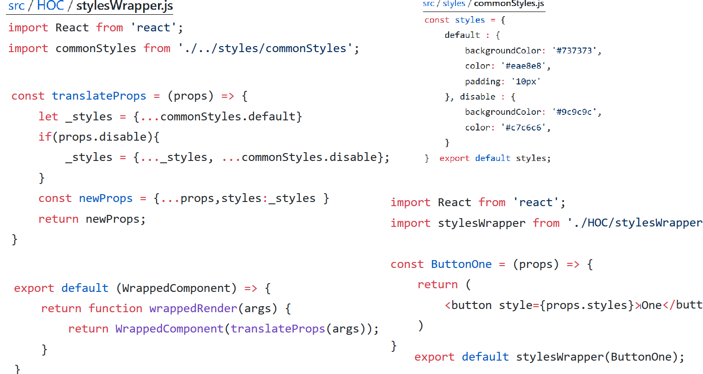

[React cheatsheet](https://devhints.io/react)

Pure components
---------------
Performance-optimized version of `React.Component`. Doesn’t rerender if props/state hasn’t changed.

    import React, {PureComponent} from 'react'

    class MessageBox extends PureComponent {
      ···
    }

In the following example, the output depends on `props.imageUrl` and `props.username`. If in a parent
component you render `<UserAvatar username="fabio" imageUrl="http://foo.com/fabio.jpg" />`, so
always the same props, React would call `render` every time, even if the output would be exactly the same.

    class UserAvatar extends Component {
        render() {
           return 
 {{ this.props.username }} 

        }
    }

If the `UserAvatar` component extends `PureComponent` instead, a shallow compare is performed. And because
`props` and `nextProps` are the same, `render` will not be called at all.
Using `PureComponent` in root-level components and components near the top of your hierarchy is usually where
you would see the biggest performance gains.

`PureComponent` performs a shallow comparison, so only works for simple props/state (no nested data structures).
If you need some performance gains by performing custom comparison logic between next/current props and
state. For example, you can quickly perform a deep comparison using lodash#isEqual:

    class MyComponent extends Component {
        shouldComponentUpdate (nextProps, nextState) {
            return !_.isEqual(this.props, nextProps) || !_.isEqual(this.state, nextState);
        }
    }

Note that implementing your own `shouldComponentUpdate` or extending from `PureComponent` are optimizations,
and as usual you should start looking into that only if you have performance issues (avoid premature optimizations)

`shouldComponentUpdate(nextProps, nextState)`
---------------------------------------------
Returns a boolean. Used to determine if a component should be re-rendered when it receives new props or after `setState` is called.
The default implementation always returns `true` - meaning that React re-renders all components and sub components every time `setState` is called.

Default props
-------------
`defaultProps` can be defined as a property on the component class itself, to set the default props for the class.

    class CustomButton extends React.Component {
      // ...
    }

    CustomButton.defaultProps = {
      color: 'blue'
    };

If `props.color` is not provided, it will be set by default to 'blue':

      render() {
        return <CustomButton /> ; // props.color will be set to blue
      }
      render() {
        return <CustomButton color={null} /> ; // props.color will remain null
      }

Context
-------
Maybe you don’t need all those fancy features of Redux – all you want to do is pass data around easily. Maybe your app is small, or you just need to get something working quickly.

Context provides a way to pass data through the component tree without having to pass props down manually at every level 

Context is designed to share data that can be considered “global” for the entire React app.
E.g. a logged in user, where user information is needed in a child component which we have to pass through another component which does not need this.

Context lets you “broadcast” such data, and changes to it, to all components below.

There are 3 important pieces to the context API:

The `React.createContext` function which creates the context

The `Provider` (returned by `createContext`) which establishes the “electrical bus” running through a component tree

The `Consumer `(also returned by `createContext`) which taps into the “electrical bus” to extract the data

The `Provider` is very similar to React-Redux’s `Provider`. It accepts a `value` prop, most likely be an object
containing your data and any actions you want to be able to perform on the data.
The `Consumer` works a little bit like React-Redux’s `connect` function.

[Further info](https://daveceddia.com/context-api-vs-redux/#how-to-use-the-react-context-api).
CodeSandbox [example 1](https://codesandbox.io/s/q9w2qrw6q4), [example 2](https://codesandbox.io/s/jpy76nm1v).

Context is primarily used when some data needs to be accessible by *many* components at different nesting levels.
Apply it sparingly because it makes component reuse more difficult.

Often, component composition is often a simpler solution than context.
E.g. consider a `Page` component that passes a `user` and `avatarSize` prop several levels down so that deeply
nested `Link` and `Avatar` components can read it:

    <Page user={user} avatarSize={avatarSize} />
    // ... which renders ...
    <PageLayout user={user} avatarSize={avatarSize} />
    // ... which renders ...
    <NavigationBar user={user} avatarSize={avatarSize} />
    // ... which renders ...
    <Link href={user.permalink}>
      <Avatar user={user} size={avatarSize} />
    </Link>

It might feel redundant to pass down the user and `avatarSize` props through many levels if in the end only
the `Avatar` component really needs it. It’s also annoying that whenever the `Avatar` component needs more props
from the top, you have to add them at all the intermediate levels too.
One solution is to use containment, i.e. pass down the `Avatar` component itself:

This *inversion of control* can make your code cleaner in many cases by reducing the amount of props you need to
pass through your application and giving more control to the root components.
However,  moving more complexity higher in the tree like this isn’t the right choice in every case.
[Context API Docs](https://reactjs.org/docs/context.html)

PropTypes
---------
Now a separate package to React, it is for type checking for reducing bugs relating to types.
It also serves as a handy documentation on how a component has to be used in terms of passing props.
Many code editors support code completion for props.

Example for basic data types:

    Person.propTypes = {
      email: PropTypes.string,
      age: PropTypes.number,
      worksRemote: PropTypes.bool,
      updateCallback: PropTypes.func
    }

Further types that can be used are:

    PropTypes.array,
    PropTypes.arrayOf(PropTypes.string),
    PropTypes.object,
    PropTypes.objectOf(PropTypes.number)

You can enforce that props are passed by using `isRequired`:

    Article.propTypes = {
      title: PropTypes.string.isRequired,
      url: PropTypes.string.isRequired,
      author: PropTypes.string.isRequired
    };

**Complex data types**

Validate a plain JS object against a certain shape:

    Person.propTypes = {
      car: PropTypes.shape({
        registrationNumber: PropTypes.string,
        year: PropTypes.number
      })
    }

**Specifying a Range of Valid Prop Values**

From time to time you might want to have a prop value passed, that is exactly one out of a given set of values.
Doing so, could look like this:

    Person.propTypes = {
      gender: PropTypes.oneOf([
        'female', 'male'
      ])
    }

In cases where a prop is optional (i.e. not using isRequired), you can set a default value to make sure something
gets passed:

    Developer.defaultProps = {
      language: 'JavaScript'
    }

The `propTypes` typechecking happens after `defaultProps` are resolved, so typechecking will also apply to the
`defaultProps`.

Pure Components
---------------
A component is said to be pure if it is guaranteed to return the same result given the same props and state.
A functional component is a good example of a pure component because, given an input, you know what will be rendered.

    const HelloWorld = ({name}) => (
     
{`Hi ${name}`}

    );

Pure components defined as function will always re-render once new props get passed down it.
You can wrap those in `React.memo()` to avoid that (unless obviously the properties changed)

Class components can be pure too as long as their props and state are immutable.
`React.PureComponent` is used for optimizing performance and relates to re-rendering.

When `setState` is called in a component then it will be re-rendered, and this is somewhat
'blind', i.e. even if the state in unchanged. Often re-rendering will not be necessary.
This unnecessary re-rendering can avoided by using `shouldComponentUpdate` (which otherwise defaults to `true`):

    shouldComponentUpdate(nextProps, nextState) {
      return this.state.value != nextState.value;
    }

Here, `nextState` is whatever the next state used in `setState`. So this can be compared
with the current state to find out if it has changed. If the method returns `false` then it will not re-render,
if `true` then it will.
It works for both props and state.

An alternative approach is to use pure components. This simply involves extending from `PureComponent` instead of `Component`
Care should be taken when using them however, since they only do a shallow comparison, for performance reasons.
Shallow comparison means that you compare the immediate contents of the objects instead of recursively comparing all the key/value pairs of the object.
So only the object references are compared, and if the state/props are mutated, this might not work as intended.

`React.memo`
------------
Class components can bail out from re-rendering when their input props are the same using `PureComponent`
or `shouldComponentUpdate`. Now you can do the same with function components by wrapping them in `React.memo`.

    const MyComponent = React.memo((props) => {
      return (
        /* markup */
      );
    });

Higher Order Components
-----------------------
Allow you to abstract out common functionality in components into a function which
you can pass your components to to wrap them and give them the common functionality.
Things you might do include injecting new props, build custom erros, set defaults etc.

Suppose you had a number of button components which used the same logic for setting styles:

Instead of repeating the same logic in each component, we could move the logic out into a wrapper function.

The `displayName` string is used in debugging messages. This is a class property and is useful when you create HOCs.

Code-splitting
------------------
**Bundling**

Most React apps will have their files “bundled” using tools like Webpack. Bundling is the process of following
imported files and merging them into a single file: a “bundle”. This bundle can then be included on a webpage to
load an entire app at once. For example:

App:

    // app.js
    import { add } from './math.js';

    console.log(add(16, 26)); // 42

    // math.js
    export function add(a, b) {
      return a + b;
    }

Bundle:

    function add(a, b) {
      return a + b;
    }

    console.log(add(16, 26)); // 42

If you’re using Create React App, or a similar tool, you will have a Webpack setup out of the box to bundle your app. If you aren’t,
you’ll need to setup bundling yourself.

**Code Splitting**

Bundling is great, but as your app grows, your bundle will grow too. Especially if you are including large third-party libraries. You need to keep an eye on
the code you are including in your bundle so that you don’t accidentally make it so large that your app takes a
long time to load.

To avoid winding up with a large bundle, it’s good to get ahead of the problem and start “splitting” your bundle. Code-Splitting is a feature supported by bundlers like
Webpack which can create multiple bundles that can be dynamically loaded at runtime.

Code-splitting your app can help you “lazy-load” just the things that are currently needed by the user, which can dramatically improve the performance of your app.

The best way to introduce code-splitting into your app is through the dynamic `import()` syntax. Note that this syntax is a ECMAScript
proposal not part of the standard yet but expected to be soon.

Before:

    import { add } from './math';

    console.log(add(16, 26));

After:

    import("./math").then(math => {
      console.log(math.add(16, 26));
    });
