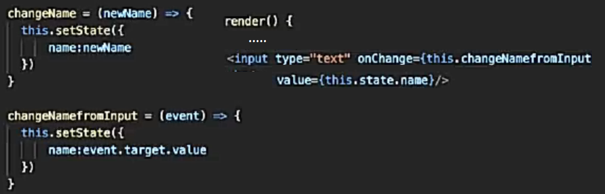

**Two-way Binding**

var Tags = React.createClass({
  getInitialState: function(){
    return {
      selected:''
    }
  },
  setFilter: function(filter) {
    this.setState({selected  : filter})
    this.props.onChangeFilter(filter);
  },
  isActive:function(value){
    return 'btn '+((value===this.state.selected) ?'active':'default');
  },
  render: function() {
    return 

      <button className={this.isActive('')} onClick={this.setFilter.bind(this, '')}>All</button>
      <button className={this.isActive('male')} onClick={this.setFilter.bind(this, 'male')}>male</button>
      <button className={this.isActive('female')} onClick={this.setFilter.bind(this, 'female')}>female</button>
      <button className={this.isActive('child')} onClick={this.setFilter.bind(this, 'child')}>child</button>
      <button className={this.isActive('blonde')} onClick={this.setFilter.bind(this, 'blonde')}>blonde</button>
     

  }
});

